# (PART\*) Representing the World {.unnumbered}

# Working with Geographic Data {#geo_data}

## Introduction

### Aims {.unnumbered}

The aims of this practical are to:

1.  Develop familiarity with ArcGIS interface.
2.  Develop skills in loading and investigating vector and raster data.
3.  Understand layer symbology and the basics of map production.

### Application {.unnumbered}

To achieve this, we'll import raster (temperature and precipitation layers) and vector data (country Polygons and city Points) into ArcGIS, visualise and summarise current and future climates, and produce a map.

### Data {.unnumbered}

-   WorldClim temperature and precipitation data, available in [`data/world-clim`] [[Source](https://www.worldclim.org/data/index.html)]
-   Natural Earth 1:10m Cultural Vectors, available in [`data/natural-earth`] [[Source](https://www.naturalearthdata.com/downloads/10m-cultural-vectors/)]
-   Esri World Cities, available in [`data/esri`] [[Source](https://hub.arcgis.com/datasets/esri::world-cities/explore?location=52.561735%2C1.201909%2C6)]

### Tools {.unnumbered}

[Zonal Statistics as Table](https://doc.esri.com/en/arcgis-pro/latest/tool-reference/spatial-analyst/zonal-statistics-as-table.html?tabs=dialog) (Spatial Analyst), [Cell Statistics](https://doc.esri.com/en/arcgis-pro/latest/tool-reference/spatial-analyst/cell-statistics.html?tabs=dialog) (Spatial Analyst Tools), [Select Layer By Attribute](https://doc.esri.com/en/arcgis-pro/latest/tool-reference/data-management/select-layer-by-attribute.html?tabs=dialog) (Data Management Tools), [Extract Multi Values to Points](https://doc.esri.com/en/arcgis-pro/latest/tool-reference/spatial-analyst/extract-multi-values-to-points.html?tabs=dialog) (Spatial Analyst Tools)

------------------------------------------------------------------------

## Practical

### Data

To begin the unit:

> Download the `GEOG73001` directory from Canvas [here]() and extract to a suitable location on your **P Drive**. 

The directory structure is as follows:

- `data`: containing all the data required for Practicals 1 - 10, organised by data source. 
- `practical-1`: an empty directory, in which you should store all outputs (i.e., spatial data, maps, tables) for Practical 1 - *Working with Geographic Data*.
- `practical-2`: an empty directory, ...
- ...

::: note
You should work on the **P drive** throughout this unit. Integration with cloud storage services (e.g., OneDrive) can cause [problems](https://support.esri.com/en-us/knowledge-base/problem-arcgis-pro-and-cloud-storage-services-000025605), while you will have limited flexibility if working locally (`C:`). 
:::

### Projects

Now that we have our data downloaded, our next step is create an ArcGIS [**project**](https://doc.esri.com/en/arcgis-pro/latest/help/projects/what-is-a-project.html) for this practical. This is an organized workspace that we will use to store all the objects related to that practical e.g., maps, layouts, data outputs. We'll store the project file in `GEOG73001\practical-1`, and you should repeat this process for all subsequent practicals. 

> Open ArcGIS Pro, and create a New Project &rarr; Map with a suitable name (e.g., `practical-1`), setting the location to the corresponding directory on the P Drive (`P:\GEOG73001\practical-1`) and *unchecking* 'Create a folder for this local project'. 

You should now be presented with the ArcGIS interface: 

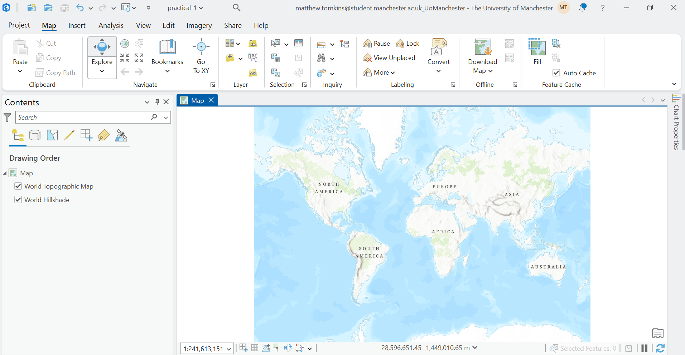{width=100%}
 

Key features to note include the:

- **Ribbon** (top), which provides access to many of the important ArcGIS functions e.g., for loading data, accessing analysis tools, exporting maps. 

- **Map View** (central), which displays the spatial data that have been loaded by the user (currently *none*) and any basemaps that are present (currently World Topographic Map and Hillshade).

- **Contents Pane** (left), which lists every layer in your current map, their visibility, and their drawing order. 

### Loading data

The best way to familiarise yourself with the ArcGIS interface is by working with data. There are lots of approach to add data in ArcGIS, one of which is simply dragging-and-dropping files into the Map View. Another approach is to establish **connections** to databases or directories: 

> In the top ribbon, navigate to Insert &rarr; Add Folder, and select `GEOG73001/data`. 

We have now created a connection to our data directory, which can enable more efficient data loading if working with lots of different datasets.

> In the top ribbon, navigate to Map &rarr; Layer &rarr; Add Data. Under the 'Project' dropdown (left), you should see 'Databases' and 'Folders`. 

Under 'Folders', you should see connections to `Practical-1` (this is the directory where our project is saved) and `data`, which we just established a connection to. 

> Back in the 'Add Data' window, navigate to [`natural-earth/ne_10m_admin_0_countries.shp`] and press 'OK' to load into ArcGIS. 

This spatial layer should now be visible, both in the Contents Pane and the Map View:

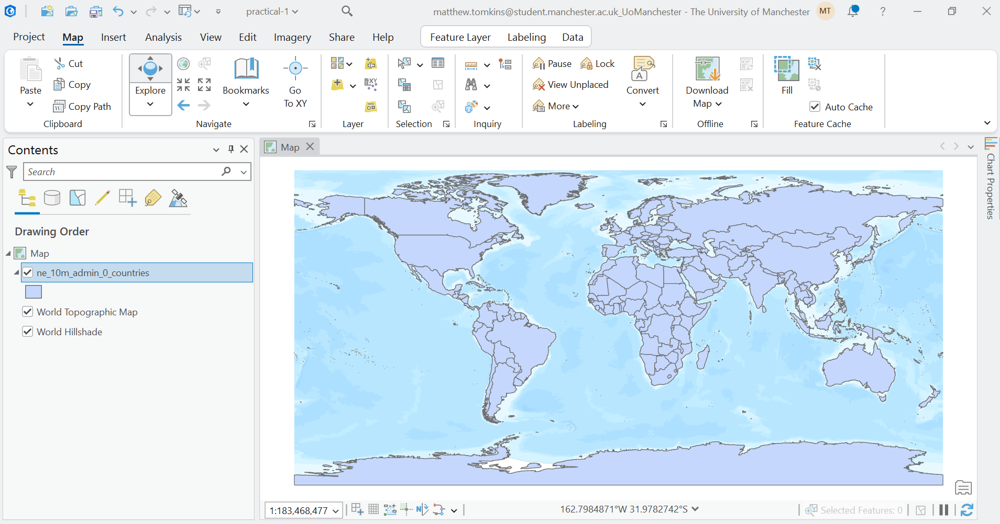{width=100%}

 

::: question
Based on the lecture materials, what type of spatial data is this? 
:::

### Exploring data

You can explore the `natural-earth` data by zooming and panning the Map View. While this provides information on the data $geometry$, we can also access additional information via the Contents Pane. 

> Right click the `ne_10m_admin_0_countries` layer in the Contents Pane &rarr; Properties &rarr; Source.

There is lots of important information here, including:

- **Data Type**: shapefile, a common vector data format.
- **Geometry Type**: Polygon, rather than Point or Line. 
- **Extent**: the minimum and maximum coordinates of the layer, expressed in the units of the Coordinate Reference System (degrees)
- **Spatial Reference**: the information (e.g., geographic coordinate reference system, datum) used to relate the geometries to specific locations on the Earth's surface. 

::: note
We will discuss Coordinate References Systems in more depth later on in the unit, with detailed analysis in GEOG71551 - [Understanding GIS](https://understandingg.is/). 
:::

The Properties window provides information about the layer as a whole, but there might be additional information specific to each **feature** of the dataset. In our case, the `natural-earth` dataset contains 258 features, each representing a country, nation, or region, with feature-specific information stored in the **Attribute Table**. 

> Right click the `ne_10m_admin_0_countries` layer in the Contents Pane &rarr; Attribute Table. 

Each row of the Attribute Table represents a feature, with feature-specific values in the corresponding columns, which we refer to as **Fields**. There is a lot of information here, including feature names in various formats (e.g., [`ISO_A3`](https://en.wikipedia.org/wiki/ISO_3166-1_alpha-3)), as well as information on gross domestic product (GDP) in millions of dollars (`GDP_MD`), population (`POP_EST`), income group (`INCOME_GRP`), and continent and region (`CONTINENT`, `REGION_WB`), among others.

You can investigate the information in each field, for example by:

- Right clicking to sort in ascending or descending order.
- Calculating statistics using 'Explore Statistics'.
- Creating plots using 'Visualise Statistics'

::: question
Which country has the largest GDP? What is its name (`ADMIN`) and ID (`FID`)?
:::

::: question
What is the total population (`POP_EST`) for **all** of the features?
:::

::: question
How would you describe the distribution of GDP? 
:::

Selecting rows in the Attribute Table also highlights the corresponding geometry in the Map View, and vice versa i.e., selecting geometries in the Map View (via the 'Selection' tab) highlights the rows in the Attribute Table: 

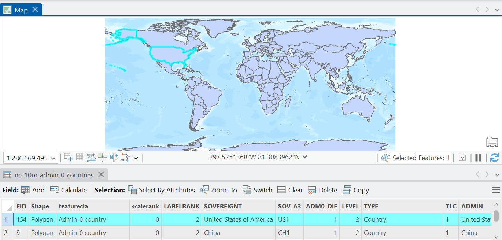{width=100%}

 

### Symbolising data

In the Map View, our `natural-earth` geometries is presented with a basic symbology i.e., for all features, `fill` = blue, `edgecolour` = black[^symbology_note]. As the user, we have a lot of flexibility to edit this. 

[^symbology_note]: *Note*, your colours may differ from mine, but don't worry!  

> Right click the `ne_10m_admin_0_countries` layer in the Contents Pane &rarr; Symbology. 

There are **lots** of options here, so we'll focus on some key choices, although you can explore further in the [documentation](https://doc.esri.com/en/arcgis-pro/latest/help/mapping/layer-properties/symbolize-feature-layers.html). Under **Primary Symbology**, our current setting is 'Single Symbol' which indicates that all features in the dataset are using the same symbology. 

> Click the Symbol &rarr; Properties and explore changing Appearance (e.g., Color, Outline Color, Outline Width) and how this is reflected in the Map View. 

As we've shown via the Attribute Table, our features are associated with a range of feature-specific values (fields) and we can use these to symbolise our data, for example by splitting our features into categories (e.g., continent).

> Back in the Symbology Window, change 'Single Symbol' to 'Unique Values' (Symbolize your layer by category). The 'Field 1' input specifies which field we want to use to define our categories, and we'll select `CONTINENT`. 

This change should now be visible in the Map View and in the Contents Pane, with the latter listing the classes in the `CONTINENT` field. You can edit this further by selecting a 'Colour scheme' of your choice. As above, you can also edit the symbology of each category by double clicking on the symbol in the 'Classes' tab.

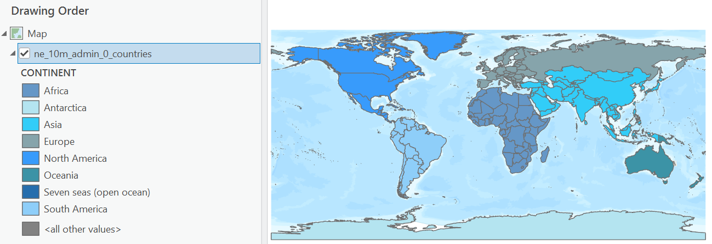{width=100%}

 

We can also symbolise our features based on a continuous field (e.g., population). 

> Back in the Symbology Window, change to 'Unclassed Colours' (Symbolize your layer by quantity). Use `POP_EST` for the 'Field' input, and select a 'Colour Scheme' of your choice. 

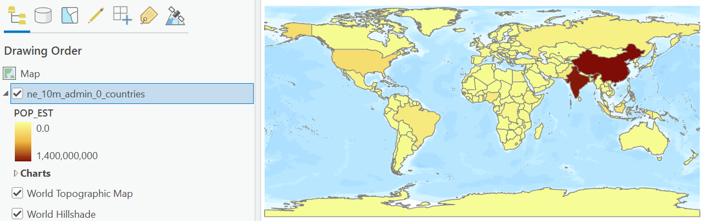{width=100%}

 

The 'Unclassed Colours' option takes the selected colour scheme (in my case, Yellow to Dark Red), and assigns the colours linearly between the minimum and maximum of the specified field (`POP_EST` = 0 to ~1.4 billion people). It is possible, however, to use ['Graduated Colours'](https://doc.esri.com/en/arcgis-pro/latest/help/mapping/layer-properties/graduated-colors.html), where the data is classified into ranges using a [classification method](https://doc.esri.com/en/arcgis-pro/latest/help/mapping/layer-properties/data-classification-methods.html) specified by the user.

> In the Symbology Window, change to 'Graduated Colours' (Symbolize your layer by quantity). Use `POP_EST` for the 'Field' input, select a 'Colour Scheme' of your choice, and for 'Method', use 'Natural Breaks (Jenks)'

::: problem
**James** When using Natural Breaks or Geometric Interval, China is always missing from the Map View, irrespective of the number of classes used. For Equal Interval, it is visible for <= 11 classes 
:::

### Filtering data

Now that we can visualise and investigate our spatial data, our next step might be to **filter** data i.e., extract features which meet certain conditions. We'll use a new dataset to demonstrate this. 

> Load `esri/World_Cities.shp`

::: question
What type of spatial data is this? 
:::

The World Cities dataset represents the location of 2,540 global cities. In the following analysis, we are going to focus on only the largest cities, defined as those >5 million in population. 

> Open the Attribute Table for this new layer, and investigate the population field (`POP`).

::: question
Which city has the largest population (based on this dataset)? 
:::

> In the Attribute Table, use 'Select by Attributes'. Keep 'Input Rows' and 'Selection Type' as they are, but modify the Expression to select rows where `POP` is greater than 5000000. If successful, 54 of 2,540 rows should be selected in the Attributes Table, and highlighted in the Map View. 

::: note
Select by Attributes can be operated using the interactive Expression box (as above), or you can use the 'SQL Editor' (`POP > 5000000`), which can be simpler for complex selections. 
:::

To simplify further analysis, we are going to **Export** this selection to a new file:

> Right click the `World_Cities` layer in the Contents Pane &rarr; Data &rarr; Export Features. Under 'Input Features', ensure that `World_Cities` is specified and 'Use the selected records' is checked (n=54). There are further options here (e.g., additional filtering, only exporting certain fields, data sorting), but for now keep the other settings as default. Under 'Output Feature Class', navigate to the `practical-1` directory (the location of our project) and choose an appropriate file name e.g., `world_cities_5m`. *Note* if the file extension is left blank, the default file type is shapefile (`.shp`). 

If successful, the new data layer should have been loaded to the Contents Pane and be visible in the Map View.

> To avoid any confusion, remove the full `World_Cities` layer (n=2,540). 

### Working with Rasters

So far in this practical we've been working with **vector** data (Points, Line, Polygons):

{width=80%}

Another common data type is **raster**, which typically consists of a grid of **cells** representing continuous surfaces:

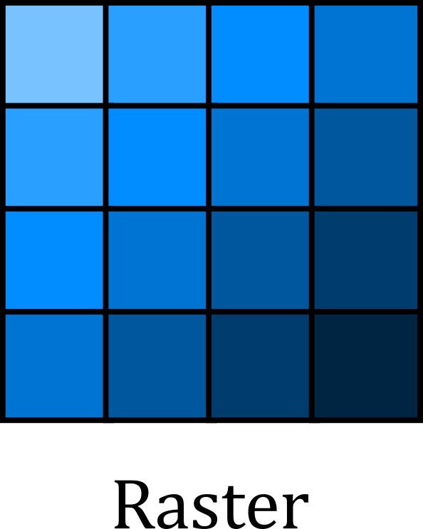{width=25%}

> Add the following raster to the map: `world-clim/wc2.1_10m_tavg/wc2.1_10m_tavg_01.tif`. You may be prompted to calculate statistics for the input, which can speed up subsequent data loading. If so, press 'Yes'. 

This [dataset](https://www.worldclim.org/data/index.html) represents average temperature (`tavg`) for January (`_01`) covering the period 1970-2000, sourced from WorldClim 2.1 [@fick2017]. 

> Use your previous understanding of Symbologies to modify the symbology for the raster layer (e.g., Colour Scheme, Stretch Type):

{width=100%}

 

::: question
In the Map View above, why are the city Points visible, but not the country Polygons?
:::

> Zoom in on the Map View and investigate a country of your choosing. *Hint: the coastlines are particularly revealing*. 

::: question
What do you notice above the size of the cells? How well do these match the vector representation of the country?   
:::

We are touching on some important concepts here: **scale** and **generalisation**. All spatial data is created and defined at a specific scale and all spatial data is generalised (or simplified) compared to the real world. 

In our case, our `WorldClim` data is characterised by a spatial resolution of [10 arc-minutes](https://www.worldclim.org/data/worldclim21.html) i.e., each cell is approximately 340 km^2^ at the equator. By comparison, our `Natural Earth` data is defined by a scale of 1:10m[^scale] i.e., 1 cm on the map equates to 100 km in reality. 

[^scale]: 1:10,000,000

The **important** thing to highlight here is that while the `Natural Earth` data is *less* generalised than the `WorldClim` data i.e., more real world information has been retained, such as some of the complexities of the coastline, neither dataset is "correct". **Both** are a simplification of reality. When working with spatial data, we should remember to:

- use spatial data that has been generated at a scale which is sufficient to represent the process or phenomenon we are studying.
- avoid working with datasets with significantly different levels of generalisation.
- remember that all spatial data are generalised. 

For our analysis, we are interested in **global** patterns in climate variables, rather than processes operating over smaller areas (e.g., sub-national, regional etc). The resolution of our raster data is sufficient to capture these patterns. 

### Geoprocessing

In the `world-clim` directory, there are raster layers (`.tif`) for each month of the year (`01 - 12`) for both average temperature (°C) and precipitation (mm). For our analysis, we are interested in the *annual* average temperature and the *total* annual precipitation. This is an excellent opportunity for our first use of a **Geoprocessing Tool**. 

> In the top ribbon, navigate to Analysis &rarr; Geoprocessing and select the red toolbox (Geoprocessing). 

The Geoprocessing pane should now be visible, with tabs for 'Toolboxes' and 'Favourites' (i.e., recent and commonly used tools). There are hundreds of available tools, so the easiest way to navigate these is via the Search bar at the top.

> Search for and open [Cell Statistics](https://doc.esri.com/en/arcgis-pro/latest/tool-reference/spatial-analyst/cell-statistics.html?tabs=dialog) (Spatial Analyst Tools)

As per the documentation linked above, this tool calculates cell-by-cell statistics for multiple rasters, as visualised below e.g., the value in the output raster $o_1$ would equal the average (or sum, maximum, etc) of $a_1 + b_1 + c_1$. 

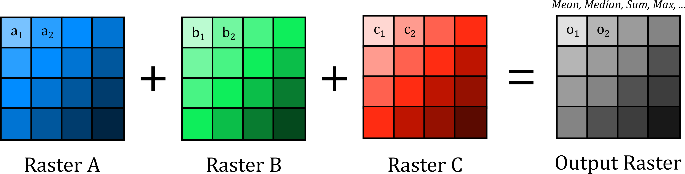{width=100%}

 

> Under 'Input rasters', use the directory icon to navigate to `data/world-clim/wc2.1_10m_tavg` and select all 12 `.tif` files as input. For 'Output Raster', export to the `practical-1` directory, with a suitable name e.g., `wc2.1_10m_tavg_annual.tif`. For 'Overlay statistic', we want the average temperature for the 12 months, so use `Mean`.

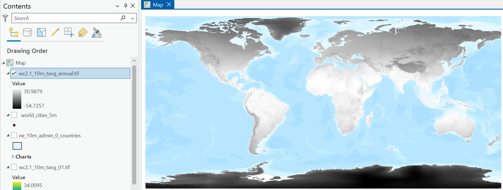{width=100%}

 

::: question
What is the average annual temperature for the Manchester region? *Hint: make sure the layer is selected in the Contents Pane and use 'Explore' selected in the 'Navigate' pane*.
:::

> Repeat the above process, using [Cell Statistics](https://doc.esri.com/en/arcgis-pro/latest/tool-reference/spatial-analyst/cell-statistics.html?tabs=dialog) to calculate the **total** precipitation across the 12 months, making sure to select a suitable file name (e.g., `wc2.1_10m_prec_total.tif`) and save in the correct directory. 

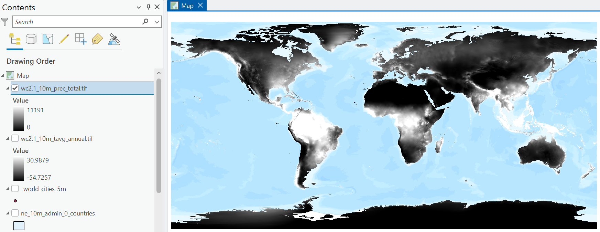{width=100%}

 

> To avoid confusion, remove the month temperature layer loaded previously (`wc2.1_10m_tavg_01.tif`). 

### Data integration: Polygon + Raster 

We now have some interesting datasets to work with: country geometries and attributes, key global cities (>5,000,000 population), and raster layers representing annual average temperature and total annual precipitation. 

To utilise this information effectively, an important next step in any spatial analysis is to **join** layers together. While there are lots of methods that can be used here, depending on the data types involved, broadly we can join mutiple layers based upon shared:

- **attribute** information i.e., datasets share a common attribute value (e.g., ID).
- **spatial** information i.e., datasets share a common geographic location.

In our case, we want to combine layers **spatially** with the following goal in mind:

- for each country (features of the `natural-earth` data) and city (`world_cities_5m`), return the average temperature and total precipitation from the corresponding raster layers. 

For our Polygon data, this can be achieved using [Zonal Statistics as Table](https://doc.esri.com/en/arcgis-pro/latest/tool-reference/spatial-analyst/zonal-statistics-as-table.html?tabs=dialog) (Spatial Analyst Tools):

> In the Geoprocessing pane, open [Zonal Statistics as Table](https://doc.esri.com/en/arcgis-pro/latest/tool-reference/spatial-analyst/zonal-statistics-as-table.html?tabs=dialog). For 'Input Raster or Feature Zone Data', use the `natural-earth` layer, with 'Zone Field' as ID[^zone_field]. For the 'Input Value Raster', use the average temperature raster created previously, and use an appropriate name for the 'Ouput Table' e.g., `ne-zonal-stats-temp`. For simplicity, select `Mean` for 'Statistics Type' and leave all other settings at default. 

[^zone_field]: Here we are calculating zonal statistics for each feature of the `natural-earth` layer. However, we could use a different zone field here e.g., `CONTINENT`, `REGION_WB`, to aggregate at a different scale. 

::: note
You may be presented with the following: `WARNING` [010566](https://doc.esri.com/en/arcgis-pro/latest/tool-reference/tool-errors-and-warnings/010001-020000/tool-errors-and-warnings-10551-10575-010566.html): *Some zones may not have been rasterized*. This has occurred because there are features present in the `natural-earth` layer but there are no corresponding values in the raster layer (`NoData`). 
:::

If successful, a new 'Standalone Table' should be present in the Contents Pane, which if opened contains the IDs used for aggregation (`FID`), the number of cells per feature, and the statistics we requested (`MEAN`)[^area_note].

[^area_note]: An `AREA` field is also present, but treat this value cautiously, as it is measured in the units of the Coordinate Reference System (degrees). Don't worry about this too much now - we'll discuss more fully later in the unit. 

> Repeat this process for precipitation, using [Zonal Statistics as Table](https://doc.esri.com/en/arcgis-pro/latest/tool-reference/spatial-analyst/zonal-statistics-as-table.html?tabs=dialog), but making sure to return the total precipitation (not the average). 

Our new tables have useful information, but we would struggle to perform any further *spatial* analysis in their current format... there is no spatial information! This can be addressed by joining our layers using **attribute information**, commonly referred to as a **table join**. This takes information from a *Join Table*, and adds it to the *Input Table* based on a common attribute, as illustrated below:

{width=100%}

 

> Right click on the `natural-earth` data in the Contents Pane &rarr; Joins and Relatives &rarr; Add Join. Under 'Input Field', select `FID`. For 'Join Table', use the output of Zonal Statistics (e.g., `ne-zonal-stats-temp`), with 'Join Field' also as `FID` (this is the field we selected for aggregation). Leave all inputs as default and Run. 

> Inspect the Attribute Table for the `natural-earth` data. At the end you should see new fields, corresponding to those produced by Zonal Statistics. 

> Repeat this process for the precipitation statistics table. 

The above is an example of a **dynamic** join i.e., if we were to remove the Zonal Statistics output, these fields would also be removed from the `natural-earth` Attribute Table. We will introduce the tools required for **permanent** joins in later practicals. 

> Update the layer Symbology to show average annual temperature and total annual precipitation per country.

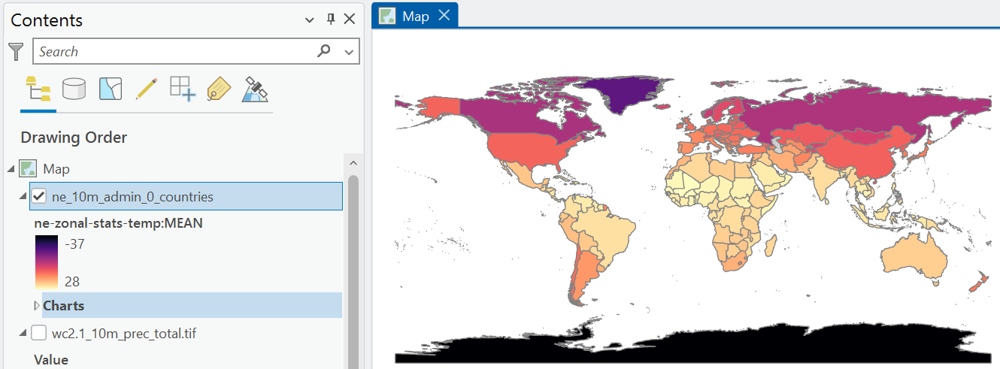{width=100%}

 

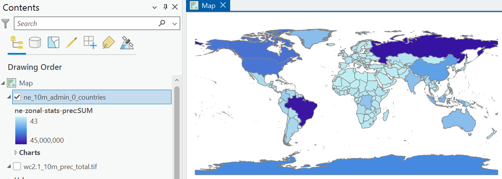{width=100%}

 

::: question
What is the annual average temperature and total annual precipitation for the UK? 
:::

### Data integration: Point + Raster 

We can repeat this process for our Point data (`world_cities_5m`), but we can achieve this more elegantly using a single standalone tool: [Extract Multi Values to Points](https://doc.esri.com/en/arcgis-pro/latest/tool-reference/spatial-analyst/extract-multi-values-to-points.html?tabs=dialog). As our Points represent discrete locations, with no corresponding area, there is no need for any form of aggregation. We can simply extract the corresponding raster value at each Point location, as illustrated below:

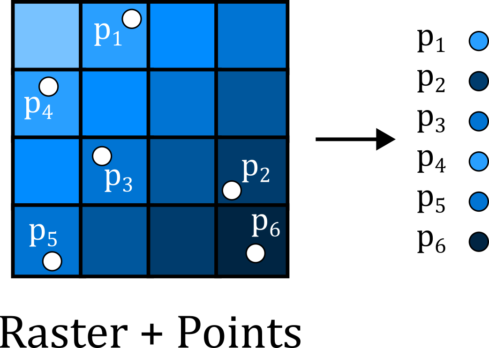{width=50%}

> Open [Extract Multi Values to Points](https://doc.esri.com/en/arcgis-pro/latest/tool-reference/spatial-analyst/extract-multi-values-to-points.html?tabs=dialog), using `world_cities_5m` as the 'Input point features' and select *both* the temperature and precipitation rasters as inputs. Update the 'Output field name' to simpler versions e.g., `temp`, `prec`. 

::: note
Note that this tool modifies the input data in place i.e., new fields are added to the Attribute Table for `world_cities_5m`, rather than creation of a new standalone table. While this streamlines our analysis in this case, be careful with tools that modify your input data! 
:::

::: question
Based on the information in the Attribute Table, which global cities have the highest and lowest average temperature / precipitation? 
:::

As previously, we can use information in the Attribute Table to change our layer symbology. This can be applied to the colour of the features, but also their size, transparency etc, see below: 

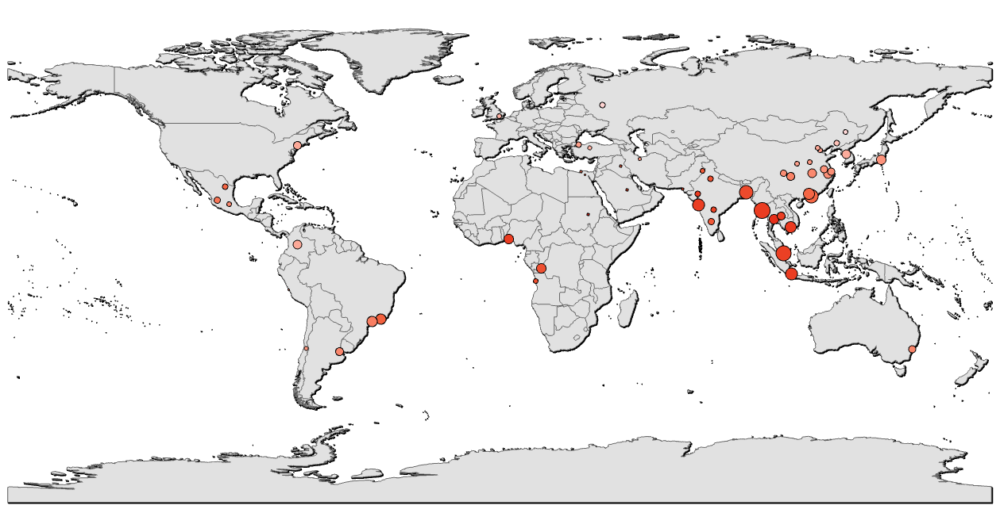{width=100%}

 

### Map production

So far we've become familiar with the ArcGIS interface, can load and symbolise vector and raster data, and can join layers based upon **attribute** and **spatial** information. This process has revealed information (e.g., average temperature per country or city), that was previously hidden i.e., **analysis!**

In the final part of this practical we will introduce the basics of map production in ArcGIS. 

::: note
*Note*: You do not have to follow the design choices below, which are intended as a guide only. If you are struggling with any of the map elements, or have a design idea that isn't covered below, ask for help in class. 
:::

In ArcGIS, we can design and export maps via **Layouts**. Unlike the Map View, which is used to inspect and visualise our map layers, **Layouts** are used for map production, containing the chosen layers plus a range of additional map elements e.g., scale bar, north arrow, title, text, legend, see [here](https://doc.esri.com/en/arcgis-pro/latest/help/layouts/layouts-in-arcgis-pro.html).

> In the top ribbon, navigate to Insert &rarr; New Layout, and choose an appropriate output size e.g., A4, landscape. 

If successful, this should produce an empty Layout:

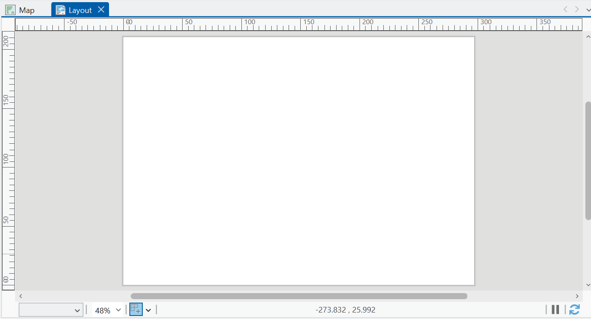{width=100%}

 

To add a map frame to this layout:

> In the Layout top ribbon, navigate to Map Frames &rarr; Map Frame, and using the 'Default Extent', use the cursor to draw the map frame, for example covering the entire A4 page, as shown below:

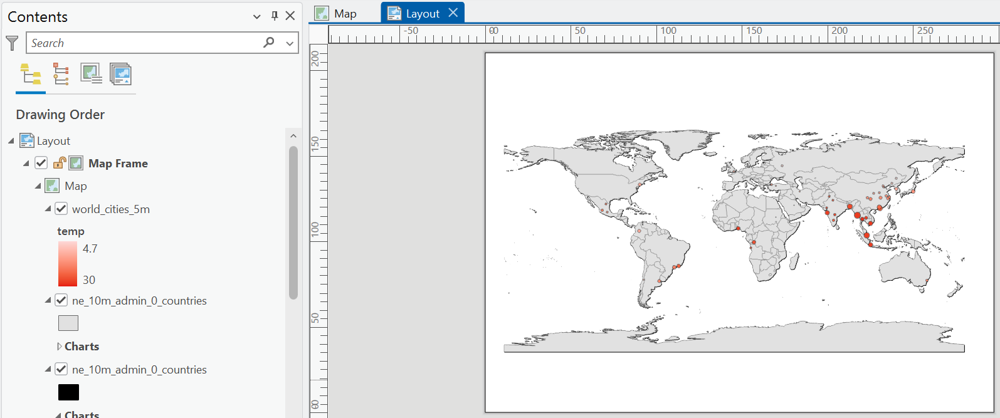{width=100%}

 

We can edit the map frame directly, for example by changing it's dimensions: 

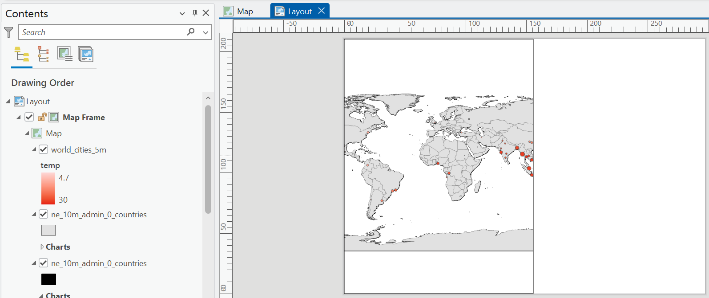{width=100%}

 

To modify the extent of the map layers **within** the map frame e.g., the scale:

> In the Layout top ribbon, navigate to Map &rarr; Activate, which will allow you to move the map layers within the frame. For example, below is the map panned to Asia, with a map scale of 1:40,000,000.

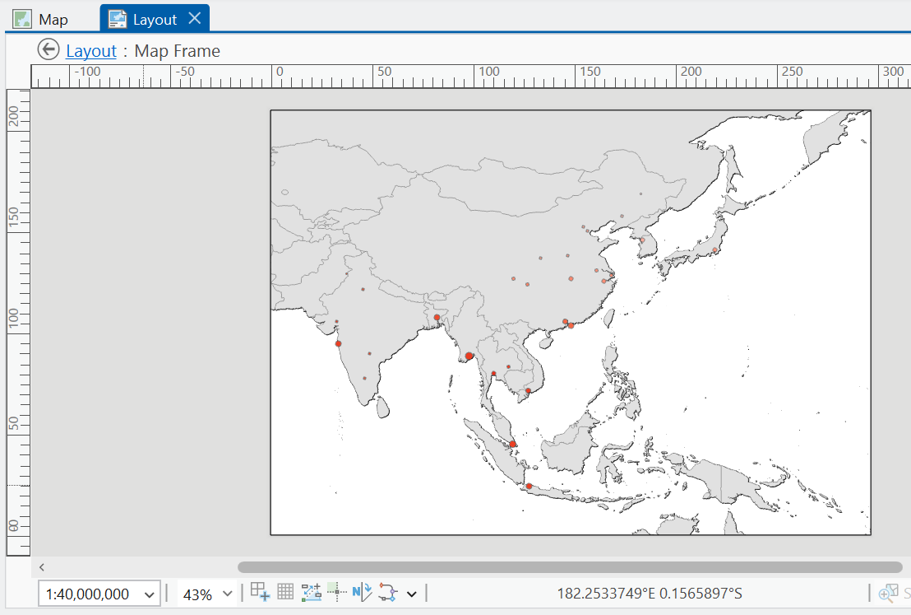{width=100%}

 

::: note
As a reminder, the aim of this section is to familiarise yourself with map production, so feel free to rescale the map (e.g., global, regional).
:::

> When you're happy with the map contents and scale, select 'Close Activation' in the top ribbon. 

A map is not complete without a scale bar, north arrow, title and legend, so let's add them. 

> In the Layout top ribbon, navigate to Map Surrounds and add a scale bar and north arrow. Add a Legend and explore the settings to remove unncessary layers, and changing the styling (e.g., font size, names) for visible layers:

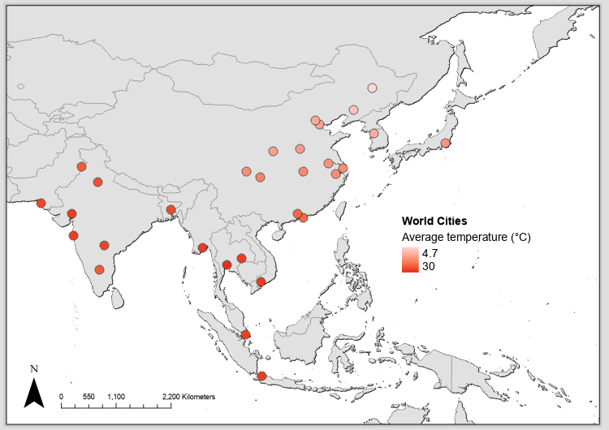{width=100%}

 

> Why not add a label for the city names? Right click `world_cities_5m`, select 'Label'. By default, this uses `$feature.CITY_NAME`, but you could change this via 'Label Properties'.

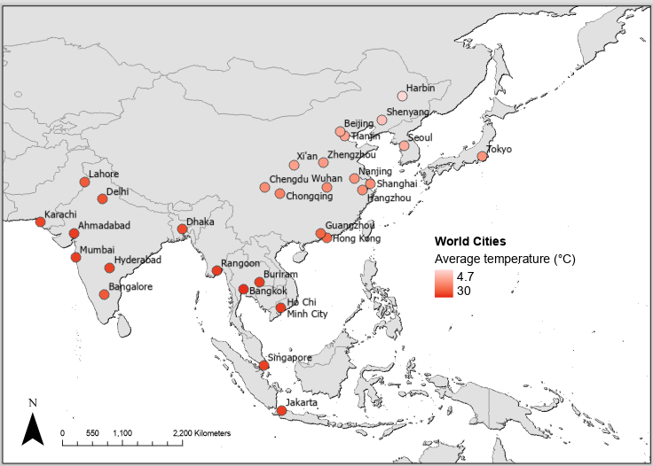{width=100%}

 

> In the Layout top ribbon &rarr; Graphics and Text, add a Text Box for a data attribution and/or title. 

> Why not add an extra symbology to the map? 

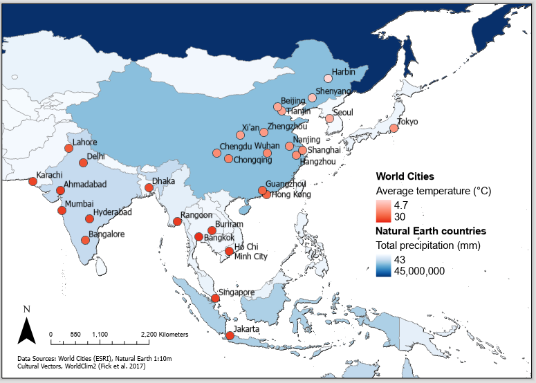{width=100%}

 

As you will have gathered from our exploration of the Layout panel, we are only really scratching the surface of map production and cartography. It will take time to learn! 

::: note
For a deeper overview of cartographic principles, wait for Week 3 of GEOG62411 (*Data Acquisition for GI Scientists*). 

It is also worth reiterating that this is **not** a course on cartography. While you should endeavour to avoid cartographic *mistakes*, the aim is to produce clear and informative map outputs i.e., is there a scale bar and north arrow? Are layers described for the reader? Are appropriate colour scales used?  
:::

### Map export

As our final task, we want to export our map. This will be useful for your [assessments](#assessment). 

> In the top ribbon, navigate to Share &rarr; Output &rarr; Export Layout. In the 'Export Layout' pane, you can either export a raster image (e.g., `.png`, recommended resolution of 300 dpi) or a vector output for further editing (e.g., `.pdf`, `.svg`), for example in [Inkscape](https://inkscape.org/) or an editing software of your choice. 

> Export your layout as a raster (e.g., `practical-1-map.png`), saving to the correct directory, and 'Clip to graphics extent'. 

**Congratulations!** You have completed some introductory but powerful spatial analysis and made a beautiful map.

[**Finished!**](#index)

------------------------------------------------------------------------

## Extra

The practical is finished! What do you mean there are more tasks to do?! 

Each week I will provide an **Extra** section, containing additional tasks and questions, for those students who want to explore the topic further and develop their understanding. 

In the practical we've been working with **historical** climate data (1970 - 2000) from [WorldClim 2](https://www.worldclim.org/data/worldclim21.html), described by @fick2017.

WorldClim 2 also includes a range of **future** climate projections, derived from CMIP6 (*Coupled Model Intercomparison Project Phase 6*), a project which combines outputs from a range of global climate models (GCM) for different scenarios of societal development, known as [Shared Socio-economic Pathways](https://doi.org/10.1016/j.gloenvcha.2016.05.009) (SSPs).

A good overview of the SSPs is provided [here](https://www.dkrz.de/en/communication/climate-simulations/cmip6-en/the-ssp-scenarios).

> Download the monthly average temperature datasets [`tx`] for 2081-2100 using the U.K. Earth System Model (`UKESM1-0-LL`) at a 10 arc-minute spatial resolution [here](https://www.worldclim.org/data/cmip6/cmip6_clim10m.html). For further information on the UKSEM, see @sellar2019. 

> For SSP1-2.6 (*Sustainable*), SSP2-4.5 (*Middle of the road*), SSP3-7.0 (*Regional rivalry*) and SSP5-8.5 (*Fossil-Fueled Development*), calculate the average annual monthly temperature using [Cell Statistics](https://doc.esri.com/en/arcgis-pro/latest/tool-reference/spatial-analyst/cell-statistics.html?tabs=dialog).

 
Which world cities (\>5 million population) are expected to see the greatest increase in temperature by 2081 - 2100? You may want to use `Zonal Statistics` again...

