# (PART\*) Spatial Patterns {.unnumbered}

# Spatial Weights {#spatial_weights}

## Introduction

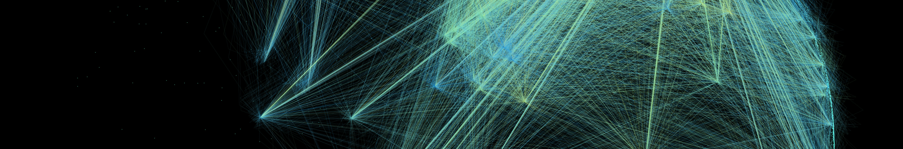

### Aims {.unnumbered}

The aims of this practical are to:

1.  Understand what spatial weights represent.
2.  Understand how spatial weights are constructed (i.e., contiguity, distance).
3.  Understand how spatial weights underpin analysis of spatial patterns.

### Application {.unnumbered}

To achieve this, we'll demonstrate construction of spatial weights using country Polygons and assess neighbourhood effects on cultural similarity, using the Cultural Fixation Index (CFST) from @muthukrishna2020.

### Data {.unnumbered}

-   Natural Earth 1:10m Cultural Vectors, available in [`data/natural-earth`] [[Source](https://www.naturalearthdata.com/downloads/10m-cultural-vectors/)]
-   Cultural Distance matrix, produced for 80 country pairs by @muthukrishna2020, available in [`data/cultural-similarity`] [[Source](https://world.culturalytics.com/)]
-   Ordnance Survey (OS) 100 km grid, available in [`data/os/grids`] [[Source](https://github.com/OrdnanceSurvey/osbng-grids)]

### Tools {.unnumbered}

[Generate Spatial Weights Matrix](https://doc.esri.com/en/arcgis-pro/latest/tool-reference/spatial-statistics/generate-spatial-weights-matrix.html?tabs=dialog) (Spatial Statistics), [Convert Spatial Weights Matrix to Table](https://doc.esri.com/en/arcgis-pro/latest/tool-reference/spatial-statistics/convert-spatial-weights-matrix-to-table.html?tabs=dialog) (Spatial Statistics), [Introduction to Neighborhood Explorer](https://doc.esri.com/en/arcgis-pro/latest/tool-reference/spatial-statistics/introduction-to-neighborhood-explorer.html), [Calculate Geometry Attributes](https://doc.esri.com/en/arcgis-pro/latest/tool-reference/data-management/calculate-geometry-attributes.html?tabs=dialog) (Data Management Tools), [Join Field](https://doc.esri.com/en/arcgis-pro/latest/tool-reference/data-management/join-field.html?tabs=dialog) (Data Management Tools), [XY To Line](https://doc.esri.com/en/arcgis-pro/latest/tool-reference/data-management/xy-to-line.html?tabs=dialog) (Data Management Tools), [Delete Identical](https://doc.esri.com/en/arcgis-pro/latest/tool-reference/data-management/delete-identical.html?tabs=dialog) (Data Management Tools), [Summary Statistics](https://doc.esri.com/en/arcgis-pro/latest/tool-reference/analysis/summary-statistics.html?tabs=dialog) (Analysis Tools), [Create Thiessen Polygons](https://doc.esri.com/en/arcgis-pro/latest/tool-reference/analysis/create-thiessen-polygons.html?tabs=dialog) (Analysis Tools)

------------------------------------------------------------------------

## Practical

### Conceptual approach

According to Tobler's Law [@tobler1970]:

"*everything is related to everything else, but near things are more related than distant things.*"

This idea has resonated strongly across geography, see @miller2004. As spatial analysts, it also raises some fundamental questions:

::: question
What do we mean by **near** and **distant**? i.e., *proximity*
:::

::: question
For a given set of spatial objects, which are **neighbours**? i.e., *adjacency*
:::

::: question
How do we define and model **proximity** and **adjacency**?
:::

Answering these spatial questions is a necessary step before embarking on further spatial analysis. Before we can ask ...

::: question
What spatial **patterns** are present in a dataset?[^02-spatial-weights-1]
:::

[^02-spatial-weights-1]: As we'll cover in Part II (*Spatial Patterns*) of GEOG73001: Practicals 2 - 5.

::: question
What spatial **processes** are important in my study area?[^02-spatial-weights-2]
:::

[^02-spatial-weights-2]: As we'll cover in Part III (*Spatial Modelling*) of GEOG73001: Practicals 6 - 8.

... we need to define how the features of our spatial data (e.g., Points, Lines, Polygons, cells of a Raster) are **topologically connected**[^02-spatial-weights-3] i.e., which are defined as *neighbouring* and which are *non-neighbouring*.

<p align="center">
<a name=""></a>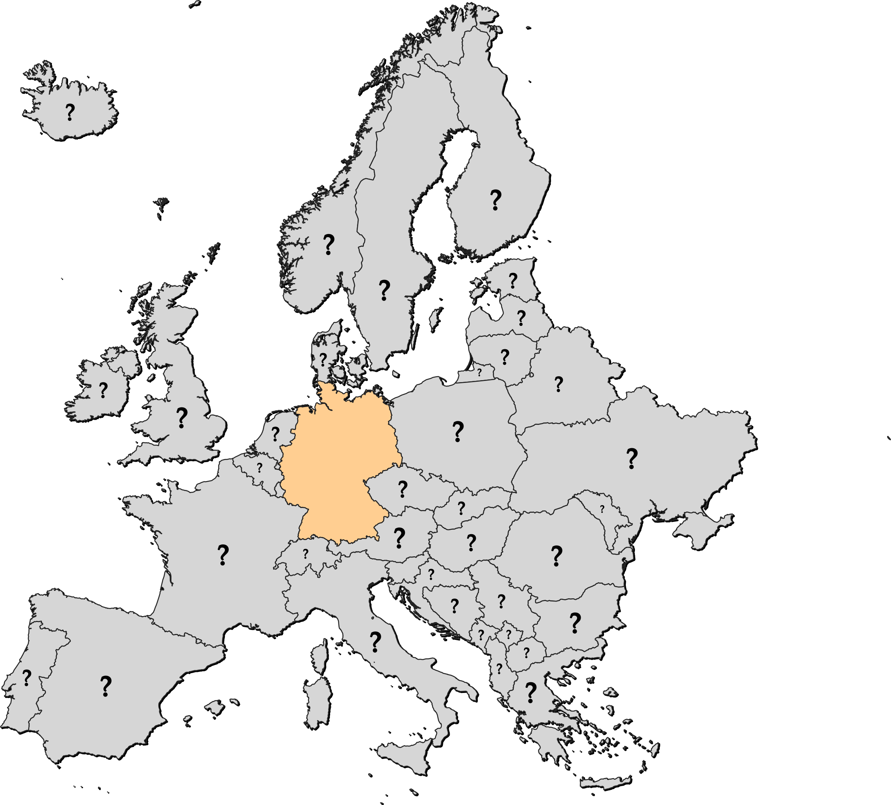{width=50%}
</p>

::: question
For the highlighted country, how would you define neighbours? 
:::

[^02-spatial-weights-3]: *Topological* properties of an object are those that are retained when a geometric object undergoes continuous deformation (e.g., stretching, twisting, bending). An example of a topological property would be whether two objects ($A,B$) are *touching*. If these objects are deformed, their geometries properties would change (e.g., area, perimeter) but their topology would be retained. You will learn much more about topology in Understanding GIS - Week 2.

In the field of spatial **econometrics**[^field_discuss], which we'll discuss more fully later in the unit, spatial relationships between objects are defined using **spatial weights**.

[^field_discuss]:
*Note* we'll discuss the history and conceptual approaches of the fields of **econometrics** and **geostatistics** in later weeks, but as brief introduction - The field of *econometrics* focuses on analysis of **discretised space** (i.e., "areal data"), where continuous space is broken down into discrete zones (e.g., counties, countries), often represented by Polygons or Points, see @anselin1988. While closely related, *geostatistics* focuses on processes operating over **continuous space**, where spatial interpolation is a key method, see @diggle2007.

### Defining spatial weights

Spatial weights ($w$) are used to represent the presence and/or strength of the spatial relationship between two objects. In the example above, we could define neighbours based on whether countries share a common border[^weight-example], in which case:

- For neighbouring objects, $w=1$.
- For non-neigbouring objects, $w=0$. 

<p align="center">
<a name=""></a>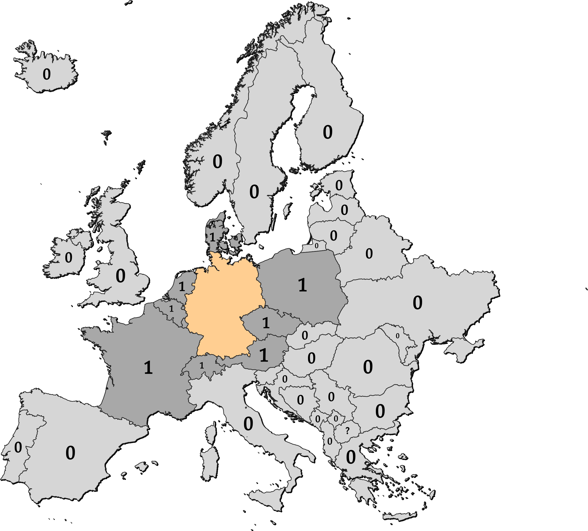{width=50%}
</p>

[^weight-example]: *Note* this is just an example, and we'll discuss the various methods for calculating spatial weights as we progress through the practical.

We would typically calculate the spatial weight ($w$) for every pair of objects in a dataset ($ij$), and store this in a **spatial weights matrix** ($\mathbf{W}$), which conceptually looks like this: 

$$\mathbf{W}=\begin{bmatrix} w_{11} & w_{12} & ... & w_{1n} \\ w_{21} & w_{22} & ... & w_{2n} \\ \vdots & \vdots & \ddots & \vdots \\ w_{n1} & w_{n2} & ... & w_{nn} \end{bmatrix}$$

$\mathbf{W}$ contains the spatial weights for every pair of objects ($w_{ij}$). In this example, the top row contains the spatial weight associated with Object 1 and itself ($w_{11}$[^self]), the spatial weight for Object 1 and Object 2 ($w_{12}$), up to the number of objects ($n$) in the dataset ($w_{1n}$). The second row contains all the spatial weights associated with Object 2 and every other object in the dataset ($w_{2n}$), and so on. 

[^self]: Self-neighbor relations are typically excluded so $W=0$.

Let's illustrate with a simple example, focusing on six European countries: *Netherlands ($n$), Belgium ($b$), Luxembourg ($l$), Germany ($g$), Austria ($a$), and Czechia ($c$)*:

<p align="center">
<a name=""></a>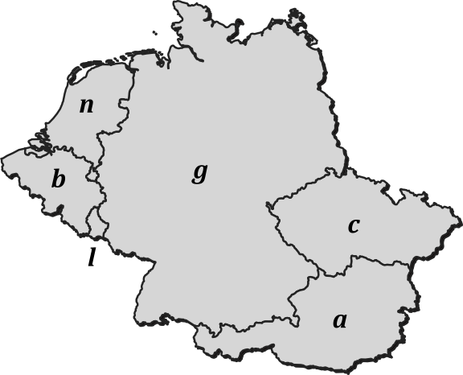{width=50%}
</p>

If we apply our current neighbourhood rule (*if* countries share a border, $w=1$, *else* $w=0$), then:

- $w_{nb}=1$ for the Netherlands ($n$) and Belgium ($n$), as these are directly bordering.
- $w_{na}=0$ for the Netherlands ($n$) and Austria ($a$), as these are *not* directly bordering. 

We would calculate $w$ for all pairs, and store these values with the following structure:

$$\mathbf{W}=\begin{bmatrix} w_{nn} & w_{nb} & w_{nl} & w_{ng} & w_{na} & w_{nc} \\  w_{bn} & w_{bb} & w_{bl} & w_{bg} & w_{ba} & w_{bc} \\  w_{ln} & w_{lb} & w_{ll} & w_{lg} & w_{la} & w_{lc} \\  w_{gn} & w_{gb} & w_{gl} & w_{gg} & w_{ga} & w_{gc} \\  w_{an} & w_{ab} & w_{al} & w_{ag} & w_{aa} & w_{ac} \\  w_{cn} & w_{cb} & w_{cl} & w_{cg} & w_{ca} & w_{cc}\end{bmatrix}$$

Using our previous neighbourhood rule, the spatial weights matrix would be as follows:

$$\mathbf{W}=\begin{bmatrix} 0 & 1 & 0 & 1 & 0 & 0 \\ 1 & 0 & 1 & 1 & 0 & 0 \\ 0 & 1 & 0 & 1 & 0 & 0 \\ 1 & 1 & 1 & 0 & 1 & 1 \\ 0 & 0 & 0 & 1 & 0 & 1 \\ 0 & 0 & 0 & 1 & 1 & 0\end{bmatrix}$$

::: question
Which country has the highest number of neighbours? What do you notice about the spatial pattern of the values?
:::


Graphically, $\mathbf{W}$ would resemble the following, where lines are connecting each neighbouring country ($w=1$), and are absent for non-neighbouring countries ($w=0$):

<p align="center">
<a name=""></a>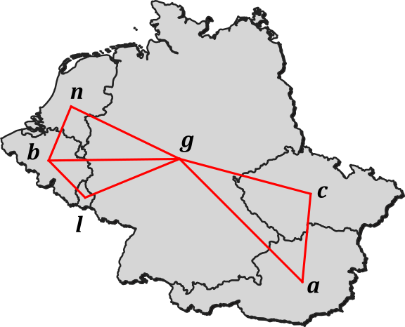{width=50%}
</p>

The examples above are just *one* approach to calculating spatial weights $w$ and we'll explore a range of methods as we progress through the practical. Irrespective of choice of method, the spatial weights matrix $\mathbf{W}$ is a way of defining the **connectivity** (topology) between all pairs of observations.


### Spatial weights in practice {#weights-in-practice}

So far we've defined spatial weights ($w$ = the presence and/or strength of the spatial relationship between two objects) and explored how we can store $w$ for all pairs of observations in a spatial weights matrix $\mathbf{W}$. 

The best way to *really* understand $w$ and $\mathbf{W}$ is through data exploration, so let's get started:

> Open ArcGIS Pro and create a new project with a suitable name (e.g., `practical-2`), making sure to select the corresponding directory on your P Drive (`P:\GEOG73001\practical-2`) and *unchecking* 'Create a folder for this local project'. 

> Create a connection to `GEOG73001/data` and then load the Ordnance Survey (OS) 100 km grid (`osbng_grid_100km.shp`).

This layer is the National Grid for Great Britain, comprising grid squares each of size 100 km by 100 km: 

<p align="center">
<a name=""></a>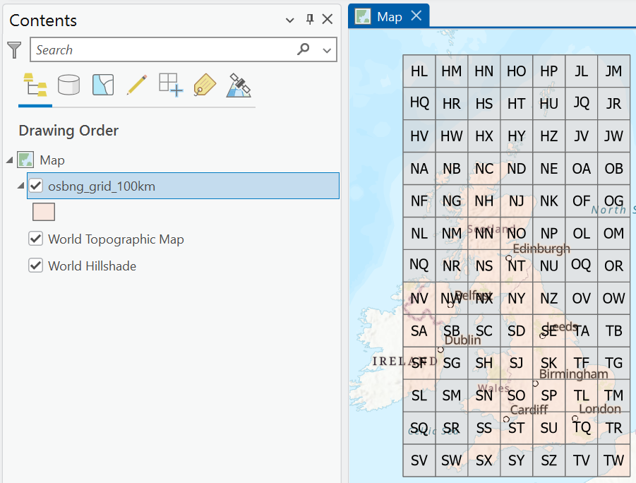{width=50%}
</p>

The Coordinate Reference System (CRS) for this dataset is [EPSG:27700](https://epsg.io/27700), which is designed to minimise **distortion** in the area of interest (i.e., Great Britain)[^distortion].

[^distortion]: Distortion is discussed more fully in *Understanding GIS* (Weeks 2 and 5)

::: question
Can you remember how to check the CRS for a map layer?
:::

When loading data, ArcGIS will automatically update the *map's* coordinate reference system to match that of the *first* feature layer added. 

> In the Contents Pane, right click Map &rarr; Properties &rarr; Coordinate Systems, to verify.

The National Grid is unlike most spatial data (i.e., all features are of the same size, regularly spaced). This simplicity is useful, as it will allow us to investigate and understand the different approaches we can use for calculating $w$.   

### Contiguity weights {#contig-swm}

The first main approach for calculating $w$ is referred to as **contiguity weights** i.e., neighbouring (contiguous) spatial objects are those that share a common border. However, the definition of "common border" is more complex than you might think. We can explore this complexity using the [Neighborhood Explorer](https://doc.esri.com/en/arcgis-pro/latest/tool-reference/spatial-statistics/introduction-to-neighborhood-explorer.html).

> In the top ribbon, navigate to Analysis &rarr; Neighbourhood Explorer, ensuring that `osbng_grid_100km` is selected in the Contents Pane. For "Unique ID Field", use `FID`.

The Neighbourhood Explorer is a powerful tool that allows us to visualise and investigate different *conceptualisations of spatial relationships*. 


#### Rook Contiguity {.unnumbered .unlisted}

> For "Conceptualisations of Spatial Relationships", choose "Contiguity Edges Only" and then press Apply. 

When complete, your map cursor will have changed, and a new layer will now be visible in the Contents Pane.

> Select one of the OS grid squares, which should visualise the connections between the **focal** feature (the one you've selected) and all the neighbouring features (based on the "contiguity edges only" rule).  

<p align="center">
<a name=""></a>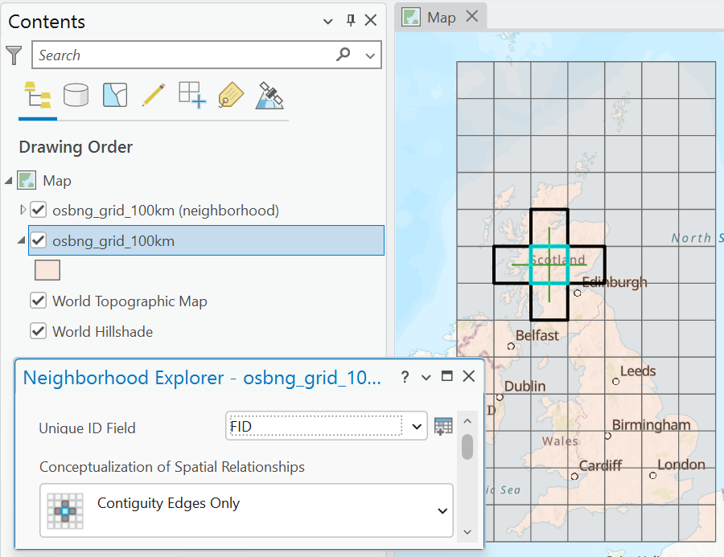{width=50%}
</p>

As the name suggests, *Contiguity Edges Only* identifies neighbouring objects which **share an edge**. This is also known as *Rook contiguity*, reflecting one of the possible moves in the game of chess. 

For example, take the simple $3 \times 3$ grid below, labelled $a-i$:

<p align="center">
<a name=""></a>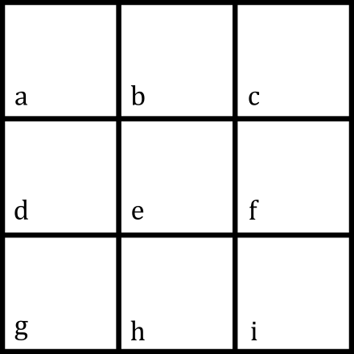{width=50%}
</p>

Using Contiguity Edges Only (*Rook*), our neighbours would resemble the following i.e., $a$ shares edges with $b$ and $d$ (so are neighbouring), but does *not* share an **edge** with $e$ (non-neighbouring):

<p align="center">
<a name=""></a>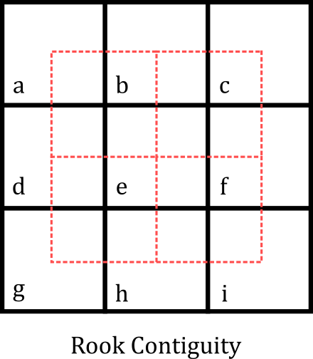{width=50%}
</p>

Conceptually, $\mathbf{W}$ would resemble the following, storing $w$ for all pairs of observations.

$$\mathbf{W}=\begin{bmatrix} w_{aa} & w_{ab} & w_{ac} & w_{ad} & w_{ae} & w_{af} & w_{ag} & w_{ah} & w_{ai} \\ w_{ba} & w_{bb} & w_{bc} & w_{bd} & w_{be} & w_{bf} & w_{bg} & w_{bh} & w_{bi} \\ \vdots & \vdots & \vdots & \vdots & \vdots & \vdots & \vdots & \vdots & \vdots \\ w_{ia} & w_{ib} & w_{ic} & w_{id} & w_{ie} & w_{if} & w_{ig} & w_{ih} & w_{ii}\end{bmatrix}$$

For the example rows above, the values for $w$ would be as follows:

$$\mathbf{W}=\begin{bmatrix} 0 & 1 & 0 & 1 & 0 & 0 & 0 & 0 & 0 \\ 1 & 0 & 1 & 0 & 1 & 0 & 0 & 0 & 0 \\ \vdots & \vdots & \vdots & \vdots & \vdots & \vdots & \vdots & \vdots & \vdots \\0 & 0 & 0 & 0 & 0 & 1 & 0 & 1 & 0 \end{bmatrix}$$

#### Queen's Contiguity {.unnumbered .unlisted}

An alternative and more commonly used approach to calculating contiguity weights is referred to by ESRI as *Contiguity Edges Corners* or more widely as *Queen's contiguity*, which identifies neighbouring objects which **share an edge or a point**. 

> In Neighbourhood Explorer, update the "Conceptualisations of Spatial Relationships" to "Contiguity Edges Corners", press Apply, and explore the connections in the Map View.

<p align="center">
<a name=""></a>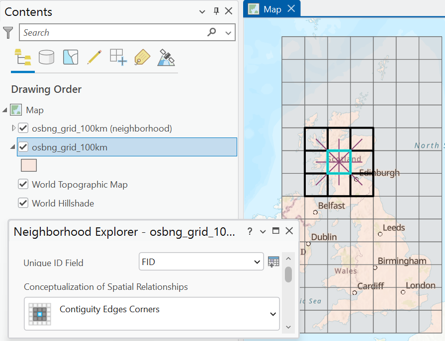{width=50%}
</p>

Returning to our simple $3 \times 3$ grid, but this time using Contiguity Edges Corners (*Queen's*), our neighbours would resemble the following i.e., $a$ shares edges *and* points with $b$ and $d$, so are defined as neighbouring. While $a$ does *not* share an **edge** with $e$, it *does* share a **point**, so is also neighbouring:

<p align="center">
<a name=""></a>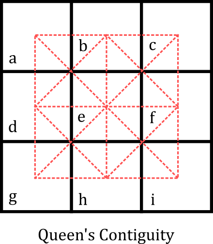{width=50%}
</p>

The conceptual structure of $\mathbf{W}$ would remain the same as above, storing $w$ for all pairs of observations, but the values of $w$ will change with our new neighbourhood rule:

$$\mathbf{W}=\begin{bmatrix} 0 & 1 & 0 & 1 & 1 & 0 & 0 & 0 & 0 \\ 1 & 0 & 1 & 1 & 1 & 1 & 0 & 0 & 0 \\ \vdots & \vdots & \vdots & \vdots & \vdots & \vdots & \vdots & \vdots & \vdots \\0 & 0 & 0 & 0 & 1 & 1 & 0 & 1 & 0 \end{bmatrix}$$
Both of these approaches are examples of **binary** classifications of spatial relationships, objects are either neighbouring ($w=1$) or not ($w=0$). Objects *cannot* be partly neighbouring[^triangulation].

[^triangulation]: You will have noticed that there is one additional method in the 'Contiguity' group, known as 'Trimmed Delaunay Triangulation'. You can explore this later in the [extra](#weights-extra) section. 

### Distance based weights {#dist-swm}

Another approach to define $w$ is based upon distance between objects (i.e., *proximity*), with "near" objects defined as neighbours.

#### Fixed Distance {.unnumbered .unlisted}

> Return to the Neighbourhood Explorer, and update the "Conceptualisations of Spatial Relationships" to "Fixed Distance", keeping the "Distance Method" as 'Euclidean'. Explore the effects of the "Distance Band" attribute on the neighbourhood classification. 

<p align="center">
<a name=""></a>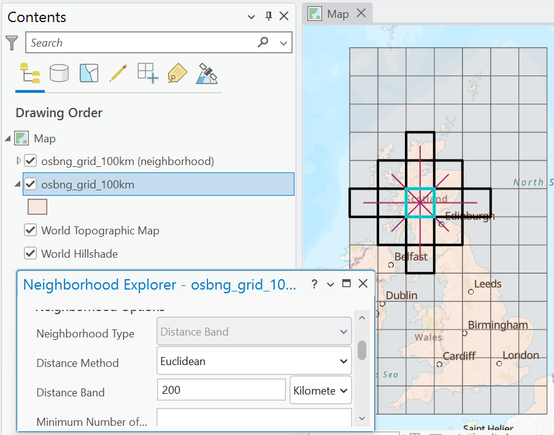{width=50%}
</p>


::: question
When using a "Distance Band" of 50 km, no neighbours are returned for any of the selected cells. Why might this be? Where are distances measured from? 
:::

The "Fixed Distance" approach is also **binary** and we can confirm this by returning to the Neighbourhood Explorer, where the table at the bottom lists the IDs of all the neighbours for the selected focal feature and the corresponding weight $w$. The 'Statistics' tab also includes important information about the number of features in the layer and neighbour counts. 

#### K Nearest Neighbours {.unnumbered .unlisted}

Another distance based approach returns the "$K$ Nearest Neighbours" for each feature, with the value of $K$ selected by the user.

> Use the Neighbourhood Explorer to explore the effects of changing $K$.

<p align="center">
<a name=""></a>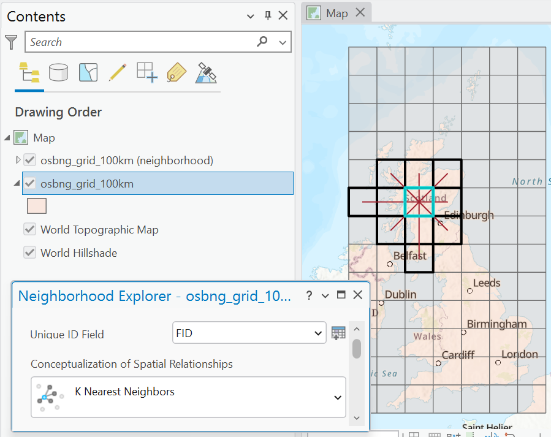{width=50%}
</p>

::: question
Inspect the example above, where $K=10$. What do you notice about the pattern of neighbours? 
:::

In the example above, the eight nearest neighbours are fairly easy to identify (immediately $N, NE, E, ...$), but when identifying the remaining two neighbours (to achieve $K=10$), there are *four* grid cells that are equidistant to the focal feature (*two* grid cells $N,E,S$ and $W$, respectively). 

::: question
What method do you think ArcGIS has used to select the cells to the south and west? Try to replicate the above result yourself, and test a few locations...
:::

This might be an issue for our simple regularly-spaced dataset, but is unlikely to be a significant problem for more typical spatial datasets, where multiple equidistant features are unlikely. 

#### Inverse Distance {.unnumbered .unlisted}

The final distance based approach to consider is *Inverse Distance*, which marks a shift away from a **binary** classification of $w$ to a **continuous** classification. Rather than $w = 0|1$, $w$ can be continuous, where "nearer" objects have larger weights than "distant" objects, in accordance with Tobler's Law [@tobler1970].

> Return to the Neighbourhood Explorer, and update the "Conceptualisations of Spatial Relationships" to "Inverse Distance" and choose a suitable Distance Band (e.g. 200 km) and apply. 

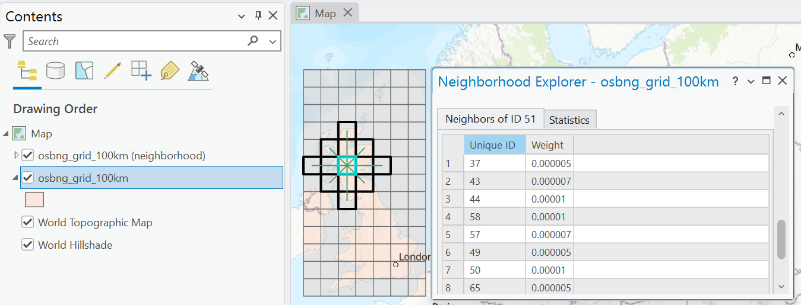{width=100%}
<br>

Here we can see that $w$ is now continuous, with the largest weights for the nearest grid cells (0.00001, immediately $N, E, S$ and $W$) and the smallest weights for the furthest objects (0.000005).

The magnitude of this *distance decay* effect (i.e., Tobler's Law) is controlled by the weighting scheme used and any associated model parameters. Our weighting scheme here is inverse distance weighting, defined as follows:

$$w=1/d^p$$
where $d$ is the distance between objects, and $p$ is an exponent controlling how $w$ varies with distance. Our current approach uses $p=1$. In the calculations above, our distance $d$ uses the units of the Coordinate Reference System (m), so for cells that are 100 km apart, the calculation would be as follows: $1 / 100000^1 = 0.00001$.

> Explore how changing the "Exponent" parameter ($p$) influences $w$. 

As $p$ increases, closer objects receive proportionally larger weights, relative to distant objects. For example, when $p=1$ and using a distance threshold of 200 km, the closest cells have a weight twice as large as distant objects, here defined as those within 200 km i.e., $w=0.00001$ compared to $w=0.000005$ for distant cells ($2 \times w$). When $p=2$, the difference is four times as large ($w=1 \times 10^{10}$ compared to $w=2.5 \times 10^{11}$).

The "Inverse Distance" conceptualisation is just one weighting scheme, but there are others we can use to control the *distance decay* effect. These can be accessed by selecting the "Manual" conceptualisation at the bottom of the Neighbourhood Explorer, using "Distance Band" for Neighbourhood Type, and then selecting the Weighting Method.

> Explorer the effects of these alternative methods on $w$.

#### Row Standardisation {#row_standard}

One option you may have noticed in the Neighbourhood Explorer is **Row Standardisation**. This is a useful approach to account for uneven spatial data and/or edge effects (i.e., objects near the edge of your dataset are likely to have fewer neighbours than those near the centre), both of which can result in significant differences in the number of neighbours. 

Row standardisation converts each value of $w$ in the spatial weights matrix $\mathbf{W}$ into **proportional** *standardised* weights $w_{ij(s)}$, dividing each weight $w_{ij}$ by the sum of all its neighbour weights (the row $j$):

$$w_{ij(s)}=w_{ij}/\sum_{j}w_{ij}$$

For example, take $\mathbf{W}$ for our European example, where I've added the row sums for each feature (i.e., the number of neighbours):

$$\mathbf{W}=\begin{bmatrix} 0 & 1 & 0 & 1 & 0 & 0 \\ 1 & 0 & 1 & 1 & 0 & 0 \\ 0 & 1 & 0 & 1 & 0 & 0 \\ 1 & 1 & 1 & 0 & 1 & 1 \\ 0 & 0 & 0 & 1 & 0 & 1 \\ 0 & 0 & 0 & 1 & 1 & 0\end{bmatrix} =\begin{matrix} 2 \\ 3 \\ 2 \\ 5 \\ 2 \\ 2 \end{matrix}$$

A row standardised $\mathbf{W}$ would resemble the following:

$$\mathbf{W}=\begin{bmatrix} 0 & 1/2 & 0 & 1/2 & 0 & 0 \\ 1/3 & 0 & 1/3 & 1/3 & 0 & 0 \\ 0 & 1/2 & 0 & 1/2 & 0 & 0 \\ 1/5 & 1/5 & 1/5 & 0 & 1/5 & 1/5 \\ 0 & 0 & 0 & 1/2 & 0 & 1/2 \\ 0 & 0 & 0 & 1/2 & 1/2 & 0\end{bmatrix}$$
Each row now sums to 1, hence row *standardisation*. 

### Spatial weights for "real" data

So far we've explored key concepts related to spatial weights and common approaches to define $w$ using a very simple spatial dataset. You should now have an understanding of [contiguity](#contig-swm) and [distance based](#dist-swm) weights, and the important choices involved (e.g., selecting $K$, exponents, distance bands, row standardisation). 

However, our OS dataset is unlike most spatial data, so to develop our understanding further, let's investigate spatial weights with a more typical spatial dataset.   

> Load the Natural Earth data from Practical 1 [`ne_10m_admin_0_countries.shp`].

If you change the map scale, your Map View should resemble the following:

<p align="center">
<a name=""></a>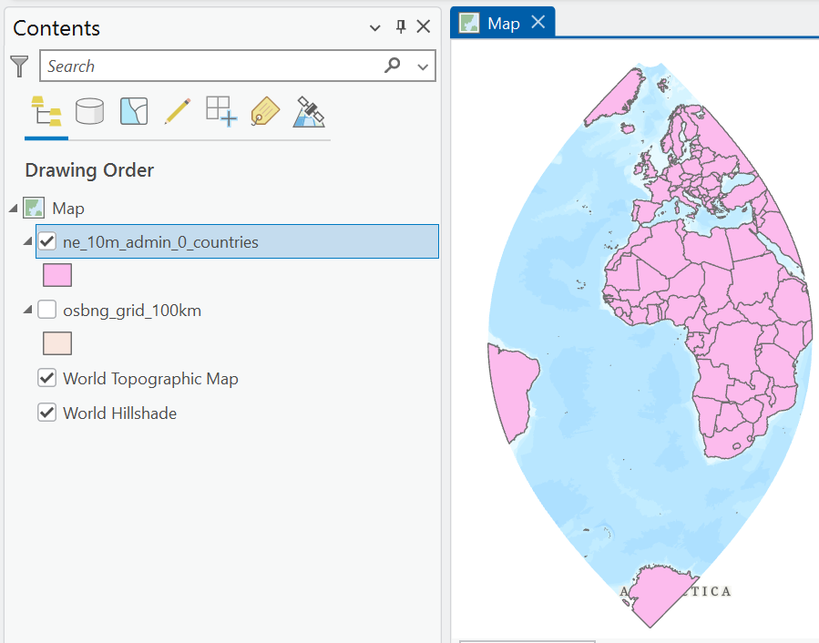{width=50%}
</p>

::: question
This is very different to the Map View from Practical 1. Can you think why this might be?
:::

<details>
  <summary>Answer</summary>
  This is because our Map View is using [EPSG:27700](https://epsg.io/27700) as the coordinate reference system (CRS). This does a good job of minimising **distortion** for Great Britain, but at the cost of enhancing distortion elsewhere. As a result, we should really change our Map CRS to that of the Natural Earth data ([EPSG:4326](https://epsg.io/4326)), or a similar CRS designed for global data. 
</details>

> Right click on "Map" in the Contents Pane &rarr; Properties &rarr; Coordinate Systems, and choose a suitable `Projected Coordinate System` for the World e.g., Equal Earth, Natural Earth, Robinson, or use `Geographic Coordinate System` &rarr; World &rarr; WGS 1984. 

Our new Map CRS will make it much easier to see our spatial relationships: 

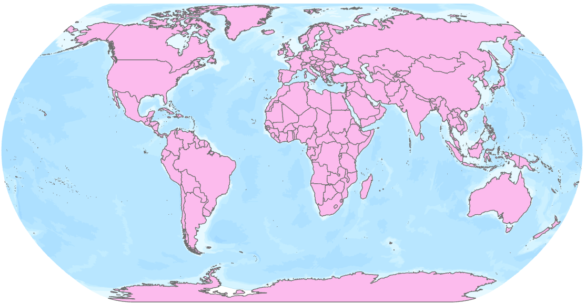{width=100%}

<br>

If we change our Map View back to Great Britain, we can see the local distortion quite clearly:

<p align="center">
<a name=""></a>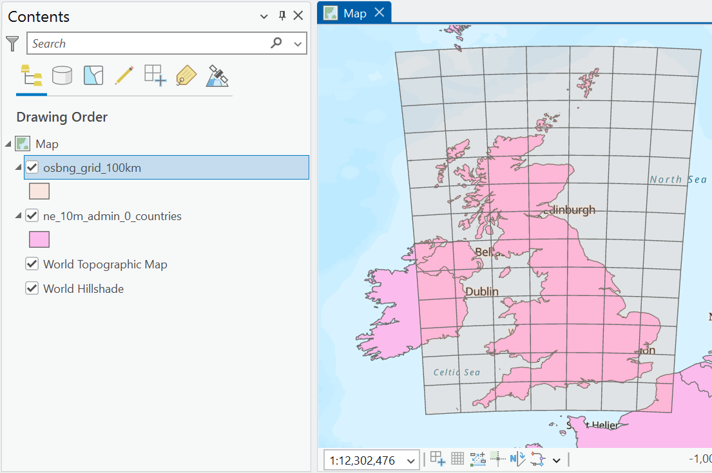{width=50%}
</p>

> Use the Neighbourhood Explorer to investigate different *conceptualisations of spatial relationships*, using "Unique ID" = `NE_ID`[^id_note]. This is a stable and unique ID provided in the Natural Earth dataset.

[^id_note]: We could use `FID` here but ESRI recommends against using the Object ID (Warning [110635](https://doc.esri.com/en/arcgis-pro/latest/tool-reference/tool-errors-and-warnings/110001-120000/tool-errors-and-warnings-110626-110650-110635.html)), as these system-managed fields can be reordered, for example if you were to sort the Attribute Table. 


::: question
What do you think is the most appropriate method for this dataset? e.g., *Contiguity* or *Distance based*, *Binary* or *Continuous*?
:::

::: question
Is there a "correct" neighbourhood for each country?
:::

::: question
Do you notice any interesting or unexpected behaviour? *Hint*: France is a useful country to explore...
:::

#### Generating the spatial weights matrix

The Neighbourhood Explorer is a really useful tool which allows us to *dynamically* view connections for a single feature of interest by selecting the *focal feature*. To generate these connections for the entire dataset, and potentially use the result for further analysis, we need to create our spatial weights matrix $\mathbf{W}$.

> Open the Geoprocessing tool [Generate Spatial Weights Matrix](https://doc.esri.com/en/arcgis-pro/latest/tool-reference/spatial-statistics/generate-spatial-weights-matrix.html?tabs=dialog). The inputs and underlying concepts should be very familiar to you by now, so select the `Natural-Earth` data as input using "Unique ID" = `NE_ID`. For the output spatial weights matrix, choose a suitable file name (e.g., `natural-earth-swm.swm`) and save to the `practical-2` directory. You are welcome to choose the Neighbourhood Type, although **Queen's contiguity** might be a suitable choice here. Leave all other settings as the default (e.g., 'Row Standaridation' = checked). 

If successful, `natural-earth-swm.swm` should now be visible in the `practical-2` directory.

There are some warnings to check: 

```{r, eval=FALSE, collapse=TRUE}       
WARNING 001605: Distances for Geographic Coordinates (degrees, minutes, seconds) are analyzed using Chordal Distances in meters.
WARNING 000846: 83 feature(s) had no neighbors which generally invalidates the statistical properties of a test.
```

WARNING [001605](https://doc.esri.com/en/arcgis-pro/latest/tool-reference/tool-errors-and-warnings/001001-010000/tool-errors-and-warnings-01601-01625-001605.html) is an important one to note, as it raises questions about the accuracy of any distance measurements. However, here we are using **contiguity** weights, which are based on a *topological* relationship between objects (i.e., do they share an edge or a point?), rather than a *geometric* relationship (i.e., are objects within a certain distance of each other?). When using **distance based** weights, we should be cautious about the CRS of our data and the distance measurement approach used. 

WARNING [000846](https://doc.esri.com/en/arcgis-pro/latest/tool-reference/tool-errors-and-warnings/001001-010000/tool-errors-and-warnings-00826-00850-000846.html) also provides useful information, where 83 features have no contiguous neighbours e.g., islands. If we were running further statistical analysis using $\mathbf{W}$, we could exclude these features from our dataset, or use a less conservative approach e.g., $K$ nearest neighbours. 

To check our output:

> Re-open the Neighbourhood Explorer, but this time choose `Get Spatial Weights from File` and use `natural-earth-swm.swm` as the input. When applied, the defined neighbours should match those identified previously. *Note* our `.swm` file is static, so to switch conceptualisation, [Generate Spatial Weights Matrix](https://doc.esri.com/en/arcgis-pro/latest/tool-reference/spatial-statistics/generate-spatial-weights-matrix.html?tabs=dialog) would have to be run again.

#### Visualising the spatial weights matrix

We now have a static `.swm` file that we could use for further analysis[^link_to_autocorrelation]. However, we can't easily inspect this output in its current format. Before we use our `.swm` file, it might be useful to investigate the weights and visualise *all* of the neighbourhood connections in $\mathbf{W}$. This can be achieved by (1) converting our spatial weights matrix to a table, (2) adding geometry attributes, and (3) converting our table to a feature layer for visualisation. 

> First, open the Geoprocessing tool [Convert Spatial Weights Matrix to Table](https://doc.esri.com/en/arcgis-pro/latest/tool-reference/spatial-statistics/convert-spatial-weights-matrix-to-table.html?tabs=dialog), using `natural-earth-swm.swm` as the input. For the output location, I would like you to select `practical-2.gdb`, which can be found within the `practical-2` directory. Use a suitable output name e.g., `natural_earth_swm_table`. 

[^link_to_autocorrelation]: For example, we could use this to identify patterns of **spatial autocorrelation**, which is the focus of Practical 3. 

::: note
Rather than saving to a directory, we have saved our output to a **File Geodatabase** (`practical-2.gdb`). This was created automatically when we initialised our Project at the [start](#weights-in-practice) of the practical. This is an ESRI data storage format which is described more fully [here](https://doc.esri.com/en/arcgis-pro/latest/help/data/geodatabases/manage-file-gdb/file-geodatabases.html). While there are some advantages to using geodatabases, our main reason for doing so here is that tables stored within a `.gdb` are easily editable via ArcGIS, which is not always the case for standalone tables (e.g., separate `.csv` or `.xls` files).  
:::

The output should now be listed in the Contents Pane and when opened should resemble the following:

<p align="center">
<a name=""></a>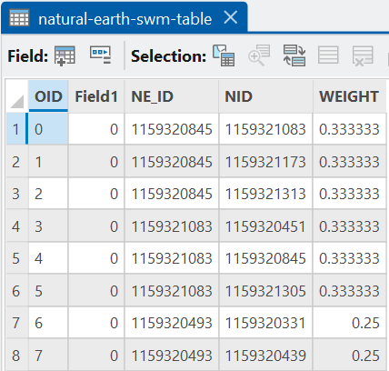{width=50%}
</p>

The key fields are as follows:

- `NE_ID`: the unique ID of the *focal feature* for that row e.g., Indonesia = 1159320845
- `NID`: the unique ID of a neighbouring feature e.g., Malaysia = 1159321083
- `WEIGHT`: $w$ for that `NE_ID-NID` pair using the selected conceptualisation (i.e., Contiguity). 

::: question
We have used a **binary** classification for calculating $w$. Why are our weights continuous? 
:::

<details>
  <summary>Answer</summary>
  This is because we used **row standardisation**, see [here](#row_standard) for a refresher. 
</details>

::: note
The format of this table differs from the *dense* spatial weights matrix $\mathbf{W}$ introduced above, where all pairs of observations are present, irrespective of whether they are neighbouring or not. The output here is a *sparse* representation of the same data, where non-neighbouring pairs have been removed, and each row represents a neighbouring pair. 
:::

Our output file `natural-earth-swm-table` contains useful information, but is not associated with any *geographic information* (i.e., feature geometries) that we could use to visualise the topological connections. To address this:

> Open the Geoprocessing tool [Calculate Geometry Attributes](https://doc.esri.com/en/arcgis-pro/latest/tool-reference/data-management/calculate-geometry-attributes.html?tabs=dialog), using `ne_10m_admin_0_countries` as input. For the 'Geometry Attributes', we want to calculate two properties: `Centroid x-coordinate` and `Centroid y-coordinate`, providing a new field name for each (e.g., `centroid_x`, `centroid_y`). 

If successful, `ne_10m_admin_0_countries` will be modified in place, with new fields (`centroid_x`, `centroid_y`) in the Attribute Table. These fields are in the units of the CRS (i.e., decimal degrees). Our next step is to join this data to our spatial weights matrix. 

> Open the Geoprocessing tool [Join Field](https://doc.esri.com/en/arcgis-pro/latest/tool-reference/data-management/join-field.html?tabs=dialog). In Practical 1 we used a *dynamic* table join via Joins and Relatives &rarr; [Add Join](#poly-raster), linking feature layers via a common attribute. One key difference here is that our table join is *static* i.e., the joined fields are permanently joined to the input table. 

> Use `natural-earth-swm-table` as the Input Table, with the Input Field as `NE_ID`, and use `ne_10m_admin_0_countries` as the Join Table (also `NE_ID`). Here we are finding rows in the spatial weights matrix and the Natural Earth data which share a common attribute (`NE_ID`). 

Before we run [Join Field](https://doc.esri.com/en/arcgis-pro/latest/tool-reference/data-management/join-field.html?tabs=dialog), we need to decide which fields we want to transfer. Dynamic table joins via Joins and Relatives &rarr; [Add Join](#poly-raster) transfer **all** of the fields in the join table. There are many (!) in the Natural Earth attribute table, and we are only interested in a small number e.g., `centroid_x` and `centroid_y`, and `ADMIN` for labelling. 

::: note
Tools in ArcGIS can be slow to initialise. To minimise the risk of any crashes, avoid making changes to any settings until the blue processing dots have disappeared: 
:::

<p align="center">
<a name=""></a>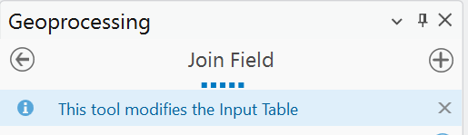{width=30%}
</p>


> For "Transfer Method", switch to `Use Field Mapping`. This will load all of the fields into the window below. Next remove all of the fields **except** `centroid_x`, `centroid_y` and  `ADMIN`. Finally, double click each and rename as `focal_x`, `focal_y` and `focal_name`, and press Run. Do **not** close the Geoprocessing pane, as we'll be using the tool again shortly. 

If successful, our spatial weights matrix should contain attribute and geometric information related to the **focal** feature for each row (as identified using `NE_ID`).

<p align="center">
<a name=""></a>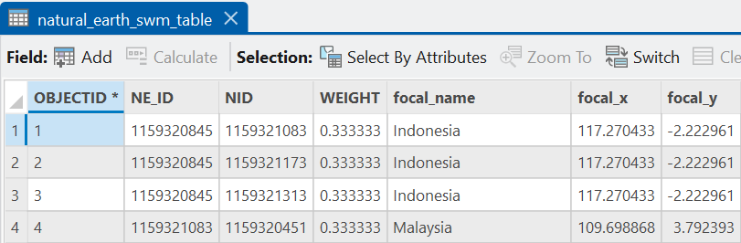{width=60%}
</p>

Our next step is to repeat this process, but this time targeting information related to the **neighbouring** feature for each row (as identified using `NID`).

> Return to [Join Field](https://doc.esri.com/en/arcgis-pro/latest/tool-reference/data-management/join-field.html?tabs=dialog), where the previous inputs should still be present. To switch to the **neighbouring** feature, this should be as simple as updating the Input Field to `NID`, and switching the transfer field names to `nb_x`, `nb_y` and `nb_name`[^nb]. 

[^nb]: `nb` denoting neighbour.

Our spatial weights matrix now contains geographic information for both the **focal** and **neighbouring** features, so let's visualise the connections between them as *Lines* connecting the feature centroids:

> Open the Geoprocessing tool [XY To Line](https://doc.esri.com/en/arcgis-pro/latest/tool-reference/data-management/xy-to-line.html?tabs=dialog), using `focal_x` and `focal_y` as the "Start X and Y Fields", and `nb_x` and `nb_y` as the "End X and Y Fields". Save the output to our project directory, using a suitable name (e.g., `natural_earth_swm_lines`), and make sure to "preserve attributes". 

Here is our output, visualising all the neighbourhood connections in $\mathbf{W}$, using contiguity weights. 

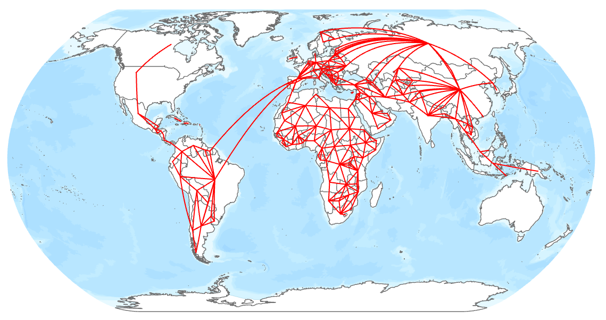{width=100%}

<br>

::: question
Which parts of the world have many / few connections? 
:::

::: question
What are the limitations of using feature centroids to represent our topological connections? 
:::

### Cultural Distance

By now you should understand the structure of $\mathbf{W}$, how to calculate $w$, and can investigate and visualise the spatial connections in a dataset. In most cases, this is where a spatial analyst would move on to further analysis, using the spatial weights matrix as an input. 

However, spatial weights can be useful *in their own right*, particularly when the spatial structure of a dataset can be linked to other spatial attributes. To demonstrate this, we are going to finish the practical by comparing $\mathbf{W}$ to the Cultural Fixation Index (CFST) produced by @muthukrishna2020. This dataset includes an estimate of **cultural distance** for 80 country pairs, which prompts the following line of enquiry:

::: question
Are "neighbouring" countries, as defined by our spatial weights matrix, more culturally similar?
:::

> Add `cultural-distance.csv` to ArcGIS and inspect.

This table contains unique combinations of countries, as summarised in `join_key`, and the corresponding cultural distances (`distance`). Our next task is to join this information to our spatial weights matrix created above.

::: note
The smaller the cultural distance value, the more similar the countries are e.g., Egypt and Norway are dissimiliar (0.5953), whereas Australia and the UK are highly similar (0.0319).
:::

#### Data wrangling

As discussed above, this standalone table (`.csv`) is not easily editable, so:

> Export Table, saving to our project **File Geodatabase** (`practical-2.gdb`), with a suitable name. When complete, remove the original standalone table `cultural-distance.csv` from ArcGIS to avoid confusion.

Next we are going to remove identical geometries from the XY to Line layer created above. This is because the spatial weights matrix is often **isomorphic**[^isomorphic], especially when using contiguity weights i.e., if $A$ is a neighbour of $B$, then $B$ is a neighbour of $A$. This explains why we often see symmetry in $\mathbf{W}$:

$$\mathbf{W}=\begin{bmatrix} 0 & 1 & 0 & 1 & 0 & 0 \\ 1 & 0 & 1 & 1 & 0 & 0 \\ 0 & 1 & 0 & 1 & 0 & 0 \\ 1 & 1 & 1 & 0 & 1 & 1 \\ 0 & 0 & 0 & 1 & 0 & 1 \\ 0 & 0 & 0 & 1 & 1 & 0\end{bmatrix}$$
In our case, every neighbour relationship is represented *twice* in `natural_earth_swm_lines` e.g., there is a feature representing the relationship between the United Kingdom and the Republic of Ireland, and *another* feature representing the relationship between the Republic of Ireland and the United Kingdom. We can be justified in removing one of these as follows:

> Open [Delete Identical](https://doc.esri.com/en/arcgis-pro/latest/tool-reference/data-management/delete-identical.html?tabs=dialog) with `natural_earth_swm_lines` as the input. For "Fields" select `Shape` i.e., we want to remove rows which have identical geometries. This modifies the input layer, so press Run. 

[^isomorphic]: Here we are referring to dataset structures that share identical structural connectivity.

To link this dataset to our table of cultural distance, we are going to use a table join, linking to the `join_key` in the latter (e.g., `Algeria-Andorra`). To achieve this, we need to create a comparable field in our XY to Line dataset:

> Open the Attribute Table for `natural_earth_swm_lines`, right click on the table  &rarr; Calculate Field. For "Field Name", use `target_key` with "Field Type" = `Text`. The "Expression" input allows us to combine our existing Fields using Python, or we can create more complex functions in the "Code Block". Paste the following equation into the "Expression" input: `"-".join(sorted([!focal_name!, !nb_name!]))` and Apply. 

This should create a new field in the Attribute Table, where the output is the two country names (`[!focal_name!, !nb_name!]`), `sorted()` alphabetically, and then joined together using `join()`, with the country names separated by `-`.  

We can join this information to our spatial weights matrix as follows:

> Use [Join Field](https://doc.esri.com/en/arcgis-pro/latest/tool-reference/data-management/join-field.html?tabs=dialog) with `cultural_distance` as the Input Table (the editable version stored in your project `.gdb`) and `natural_earth_swm_lines` as the Join Table, joining based on the `join_key` in the former and `target_key` from the latter. For "Transfer Fields", we only want to transfer the `target_key`. 

When complete, rows with a match between `join_key` and `target_key` will have data, and those without a match will contain `<Null>`:

<p align="center">
<a name=""></a>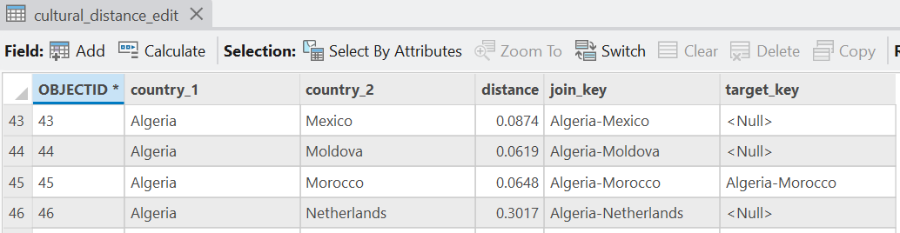{width=50%}
</p>

We can utilise this pattern to create a new field, summarising whether rows are neighbouring or non-neighbouring.

> Open the Attribute Table for `cultural_distance` and Create Field ("Name" = `neighbours`, "Field Type" = `Text`) using the following Expression: `"false" if !target_key! is None else "true"` and Apply:

<p align="center">
<a name=""></a>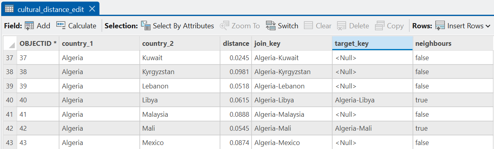{width=70%}
</p>

::: note
This approach populates the `neighbours` field with `true` for country pairs which are neighbouring (as defined by our spatial weights matrix) AND which have a cultural distance value from @muthukrishna2020. Rows where the value is `false` denotes country pairs which are **not** neighbouring OR do **not** have a cultural distance value. For example, the United Kingdom and the Republic of Ireland are classed as neighbouring in $\mathbf{W}$, but there is no cultural distance value, hence `false`. 
:::

#### Interpretation

We now have all the data we need to answer our initial question:

::: question
Are "neighbouring" countries, as defined by our spatial weights matrix, more culturally similar?
:::

> Open the Geoprocessing tool [Summary Statistics](https://doc.esri.com/en/arcgis-pro/latest/tool-reference/analysis/summary-statistics.html?tabs=dialog), using `cultural_distance` as the input and choosing a suitable output name. For "Statistics Fields", use `distance` as the "Field", and select `Mean` and `Standard deviation` for "Statistic Type". For "Case Fields", use `Neighbours` 

When complete:

> Inspect the output, which should contain the mean and standard deviation of the cultural distance values for each group (neighbours, non-neighbours).  

::: question
What is your intepretation of the results? Are neighbouring countries more culturally similar? 
:::

::: question
What are the limitations of this approach?
:::

<details>
  <summary>Answer</summary>
  Our results indicate that non-neighbouring countries are characterised by (on average) greater ($\times 2$) cultural distance (0.14) compared to neighbouring countries (0.07). However, we can be critical here:
  
- Note the extreme un-evenness of sample sizes.
- The estimates overlap when considering the standard deviation. Could we use a statistical test for significance? 
- The results are sensitive to our designation of $\mathbf{W}$. 
- The results are sensitive to the calculation of cultural distance. Can this be expressed well by a single value? 
</details>

<br>

**Congratulations!** You have completed the practical and should now be familiar with the conceptual and mathematical background to spatial weights. We have also demonstrated an application of spatial weights, and will explore this further in next weeks practical.  

[**Finished!**](#index)

## Extra {#weights-extra}

In the practical we've worked exclusively with Polygons. How would we define neighbours for a Point dataset?

> Open the `world_cities_5m` layer created in Practical 1 and use the Neighbourhood Explorer to investigate different conceptualisations of spatial relationships. Fixed distances and $K$ nearest neighbours are common approaches.

<p align="center">
<a name=""></a>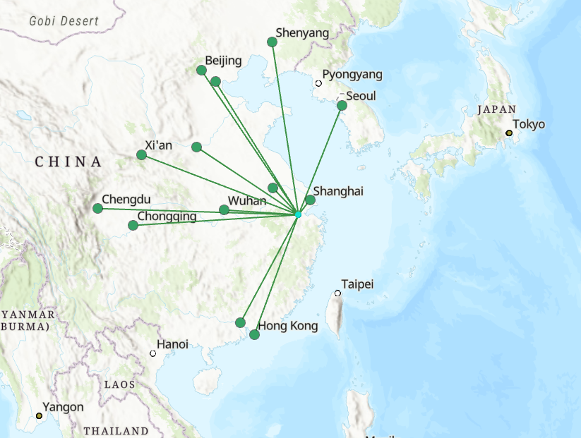{width=50%}
</p>

Another approach is to use "Trimmed Delaunay Triangulation", which can be run much like the other conceptualisations. To really understand how this works:

> Open the Geoprocessing tool [Create Thiessen Polygons](https://doc.esri.com/en/arcgis-pro/latest/tool-reference/analysis/create-thiessen-polygons.html?tabs=dialog) and run with the `world_cities` layer as input, and preserve all "Output Fields". 

This tool creates **Thiessen** or **Voronoi** Polygons around a set of Points, where the area within each Polygon is closer to the focal point than any other point in the dataset, as shown here:

<p align="center">
<a name=""></a>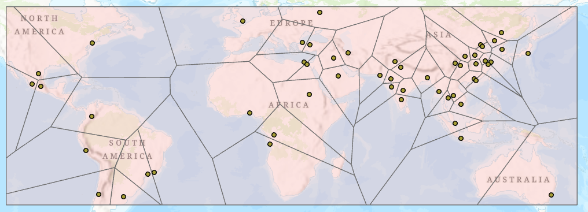{width=80%}
</p>

> Return to the Neighbourhood Explorer but use the output of [Create Thiessen Polygons](https://doc.esri.com/en/arcgis-pro/latest/tool-reference/analysis/create-thiessen-polygons.html?tabs=dialog) as the input, and using `Contiguity Edges Corners` as the conceptualisation.

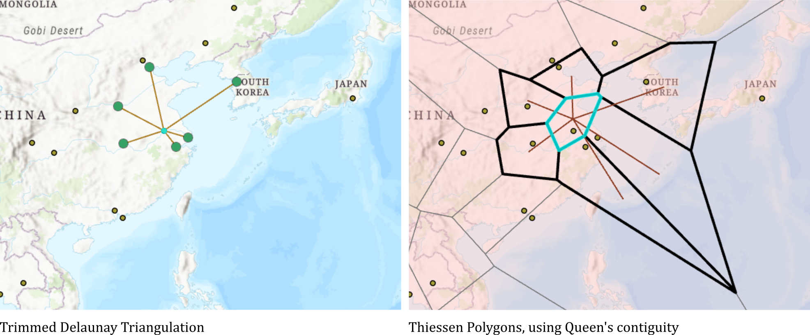{width=100%}
<br>

While Trimmed Delaunay Triangulation and Thiessen Polygons are **not** identical approaches (the former creates a mesh of non-overlapping triangles connecting the Points), they are *conceptually* similiar: both methods convert our Point data to areal data before contiguity weights are applied. A Thiessen approach is one I've used in my own research, see @tomkins2021.

::: task
**Remember** - we can define neighbours for all types of spatial data (e.g., Points, Lines, Polygons), so keep this in mind for later tasks in the unit. 
:::

## Resources {#sw_resources}

-   Tobler, W. ([1970](https://doi.org/10.2307/143141)). A Computer Movie Simulating Urban Growth in the Detroit Region. Economic Geography 46, 234–40.
-   Miller, H.J. ([2004](https://doi.org/10.1111/j.1467-8306.2004.09402005.x)). Tobler's first law and spatial analysis. Annals of the association of American geographers, 94(2), pp.284-289.
-   Tobler, W. ([2004](https://doi.org/10.1111/j.1467-8306.2004.09402009.x)). On the first law of geography: A reply. Annals of the association of American geographers, 94(2), pp.304-310.
-   Anselin, L. and Li, X. ([2020](https://doi.org/10.1111/gean.12237)). Tobler’s law in a multivariate world. Geographical Analysis, 52(4), pp.494-510.
