# Spatial Autocorrelation {#spatial_autocorrelation}

## Introduction

### Aims {.unnumbered}

The aims of this practical are to:

1.  Understand why spatial autocorrelation needs to be considered when analysing spatial data.
2.  Understand the techniques we can use to assess for global and local spatial autocorrelation, including the underlying mathematics and assumptions.
3.  Test for spatial autocorrelation in ArcGIS and interpret outputs correctly.

### Application {.unnumbered}

To that end, we'll use county-level data from the [2024 US General election](https://www.bbc.co.uk/news/election/2024/us/results) to investigate global and local spatial autocorrelation.

### Data {#autocorrelation_data .unnumbered}

The county-level data for this practical are available in [`data/us-census`] as follows:

-   US county geometries for 2023, mapped at a 1:500,000 scale [[Source](https://www2.census.gov/geo/tiger/GENZ2023/shp/)]
-   US county-level Presidential results for the 2024 elevation [[Source](https://github.com/tonmcg/US_County_Level_Election_Results_08-24)], which includes:
    -   Democratic vote total [`votes_dem`] and proportion (`per_dem`)
    -   Republican vote total [`votes_gop`] and proportion (`per_gop`)

*Note that other datasets are present in this directory and will be utilised later in the unit.*

### Tools {.unnumbered}

[Spatial Autocorrelation (Global Moran's I)](https://doc.esri.com/en/arcgis-pro/latest/tool-reference/spatial-statistics/spatial-autocorrelation.html?tabs=dialog) (Spatial Statistics Tools), [Cluster and Outlier Analysis (Anselin Local Moran's I)](https://doc.esri.com/en/arcgis-pro/latest/tool-reference/spatial-statistics/cluster-and-outlier-analysis-anselin-local-moran-s.html?tabs=dialog) (Spatial Statistics Tools), [High/Low Clustering (Getis-Ord General G)](https://doc.esri.com/en/arcgis-pro/latest/tool-reference/spatial-statistics/high-low-clustering.html?tabs=dialog) (Spatial Statistics Tools), [Hot Spot Analysis (Getis-Ord Gi\*)](https://doc.esri.com/en/arcgis-pro/latest/tool-reference/spatial-statistics/hot-spot-analysis.html?tabs=dialog) (Spatial Statistics Tools), [Project](https://doc.esri.com/en/arcgis-pro/latest/tool-reference/data-management/project.html?tabs=dialog) (Data Management Tools), [Neighborhood Summary Statistics](https://doc.esri.com/en/arcgis-pro/latest/tool-reference/spatial-statistics/neighborhood-summary-statistics.html?tabs=dialog) (Spatial Statistics Tools)

------------------------------------------------------------------------

## Practical {#autocorrelation_prac}

### Understanding spatial autocorrelation

According to Tobler's Law [@tobler1970]:

"*everything is related to everything else, but near things are more related than distant things.*"

In our exploration of [**spatial weights**](#spatial_weights), we focused on the key concepts of *proximity* and *adjacency* (i.e., "near", "distant") and discovered how we can define and model those concepts using spatial weights $w$ and the spatial weights matrix $\mathbf{W}$.

One aspect of Tobler's Law we *didn't* engage with is the word **related** i.e., the concept of *similarity*. As a whole, Tobler's Law relates to the interplay of proximity-adjacency *and* similarity. In the field of spatial analysis, we refer to this relationship as **spatial autocorrelation**, defined by @anselin1988 as a:

"*functional relationship between what happens at one point in space and what happens elsewhere*"

Or more simply:

"*the degree to which an object or value is similar to nearby objects or values.*"

Related concepts include *temporal* autocorrelation i.e., the degree to which a value at a point in time is similar to those in the past, or *correlation*[^03-autocorrelation-1] more broadly i.e., a measure of association between two or more variables (but typically excluding a spatial or temporal component). It is also worth noting that we use the term **auto**correlation because we are assessing **self** correlation i.e., the degree of similarity for a single dataset or variable (e.g., house prices), rather than multiple variables (e.g., house prices *vs.* employment opportunities), even if that single dataset could comprise many different observations.

[^03-autocorrelation-1]: We will explore **spatial correlation** in Practical 4.

#### Randomness and Clustering

When assessing the spatial distribution of objects and their values, we can imagine three potential scenarios: **spatial randomness**, **positive** spatial autocorrelation and **negative** spatial autocorrelation.

**Spatial randomness** relates to situations where there is no distinct spatial pattern. In this case, the location of the object is irrelevant to the phenonemon we are studying.

Spatial autocorrelation exists when we *reject* the hypothesis of spatial randomness, in favour of the presence of:

-   **positive** spatial autocorrelation, where similar values are located nearby, and dissimilar values are distant i.e., *clustered*.
-   **negative** spatial autocorrelation, where similar values tend be distant from each other, and dissimilar values are located nearby i.e., *dispersed*.

Here are some examples of different configurations, redrawn from [Luc Anselin's](https://lanselin.github.io/introbook_vol1/positive-and-negative-spatial-autocorrelation.html#fn97) "*An Introduction to Spatial Data Science with GeoDa*":

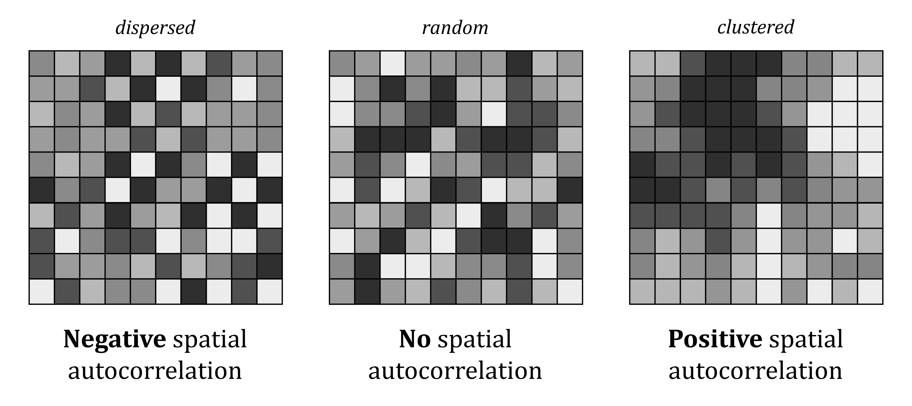{width="100%"} 

 

::: note
Pattern recognition is one of our defining human characteristics, see @biederman1987, @shermer2008 and @mattson2014. As a result, while it is tempting to identify spatial structure in the example of *spatial randomness* above, the map was constructed using a [random process](https://lanselin.github.io/introbook_vol1/spatial-randomness.html#parametric-approach).
:::

Importantly, the scenarios of positive and negative spatial autocorrelation do not relate to the **sign** of the values (i.e., $+|-$), but attribute similarity alone. For example, positive spatial autocorrelation could relate to high values being found close to other high values (e.g., expensive houses near other expensive houses) or low values being found close to other low values (e.g., low-cost houses near other low-cost houses).

::: question
Can you think of any other examples of geographic phenonema which are characteristed by positive spatial autocorrelation?
:::

#### Global vs. local

When assessing for spatial autocorrelation, this be analysed at a **global** level, which provides information on the degree of clustering, dispersion or randomness for a dataset *as a whole* i.e., on average, are expensive houses found near other expensive houses?

Spatial autcorrelation can also be analysed at a **local** level, which provides more detailed information on the *locations* of areas of clustering, dispersion or randomness e.g., which parts of the map show clusters of **positive** spatial autocorrelation?

#### Importance

As discussed in the lecture, spatial autocorrelation is of profound importance for spatial analysis. Understanding the spatial structure of our data is critical if we want to really understand the phenonema of interest. Spatial autocorrelation also dictates the methods that we can use. For example, many traditional statistical approaches[^03-autocorrelation-2] assume **independence of observations** i.e., all observations in your data are independent from each other. This assumption is *met* when spatial autocorrelation is absent (i.e., spatial randomness), but is *broken* when spatial autocorrelation is present, rendering the results and our interpretations invalid.

[^03-autocorrelation-2]: e.g., t-tests, ordinary least squares regression.

::: note
As expert spatial analysts, we need to use methods which incorporate the spatial structure and autocorrelation present in many geographic datasets[^03-autocorrelation-3].
:::

[^03-autocorrelation-3]: Alongside **spatial autocorrelation** (Practical 3), we will also explore spatial **correlation** (Practical 4) and **regression** (Practicals 7 - 8).

In the next sections, we'll use county-level data from the [2024 US General election](https://www.bbc.co.uk/news/election/2024/us/results) to investigate global and local spatial autocorrelation and introduce the methods we can use to test for it.

### Pre-processing

To begin:

> Open ArcGIS, initialise a new project in the `practical-3` directory, establish a connection to `data` and load `cb_2023_us_county_500k.shp`, which contains the geometries for US counties[^03-autocorrelation-4].

[^03-autocorrelation-4]: Note that for US elections, counties are primarily used for administrative purposes, see [here](https://www.bbc.co.uk/news/articles/cj4vn0qxy0lo). For presidential elections, the important voting statistics are at the state-level, which determines the number of [electoral college votes](https://www.bbc.co.uk/news/world-us-canada-53558176), where a majority determines the national outcome.

#### The contiguous United States

For simplicity, we are going to focus on the contiguous United States:

> Use "Select by Attributes" to select all rows where the `STATE_NAME` is **not** Alaska, Hawaii, Puerto Rico, Guam, American Samoa, Commonwealth of the Northern Mariana Islands and United States Virgin Islands. "Export Selection" (n = 3,109) with a suitable name (e.g., `us_county_500k_contig`) to the correct directory, and when complete, remove the original file from ArcGIS.

SQL expression

The following expression will select all rows which meet the following conditions (i.e., not equal to (`<>`) Alaska): `STATE_NAME <> 'Alaska' And STATE_NAME <> 'Hawaii' And STATE_NAME <> 'Puerto Rico' And STATE_NAME <> 'Guam' And STATE_NAME <> 'American Samoa' And STATE_NAME <> 'Commonwealth of the Northern Mariana Islands' And STATE_NAME <> 'United States Virgin Islands'`

 

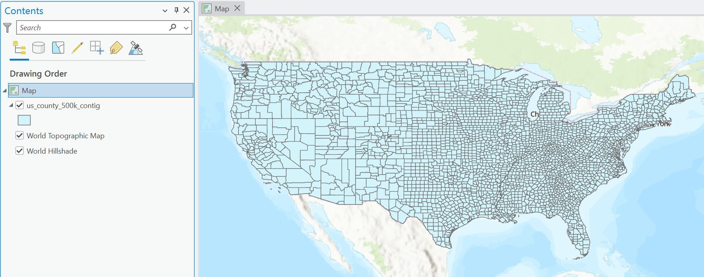{width="100%"}

 

Our dataset is using a geographic CRS:

::: question
What is the EPSG code?
:::

In our current Map View, this has resulted in significant distortion (i.e., flattening) of the geometries. We are going to switch to a **conformal** projected CRS to preserve the *shape* of the US counties:

> Open the Geoprocessing tool [Project](https://doc.esri.com/en/arcgis-pro/latest/tool-reference/data-management/project.html?tabs=dialog). Use `us_county_500k_contig` as the input and specify a suitable output name (e.g., `us_county_500k_contig_cf`[^03-autocorrelation-5]). For the "Output Coordinate System", use `USA Contiguous Lambert Conformal Conic` (EPSG: [102004](https://epsg.io/102004)) and Run. When complete, remove any other layers from the Contents Pane.

[^03-autocorrelation-5]: `cf` denoting conformal

Your output will resemble the following:

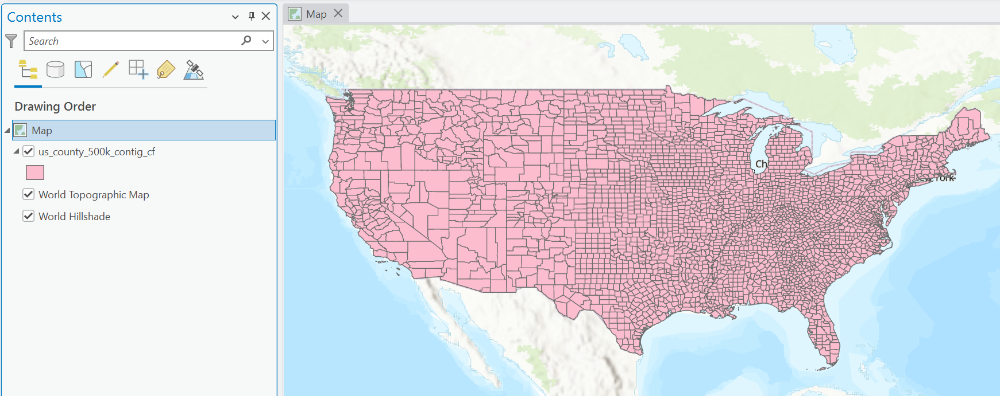{width="100%"}

 

**Importantly** this is visually identical to the previous layer, even though we have changed the data CRS.

::: question
Can you think why this might be?
:::

Answer

This is because the **maps** coordinate reference system is still using that of the *first* feature layer added (EPSG: [4269](https://epsg.io/4269)). While we have reprojected our county geometries, these are being reprojected again "on-the-fly" to match the map CRS.

> Update the map CRS to that of the `us_county_500k_contig_cf` layer, which should now resemble the following:

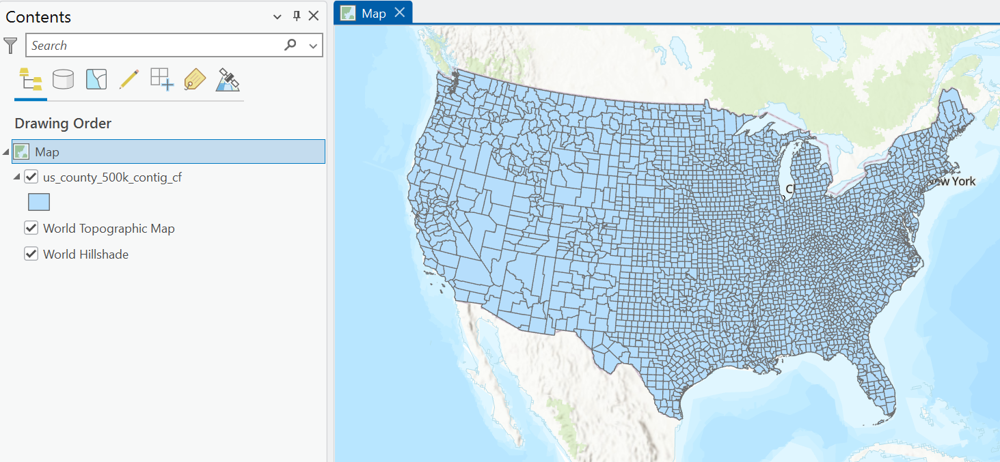{width="100%"}

 

#### Election results {#election_results}

Next we are going to combine our geometries with the county-level election results for 2024.

> Load `2024_US_County_Level_Presidential_Results.csv` and use a dynamic table join to link the election results to our county geometries, joining using the `NAMELSAD`[^03-autocorrelation-6] and `county_name` fields.

[^03-autocorrelation-6]: Current legal/statistical area description code

::: note
An alternative approach would be to join using the Federal Information Processing Series ([FIPS](https://www.census.gov/library/reference/code-lists/ansi.html)) code, stored in `GEOID` and `county_fips` respectively. However, these are currently in different data formats (`Text` and `Long` i.e., numeric), which you can inspect via the Attribute Table → right click Fields → Data Type. The different data formats would preclude any matches i.e., $01003_{text}\neq01003_{numeric}$. While we can address this via some data processing[^03-autocorrelation-7], for now we'll just use the county names.
:::

[^03-autocorrelation-7]: We'll explore this in Practical 4, where we'll use the same US county level data to investigate patterns of spatial **correlation**.

The Attribute Table should now contain the following key fields:

-   the number of votes cast for the Republican (`votes_gop`[^03-autocorrelation-8]) and Democratic parties (`votes_dem`), the difference between them (`diff`) and the total votes cast (`total_votes`).
-   the Republican and Democratic vote share (`per_gop`, `per_dem`) and the difference between them (`per_point_diff`).

[^03-autocorrelation-8]: The Grand Old Party (GOP) is another name for the Republican Party.

::: question
What is the total number of votes cast for each party?
:::

::: question
What is the average *county-level* vote share for the Republican party?
:::

::: note
These values are *close* to the reported [results](https://www.bbc.co.uk/news/election/2024/us/results), with minor differences partly explained by the removal of non-contiguous states, and the aggregation of votes at county rather than state-level. The data source is also not considered [authoritative](https://github.com/tonmcg/US_County_Level_Election_Results_08-24#compiling-presidential-election-results), but for the purposes of this practical, is sufficiently accurate to illustrative the spatial trends in vote share, and to assess for spatial autocorrelation.
:::

To better understand the spatial variability in the election results:

> Update the layer symbology based upon `gop_perc` and use colours and scaling of your choice. For example, using `Unclassed Colors`, `Red-Blue` (reversed) and setting the min-max to 0 and 1 will produce the following output, which resembles [typical visualisations](https://tonmcg.github.io/US_County_Level_Election_Results_08-24/), where reds denote Republican vote share, and blues denote Democratic vote share. The use of a 0-1 scale, rather than scaling by the min-max vote %, also produces a natural mid-point value of 0.5, where the vote is shared equally between the two parties.

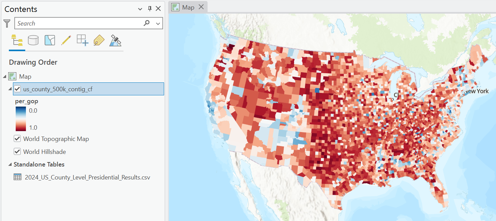{width="100%"}

 

::: question
While this is an interesting visualisation, what are the limitations of this approach?
:::

There are lots of interesting spatial patterns in this dataset:

::: question
Can you see any evidence of spatial autocorrelation?
:::

While initial exploratory analysis is important, our pattern recognition abilities are not perfect. We might miss subtle but important patterns (a Type II error) or identify spurious or random patterns as significant (a Type I error). As a result, it is important that we use a statistical approach to identify and assess the significance of spatial autocorrelation.

### Spatial Lag {#spatial_lag}

Before we begin to explore spatial autocorrelation and start running ArcGIS tools, it is important that we understand the underlying mathematics. In particular, we need to introduce the **spatial lag** operator, which is one of the key use cases for the spatial weights matrix $\mathbf{W}$.

The spatial lag captures the *weighted value of a variable for each locations neighbourhood*. In our case, this could be the weighted Republican vote share (`per_gop`) for the neighbourhood surrounding each US county, as illustrated below:

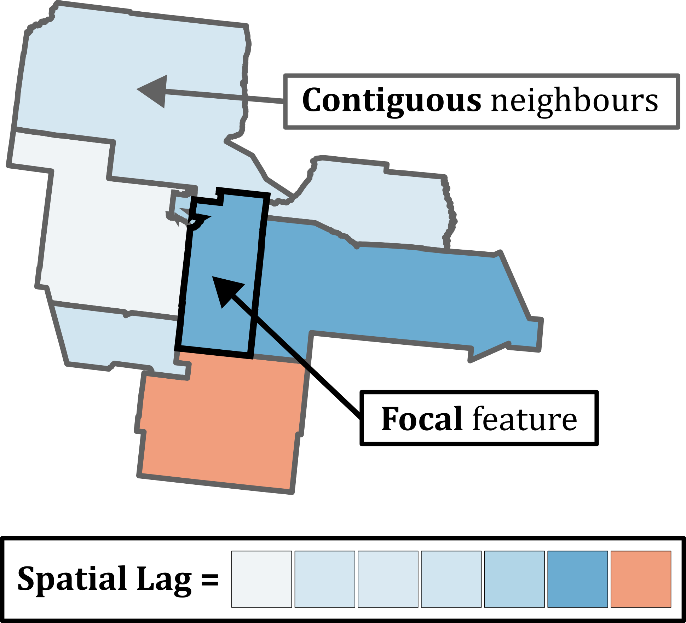{width="40%"}

Mathematically it is defined as follows:

$$y_{sl-i}=\sum_{j}w_{ij}y_{j}$$

where $y_{sl-i}$ is the spatial lag, representing the weighted neighbourhood value for the focal object, excluding itself ($-i$). This is calculated as the sum of the spatial weights $w$ for row $i$ and column $j$ in the spatial weights matrix multiplied by the corresponding value for the neighbourhood location $y_j$.

As an example, here is a *sparse* spatial weights matrix, subset to a single focal object $f$. As $f$ has seven neighbours and $\mathbf{W}_f$ is row-standardised, $w=1/7$

$$\mathbf{W}_f=\begin{bmatrix} 1/7 & 1/7 & 1/7 & 1/7 & 1/7 & 1/7 & 1/7 \end{bmatrix}$$

If the values at those locations (e.g., `gop_perc`) are as follows:

$$y_{j}=\begin{bmatrix} 0.39 & 0.33 & 0.46 & 0.38 & 0.67 & 0.24 & 0.41 \end{bmatrix}$$

The products of the spatial weight $w$ and the value $y$ would be:

$$w_{ij}y_{j}=\begin{bmatrix} 0.06 & 0.05 & 0.07 & 0.05 & 0.10 & 0.03 & 0.06 \end{bmatrix}$$

The sum of these products is our **spatial lag** i.e., the weighted value for the neighbourhood:

$$y_{sl-i} = \sum w_{ij}y_{j}=0.41$$

When row-standardisation is used, the spatial lag is effectively a weighted **average** for the neighbourhood, because the weights will sum to 1. When binary weights are used and row-standardisation is *not*, the spatial lag would produce the sum of the neighbourhood values. 

You may find it easier to understand this visually, so here is a schematic using the same weights and values, illustrating how the values ($y$, `gop_perc`) are multiplied by the corresponding spatial weights ($w$), where the sum is the **spatial lag** ($y_{sl-i}$) for the focal feature = $0.41$.

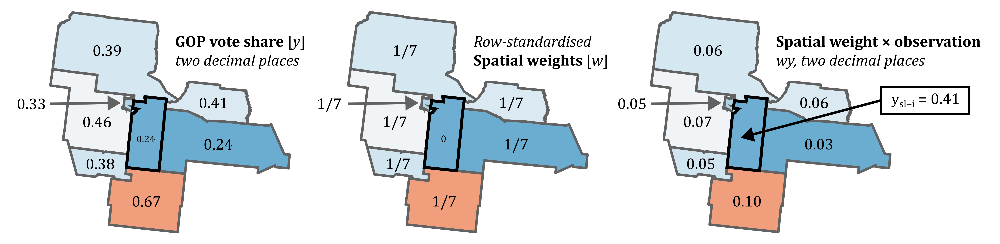{#lag_schematic width="100%"}

The above matrices and schematics illustrate the process for a *single* focal feature, and this would be replicated to create a spatially-lagged variable for all features in the dataset.

::: note
If you are interested you can check the calculations yourself, as these are based on the election results and weights for Sante Fe County, New Mexico (GEOID: 35049).
:::

To help your understanding further:

> Open the Geoprocessing tool [Neighbourhood Summary Statistics](https://doc.esri.com/en/arcgis-pro/latest/tool-reference/spatial-statistics/neighborhood-summary-statistics.html?tabs=dialog), using the US county data as input, and selecting `gop_perc` as the "Analysis Field". For "Neighbourhood Type" using `Contiguity Edges Corners`, for "Local Summary Statistic" use `Mean`, and `Ignore Focal Feature` (because $y_{sl-i}$). I used the output name `us_county_gop_sl`, where `sl` denotes "spatial lag".

Your output should resemble the following, where the US counties are symbolised using the spatial lag of `gop_perc`, using Queen's contiguity. In effect, we have created a *smoothed* version of the original values.

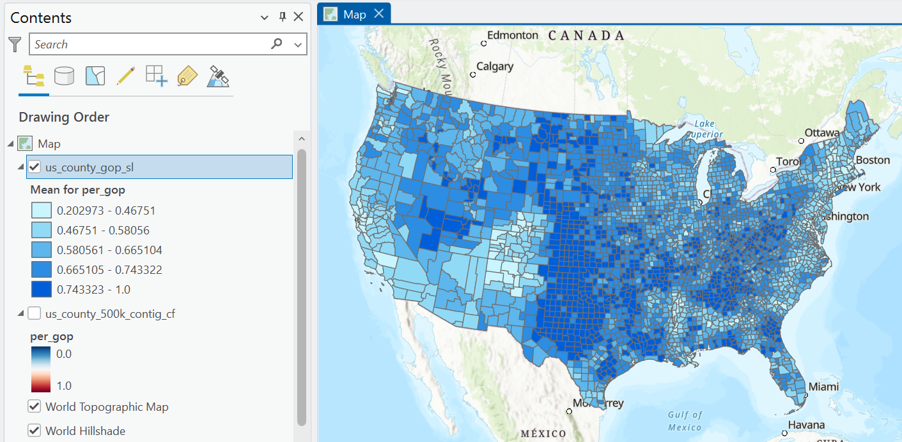{width="100%"}

 

> Inspect the Attribute Table of the new layer, which contains the original `gop_perc` values and the spatially-lagged variable `_Mean`, as well as the number of neighbours for each feature (`NNBRS`).

::: question
Are there any counties where the GOP vote share is noticeably different from the spatially-lagged variable?
:::

::: note
The **spatial lag** operator underpins many spatial methods, including tests for spatial autocorrelation.

 

It is also **directly** influenced by our definition of the spatial weights matrix. Different approaches (e.g., contiguous vs. distance based, binary vs. continuous) will result in very different neighbourhood definitions and very different spatially-lagged variables.
:::

### Global spatial autocorrelation

The *spatial lag* variable is a key component of Moran's $I$ [@moran1948], one of the most commonly used statistics for global autocorrelation, defined as:

$$I = \frac{n}{\sum_{i}\sum_{j}w_{ij}}\frac{\sum_{i}\sum_{j}w_{ij}z_{i}z_{j}}{\sum_{i}z_{i}^{2}}$$ where $n$ is the number of observations, $w_{ij}$ is the cell corresponding to the row $i$ and column $j$ of the spatial weights matrix $\mathbf{W}$, and $z_{i}$ and $z_{j}$ are the standardised values of a variable of interest at locations $i$ and $j$ respectively. These are calculated as the difference between each value and the mean of all the values ($z_{i}-\overline{z}$).

#### Moran Plot {#moran_plot}

At first glance this function seem quite complicated, so before we jump into the maths, we'll begin by exploring visually:

> Find the mean ($\overline{z}$) of `gop_perc` and then create a new field in the Attribute Table of `us_county_gop_sl` using Calculate Field ("Name" = `gop_std`, "Field Type" = `Double`). This field should contain the difference between `gop_perc` for each county and the mean `gop_perc`.

> Repeat this process for the spatial lag variable (`_Mean`, "Name" = `lag_std`).

Before we can progress further, there are four US counties with no *contiguous* neighbours (FID = `425`, `533`, `2017`, `2615`). To simplify our analysis:

> Remove these rows from `us_county_gop_sl` e.g., Select by Attributes (`DIST_NNBRS` = 0) and then Delete.

Using our standardised spatial lag variable `lag_std` and standardised variable of interest `gop_std`, we can create a **Moran Plot** as follows:

> Right click on `us_county_gop_sl` in the Contents Pane → Create Chart → Scatter Plot, and use the standardised `gop_std` variable for the x-axis, and the standardised spatial lag variable `lag_std` for the y-axis.

::: note
We use **standardisation** for both the variable of interest `gop_perc` and the spatial lag variable `lag_std` to facilitate interpretation. By calculating the deviation from the mean ($\overline{z}$), this centers both datasets at 0, where above average values are $z_{i}>0$ and below average values are $z_{i}<0$. In turn, we can easily evaluate whether the focal feature and/or the neigbourhood have an above or below average Republican vote share.
:::

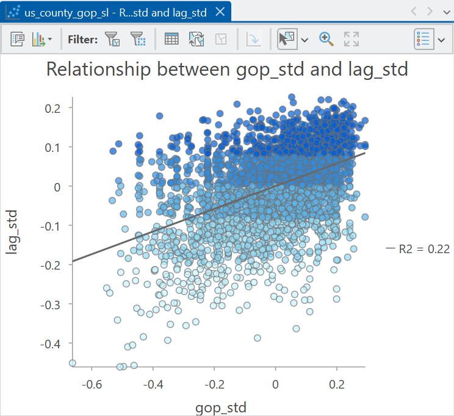{width="60%"}

The **Moran Plot** is a useful tool for visual exploration of spatial autocorrelation and is simply a scatter plot of the variable of interest compared to the spatially lagged values[^03-autocorrelation-9]. The overall pattern of the data and the slope of the linear regression fitted to the values (Available in Chart Properties: $0.2898637359$) provides us with a great deal of information about the presence of spatial *autocorrelation* (either positive or negative) or spatial *randomness*.

[^03-autocorrelation-9]: Note that we have created the Moran Plot manually here to facilitate understanding, but of course there are ArcGIS tools which will do this for us, as we'll explore soon.

In our case, the slope of the linear regression is **positive** ($\sim0.29$) i.e., as the standardised Republican vote share for a county increases, so too does the vote share of its neighbouring counties. This is indicative of **positive** spatial autocorrelation i.e., similar values are located nearby, and dissimilar values are distant.

By comparison, if the slope of the linear regression was **negative**, this would indicate that as the Republican vote share for a county *increases*, the vote share of its neighbouring counties would *decrease*. This would be indicative of **negative** spatial autocorrelation i.e., similar values tend be distant from each other, and dissimilar values are located nearby.

Finally, if there was no significant slope to the linear regression[^03-autocorrelation-10], this would indicate the presence of spatial **randomness** i.e., the Republican vote share for a county is not meaningfully related to that of its neighbours.

[^03-autocorrelation-10]: We will discuss how we can test for significance in a moment.

::: question
Would you describe the county-level Republican vote share as clustered or dispersed?
:::

Using the Moran Plot, we can infer that *on average*, **positive** autocorrelation is present i.e., Republican voting counties tend to be surrounded by other Republican voting counties. However, that doesn't mean that this applies to every situation e.g., there may be instances where Republican voting counties are surrounded by Democratic voting counties, and vice-versa.

#### Calculating Moran's $I$ {#calc_moran_i}

The **Moran Plot** is a powerful visualisation that tells us a great deal about the presence or absence of spatial autocorrelation for a dataset *as a whole*. However, there are some unanswered questions:

::: question
Which *parts* of the map show clustering, dispersion or randomness?
:::

::: question
How do we know that the observed pattern of spatial autocorrelation is meaningful? i.e., is it significantly different from spatial randomness?
:::

We can answer the former by investigating **local** spatial autocorrelation, which is the topic of the second half of the practical.

We can answer the latter by calculating the Moran's $I$ statistic and its significance, rather than relying on the Moran Plot alone. This requires a deeper dive into the Moran's $I$ formula:

$$I = \frac{n}{\sum_{i}\sum_{j}w_{ij}}\frac{\sum_{i}\sum_{j}w_{ij}z_{i}z_{j}}{\sum_{i}z_{i}^{2}}$$

Before we describe the key parts of the formula, Moran's $I$ is assessing:

"*How similar are observations to their neighbours, relative to the overall variation in the dataset?*"

On the right hand side of the function, the *denominator* $\sum_{i}z_{i}^{2}$ is a measure of the total variation in the data, while the *numerator* $\sum_{i}\sum_{j}w_{ij}z_{i}z_{j}$ is a measure of the variation between each observation and its neighbours. The left hand side of the function $\frac{n}{\sum_{i}\sum_{j}w_{ij}}$ accounts for the number of observations and their spatial weights. Normalising by these variables allows us to compare the Moran's $I$ statistic across different datasets, which might vary in size, neighbourhood definition, and the number of neighbours.

Describing these parts more fully, on the left hand side of the function we have the following:

$$\frac{n}{\sum_{i}\sum_{j}w_{ij}}$$

which is simply the number of observations ($n$) in the dataset (i.e., the number of US counties, $n=3105$) divided by the sum of all the non-zero weights in the spatial weights matrix ($\sum_{i}\sum_{j}w_{ij}$). When using a row-standardised spatial weights matrix, this will sum to the number of observations in the dataset i.e., $n = \sum_{i}\sum_{j}w_{ij}$ (assuming all observations are connected[^03-autocorrelation-11]). If so, this part of the function cancels out and can be ignored. If row-standardisation is *not* used, then this ratio would need to be calculated.

[^03-autocorrelation-11]: We ensured this by removing the four US counties with no *contiguous* neighbours (FID = `425`, `533`, `2017`, `2615`).

::: note
If you are interested you can confirm this by using [Generate Spatial Weights Matrix](https://doc.esri.com/en/arcgis-pro/latest/tool-reference/spatial-statistics/generate-spatial-weights-matrix.html?tabs=dialog) for the `us_county_gop_sl` layer, using Queen's contiguity and row-standardisation. If you convert the output to a readable table via [Convert Spatial Weights Matrix to Table](https://doc.esri.com/en/arcgis-pro/latest/tool-reference/spatial-statistics/convert-spatial-weights-matrix-to-table.html?tabs=dialog), the sum of the `WEIGHT` field should equal the number of observations ($n=3105$).
:::

On the right hand side of the function we have the numerator: $\sum_{i}z_{i}^{2}$, which is the sum of the squared standardised values ($z_{i}-\overline{z}$). For example, if the Republican vote share is as follows:

$$z=\begin{bmatrix} 0.78 & 0.73 & 0.57 & 0.29 & 0.74 & 0.80 & 0.64 \end{bmatrix}$$ The corresponding mean value is $0.65$, which would result in standardised values of:

$$z-\overline{z}=\begin{bmatrix} 0.13 & 0.08 & -0.08 & -0.36 & 0.09 & 0.15 & -0.01 \end{bmatrix}$$ The square of these values is as follows:

$$z_{i}^{2}=\begin{bmatrix} 0.0169 &    0.0064 &    0.0064 &    0.1296 &    0.0081 &    0.0225 &    0.0001\end{bmatrix}$$

resulting in the following sum. This is a measure of the **overall variability of the data**:

$$\sum_{i}z_{i}^{2}=0.19$$

The final piece of the puzzle is the numerator:

$$\sum_{i}\sum_{j}w_{ij}z_{i}z_{j}$$

Some of this might be familiar. The **spatial lag** variable is here, albeit with slightly different notation, which you'll remember is the *weighted value of a variable for each locations neighbourhood*. This is present as $w_{ij}z_{i}$, the only difference is we are using standardised values $(z_{i}-\overline{z})$ rather than the raw values, to capture the deviation from the global mean. As discussed above, this approach centers the dataset at 0, which allows us to easily identify whether values are above or below the average.

The spatial lag is multiplied by all other standardised values in the dataset ($z_{j}$), with the outputs summed. This is measure of the **overall similarity of observations to their neighbours**.

For example, if on average high values ($z_{i}>0$) are found near other high values *and/or* low values ($z_{i}<0$) are found near other low values, the numerator would be **positive**. By comparison, if on average high values ($z_{i}>0$) are found near low values ($z_{i}<0$), or vice versa, the numerator would be **negative**[^03-autocorrelation-12].

[^03-autocorrelation-12]: This is because when both values are positive ($z_{i}>0$) or both values are negative ($z_{i}<0$), the cross-product is positive i.e., Positive $\times$ Positive = Positive, and Negative $\times$ Negative = Positive. By comparison, if the signs of the values differ, the cross-product is negative i.e., Positive $\times$ Negative = Negative.

To summarise:

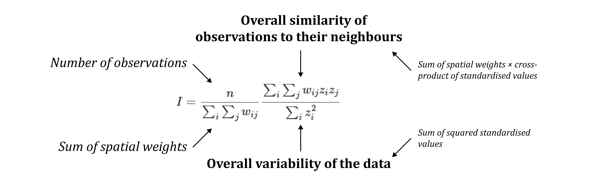{width="100%"}

We can interpret the test statistic $I$ as follows:

-   If $I$ \> 0, observations are **more** similar to their neighbours than would be expected, given the overall variation in the dataset i.e., **positive** spatial autocorrelation.
-   If $I$ \< 0, observations are **less** similar to their neighbours than would be expected, given the overall variation in the dataset i.e., **negative** spatial autocorrelation.

Moran's $I$ values range from $-1$ (dispered) to $1$ (clustered), where $0$ denotes no spatial pattern. 

#### Interpreting Moran's $I$

So far, we've done quite a deep dive into Moran's $I$.

Actually running and interpreting Moran's $I$ in ArcGIS is surprisingly simple, and this can be achieved using the [Spatial Autocorrelation (Global Moran's I)](https://doc.esri.com/en/arcgis-pro/latest/tool-reference/spatial-statistics/spatial-autocorrelation.html?tabs=dialog) geoprocessing tool.

::: note
I'll reiterate this theme across the unit, but being able to run ArcGIS tools is not particularly impressive, especially given the wealth of information online, and generally very detailed ESRI documentation.

 

What *is* impressive is really **understanding** what the tools are doing, which requires us to take a look "under-the-hood" to investigate and question the mathematics and assumptions involved. Being able to demonstrate understanding of these tools and their foundations (e.g., spatial weights, the spatial lag operator), will set you apart from other spatial analysts who can click their way through practicals, but don't *really* understand what's going on.
:::

> Open the Geoprocessing tool [Spatial Autocorrelation (Global Moran's I)](https://doc.esri.com/en/arcgis-pro/latest/tool-reference/spatial-statistics/spatial-autocorrelation.html?tabs=dialog), using `us_county_500k_contig_cf` as the input, using Queen's contiguity and row standardisation, and check "Generate Report".

We can access the results of Morans $I$ via the `.html` file, which is linked in the output messages (click "View Details") and is saved in your project directory. The output table is also important:

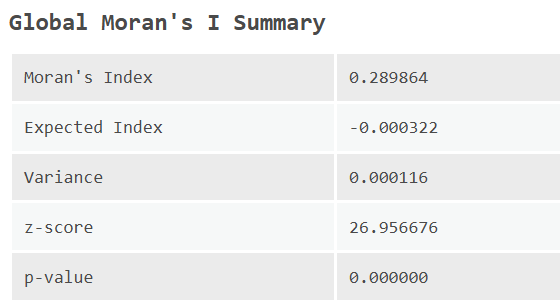{width="50%"}

The "Moran's Index" is $I$ and you'll notice this is identical to the value produced by our Moran Plot earlier: $0.289864$. The regression line in the Moran Plot will always match the Moran's $I$ statistic when standardised values are used (i.e., mean centred: $z_{i}-\overline{z}$) and when the spatial weights matrix is row-standardised.

Other important values include the expected index $E[I]$, which is the expected value of Moran's $I$ under the assumption of spatial *randomness* i.e., what $I$ value would we expect if there is no spatial autocorrelation? This is calculated as follows:

$$E[I]=\frac{-1}{n-1}$$ where $n$ is the number of observations. For our dataset, $E[I]=\frac{-1}{3105-1}=-0.000322$.

The variance $Var(I)$ is a measure of how much the Moran’s I statistic would be expected to vary assuming spatial randomness[^03-autocorrelation-13].

[^03-autocorrelation-13]: There is some ESRI [documentation](https://doc.esri.com/en/arcgis-pro/latest/tool-reference/spatial-statistics/h-how-spatial-autocorrelation-moran-s-i-spatial-st.html) on how this is calculated, with a more detailed walkthrough from Luc Anselin [here](https://lanselin.github.io/introbook_vol1/morans-i.html#analytical-inference).

A particularly important statistic is the **z-score** which is measure of how far observed $I$ is from $E[I]$, in units of standard deviation. This is calculated as follows:

$$z = \frac{I-E[I]}{\sqrt{Var(I)}}$$ If we plug our numbers from the output table into the equation:

$$z = \frac{0.289864-(-0.000322)}{\sqrt{0.000116}}$$ we should be able to reproduce the z-score[^03-autocorrelation-14].

[^03-autocorrelation-14]: If you do the calculations yourself, the z-score will be slightly different (by $\sim0.05\%$) to that reported in the results table, likely due to rounding.

The final statistic is the **p-value** which is the probability of observing a z-score (26.94) this extreme if the null hypothesis of spatial randomness is true, or more simply, if we randomly shuffled the values across the map (i.e., Republican vote share) and calculated $I$ for each, how many configurations would show a larger Moran's $I$ than the one we observed? In our case, the probability is tiny, and much lower than typical thresholds for statistical significance e.g., $p<0.05$ or $p<0.01$. As such, we would reject the null hypothesis of spatial randomness.

> Open the `.html` output, which summarises these values for you and aids interpretation.

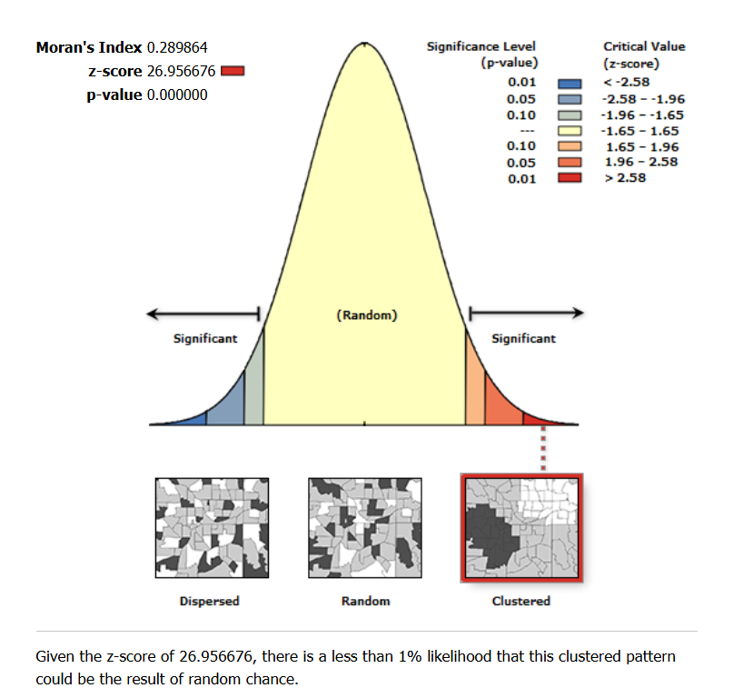{width="75%"}

Here we can see the normal distribution of $E[I]$ values against which our observed $I$ value is being evaluated. While there is always a chance that our observed $I$ might have arisen from spatial randomness, the probability is extremely low given the calculated z-score and p-value.

::: question
Based on all of the previous discussion and analysis, what is your interpretation of **global** autocorrelation for the county-level Republican vote share?
:::

::: question
With your knowledge of the analytical approach, what are the key choices for you as the user?
:::

### Local spatial autocorrelation

Based on the analysis so far, we can conclude that statistically significant positive spatial autocorrelation is present for the county-level Republican vote share. While this is an interesting result, more work is needed to answer the following:

::: question
Which *parts* of the map show clustering, dispersion or randomness?
:::

#### Calculating local Moran's $I_{i}$

To that end we can use **Local Indicators of Spatial Association** (LISAs) [@anselin1995] to assess for local spatial autocorrelation. Unlike Moran's $I$, which provides an indication of the degree of clustering, randomness or dispersion for a dataset *as a whole*, local indicators provide information on *where* spatial autocorrelation is present within a dataset.

In the previous section, we produced the **Moran Plot**, using a standardised variable `gop_std` and its standardised spatial lag `lag_std`. While this provides information on the presence of global autocorrelation, the use of standardised mean-centered values also allows us to investigate whether objects *and/or* their neighbourhoods showcase above or below average values. For example:

-   if the focal object has an above average value **and** its neighbourhood spatial lag is also above average, we would describe this as a **high-high** (HH) cluster e.g., *a high Republican voting county surrounded by other high Republican voting counties.*
-   if the focal object has a below average value **and** its neighbourhood spatial lag is also below average, we would describe this as a **low-low** (LL) cluster e.g., *a low Republican voting county surrounded by other low Republican voting counties.*
-   if the focal object has an above average value **but** its neighbourhood spatial lag is below average, we would describe this as a **high-low** (HL) outlier e.g., *a high Republican voting county surrounded by low Republican voting counties.*
-   if the focal object has a below average value **but** its neighbourhood spatial lag is above average, we would describe this as a **low-high** (LH) outlier e.g., *a low Republican voting county surrounded by high Republican voting counties.*

We can split the Moran Plot neatly into quadrats as follows:

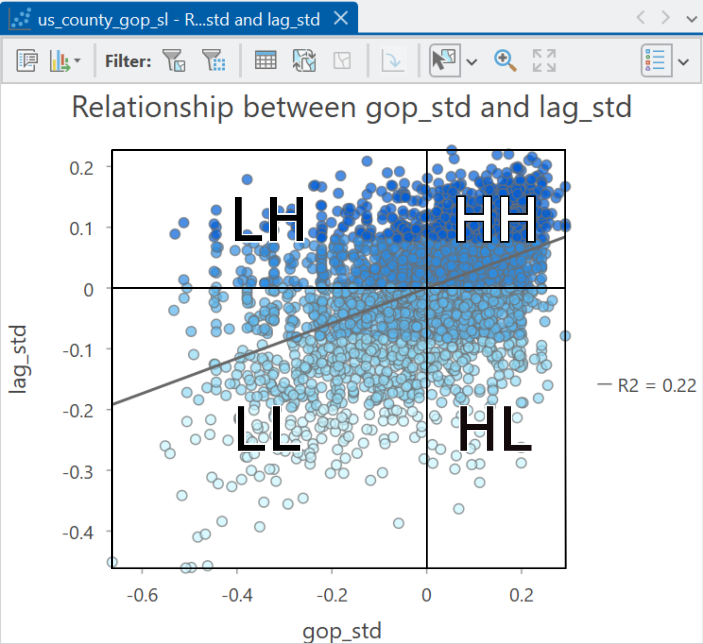{width="60%"}

This approach assigns all objects to a quadrat. While useful for our understanding, our primary interest is in **statistically significant** clustering or dispersion i.e., if the values are only *slightly* above or below the average, is that meaningful?

To test this, we can use **local Moran's** $I_i$.

Much like global Moran's $I$, local Moran's $I_{i}$ evaluates the similarities or differences between observations and their neighbours, and whether these are greater than would be expected if the values had arisen from a spatially random process. Unlike Moran's $I$, which is applied *globally* for the entire dataset, local Moran's $I_i$ is applied to each object in turn, creating an index value ($I_{i}$) for each location, which we can interpret as the degree of *local* spatial autocorrelation.

Local Moran's $I_{i}$ is defined as:

$$I_i=\frac{z_{i}}{m_{2}} \sum_{j}w_{ij}z_{j}\quad\mathrm{where}\quad m_{2}=\frac{\sum_{i}z_{i}^{2}}{n}$$ Some of the components should be familiar from our exploration of global Moran's $I$. For example, $z_{i}$ are the standardised values, $w_{ij}$ represents the spatial weight for locations $ij$ and $n$ is the number of observations.

$m^{2}$ stands for the "second moment" of a distribution[^03-autocorrelation-15], or more simply, the **variance** of the data, defined here as the *average squared deviation from the mean* for the entire dataset. This is calculated by standardising the values ($z_{i}$), squaring them ($z_{i}^{2}$), calculating the sum ($\sum_{i}z_{i}^{2}$) and then dividing by the number of observations ($n$).

[^03-autocorrelation-15]: "Moments" are values that represent a distribution or dataset: First moment (Mean), Second moment (Variance), Third moment (Skewness), Fourth moment (Kurtosis), see [here](https://en.wikipedia.org/wiki/Moment_(mathematics)).

Putting it all together, local Moran's $I_{i}$ is the cross-product of the standardised value for each location in the dataset $z_{i}$ (i.e., is the location above or below average?) and the sum of the weighted standardised values of its neighbours $\sum_{j}w_{ij}z_{j}$ (i.e., is the neighbourhood above or below average?). The cross-product is then normalised based on the overall variance of the dataset ($m_{2}$).

This normalisation is important because it places the observed deviations from the mean $z_{i}$ within the context of the overall variability in the dataset, and makes $I_{I}$ dimensionless, allowing for comparison of $I_{I}$ for different datasets and measurement scales. Take the example below, which shows two different data distributions:

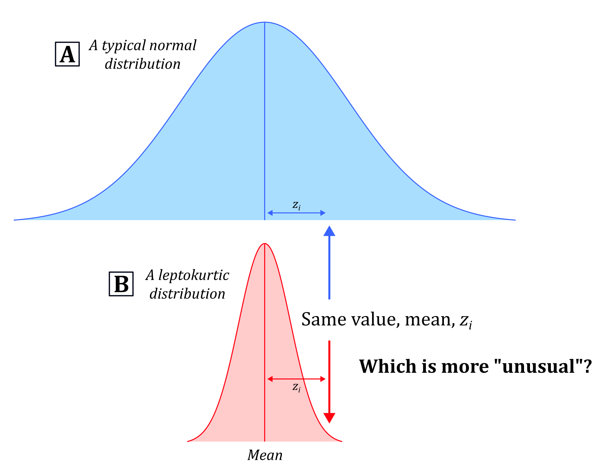{#normalisation_figure width="80%"}

The datasets have the same mean, but very different levels of variance ($m_{2}$). If we pick a value at random (denoted by the vertical arrows), the absolute deviation $z_{i}$ will be the same for both distributions, as these are measured relative to the mean. In [A], that value would be considered quite *normal*, being close to the mean and within the range of typical values. By contrast, that same value in [B] might be considered *abnormal*, being significantly different from most other values. This example illustrates that we need to interpret the absolute deviation $z_{i}$ within the overall spread of the data, which is what normalising by $m_{2}$ achieves[^03-autocorrelation-16].

[^03-autocorrelation-16]: This also allows local Moran's $I_{i}$ to be compared for datasets of different scales and units. For example, a dataset with values measured in millions of dollars might have relatively small $z_{i}$ values. An example would be the `GDP_MD` field in the Natural Earth dataset from Week 1 (i.e., gross domestic product in millions of dollars). If we changed the units to absolute dollars i.e., ($10$ M\$ becomes $10,000,000$ \$), our $z_{i}$ values would be much larger, even though the spatial pattern hasn't changed.

To summarise:

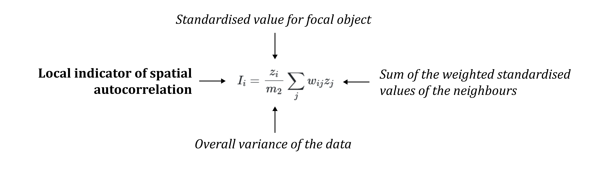{width="100%"}

#### Interpreting local Moran's $I_{i}$

As with global Moran's $I$, calculating and interpreting local Moran's $I_{i}$ in ArcGIS can be achieved using a single geoprocessing tool: [Cluster and Outlier Analysis (Anselin Local Moran's I)](https://doc.esri.com/en/arcgis-pro/latest/tool-reference/spatial-statistics/cluster-and-outlier-analysis-anselin-local-moran-s.html?tabs=dialog).

> Open [Cluster and Outlier Analysis (Anselin Local Moran's I)](https://doc.esri.com/en/arcgis-pro/latest/tool-reference/spatial-statistics/cluster-and-outlier-analysis-anselin-local-moran-s.html?tabs=dialog), using `us_county_500k_contig_cf` as the "Input Feature Class" and the Republican vote share as the "Input Field". For consistency with global Moran's $I$, use Queen's contiguity and row standardisation, but also check "False Discovery Rate (FDR) correction". Keep all other settings as the default. Save the output feature class to the project directory e.g., `us_county_gop_lisa`.

::: note
As with global Moran's $I$, local Moran's $I_{i}$ evaluates the statistical significance of the observed pattern of local spatial autocorrelation ($I_{i}$) through comparison with random permutations of the modelled values i.e., shuffling the Republican vote share across the locations and calculating $I_{i}$ for each permutation. Increasing the "Number of Permutations" allows us to assess statistical significance with greater precision, at the cost of increased run time.

 

Another setting is the "False Discovery Rate (FDR) correction", which is used to control the number of false positives (Type I errors) when running many tests at the same time. For example, for a given significance level of $p=0.05$ and assuming spatial randomness, if you were to run 1,000 tests, 950 would be correctly identified as not significant (i.e., spatially random) but 50 would be incorrectly identified as significant (i.e., spatial autocorrelation). We would refer to these as *false discoveries*. Rather than using a simple threshold for statistical significance (i.e., $p<0.05$), FDR correction adjusts the threshold for each feature to minimise the number of false discoveries, with more information [here](https://doc.esri.com/en/arcgis-pro/latest/tool-reference/spatial-statistics/what-is-a-z-score-what-is-a-p-value.html#440).
:::

When complete, you should be presented with a range of outputs, including a feature layer showing the locations of statistically significant HH, LL, HL, and LL clusters and outliers (*colours adapted for contrast*):

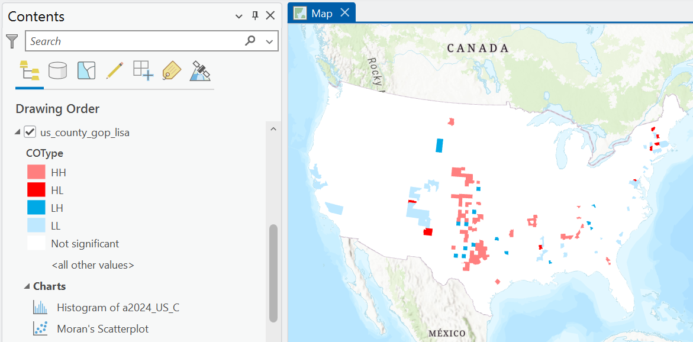{width="100%"} 

 

[Cluster and Outlier Analysis (Anselin Local Moran's I)](https://doc.esri.com/en/arcgis-pro/latest/tool-reference/spatial-statistics/cluster-and-outlier-analysis-anselin-local-moran-s.html?tabs=dialog) also produces a Moran Plot, which can be found in the Contents Pane &rarr; Charts. 

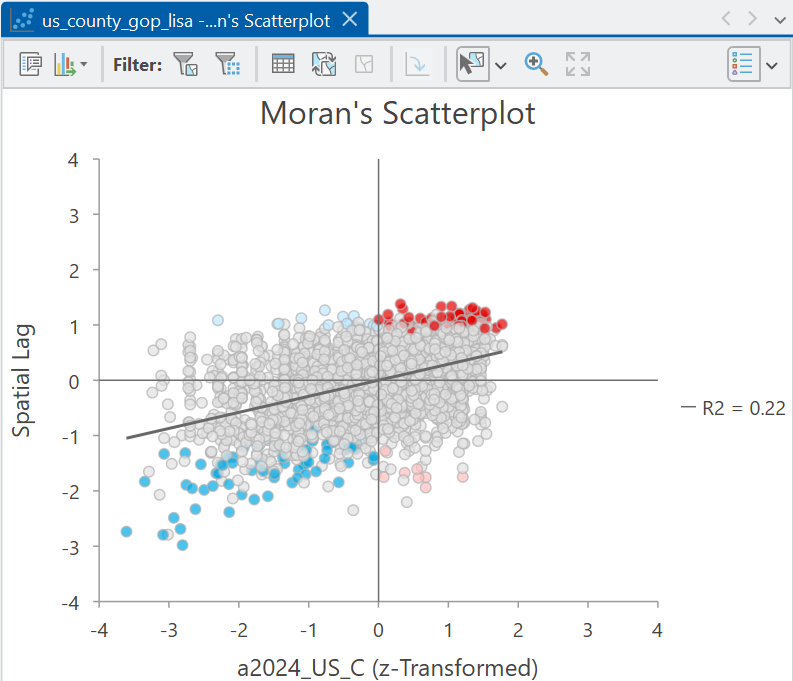{width="60%"}

This is identical to the one we created earlier (note the regression $R^2$ and slope), but here the statistically significant features have been identified in each quadrat. 

The Attribute Table also contains some useful information, including the standardised variable (`ZTransform`) and spatial lag (`SpatialLag`), the number of neighbours (`NNeighbors`), and the cluster-outlier type (`COTYPE` i.e., HH, LL, HL, LH, not significant). The z-score (`LMiZscore`) and p-value (`LMiPValue`) are calculated in the same manner as for global Moran's $I$, except using values for each feature and neighbourhood, rather then the dataset as whole. 

As always, the calculation of $I_{i}$ is dependent on our specification of the spatial weights matrix.

::: question
How do the results change if a distance based approach is used?
:::

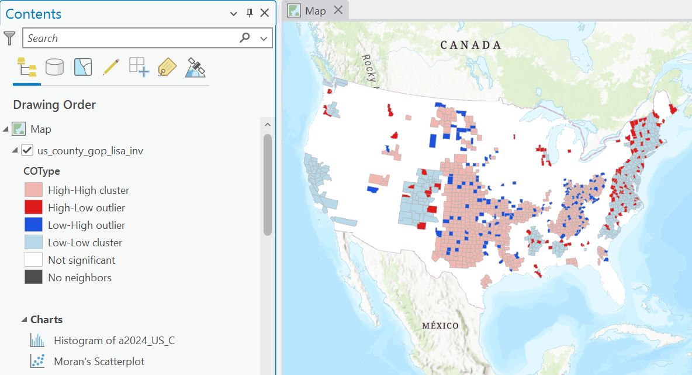{width="100%"} 

 

Answer

When using a distance based approach e.g., inverse-distance or inverse-distance squared, local Moran's $I_{i}$ has produced a much larger pattern of positive spatial autocorrelation (HH, LL). This is because Queen's contiguity is a relatively conservative approach to defining neighbours, requiring a shared point or edge . By comparison, inverse distance approaches typically include a much larger number of neighbours, although those nearby still receive higher weights. In turn, while neighbours defined using Queen's contiguity typically represent a very **local** neighbourhood (within the context of the scale of the data), distance based approaches can access information from a much **larger** neighbourhood, making it less sensitive to local variation. 

 

Based on all the above information:

::: question
Does the spatial distribution of **positive** local spatial autocorrelation (HH, LL) match your understanding of Republican and Democratic [voting patterns](https://en.wikipedia.org/wiki/Red_states_and_blue_states)? 
:::

::: question
What might explain the spatial distribution of outliers (HL, LH)? Remember these are indicative of **negative** local spatial autocorrelation i.e., *divergence*. 
:::

### Alternative indices

Global Moran's $I$ [@moran1948] and local Moran's $I_{i}$ [@anselin1995] are the most commonly used indicators of spatial autocorrelation, but they are not the only indicators. To finish the practical we'll briefly introduce global and local indicators proposed by @getis1992.

#### Getis and Ord's $G$

Getis and Ord's $G$ is a global test, equivalent to Moran's $I$ and is defined as follows:

$$G = \frac{\sum_{i}\sum_{j}w_{ij}y_{i}y_{j}}{\sum_{i}\sum_{j}y_{i}y_{j}}$$

We won't explore this in great depth, but broadly Getis and Ord's $G$ compares the spatially *weighted* sum of the cross-product of all neighbourhood values in the dataset $\sum_{i}\sum_{j}w_{ij}y_{i}y_{j}$ with the *unweighted* sum of the cross-product of all values in the dataset $\sum_{i}\sum_{j}y_{i}y_{j}$. If large or small values tend to occur together (i.e., positive spatial autocorrelation), then the numerator will increase, and so too will the test statistic $G$. 

Getis and Ord's $G$ provides information on whether there is a concentration of high or low values in a dataset. 

::: question
How is this different to Moran's $I$? 
:::

Answer

Getis and Ord's $G$ is a measure of **positive** spatial autcorrelation only, measuring the concentration of raw values. It does not consider **negative** spatial autocorrelation i.e., divergence, which is incorporated into Moran's $I$, which focuses on deviations from the global mean (i.e., standardised values $z_{i}$).  

 

You can read about the ArcGIS implementation of $G$ [here](https://doc.esri.com/en/arcgis-pro/latest/tool-reference/spatial-statistics/h-how-high-low-clustering-getis-ord-general-g-spat.html), while the `pysal` [documentation](https://pysal.org/esda/stable/user-guide/getisord.html#) may also be useful.

> Run [High/Low Clustering (Getis-Ord General G)](https://doc.esri.com/en/arcgis-pro/latest/tool-reference/spatial-statistics/high-low-clustering.html?tabs=dialog), using Queen's contiguity, but *don't* use row standardisation[^g_row]. Use "Check Report" to produce a `.html` output and the summary table: 

[^g_row]: As outlined in the ESRI [documentation](https://doc.esri.com/en/arcgis-pro/latest/tool-reference/spatial-statistics/h-how-high-low-clustering-getis-ord-general-g-spat.html) "*a binary weighting scheme is recommended for this statistic*", hence why we are **not** row standardising the spatial weights. Getis and Ord's $G$ is designed for binary weights, as the test is evaluating the number of high or low value pairs in a dataset. This is enabled by retaining the number of neighbours per feature i.e., features with lots of neighbours contribute more to the test statistic. By comparison, row-standardisation is typically used for Moran's $I$ as this is assessing similarity relative to the mean and the strength of association between variables, not the connectivity for each location.  

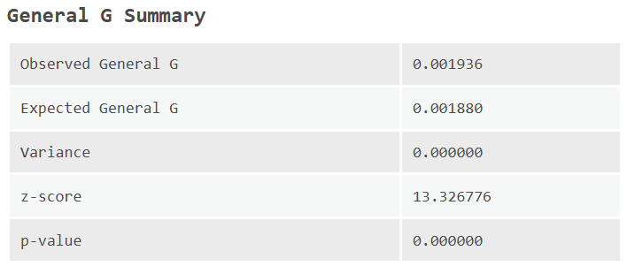{width="50%"}

::: question
Based on the table and report, what is your intepretation of the Getis and Ord's $G$ results? Does this accord with those of Moran's $I$?
:::

#### Getis and Ord's $G_{i}$

As with Moran's $I$, Getis and Ord's $G$ provides information on the degree of clustering for a dataset *as a whole* but not the local occurrences of that clustering. We can investigate those local patterns using Getis and Ord's $G_{i}$ and $G_{i}^{*}$, defined as:

$$G_{i}=\frac{\sum_{j\neq i}w_{ij}y_{j}}{\sum_{j \neq i}y_{j}}$$
and: 

$$G_{i}^{*}=\frac{\sum_{j}w_{ij}y_{j}}{\sum_{j}y_{j}}$$

These approaches are very similar to the general form $G$, except they are applied locally: $G_{i}$ and $G_{i}^{*}$ compare the spatially *weighted* sum of the neighbourhood values (e.g., $\sum_{j}w_{ij}y_{j}$) for location $i$, with the *unweighed* sum of all the values in the dataset (e.g., $\sum_{j}y_{j}$). The only difference between the two approaches $G_{i}$ and $G_{i}^{*}$ is whether the focal feature ($i$) is included in the calculations. 

The calculation is simply the ratio of the neighbourhood sum to the dataset sum. For example, take the following schematic, which shows a simple dataset of objects ($A-F$), their values ($95-520$) and their neighbourhood connections (black lines). Here we are using a binary weighting scheme, so $w=1$.

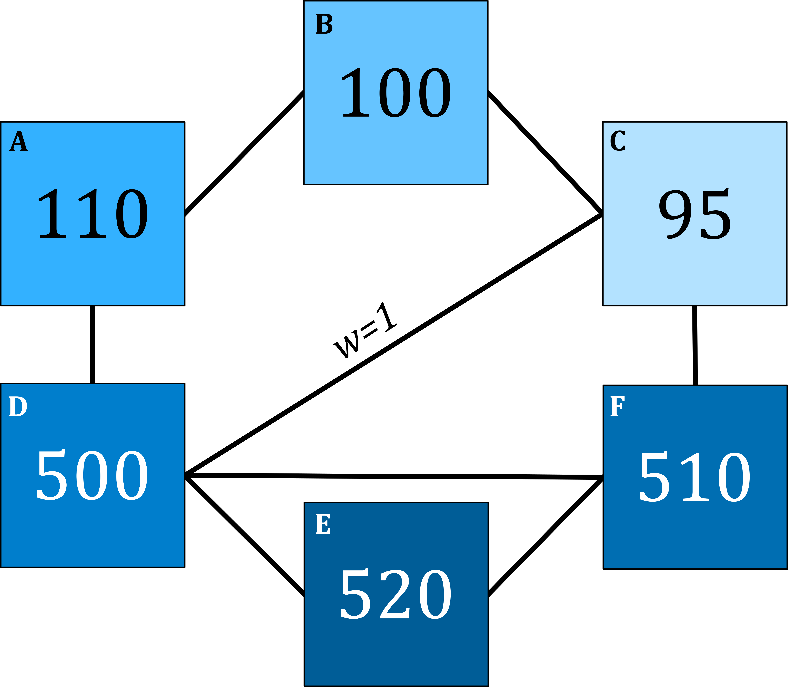{width="50%"}

Taking object $E$ as an example, the neighbourhood values are $500$, $510$ and $520$, which would equate to spatially *weighted* sum of $1530$[^binary_w]. The *unweighed* sum of all the values in the dataset is equal to $1835$. In turn our $G_{i}^{*}$ statistic is as follows:

$$G_{i}^{*} = \frac{1530}{1835}=0.834$$
i.e., how much of the total "value" of the dataset (~83%) is contained in the current neighbourhood ($i$)? As with local Moran's $I$, the significance of the test statistic is evaluated against the *expected* local statistic, assuming spatial randomness, and you can read more on that [here](https://doc.esri.com/en/arcgis-pro/latest/tool-reference/spatial-statistics/hot-spot-analysis.html?tabs=dialog) and [here](https://doc.esri.com/en/arcgis-pro/latest/tool-reference/spatial-statistics/h-how-hot-spot-analysis-getis-ord-gi-spatial-stati.html).

[^binary_w]: As we have used binary weights $w=1$, this calculation is equivalent to $(1\times500) + (1\times510)+(1\times520)$, so the result is identical to the sum of the neighbourhood values.

> Run [Hot Spot Analysis (Getis-Ord Gi*)](https://doc.esri.com/en/arcgis-pro/latest/tool-reference/spatial-statistics/hot-spot-analysis.html?tabs=dialog)[^getis_note] using Queen's contiguity and applying an FDR correction. Save the output feature class as `us_county_gop_gi`. 

[^getis_note]: As the tool name indicates, the ArcGIS implementation is $G_{i}^{*}$, including the focal feature $i$.

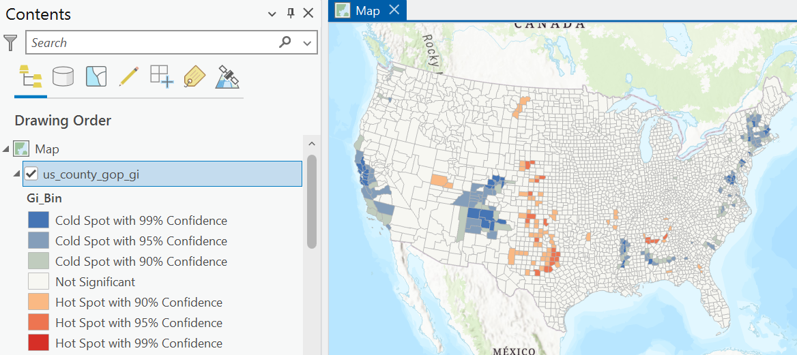{width="100%"} 

 

::: question
How do results of $G_{i}^{*}$ differ from those of $I_{i}$?
:::

### Summary {#autocorrelation_summary}

While $I$ and $G$ (global) and $I_{i}$ and $G_{i}^{*}$ (local) will often generate complementary results, the results are not always identical and can sometimes diverge. Fundamentally, the two sets of indicators are evaluating different phenomenon. 

::: question
What is local Moran's $I_{i}$ measuring?
:::

::: question
What is Getis and Ord's $G_{i}^{*}$ measuring? 
:::

Answer

Fundamentally, the indicators of @moran1948 are focused on *similarity* of neighbours relative to the mean ($z_{i}$) whereas those of @getis1992 are focused on absolute similarity of high or low values in the raw data. 

 

Overall, while each indicator has specific strengths and use-cases (e.g., straightforward interpretation of "hotspots" and "coldspots" for $G_{i}^{*}$), those of @moran1948 can be used to reveal additional behaviour, including the presence of global **negative** spatial autocorrelation ($I<0$) and local **negative** autocorrelation (i.e., HL and LH outliers identified using $I_{i}$).

------------------------------------------------------------------------

**Congratulations!** You have completed the practical and should now be able to assess for autocorrelation and hotpots in ArcGIS, should have a strong understanding of the underlying mathematics, and should have an even greater appreciation of the importance of the spatial weights matrix. 

[**Finished!**](#index)

## Extra

The practical is based on county-level data from the [2024 US General election](https://www.bbc.co.uk/news/election/2024/us/results). In the `data/us-census` directory, I have also included the results for the [2008 US General Election](https://www.presidency.ucsb.edu/statistics/elections/2008) i.e., [Barack Obama](https://en.wikipedia.org/wiki/Barack_Obama) vs. [John McCain](https://en.wikipedia.org/wiki/John_McCain). 

> Repeat the analysis using the 2008 results, linking the geometries and voting results using the `NAMELSAD` and `county_name` fields.

::: question
How have the results changed over that 16 year period? Is voter spatial autocorrelation greater, less, or about the same? What does this reveal?
:::

::: question
What is a limitation of our current approach? *Hint*: Sort the `gop_per` column for the 2008 results.
:::

Answer

The county geometries, names, and/or FIPS codes might have changed in this period, so we have 80 counties of 3109 where there is no matching name. Instead, we should really use time-accurate geometries, available [here](https://www2.census.gov/geo/tiger/).

## Resources

-   Moran, P.A.P. ([1948](https://www.jstor.org/stable/2983777)). The Interpretation of Statistical Maps. Journal of the Royal Statistical Society, B 10: 243–51.
-   Moran, P.A.P. ([1950](https://doi.org/10.2307/2332142)). Notes on continuous stochastic phenomena. Biometrika, 37(1/2), pp.17-23.
-   Anselin, L. ([1995](https://doi.org/10.1111/j.1538-4632.1995.tb00338.x)). Local Indicators of Spatial Association—LISA. Geographical Analysis 27, 93–115.
-   Anselin, L ([1996](https://www.taylorfrancis.com/chapters/edit/10.1201/9780203739051-8/moran-scatterplot-esda-tool-assess-local-instability-spatial-association-luc-anselin)). “The Moran Scatterplot as an ESDA Tool to Assess Local Instability in Spatial Association.” In Spatial Analytical Perspectives on GIS in Environmental and Socio-Economic Sciences, edited by Manfred Fischer, Henk Scholten, and David Unwin, 111–25. London: Taylor; Francis.
-   Getis, A. and Ord, J.K. ([1992](https://doi.org/10.1111/j.1538-4632.1992.tb00261.x)). The analysis of spatial association by use of distance statistics. Geographical analysis, 24(3), pp.189-206.
