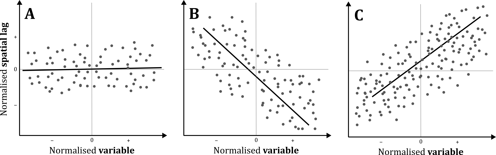
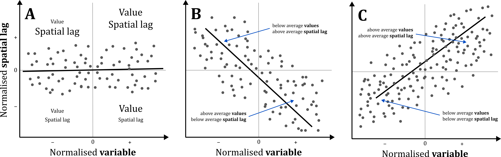
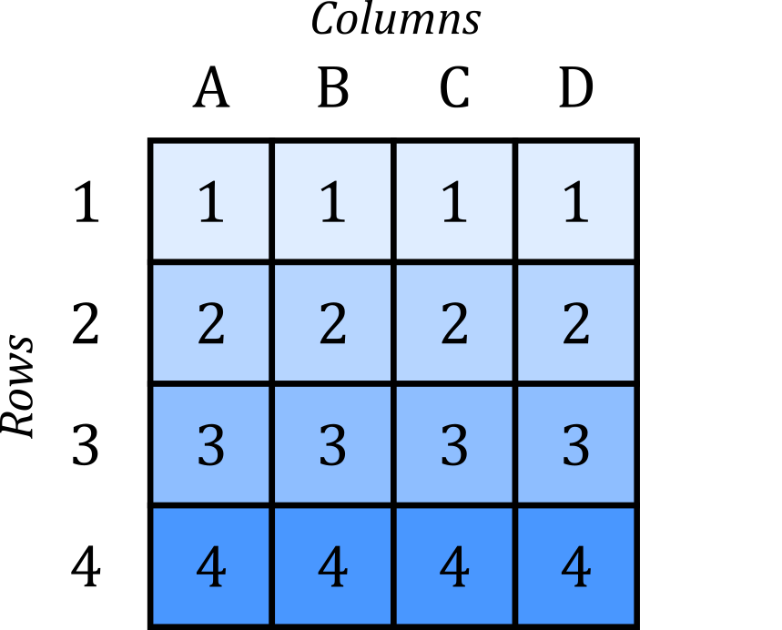
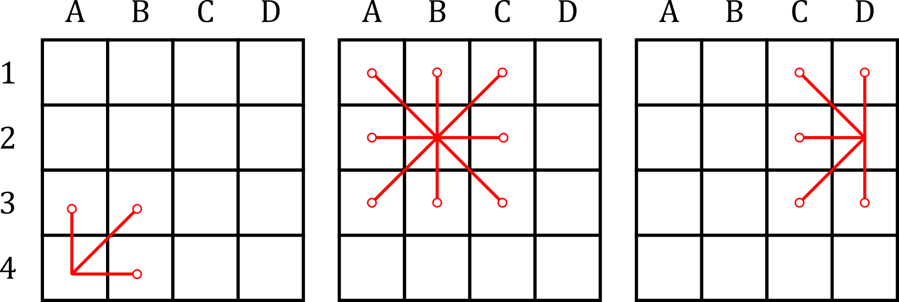
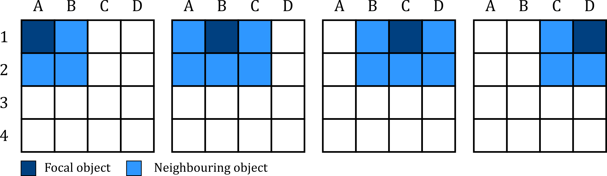

# Spatial Autocorrelation {#spatial_autocorrelation}

## Introduction

### Aims {.unnumbered}

The aims of this practical are to:

1.  Understand why spatial autocorrelation needs to be considered when analysing spatial data.
2.  Understand the techniques we can use to assess for global and local spatial autocorrelation, including the underlying mathematics and assumptions.
3.  Test for spatial autocorrelation in ArcGIS and interpret outputs correctly.

### Application {.unnumbered}

To that end, we'll use county-level data from the [2024 US General election](https://www.bbc.co.uk/news/election/2024/us/results) to investigate global and local spatial autocorrelation.

### Data {#autocorrelation_data .unnumbered}

The county-level data for this practical are available in [`data/us-census`] as follows:

-   US county geometries for 2023, mapped at a 1:500,000 scale [[Source](https://www2.census.gov/geo/tiger/GENZ2023/shp/)]
-   US county-level Presidential results for the 2024 elevation [[Source](https://github.com/tonmcg/US_County_Level_Election_Results_08-24)], which includes:
    -   Democratic vote total [`votes_dem`] and proportion (`per_dem`)
    -   Republican vote total [`votes_gop`] and proportion (`per_gop`)

*Note that other datasets are present in this directory and will be utilised later in the unit.*

### Tools {.unnumbered}

[Spatial Autocorrelation (Global Moran's I)](https://doc.esri.com/en/arcgis-pro/latest/tool-reference/spatial-statistics/spatial-autocorrelation.html?tabs=dialog) (Spatial Statistics Tools), [Cluster and Outlier Analysis (Anselin Local Moran's I)](https://doc.esri.com/en/arcgis-pro/latest/tool-reference/spatial-statistics/cluster-and-outlier-analysis-anselin-local-moran-s.html?tabs=dialog) (Spatial Statistics Tools), [High/Low Clustering (Getis-Ord General G)](https://doc.esri.com/en/arcgis-pro/latest/tool-reference/spatial-statistics/high-low-clustering.html?tabs=dialog) (Spatial Statistics Tools), [Hot Spot Analysis (Getis-Ord Gi\*)](https://doc.esri.com/en/arcgis-pro/latest/tool-reference/spatial-statistics/hot-spot-analysis.html?tabs=dialog) (Spatial Statistics Tools), [Project](https://doc.esri.com/en/arcgis-pro/latest/tool-reference/data-management/project.html?tabs=dialog) (Data Management Tools), [Neighborhood Summary Statistics](https://doc.esri.com/en/arcgis-pro/latest/tool-reference/spatial-statistics/neighborhood-summary-statistics.html?tabs=dialog) (Spatial Statistics Tools)

------------------------------------------------------------------------

## Practical {#autocorrelation_prac}

### Understanding spatial autocorrelation

According to Tobler's Law [@tobler1970]:

"*everything is related to everything else, but near things are more related than distant things.*"

In our exploration of [**spatial weights**](#spatial_weights), we focused on the key concepts of *proximity* and *adjacency* (i.e., "near", "distant") and discovered how we can define and model those concepts using spatial weights $w$ and the spatial weights matrix $\mathbf{W}$.

One aspect of Tobler's Law we *didn't* engage with is the word **related** i.e., the concept of *similarity*. As a whole, Tobler's Law relates to the interplay of proximity-adjacency *and* similarity. In the field of spatial analysis, we refer to this relationship as **spatial autocorrelation**, defined by @anselin1988 as a:

"*functional relationship between what happens at one point in space and what happens elsewhere*"

Or more simply:

"*the degree to which an object or value is related to nearby objects or values.*"

Related concepts include *temporal* autocorrelation i.e., the degree to which a value at a point in time is similar to those in the past, or *correlation*[^03-autocorrelation-1] more broadly i.e., a measure of association between two or more variables (but typically excluding a spatial or temporal component). It is also worth noting that we use the term **auto**correlation because we are assessing **self** correlation i.e., the degree of similarity for a single dataset or variable (e.g., house prices), rather than multiple variables (e.g., house prices *vs.* employment opportunities), even if that single dataset could comprise many different observations.

[^03-autocorrelation-1]: We will explore **spatial correlation** in Practical 4.

#### Randomness and Clustering

When assessing the spatial distribution of objects and their values, we can imagine three potential scenarios: **complete spatial randomness**, **positive** spatial autocorrelation and **negative** spatial autocorrelation.

**Complete spatial randomness** relates to situations where there is no distinct spatial pattern or structure to the data. In this case, the location of the object is irrelevant to the phenonemon we are studying.

Spatial autocorrelation exists when we *reject* the hypothesis of spatial randomness, in favour of the presence of:

-   **positive** spatial autocorrelation, where similar values are located nearby, and dissimilar values are distant i.e., *clustered*.
-   **negative** spatial autocorrelation, where similar values tend be distant from each other, and dissimilar values are located nearby i.e., *dispersed*.

Here are some examples of different configurations, redrawn from [Luc Anselin's](https://lanselin.github.io/introbook_vol1/positive-and-negative-spatial-autocorrelation.html#fn97) "*An Introduction to Spatial Data Science with GeoDa*":

{width="100%"}

 

::: note
Pattern recognition is one of our defining human characteristics, see @biederman1987, @shermer2008 and @mattson2014. As a result, while it is tempting to identify spatial structure in the example of *spatial randomness* above, the map was constructed using a [random process](https://lanselin.github.io/introbook_vol1/spatial-randomness.html#parametric-approach).
:::

Importantly, the scenarios of positive and negative spatial autocorrelation do not relate to the **sign** of the values (i.e., $+|-$), but attribute similarity alone. For example, positive spatial autocorrelation could relate to high values being found close to other high values (e.g., expensive houses near other expensive houses) or low values being found close to other low values (e.g., low-cost houses near other low-cost houses).

::: question
Can you think of any other examples of geographic phenonema which are characteristed by positive spatial autocorrelation?
:::

#### Global vs. local

When assessing for spatial autocorrelation, this can be analysed at a **global** level, which provides information on the degree of clustering, dispersion or randomness for a dataset *as a whole* i.e., on average, are expensive houses found near other expensive houses?

Spatial autcorrelation can also be analysed at a **local** level, which provides more detailed information on the *locations* of areas of clustering, dispersion or randomness e.g., which parts of the map show clusters of **positive** spatial autocorrelation?

Measures of global and local spatial autocorrelation typically focus on **continuous** numerical data e.g., temperature ($^{\circ}\text{C}$), air pollution (ppm), or vote share (%). However, it is possible to analyse **categorical** data by assigning a numeric value to each category, although the process would vary depending on whether there is a *logical order*[^ordinal] to the categories, or not[^dummy_encoding]. 

[^ordinal]: If there **is** a logical order to the categories, we would refer to this as **ordinal data** e.g., survey responses with the following ordered scores: Poor &rarr; Basic &rarr; Reasonable &rarr; Good &rarr; Excellent &rarr; Outstanding. In this situation, we could be justified in assigning them a sequential numeric value e.g., Poor = 1, Basic = 2, and so on. 

[^dummy_encoding]: If there is **no** logical order to the categories, we would refer to this as **nominal data** e.g., vehicle brands: Toyota, Ford, Honda, Land Rover. As there no logical order to these items, we should **not** assign them a numeric value e.g., Toyota = 1, Ford = 2, Honda = 3, Land Rover = 4. Using this approach, we would infer that Honda is equal to three $\times$ Toyota, which makes no sense! Instead, we would typically use a [**dummy variable**](https://en.wikipedia.org/wiki/Dummy_variable_(statistics)) approach, which would involve creating a separate variable for each category, where the values are either 1 or 0, denoting the presence or absence of the categorical value for that particular row of data. See Figure 1 [here](https://methods.sagepub.com/ency/edvol/sage-encyclopedia-of-educational-research-measurement-evaluation/chpt/dummy-variables#_) for a useful example. Spatial autocorrelation could then be evaluated for each dummy variable. In ArcGIS, dummy variables could be created using [Encode Field](https://doc.esri.com/en/arcgis-pro/latest/tool-reference/data-management/encode-field.html?tabs=dialog) (Data Management Tools). 

#### Importance

As discussed in the lecture, spatial autocorrelation is of profound importance for spatial analysis. Understanding the spatial structure of our data is critical if we want to really understand the phenonema of interest. Spatial autocorrelation also dictates the methods that we can use. For example, many traditional statistical approaches[^03-autocorrelation-2] assume **independence of observations** i.e., all observations in your data are independent from each other. This assumption is *met* when spatial autocorrelation is absent (i.e., complete spatial randomness), but is *broken* when spatial autocorrelation is present, rendering the results and our interpretations invalid.

[^03-autocorrelation-2]: e.g., t-tests, ordinary least squares regression.

::: note
As expert spatial analysts, we need to use methods which incorporate the spatial structure and autocorrelation present in many geographic datasets[^03-autocorrelation-3].
:::

[^03-autocorrelation-3]: Alongside **spatial autocorrelation** (Practical 3), we will also explore spatial **correlation** (Practical 4) and **regression** (Practicals 7 - 8).

In the next sections, we'll use county-level data from the [2024 US General election](https://www.bbc.co.uk/news/election/2024/us/results) to investigate global and local spatial autocorrelation and introduce the methods we can use to test for it.

### Pre-processing

To begin:

> Open ArcGIS, initialise a new project in the `practical-3` directory, establish a connection to `data` and load `cb_2023_us_county_500k.shp`, which contains the geometries for US counties[^03-autocorrelation-4].

[^03-autocorrelation-4]: Note that for US elections, counties are primarily used for administrative purposes, see [here](https://www.bbc.co.uk/news/articles/cj4vn0qxy0lo). For presidential elections, the important voting statistics are at the state-level, which determines the number of [electoral college votes](https://www.bbc.co.uk/news/world-us-canada-53558176), where a majority determines the national outcome.

#### The contiguous United States

For simplicity, we are going to focus on the [contiguous United States](https://en.wikipedia.org/wiki/Contiguous_United_States):

> Use "Select by Attributes" to select all rows where the `STATE_NAME` is **not** Alaska, Hawaii, Puerto Rico, Guam, American Samoa, Commonwealth of the Northern Mariana Islands and United States Virgin Islands. "Export Selection" (n = 3,109) with a suitable name (e.g., `us_county_500k_contig`) to the correct directory, and when complete, remove the original file from ArcGIS.

SQL expression

The following expression will select all rows which meet the following conditions (i.e., not equal to (`<>`) Alaska): `STATE_NAME <> 'Alaska' And STATE_NAME <> 'Hawaii' And STATE_NAME <> 'Puerto Rico' And STATE_NAME <> 'Guam' And STATE_NAME <> 'American Samoa' And STATE_NAME <> 'Commonwealth of the Northern Mariana Islands' And STATE_NAME <> 'United States Virgin Islands'`

 

{width="100%"}

 

Our dataset is using a geographic CRS:

::: question
What is the EPSG code?
:::

In our current Map View, this has resulted in significant distortion (i.e., flattening) of the geometries. We are going to switch to a **conformal** projected CRS to preserve the *shape* of the US counties:

> Open the Geoprocessing tool [Project](https://doc.esri.com/en/arcgis-pro/latest/tool-reference/data-management/project.html?tabs=dialog). Use `us_county_500k_contig` as the input and specify a suitable output name (e.g., `us_county_500k_contig_cf`[^03-autocorrelation-5]). For the "Output Coordinate System", use `USA Contiguous Lambert Conformal Conic` (EPSG: [102004](https://epsg.io/102004)) and Run. When complete, remove any other layers from the Contents Pane.

[^03-autocorrelation-5]: `cf` denoting conformal

Your output will resemble the following:

{width="100%"}

 

**Importantly** this is visually identical to the previous layer, even though we have changed the data CRS.

::: question
Can you think why this might be?
:::

Answer

This is because the **maps** coordinate reference system is still using that of the *first* feature layer added (EPSG: [4269](https://epsg.io/4269)). While we have reprojected our county geometries, these are being reprojected again "on-the-fly" to match the map CRS.

> Update the map CRS to that of the `us_county_500k_contig_cf` layer, which should now resemble the following:

{width="100%"}

 

#### Election results {#election_results}

Next we are going to combine our geometries with the county-level election results for 2024.

> Load `2024_US_County_Level_Presidential_Results.csv` and use a dynamic table join to link the election results to our county geometries, joining using the `NAMELSAD`[^03-autocorrelation-6] and `county_name` fields.

[^03-autocorrelation-6]: Current legal/statistical area description code

::: note
An alternative approach would be to join using the Federal Information Processing Series ([FIPS](https://www.census.gov/library/reference/code-lists/ansi.html)) code, stored in `GEOID` and `county_fips` respectively. However, these are currently in different data formats (`Text` and `Long` i.e., numeric), which you can inspect via the Attribute Table → right click Fields → Data Type. The different data formats would preclude any matches i.e., $01003_{text}\neq01003_{numeric}$. While we can address this via some data processing[^03-autocorrelation-7], for now we'll just use the county names.
:::

[^03-autocorrelation-7]: We'll explore this in Practical 4, where we'll use the same US county level data to investigate patterns of spatial **correlation**.

The Attribute Table should now contain the following key fields:

-   the number of votes cast for the Republican (`votes_gop`[^03-autocorrelation-8]) and Democratic parties (`votes_dem`), the difference between them (`diff`) and the total votes cast (`total_votes`).
-   the Republican and Democratic vote share (`per_gop`, `per_dem`) and the difference between them (`per_point_diff`).

[^03-autocorrelation-8]: The Grand Old Party (GOP) is another name for the Republican Party.

::: question
What is the total number of votes cast for each party?
:::

::: question
What is the average *county-level* vote share for the Republican party?
:::

::: note
These values are *close* to the reported [results](https://www.bbc.co.uk/news/election/2024/us/results), with minor differences partly explained by the removal of non-contiguous states, and the aggregation of votes at county rather than state-level. The data source is also not considered [authoritative](https://github.com/tonmcg/US_County_Level_Election_Results_08-24#compiling-presidential-election-results), but for the purposes of this practical, is sufficiently accurate to illustrative the spatial trends in vote share, and to assess for spatial autocorrelation.
:::

To better understand the spatial variability in the election results:

> Update the layer symbology based upon `per_gop` and use colours and scaling of your choice. For example, using `Unclassed Colors`, `Red-Blue` (reversed) and setting the min-max to 0 and 1 will produce the following output, which resembles [typical visualisations](https://tonmcg.github.io/US_County_Level_Election_Results_08-24/), where reds denote Republican vote share, and blues denote Democratic vote share. The use of a 0-1 scale, rather than scaling by the min-max vote %, also produces a natural mid-point value of 0.5, where the vote is shared equally between the two parties.

{width="100%"}

 

::: question
While this is an interesting visualisation, what are the limitations of this approach?
:::

Interpretation

Land doesn't vote... **people do**. While we have changed the symbology to match the vote share for each county, the counties differ in size, so naturally we assign greater weight to the larger, more visible counties, and less weight to the smaller, less visible counties. The following ArcGIS [StoryMap](https://storymaps.arcgis.com/stories/0e636a652d44484b9457f953994b212b) provides some interesting commentary and alternative visualisations.

 

There are lots of interesting spatial patterns in this dataset:

::: question
Can you see any evidence of spatial autocorrelation?
:::

While initial exploratory analysis is important, our pattern recognition abilities are not perfect. We might miss subtle but important patterns (a Type II error) or identify spurious or random patterns as significant (a Type I error). As a result, it is important that we use a statistical approach to identify and assess the significance of spatial autocorrelation.

### Spatial Lag {#spatial_lag}

Before we begin to explore spatial autocorrelation and start running ArcGIS tools, it is important that we understand the underlying mathematics. In particular, we need to introduce the **spatial lag** operator, which is one of the key use cases for the spatial weights matrix $\mathbf{W}$.

The spatial lag captures the *weighted value of a variable for each locations neighbourhood*. In our case, this could be the weighted Republican vote share (`per_gop`) for the neighbourhood surrounding each US county, as illustrated below:

{width="40%"}

Mathematically it is defined as follows:

$$y_{sl-i}=\sum_{j}w_{ij}y_{j}$$

where $y_{sl-i}$ is the spatial lag, representing the weighted neighbourhood value for the focal object, excluding itself ($-i$). This is calculated as the sum of the spatial weights $w$ for row $i$ and column $j$ in the spatial weights matrix multiplied by the corresponding value for the neighbourhood location $y_j$.

As an example, here is a *sparse* spatial weights matrix, subset to a single focal object $f$. As $f$ has seven neighbours and $\mathbf{W}_f$ is row-standardised, $w=1/7$

$$\mathbf{W}_f=\begin{bmatrix} 1/7 & 1/7 & 1/7 & 1/7 & 1/7 & 1/7 & 1/7 \end{bmatrix}$$

If the values at those locations (e.g., `per_gop`) are as follows:

$$y_{j}=\begin{bmatrix} 0.39 & 0.33 & 0.46 & 0.38 & 0.67 & 0.24 & 0.41 \end{bmatrix}$$

The products of the spatial weight $w$ and the value $y$ would be:

$$w_{ij}y_{j}=\begin{bmatrix} 0.06 & 0.05 & 0.07 & 0.05 & 0.10 & 0.03 & 0.06 \end{bmatrix}$$

The sum of these products is our **spatial lag** i.e., the weighted value for the neighbourhood:

$$y_{sl-i} = \sum w_{ij}y_{j}=0.41$$

When row-standardisation is used, the spatial lag is effectively a weighted **average** for the neighbourhood, because the weights will sum to 1. When binary weights are used and row-standardisation is *not*, the spatial lag would produce the sum of the neighbourhood values.

You may find it easier to understand this visually, so here is a schematic using the same weights and values, illustrating how the values ($y$, `per_gop`) are multiplied by the corresponding spatial weights ($w$), where the sum is the **spatial lag** ($y_{sl-i}$) for the focal feature = $0.41$.

{#lag_schematic width="100%"}

The above matrices and schematics illustrate the process for a *single* focal feature, and this would be replicated to create a spatially-lagged variable for all features in the dataset.

::: note
If you are interested you can check the calculations yourself, as these are based on the election results and weights for Sante Fe County, New Mexico (GEOID: 35049).
:::

To help your understanding further:

> Open the Geoprocessing tool [Neighbourhood Summary Statistics](https://doc.esri.com/en/arcgis-pro/latest/tool-reference/spatial-statistics/neighborhood-summary-statistics.html?tabs=dialog)[^american_british], using the US county data as input, and selecting `per_gop` as the "Analysis Field". For "Neighbourhood Type" using `Contiguity Edges Corners`, for "Local Summary Statistic" use `Mean`, and `Ignore Focal Feature` (because $y_{sl-i}$). I used the output name `us_county_gop_sl`, where `sl` denotes "spatial lag".

[^american_british]: The default language settings for our ArcGIS install are American English, so the tool names may be slightly different i.e., **Neighborhood** Summary Statistics. 

Your output should resemble the following, where the US counties are symbolised using the spatial lag of `per_gop`, using Queen's contiguity. In effect, we have created a *smoothed* version of the original values.

{width="100%"}

 

> Inspect the Attribute Table of the new layer, which contains the original `per_gop` values and the spatially-lagged variable `Mean`, as well as the `Number of neighbours` for each feature. 

::: question
Are there any counties where the GOP vote share is noticeably different from the spatially-lagged variable?
:::

::: note
The **spatial lag** operator underpins many spatial methods, including tests for spatial autocorrelation.

 

It is also **directly** influenced by our definition of the spatial weights matrix. Different approaches (e.g., contiguous vs. distance based, binary vs. continuous) will result in very different neighbourhood definitions and very different spatially-lagged variables.
:::

### Global spatial autocorrelation

The *spatial lag* variable is a key component of Moran's $I$ [@moran1948], one of the most commonly used statistics for global autocorrelation.

Before we introduce the mathematics of Moran's $I$, we will begin by exploring spatial autocorrelation visually using the **Moran Plot**.

#### Moran Plot {#moran_plot}

To begin, we are going to **standardise** our values, as explained below: 

> Find the mean ($\overline{z}$) of `per_gop` and then create a new field in the Attribute Table of `us_county_gop_sl` using Calculate Field ("Name" = `gop_std`, "Field Type" = `Double`). This field should contain the difference between `per_gop` for each county and the mean `per_gop`.

Answer

The mean of the Republican vote share is $\approx0.66\%$ ($0.6632597676265708$) so the Expression to calculate the standardised variable `gop_std` is as follows: `!per_gop! - 0.6632597676265708`

 

> Repeat this process for the spatial lag variable (`Mean for per_gop`, "Name" = `lag_std`).

Answer

The mean of the spatially lagged Republican vote share is also $\approx0.66\%$, although not identical ($0.6636104005899481$). The Expression to calculate the standardised spatial lag variable `lag_std` is as follows: `!PER_G_Mean! - 0.6636104005899481`. 

Note that the visible field name in the "Fields" table is `Mean for per_gop` but this is just an **alias** i.e., an alternative name which provides a more user-friendly description of the content. The *actual* field name is `PER_G_Mean!`, which is populated in the Expression when `Mean for per_gop` is double clicked. Similarly, `Mean for Distance to Neighbors` is an alias for `DIST_Mean`. 

 

Before we can progress further, there are four US counties with no *contiguous* neighbours (FID = `425`, `533`, `2017`, `2615`). To simplify our analysis:

> Remove these rows from `us_county_gop_sl` e.g., Select by Attributes (`DIST_NNBRS = 0`) and then Delete.

Using our standardised spatial lag variable `lag_std` and standardised variable of interest `gop_std`, we can create a **Moran Plot** as follows:

> Right click on `us_county_gop_sl` in the Contents Pane → Create Chart → Scatter Plot, and use the standardised `gop_std` variable for the x-axis, and the standardised spatial lag variable `lag_std` for the y-axis.

::: note
We use **standardisation** for both the variable of interest `per_gop` and the spatial lag variable `lag_std` to facilitate interpretation. By calculating the deviation from the mean ($\overline{z}$), this centers both datasets at 0, where above average values are $z_{i}>0$ and below average values are $z_{i}<0$. In turn, we can easily evaluate whether the focal feature and/or the neigbourhood have an above or below average Republican vote share.
:::

{width="60%"}

 

The **Moran Plot** is a useful tool for visual exploration of spatial autocorrelation and is simply a scatter plot of the variable of interest compared to the spatially lagged values[^03-autocorrelation-9]. The overall pattern of the data provides us with a great deal of information about the presence of spatial *autocorrelation* (either positive or negative) or spatial *randomness*.

[^03-autocorrelation-9]: Note that we have created the Moran Plot manually here to facilitate understanding, but of course there are ArcGIS tools which will do this for us, as we'll explore soon.

The plot also includes a **linear regression** fitted to the values (the black line). We will explore regression later in the unit[^03-autocorrelation-10], but as a brief introduction, this provides information on the strength, direction and nature of the relationship between two variables, in this case `gop_std` and `lag_std`. Here the [coefficient of determination](https://en.wikipedia.org/wiki/Coefficient_of_determination) $\text{R}^2\approx0.22$, which indicates that $\approx22\%$ of the variation in `gop_std` can be explained by `lag_std`.

[^03-autocorrelation-10]: In **Practical 7** *Spatial Regression* and **Practical 8** *Geographically Weighted Regression*.

The slope of the linear regression is also **positive** ($\approx0.29$, available in Chart Properties), with the trendline sloping *upwards* i.e., as the standardised Republican vote share for a county increases, so too does the vote share of its neighbouring counties. This is indicative of **positive** spatial autocorrelation i.e., similar values are located nearby, and dissimilar values are distant.

By comparison, if the slope of the linear regression was **negative**, this would indicate that as the Republican vote share for a county *increases*, the vote share of its neighbouring counties would *decrease*. This would be indicative of **negative** spatial autocorrelation i.e., similar values tend be distant from each other, and dissimilar values are located nearby.

Finally, if there was no significant slope to the linear regression[^03-autocorrelation-11], this would indicate the presence of spatial **randomness** i.e., the Republican vote share for a county is not meaningfully related to that of its neighbours.

[^03-autocorrelation-11]: We will discuss how we can test for significance in a moment.

::: question
Would you describe the county-level Republican vote share as clustered or dispersed?
:::

Interpretation

Using the Moran Plot, we can infer that *on average*, **positive** autocorrelation is present i.e., Republican voting counties tend to be surrounded by other Republican voting counties. However, that doesn't mean that this applies to every situation e.g., there may be instances where Republican voting counties are surrounded by Democratic voting counties, and vice-versa.

 

> Before moving on, make sure you understand how the [spatial lag](#spatial_lag) variable is calculated, how it is normalised (i.e., relative to the mean), and what the Moran Plot represents (i.e., the variable of interest plotted against the weighted neighbourhood values).

To test your understanding:

::: question
Which of the following Moran Plots ($A,B,C$) are characterised by spatial randomness, positive spatial autocorrelation, or negative autocorrelation?
:::

{width="100%"}

 

Interpretation

$A$ is indicative of complete spatial randomness. Above average values (e.g., Republican vote share on the x-axis) appear just as likely to be associated with **below average** neighbourhood values (i.e., spatial lag of Republican vote share) as they are **above average** neighbourhood values (y-axis).

By comparison, both $B$ and $C$ reveal spatial autocorrelation.

For $B$, this is generally **negative** as *above* average values are typically associated with *below* average neighbourhood values, and vice versa (i.e., *below* average values associated with *above* average neighbourhood values). Nearby values are therefore often dissimilar in a **dispersed** pattern.

For $C$ there is strong evidence of **positive** spatial autocorrelation, where above average values are associated with above average neighbourhood values, and vice versa i.e., similar values **cluster**.

{width="100%"}

 

#### Calculating Moran's $I$ {#calc_moran_i}

The **Moran Plot** is a powerful visualisation that tells us a great deal about the presence or absence of spatial autocorrelation for a dataset *as a whole*. However, there are some unanswered questions:

::: question
Which *parts* of the map show clustering, dispersion or randomness?
:::

::: question
How do we know that the observed pattern of spatial autocorrelation is meaningful? i.e., is it significantly different from spatial randomness?
:::

We can answer the former by investigating **local** spatial autocorrelation, which is the topic of the second half of the practical.

We can answer the latter by calculating the **Moran's** $I$ **statistic** and its significance, rather than relying on the visualisation alone. Here $I$ is used to summarise the information in the Moran Plot. Much like Pearson's $r$, Moran's $I$ can range from $-1$ to $+1$, where $-1$ indicates **negative** spatial autocorrelation (dispersion), $+1$ indicates **positive** spatial autocorrelation (clustering), and $0$ denotes **complete spatial randomness**.

To understand how $I$ is calculated, we need to take a deeper dive into the Moran's $I$ formula, which is defined as follow:

$$I = \frac{n}{\sum_{i}\sum_{j}w_{ij}}\frac{\sum_{i}\sum_{j}w_{ij}z_{i}z_{j}}{\sum_{i}z_{i}^{2}}$$

**Don't worry** about trying to interpret the equation at the moment, as we'll run through it step-by-step in a moment, but as a quick summary: $n$ is the number of observations in the dataset, $w_{ij}$ is the cell corresponding to the row $i$ and column $j$ of the spatial weights matrix $\mathbf{W}$, and $z_{i}$ and $z_{j}$ are the standardised values of a variable of interest at locations $i$ and $j$ respectively. These are calculated as the difference between each value and the mean of all the values ($z_{i}-\overline{z}$).

Before we explain the key parts of the formula in more detail, Moran's $I$ is assessing a simple but important question:

::: question
"*How similar are observations to their neighbours, relative to the overall variation in the dataset?*"
:::

To help your understanding, we are going to work through Moran's $I$ for a *very* simple spatial dataset, which is shown below. This is a $4\times4$ grid of cells ($\text{A1}$ to $\text{D4}$), where the number in each cell is its value.

{width="40%"}

 

Here is a table of the same dataset, which we'll use for our calculations:

$$\begin{array}{c|ccc} & \text{A} & \text{B} & \text{C} & \text{D} \\ \hline
\text{1} & 1 & 1 & 1 & 1\\
\text{2} & 2 & 2 & 2 & 2\\
\text{3} & 3 & 3 & 3 & 3\\ 
\text{4} & 4 & 4 & 4 & 4\\
\end{array}$$

Our first initial step is to **standardise** all the values to produce $z_i$ i.e., the deviation of the value at each location $i$ from the mean. Given the mean of this dataset $\overline{z}=2.5$, the standardised values are as follows (e.g., $\text{A1}=1\: \text{, so} \: z_i=1-2.5=-1.5$). As discussed above, this approach centers the dataset at 0, which allows us to easily identify whether values are above or below the average:

$$\begin{array}{c|ccc} & \text{A} & \text{B} & \text{C} & \text{D} \\ \hline
\text{1} & -1.5 & -1.5 & -1.5 & -1.5\\
\text{2} & -0.5 & -0.5 & -0.5 & -0.5\\
\text{3} & 0.5 & 0.5 & 0.5 & 0.5\\ 
\text{4} & 1.5 & 1.5 & 1.5 & 1.5\\
\end{array}$$

We can now turn to the right hand side of the function, and the **numerator**:

$$\color{Gray}{I = \frac{n}{\sum_{i}\sum_{j}w_{ij}}\frac{\color{Black}{\sum_{i}\sum_{j}w_{ij}z_{i}z_{j}}}{\sum_{i}z_{i}^{2}}}$$

This is a measure of the similarity of the observations and their neighbours. We can calculate this by first calculating the product of **all** combinations of the normalised values $z_i$ and $z_j$ i.e., $\text{A1}\times\text{A1}, \text{A1}\times\text{A2}, \text{A1}\times\text{A3}, \cdots$.

$$\color{Gray}{I = \frac{n}{\sum_{i}\sum_{j}w_{ij}}\frac{\sum_{i}\sum_{j}w_{ij}\color{Black}{z_{i}z_{j}}}{\sum_{i}z_{i}^{2}}}$$

Here is a table containing *some* of those values[^03-autocorrelation-12] e.g., $z_{\text{A1}}=-1.5 \: \text{, so} \: z_{\text{A1}} \times z_{\text{A1}}=-1.5\times -1.5=2.25$:

[^03-autocorrelation-12]: The full table is $16\times16$, representing all the combinations of $\text{A1}$ to $\text{D4}$. This is difficult to render and interpret, so I have included only a few rows and columns, but you should hopefully be able to understand how each value has been calculated.

$$\begin{array}{c|cccccccccccccccc}
 & \text{A1} & \text{A2} & \text{A3} & \text{A4} &
   \text{B1} & \text{B2} & \text{B3} & \cdots\\
\hline
\text{A1} & 2.25    &   0.75    &   -0.75   &   -2.25   &   2.25    &   0.75    &   -0.75   &   \cdots\\
\text{A2} & 0.75    &   0.25    &   -0.25   &   -0.75   &   0.75    &   0.25    &   -0.25   &   \cdots\\
\text{A3} & -0.75   &   -0.25   &   0.25    &   0.75    &   -0.75   &   -0.25   &   0.25    &   \cdots\\
\text{A4} & -2.25   &   -0.75   &   0.75    &   2.25    &   -2.25   &   -0.75   &   0.75    &   \cdots\\
\text{B1} & 2.25    &   0.75    &   -0.75   &   -2.25   &   2.25    &   0.75    &   -0.75   &   \cdots\\
\text{B2} & 0.75    &   0.25    &   -0.25   &   -0.75   &   0.75    &   0.25    &   -0.25   &   \cdots\\
\text{B3} & -0.75   &   -0.25   &   0.25    &   0.75    &   -0.75   &   -0.25   &   0.25    &   \cdots\\
\vdots &    \vdots  &   \vdots  &   \vdots  &   \vdots  &   \vdots  &   \vdots  &   \vdots  &   \ddots
\end{array}$$

Another key part of the numerator is the **spatial weight** for all objects $w_{ij}$:

$$\color{Gray}{I = \frac{n}{\sum_{i}\sum_{j}w_{ij}}\frac{\sum_{i}\sum_{j}\color{Black}{w_{ij}}z_{i}z_{j}}{\sum_{i}z_{i}^{2}}}$$

For this example, we will use [**contiguity weights**](#contig-swm) and specifically *Queen's contiguity* (`Contiguity Edges Corners`).

::: question
Using Queen's contiguity, which cells are neighbours of $\text{A1}$?
:::

Answer

[Queen's contiguity](#queen-swm) identifies neighbouring objects which **share an edge or a point**. In turn, $\text{A1}$ is a neighbour of $\text{A2}$, $\text{B1}$ and $\text{B2}$. By comparison, if we used [Rook contiguity](#rook-swm), $\text{B2}$ would not be a neighbour, as it shares a point with $\text{A1}$, but **not** an edge.

Here are some examples of neighbourhood topologies using Queen's contiguity:

{width="90%"}

 

The resulting spatial weights matrix $\mathbf{W}$ for our dataset is shown below, where $w=1$ denotes neighbouring objects, and $w=0$ denotes non-neighbouring objects e.g., $\text{A1}$ is a neighbour of $\text{A2}$, $\text{B1}$ and $\text{B2}$, but not $\text{A3}$ or $\text{A1}$[^03-autocorrelation-13]:

[^03-autocorrelation-13]: As a reminder from [Practical 2](#define_sw), self-neighbor relations are typically excluded so $w=0$ for $w_{\text{A1,}\text{A1}}$.

$$\mathbf{W}=\begin{array}{c|cccccccccccccccc}
 & \text{A1} & \text{A2} & \text{A3} & \text{A4} &
   \text{B1} & \text{B2} & \text{B3} & \cdots\\
\hline
\text{A1} & 0   &   1   &   0   &   0   &   1   &   1   &   0   & \cdots\\
\text{A2} & 1   &   0   &   1   &   0   &   1   &   1   &   1   &   \cdots\\
\text{A3} & 0   &   1   &   0   &   1   &   0   &   1   &   1   &   \cdots\\
\text{A4} & 0   &   0   &   1   &   0   &   0   &   0   &   1   &   \cdots\\
\text{B1} & 1   &   1   &   0   &   0   &   0   &   1   &   0   &   \cdots\\
\text{B2} & 1   &   1   &   1   &   0   &   1   &   0   &   1   &   \cdots\\
\text{B3} & 0   &   1   &   1   &   1   &   0   &   1   &   0   &   \cdots\\
\vdots &    \vdots  &   \vdots  &   \vdots  &   \vdots  &   \vdots  &   \vdots  &   \vdots  &   \ddots
\end{array}$$

With the spatial weights matrix defined, the binary weights $w$ are then multiplied by the corresponding product of the normalised values:

$$\color{Gray}{I = \frac{n}{\sum_{i}\sum_{j}w_{ij}}\frac{\sum_{i}\sum_{j}\color{Black}{w_{ij}z_{i}z_{j}}}{\sum_{i}z_{i}^{2}}}$$ For example, for $\text{A1}$ and $\text{A2}$, the spatial weight $w=1$ (they are neighbours!) and the product of their normalised values is $0.75$. Therefore, $w_{ij}z_{i}z_{j}=1\times0.75=0.75$. By comparison, the product of $\text{A1}$ and $\text{A3}$ is $-0.75$ but they are **not** neighbours, so $w=0$. Therefore $w_{ij}z_{i}z_{j}=0\times-0.75=0$.

Here is a partial table of the calculated values:

$$w_{ij}z_{i}z_{j}=\begin{array}{c|cccccccccccccccc}
 & \text{A1} & \text{A2} & \text{A3} & \text{A4} &
   \text{B1} & \text{B2} & \text{B3} & \cdots\\
\hline
\text{A1} & 0   &   0.75    &   0   &   0   &   2.25    &   0.75    &   0 & \cdots\\
\text{A2} & 0.75    &   0   &   -0.25   &   0   &   0.75    &   0.25    &   -0.25   &   \cdots\\
\text{A3} & 0   &   -0.25   &   0   &   0.75    &   0   &   -0.25   &   0.25    &   \cdots\\
\text{A4} & 0   &   0   &   0.75    &   0   &   0   &   0   &   0.75    &   \cdots\\
\text{B1} & 2.25    &   0.75    &   0   &   0   &   0   &   0.75    &   0   &   \cdots\\
\text{B2} & 0.75    &   0.25    &   -0.25   &   0   &   0.75    &   0   &   -0.25   &   \cdots\\
\text{B3} & 0   &   -0.25   &   0.25    &   0.75    &   0   &   -0.25   &   0   &   \cdots\\
\vdots &    \vdots  &   \vdots  &   \vdots  &   \vdots  &   \vdots  &   \vdots  &   \vdots  &   \ddots
\end{array}$$

The remainder of the numerator is the **sum** ($\sum$) of the weighted values for all objects ($\sum_i\sum_j$):

$$\color{Gray}{I = \frac{n}{\sum_{i}\sum_{j}w_{ij}}\frac{\color{Black}{\sum_{i}\sum_{j}w_{ij}z_{i}z_{j}}}{\sum_{i}z_{i}^{2}}}$$

For this example, the sum of the above table is $55$, so we can substitute this in:

$$\color{Gray}{I = \frac{n}{\sum_{i}\sum_{j}w_{ij}}\frac{\color{Black}{55}}{\sum_{i}z_{i}^{2}}}$$ Overall the numerator can be interpreted as the **overall similarity of observations to their neighbours**. For example, if on average high values ($z_{i}>0$) are found near other high values *and/or* low values ($z_{i}<0$) are found near other low values, the numerator would be **positive**. By comparison, if on average high values ($z_{i}>0$) are found near low values ($z_{i}<0$), or vice versa, the numerator would be **negative**[^03-autocorrelation-14]. Let's use some examples to illustrate:

[^03-autocorrelation-14]: This is because when both values are positive ($z_{i}>0$) or both values are negative ($z_{i}<0$), the cross-product is positive i.e., Positive $\times$ Positive = Positive, and Negative $\times$ Negative = Positive. By comparison, if the signs of the values differ, the cross-product is negative i.e., Positive $\times$ Negative = Negative.

-   the standardised values for $\text{A1}$ and $\text{A2}$ are **both negative** at $-1.5$ and $-0.5$, respectively, as they are both *below* the average value $\overline{z}=2.5$. In turn, the spatially weighted product $w_{ij}z_{i}z_{j}$ of $\text{A1}$ and $\text{A2}$ is positive, at $0.75$. This reflects **positive** autocorrelation, as similar values are nearby.
-   the standardised values for $\text{A4}$ and $\text{B3}$ are **both positive** at $1.5$ and $0.5$, respectively, as they are both *above* the average value $\overline{z}=2.5$. In turn, the spatially weighted product of $\text{A1}$ and $\text{A2}$ is positive, at $0.75$. Like $\text{A1}$ and $\text{A2}$, this also reflects **positive** autocorrelation, with similar values nearby.
-   the standardised value for $\text{A2}$ is **below** average at $-0.5$ but the standardised value for its neighbour $\text{A3}$ is **above** average at $0.5$. In turn, the spatially weighted product of $\text{A2}$ and $\text{A3}$ is negative, indicative of **negative** spatial autocorrelation, as nearby values are dissimilar.

By repeating this for all pairs of observations in the dataset, incorporating the spatial weights, the sum of these values can be used to assess whether nearby values are typically similar or dissimilar.

::: question
A difficult but important question: **why** do we multiply the cross-products $z_{i}z_{j}$ by the spatial weights $w_{ij}$?
:::

Interpretation

We do this to specify which pairs of observations **matter**.

For example, $\text{A1}$ is a neighbour of $\text{A2}$, $\text{B1}$ and $\text{B2}$, when using Queen's contiguity. When assessing the overall similarity of observations to their neighbours, we therefore only want to incorporate the neighbouring objects. By comparison, the similarity of $\text{A1}$ to $\text{A3}$, $\text{A4}$, $\text{B3}$ and so on is **irrelevant**, because they are not neighbouring. Therefore, these pairs should **not** contribute to our assessment of neighbourhood similarity for the dataset as a whole. As the spatial weights for these pairs is zero (i.e., $w_{\text{A1},\text{A3}}=0$), the weighted cross-product is also zero, so makes no contribution to the numerator.

For this simple example we have also used **binary** weights i.e., spatial objects are either neighbours and therefore contribute to the numerator for Moran's $I$ ($w=1$) or they don't ($w=0$). We could, however, have used **continuous** weights, for example using an [inverse distance](#inv_weights) approach, in which case the weights would represent the **relative importance** of neighbours. If so, nearby objects would typically contribute more significantly to our assessment of similarity than distant objects.

 

We can now move on to the **denominator**, which is a measure of the **total variation in the dataset**, and which is calculated as the sum of the squared standardised values ($z_{i}^2$).

$$\color{Gray}{I = \frac{n}{\sum_{i}\sum_{j}w_{ij}}\frac{55}{\color{Black}{\sum_{i}z_{i}^{2}}}}$$ We've already calculated the standardised values, so the denominator is the sum of the square of those:

$$z_i=\begin{array}{c|ccc} & \text{A} & \text{B} & \text{C} & \text{D} \\ \hline
\text{1} & -1.5 & -1.5 & -1.5 & -1.5\\
\text{2} & -0.5 & -0.5 & -0.5 & -0.5\\
\text{3} & 0.5 & 0.5 & 0.5 & 0.5\\ 
\text{4} & 1.5 & 1.5 & 1.5 & 1.5\\
\end{array} \quad z_i^2=\begin{array}{c|ccc} & \text{A} & \text{B} & \text{C} & \text{D} \\ \hline
\text{1} &  2.25    &   2.25    &   2.25    &   2.25\\
\text{2} &  0.25    &   0.25    &   0.25    &   0.25\\
\text{3} &  0.25    &   0.25    &   0.25    &   0.25\\ 
\text{4} &  2.25    &   2.25    &   2.25    &   2.25\\
\end{array}$$

$$\sum_{i}z_{i}^{2}=20$$

We can now substitute that value into our equation:

$$\color{Gray}{I = \frac{n}{\sum_{i}\sum_{j}w_{ij}}\frac{55}{\color{Black}{20}}}$$

As deviations from the average value increase, so too does $\sum_{i}z_{i}^{2}$. By dividing the overall similarity of observations and their neighbours ($55$) by the overall variability of the dataset ($20$), $I$ becomes **scale-independent**. For example, let's say our values for $\text{A1}$ to $\text{D4}$ were no longer $1,2,3,4$ but were scaled to $1000,2000,3000,4000$. This is quite a common occurrence, for example shifting between measuring in kilometers compared to metres:

$$\begin{array}{c|ccc} & \text{A} & \text{B} & \text{C} & \text{D} \\ \hline
\text{1} & 1000 & 1000 & 1000 & 1000\\
\text{2} & 2000 & 2000 & 2000 & 2000\\
\text{3} & 3000 & 3000 & 3000 & 3000\\ 
\text{4} & 4000 & 4000 & 4000 & 4000\\
\end{array}$$

Given the new mean value of $2500$, the standardised values would also now be much larger:

$$\begin{array}{c|ccc} & \text{A} & \text{B} & \text{C} & \text{D} \\ \hline
\text{1} & -1500 & -1500 & -1500 & -1500\\
\text{2} & -500 & -500 & -500 & -500\\
\text{3} & 500 & 500 & 500 & 500\\ 
\text{4} & 1500 & 1500 & 1500 & 1500\\
\end{array}$$

If we continued the analysis with this dataset, the overall similarity of observations to their neighbours ($\sum_{i}\sum_{j}w_{ij}z_{i}z_{j}$) would be much larger simply because of the change of units, even though the **underlying spatial pattern and the relative differences between values would be identical** to our original dataset. In turn, the calculated similarity is only meaningful within the context of the overall variability of the data.

We can now switch to the left hand side of the Moran's $I$ equation, which accounts for the number of observations and their spatial weights. Normalising by these variables allows us to compare the Moran's $I$ statistic across different datasets, which might vary in size, neighbourhood definition, and the number of neighbours. Here $n$ is simply the number of observations ($n$) in the dataset, which in our case is $16$[^03-autocorrelation-15], so we can substitute that in:

[^03-autocorrelation-15]: We are working with a $4\times4$ grid, hence $16$ individual objects.

$$\color{Gray}{I = \frac{\color{Black}{16}}{\sum_{i}\sum_{j}w_{ij}}\frac{55}{20}}$$ $n$ is then divided by the sum of the weights in the spatial weights matrix ($\sum_{i}\sum_{j}w_{ij}$). When using a row-standardised spatial weights matrix, this will sum to the number of observations in the dataset i.e., $n = \sum_{i}\sum_{j}w_{ij}$ (assuming all observations are connected[^03-autocorrelation-16]). In our simple example, we have **not** used row-standardisation, so this ratio would need to be calculated.

[^03-autocorrelation-16]: For our analysis of US counties, we ensured this by removing the four US counties with no *contiguous* neighbours (FID = `425`, `533`, `2017`, `2615`).

Here the sum of $w_{ij}$ equals $84$:

$$\mathbf{W}=\begin{array}{c|cccccccccccccccc}
 & \text{A1} & \text{A2} & \text{A3} & \text{A4} &
   \text{B1} & \text{B2} & \text{B3} & \cdots\\
\hline
\text{A1} & 0   &   1   &   0   &   0   &   1   &   1   &   0   & \cdots\\
\text{A2} & 1   &   0   &   1   &   0   &   1   &   1   &   1   &   \cdots\\
\text{A3} & 0   &   1   &   0   &   1   &   0   &   1   &   1   &   \cdots\\
\text{A4} & 0   &   0   &   1   &   0   &   0   &   0   &   1   &   \cdots\\
\text{B1} & 1   &   1   &   0   &   0   &   0   &   1   &   0   &   \cdots\\
\text{B2} & 1   &   1   &   1   &   0   &   1   &   0   &   1   &   \cdots\\
\text{B3} & 0   &   1   &   1   &   1   &   0   &   1   &   0   &   \cdots\\
\vdots &    \vdots  &   \vdots  &   \vdots  &   \vdots  &   \vdots  &   \vdots  &   \vdots  &   \ddots
\end{array} \rightarrow \sum_{i}\sum_{j}w_{ij}=84$$

This value can be substituted into our equation:

$$I = \frac{16}{84}\frac{55}{20}$$ We now have all we need to calculate $I$! As a reminder, the left hand side of the equation is the number of observations divided by the sum of the spatial weights, whereas the right side is the sum of the spatially weighted cross-product of the standardised values *divided* by the sum of the squared standardised values:

$$I = 0.19 \cdot2.75\approx0.52$$ For our sample dataset, Moran's $I\approx0.52$.

This is our **measure of spatial autocorrelation**, which we can interpret as follows:

-   If $I>0$, observations are **more** similar to their neighbours than would be expected, given the overall variation in the dataset i.e., **positive** spatial autocorrelation.
-   If $I<0$, observations are **less** similar to their neighbours than would be expected, given the overall variation in the dataset i.e., **negative** spatial autocorrelation.

To summarise:

{width="100%"}

Before moving on:

> Make sure you understand the key components of Moran's $I$ and ask for help if not!

#### Interpreting Moran's $I$

So far, we've done quite a deep dive into Moran's $I$.

Actually running and interpreting Moran's $I$ in ArcGIS is surprisingly simple, and this can be achieved using the [Spatial Autocorrelation (Global Moran's I)](https://doc.esri.com/en/arcgis-pro/latest/tool-reference/spatial-statistics/spatial-autocorrelation.html?tabs=dialog) geoprocessing tool.

> Open the Geoprocessing tool [Spatial Autocorrelation (Global Moran's I)](https://doc.esri.com/en/arcgis-pro/latest/tool-reference/spatial-statistics/spatial-autocorrelation.html?tabs=dialog), using `us_county_500k_contig_cf` as the input, `perc_gop` as the "Input Field", using Queen's contiguity (`Contiguity edges corners`) and row standardisation, and check "Generate Report".

We can access the results of Morans $I$ via the `.html` file, which is linked in the output messages (click "View Details") and is saved in your project directory. The output table is also important:

{width="50%"}

 

The "Moran's Index" is $I$ and you'll notice this is identical to the **slope** of regression produced by our Moran Plot earlier: $0.289864$. The regression line in the Moran Plot will always match the Moran's $I$ statistic when standardised values are used (i.e., mean centred: $z_{i}-\overline{z}$) and when the spatial weights matrix is row-standardised.

Other important values include the expected index $E[I]$, which is the expected value of Moran's $I$ under the assumption of *complete spatial randomness* i.e., what $I$ value would we expect if there is no spatial autocorrelation? This is calculated as follows:

$$E[I]=\frac{-1}{n-1}$$ where $n$ is the number of observations. For our dataset, $E[I]=\frac{-1}{3105-1}=-0.000322$.

The variance $Var(I)$ is a measure of how much the Moran’s I statistic would be expected to vary assuming spatial randomness[^03-autocorrelation-17].

[^03-autocorrelation-17]: There is some ESRI [documentation](https://doc.esri.com/en/arcgis-pro/latest/tool-reference/spatial-statistics/h-how-spatial-autocorrelation-moran-s-i-spatial-st.html) on how this is calculated, with a more detailed walkthrough from Luc Anselin [here](https://lanselin.github.io/introbook_vol1/morans-i.html#analytical-inference).

A particularly important statistic is the **z-score** which is measure of how far observed $I$ is from $E[I]$, in units of standard deviation. This is calculated as follows:

$$z = \frac{I-E[I]}{\sqrt{Var(I)}}$$ If we plug our numbers from the output table into the equation:

$$z = \frac{0.289864-(-0.000322)}{\sqrt{0.000116}}\approx26.95$$ we should be able to reproduce the z-score[^03-autocorrelation-18].

[^03-autocorrelation-18]: If you do the calculations yourself, the z-score will be slightly different (by $\sim0.05\%$) to that reported in the results table, likely due to rounding.

The final statistic is the **p-value** which is the probability of observing a z-score ($\approx26.95$) this extreme if the null hypothesis of spatial randomness is true, or more simply, if we randomly shuffled the values across the map (i.e., Republican vote share) and calculated $I$ for each, how many configurations would show a larger Moran's $I$ than the one we observed? In our case, the probability is tiny, and much lower than typical thresholds for statistical significance e.g., $p<0.05$ or $p<0.01$. As such, we would reject the null hypothesis of spatial randomness.

> Open the `.html` output, which summarises these values for you and aids interpretation.

{width="75%"}

Here we can see the normal distribution of $E[I]$ values against which our observed $I$ value is being evaluated. While there is always a chance that our observed $I$ might have arisen from spatial randomness, the probability is extremely low given the calculated z-score and $p$-value.

::: question
Based on all of the previous discussion and analysis, what is your interpretation of **global** autocorrelation for the county-level Republican vote share?
:::

Interpretation

Based on the analysis so far, we can conclude that statistically significant positive spatial autocorrelation $I=0.29,p<0.5$ is present for the county-level Republican vote share i.e., similar values often **cluster** together.

 

::: question
With your knowledge of the analytical approach, what are the key choices for you as the user?
:::

Interpretation

Assuming the spatial objects and their values are fixed in an analysis (e.g., number of observations, their values, and their geometries), the key choices relate to the specification of the **spatial weights matrix** $\mathbf{W}$. As you change $\mathbf{W}$, for example switching between [contiguity](#contig-swm) or [distance-based](#dist-swm) weights, $I$ will also change, and this may shape your interpretation of whether spatial autocorrelation is present.

 

### Local spatial autocorrelation

While the results above are interesting, and tie into a much larger body of literature on **political segregation** [@cutts2010; @walker2013; @cohn2011], more work is needed to answer the following:

::: question
Which *parts* of the map show clustering, dispersion or randomness?
:::

#### Calculating local Moran's $I_{i}$

To that end we can use **Local Indicators of Spatial Association** (LISAs) [@anselin1995] to assess for local spatial autocorrelation. Unlike Moran's $I$, which provides an indication of the degree of clustering, randomness or dispersion for a dataset *as a whole*, local indicators provide information on *where* spatial autocorrelation is present within a dataset.

In the previous section, we produced the **Moran Plot**, using a standardised variable `gop_std` and its standardised spatial lag `lag_std`. While this provides information on the presence of global autocorrelation, the use of standardised mean-centered values also allows us to investigate whether objects *and/or* their neighbourhoods showcase above or below average values. For example:

-   if the focal object has an above average value **and** its neighbourhood spatial lag is also above average, we would describe this as a **high-high** (HH) cluster e.g., *a high Republican voting county surrounded by other high Republican voting counties.*
-   if the focal object has a below average value **and** its neighbourhood spatial lag is also below average, we would describe this as a **low-low** (LL) cluster e.g., *a low Republican voting county surrounded by other low Republican voting counties.*
-   if the focal object has an above average value **but** its neighbourhood spatial lag is below average, we would describe this as a **high-low** (HL) outlier e.g., *a high Republican voting county surrounded by low Republican voting counties.*
-   if the focal object has a below average value **but** its neighbourhood spatial lag is above average, we would describe this as a **low-high** (LH) outlier e.g., *a low Republican voting county surrounded by high Republican voting counties.*

We can split the Moran Plot neatly into quadrats as follows:

{width="60%"}

 

This approach assigns all objects to a quadrat. While useful for our understanding, our primary interest is in **statistically significant** clustering or dispersion i.e., if the values are only *slightly* above or below the average, is that meaningful?

To test this, we can use **local Moran's** $I_i$ [@anselin1995].

Much like global Moran's $I$, local Moran's $I_{i}$ evaluates the similarities or differences between observations and their neighbours, and whether these are greater than would be expected if the values had arisen from a spatially random process. Unlike Moran's $I$, which is applied *globally* for the entire dataset, local Moran's $I_i$ is applied to each object in turn, creating an index value ($I_{i}$) for each location, which we can interpret as the degree of *local* spatial autocorrelation.

Local Moran's $I_{i}$ is defined as:

$$I_i=\frac{z_{i}}{m_{2}} \sum_{j}w_{ij}z_{j}\quad\mathrm{where}\quad m_{2}=\frac{\sum_{i}z_{i}^{2}}{n}$$ Some of the components should be familiar from our exploration of global Moran's $I$. For example, $z_{i}$ are the standardised values, $w_{ij}$ represents the spatial weight for locations $ij$ and $n$ is the number of observations.

To illustrate let's return to our simple example dataset, and we'll calculate $I_{i}$ for a single focal feature $\text{B2}$:

$$\begin{array}{c|ccc} & \text{A} & \text{B} & \text{C} & \text{D} \\ \hline
\text{1} & 1 & 1 & 1 & 1\\
\text{2} & 2 & 2 & 2 & 2\\
\text{3} & 3 & 3 & 3 & 3\\ 
\text{4} & 4 & 4 & 4 & 4\\
\end{array}$$

As above, we begin by **standardising** all the values to produce $z_i$ i.e., the deviation of the value at each location $i$ from the mean ($\bar{z}=2.5$).

$$\begin{array}{c|ccc} & \text{A} & \text{B} & \text{C} & \text{D} \\ \hline
\text{1} & -1.5 & -1.5 & -1.5 & -1.5\\
\text{2} & -0.5 & -0.5 & -0.5 & -0.5\\
\text{3} & 0.5 & 0.5 & 0.5 & 0.5\\ 
\text{4} & 1.5 & 1.5 & 1.5 & 1.5\\
\end{array}$$

We'll then calculate $m_2$, which stands for the "second moment" of a distribution[^03-autocorrelation-19], or more simply, the **variance** of the data, defined here as the *average squared deviation from the mean* for the **entire dataset**. This is calculated by standardising the values ($z_{i}$), squaring them ($z_{i}^{2}$), calculating the sum ($\sum_{i}z_{i}^{2}$) and then dividing by the number of observations ($n$).

[^03-autocorrelation-19]: "Moments" are values that represent a distribution or dataset: First moment (Mean), Second moment (Variance), Third moment (Skewness), Fourth moment (Kurtosis), see [here](https://en.wikipedia.org/wiki/Moment_(mathematics)).

$$\color{Gray}{I_i=\frac{z_{i}}{\color{Black}{m_{2}}} \sum_{j}w_{ij}z_{j}\quad\mathrm{where}\color{Black}{\quad m_{2}=\frac{\sum_{i}z_{i}^{2}}{n}}}$$ We know from our calculations above how to calculate $\sum_{i}z_{i}^{2}$, as this is the denominator on right hand side of global Moran's $I$:

$$z_i^2=\begin{array}{c|ccc} & \text{A} & \text{B} & \text{C} & \text{D} \\ \hline
\text{1} &  2.25    &   2.25    &   2.25    &   2.25\\
\text{2} &  0.25    &   0.25    &   0.25    &   0.25\\
\text{3} &  0.25    &   0.25    &   0.25    &   0.25\\ 
\text{4} &  2.25    &   2.25    &   2.25    &   2.25\\
\end{array}\rightarrow\sum_{i}z_{i}^{2}=20$$

There are $16$ observations in the dataset ($n$), so we can substitute those values in:

$$\color{Gray}{I_i=\frac{z_{i}}{\color{Black}{1.25}} \sum_{j}w_{ij}z_{j}\quad\mathrm{where}\color{Black}{\quad m_{2}=\frac{20}{16}=1.25}}$$ When calculating Moran's $I_i$ for a specific dataset, $m_2$ is therefore fixed as it is calculated using **all** the observations in the dataset. The remaining parts of the equation will change for each focal feature, representing the similarities or differences between the feature and its neighbours.

$z_i$ is the standardised value for the focal feature $i$, which for $\text{B2}$ is $-0.5$, so we can also add that in.

$$\color{Gray}{I_i=\frac{\color{Black}{-0.5}}{1.25} \sum_{j}w_{ij}z_{j}\quad\mathrm{where}\quad m_{2}=\frac{20}{16}=1.25}$$ Our next step is to find the standardised values of the **neighbours** $z_j$ of our focal object $i$.

$$\color{Gray}{I_i=\frac{-0.5}{1.25} \sum_{j}w_{ij}\color{Black}{z_{j}}\quad\mathrm{where}\quad m_{2}=\frac{20}{16}=1.25}$$ Using Queen's contiguity, these are highlighted below, with non-neighbours shaded grey[^03-autocorrelation-20]:

[^03-autocorrelation-20]: As discussed above, self-neighbor relations are excluded here. We are only interested in the neighbours $z_j$ and **not** the value for the focal object $z_i$.

$$\begin{array}{c|ccc} & \text{A} & \text{B} & \text{C} & \text{D} \\ \hline
\text{1} & -1.5 & -1.5 & -1.5 & \color{Gray}{-1.5}\\
\text{2} & -0.5 & \color{Gray}{-0.5} & -0.5 & \color{Gray}{-0.5}\\
\text{3} & 0.5 & 0.5 & 0.5 & \color{Gray}{0.5}\\ 
\text{4} & \color{Gray}{1.5} & \color{Gray}{1.5} & \color{Gray}{1.5} & \color{Gray}{1.5}\\
\end{array}$$

As with global Moran's $I$, standardised values are then multiplied by the corresponding spatial weights, and summed $\sum_j$:

$$\color{Gray}{I_i=\frac{-0.5}{1.25} \color{Black}{\sum_{j}w_{ij}z_{j}}\quad\mathrm{where}\quad m_{2}=\frac{20}{16}=1.25}$$ Here the calculation is not particularly interesting, because we are using **binary** weights, so the weights for the neighbours of $\text{B2}$ are all $w=1$. Therefore, $w_{ij}z_{j}=z_{j}$. However, if we used **continuous** weights, these would vary with distance from the focal feature, with the similarity of nearby objects typically weighted more heavily in the calculations.

$$w_{ij}z_{j}=\begin{array}{c|ccc} & \text{A} & \text{B} & \text{C} & \text{D} \\ \hline
\text{1} & -1.5 & -1.5 & -1.5 & \\
\text{2} & -0.5 & & -0.5 & \\
\text{3} & 0.5 & 0.5 & 0.5 &\\ 
\text{4} & & & &\\
\end{array}\quad \sum_{j}w_{ij}z_{j}=-4$$

We have now calculated all the components of Moran's $I_i$!

$$I_i=\frac{-0.5}{1.25}(-4)\quad\color{Gray}{\mathrm{where}\quad m_{2}=\frac{20}{16}=1.25}$$ If we complete the calculations:

$$I_i=(-0.4)\times(-4)=1.6$$

Moran's $I_i$ for the **focal** feature is $1.6$.

This is our test statistic, where:

- positive values indicate **positive local** spatial autocorrelation i.e., nearby values are similar.
- negative values indicate **negative local** spatial autocorrelation i.e., nearby values are dissimilar. 

The above process would be repeated for all spatial objects, comparing their standardised values, with those of their neighbours:

{width="100%"}

 

Putting it all together, local Moran's $I_{i}$ is the cross-product of the standardised value for each location in the dataset $z_{i}$ (i.e., *is the location above or below average?*) and the sum of the weighted standardised values of its neighbours $\sum_{j}w_{ij}z_{j}$ (i.e., *is the neighbourhood above or below average?*). The cross-product is then normalised based on the overall variance of the dataset ($m_{2}$).

This normalisation is important because it places the observed deviations from the mean $z_{i}$ within the context of the overall variability in the dataset, and makes $I_{i}$ dimensionless, allowing for comparison of $I_{i}$ for different datasets and measurement scales. Take the example below, which shows two different data distributions:

{#normalisation_figure width="80%"}

The datasets have the same mean, but very different levels of variance ($m_{2}$). If we pick a value at random (denoted by the vertical arrows), the absolute deviation $z_{i}$ will be the same for both distributions, as these are measured relative to the mean. In $A$, that value would be considered quite *normal*, being close to the mean and within the range of typical values. By contrast, that same value in $B$ might be considered *abnormal*, being significantly different from most other values. This example illustrates that we need to interpret the absolute deviation $z_{i}$ within the overall spread of the data, which is what normalising by $m_{2}$ achieves[^03-autocorrelation-21].

[^03-autocorrelation-21]: This also allows local Moran's $I_{i}$ to be compared for datasets of different scales and units. For example, a dataset with values measured in millions of dollars might have relatively small $z_{i}$ values. An example would be the `GDP_MD` field in the Natural Earth dataset from Week 1 (i.e., gross domestic product in millions of dollars). If we changed the units to absolute dollars i.e., ($10$ M\$ becomes $10,000,000$ \$), our $z_{i}$ values would be much larger, even though the spatial pattern hasn't changed.

To summarise:

{width="100%"}

#### Interpreting local Moran's $I_{i}$

As with global Moran's $I$, calculating and interpreting local Moran's $I_{i}$ in ArcGIS can be achieved using a single geoprocessing tool: [Cluster and Outlier Analysis (Anselin Local Moran's I)](https://doc.esri.com/en/arcgis-pro/latest/tool-reference/spatial-statistics/cluster-and-outlier-analysis-anselin-local-moran-s.html?tabs=dialog).

> Open [Cluster and Outlier Analysis (Anselin Local Moran's I)](https://doc.esri.com/en/arcgis-pro/latest/tool-reference/spatial-statistics/cluster-and-outlier-analysis-anselin-local-moran-s.html?tabs=dialog), using `us_county_500k_contig_cf` as the "Input Feature Class" and the Republican vote share as the "Input Field". For consistency with global Moran's $I$, use Queen's contiguity and row standardisation, but also check "False Discovery Rate (FDR) correction". Keep all other settings as the default. Save the output feature class to the project directory e.g., `us_county_gop_lisa`.

::: note
As with global Moran's $I$, local Moran's $I_{i}$ evaluates the statistical significance ($p$-value) of the observed pattern of local spatial autocorrelation ($I_{i}$) through comparison with random permutations of the modelled values i.e., shuffling the Republican vote share across the locations and calculating $I_{i}$ for each permutation. Increasing the "Number of Permutations" allows us to assess statistical significance with greater precision, at the cost of increased run time.

 

Another setting is the "False Discovery Rate (FDR) correction", which is used to control the number of false positives (Type I errors) when running many tests at the same time. For example, for a given significance level of $p=0.05$ and assuming spatial randomness, if you were to run 1,000 tests, 950 would be correctly identified as not significant (i.e., spatially random) but 50 would be incorrectly identified as significant (i.e., spatial autocorrelation). We would refer to these as *false discoveries*. Rather than using a simple threshold for statistical significance (i.e., $p<0.05$), FDR correction adjusts the threshold for each feature to minimise the number of false discoveries, with more information [here](https://doc.esri.com/en/arcgis-pro/latest/tool-reference/spatial-statistics/what-is-a-z-score-what-is-a-p-value.html#440).
:::

When complete, you should be presented with a range of outputs, including a feature layer showing the locations of statistically significant HH, LL, HL, and LL clusters and outliers (*colours adapted for contrast*):

{width="100%"}

 

[Cluster and Outlier Analysis (Anselin Local Moran's I)](https://doc.esri.com/en/arcgis-pro/latest/tool-reference/spatial-statistics/cluster-and-outlier-analysis-anselin-local-moran-s.html?tabs=dialog) also produces a Moran Plot, which can be found in the Contents Pane → Charts.

{width="60%"}

 

The distribution of the values is identical to the manual plot we created earlier (note the regression $\text{R}^2$ and slope[^03-autocorrelation-22]), but here the statistically significant features have been identified in each quadrat based on $I_i$ and its corresponding significance $p$ (described above).

[^03-autocorrelation-22]: Although the variable of interest (x-axis) and the spatially lagged values (y-axis) have been standardised in a slightly different way, which explains why the axis scales differ from our manual plot. Earlier we simply used the deviation from the mean, but the values here also incorporate the standard deviation of the observations.

The Attribute Table also contains some useful information, including the standardised variable (`ZTransform`) and spatial lag (`SpatialLag`) which are used in the Moran Plot, the number of neighbours (`NNeighbors`), and the cluster-outlier type (`COTYPE` i.e., HH, LL, HL, LH, not significant). The z-score (`LMiZscore`) and $p$-value (`LMiPValue`) are calculated in the same manner as for global Moran's $I$, except using values for each feature and neighbourhood, rather then the dataset as whole. The actual $I_i$ values are in `LMiIndex`, which you now know how to calculate!

As always, the calculation of $I_{i}$ is dependent on our specification of the spatial weights matrix.

::: question
How do the results change if a distance based approach is used?
:::

{width="100%"}

  

Interpretation

When using a distance based approach e.g., inverse-distance or inverse-distance squared, local Moran's $I_{i}$ has produced a much larger pattern of positive spatial autocorrelation (HH, LL). This is because Queen's contiguity is a relatively conservative approach to defining neighbours, requiring a shared point or edge . By comparison, inverse distance approaches typically include a much larger number of neighbours, although those nearby still receive higher weights. In turn, while neighbours defined using Queen's contiguity typically represent a very **local** neighbourhood (within the context of the scale of the data), distance based approaches can access information from a much **larger** neighbourhood, making it less sensitive to local variation.

 

Based on all the above information:

::: question
Does the spatial distribution of **positive** local spatial autocorrelation (HH, LL) match your understanding of Republican and Democratic [voting patterns](https://en.wikipedia.org/wiki/Red_states_and_blue_states)?
:::

::: question
What might explain the spatial distribution of outliers (HL, LH)? Remember these are indicative of **negative** local spatial autocorrelation i.e., *divergence*.
:::

Interpretation

Hopefully you have some interesting ideas here, and I'd recommend looking at @li2022, @braha2017 and @kinsella2015 if you wish to explore further. 

 

### Summary {#autocorrelation_summary}

As discussed above, spatial autocorrelation is of profound importance for spatial analysis, dictating the methods we can use and influencing our interpretations of spatial phenomena. Global Moran's $I$ [@moran1948] and local Moran's $I_i$ [@anselin1995] are both powerful techniques, but provide very different perspectives on spatial autocorrelation. While the former can be used to assess for global patterns *for a dataset as a whole*, $I_i$ can be used to identify specific areas of clustering, dispersion or randomness, which can often tell us a great deal about the underlying geographic factors e.g., demographics, economics, health, history, and so on. 

However, we also need to recognise that the techniques introduced today are **exploratory** methods, and different results can be generated by simply changing the parameters e.g., switching between [contiguity](#contig-swm) or [distance-based](#dist-swm) weights, increasing or decreasing the number of neighbours when using [$K$ Nearest Neighbours](#k_neighbours), or modifying the *distance decay* effect if [continuous weights](#inv_weights) are used. Thus, while the methods are **deterministic**, in that they will produce the same results, given the same input and model parameters[^03-autocorrelation-26], this does not mean that the results are **objective truth**. As switching parameters will change the results, and perhaps may fundamentally change your interpretations, care is needed to:

[^03-autocorrelation-26]: Unlike **stochastic** methods, which incorporate a *stochastic* or *random* element, which can generate different results, even with the same input and model parameters.

1.  Select parameters which are appropriate for the geographic process you are studying.
2.  Evaluate the sensitivity of your results to those parameters.
3.  Present the results and interpretation cautiously.

------------------------------------------------------------------------

**Congratulations!** You have completed the practical and should now be able to assess for autocorrelation and hotpots in ArcGIS, should have a strong understanding of the underlying mathematics, and should have an even greater appreciation of the importance of the spatial weights matrix.

[**Finished!**](#index)

## Extra

For those of you who wish to explore spatial autocorrelation further, I have provided a brief introduction to some [alternative indices](#alt_indices) from @getis1992, and some prompts for a [temporal analysis](#time_auto) i.e., has spatial autocorrelation changed between elections? 

### Alternative indices {#alt_indices .unnumbered}

Global Moran's $I$ [@moran1948] and local Moran's $I_{i}$ [@anselin1995] are the most commonly used indicators of spatial autocorrelation, but they are not the only indicators. In this section,  we'll briefly introduce global and local indicators proposed by @getis1992.

#### Getis and Ord's $G$

Getis and Ord's $G$ is a global test, equivalent to Moran's $I$, and is defined as follows:

$$G = \frac{\sum_{i}\sum_{j}w_{ij}y_{i}y_{j}}{\sum_{i}\sum_{j}y_{i}y_{j}}\quad\text{where}\; i\neq j$$

We won't explore this in great depth, but broadly Getis and Ord's $G$ compares the *spatially weighted* sum of the cross-product of all values in the dataset $\sum_{i}\sum_{j}w_{ij}y_{i}y_{j}$ with the *unweighted* sum of the cross-product of all values in the dataset $\sum_{i}\sum_{j}y_{i}y_{j}$, excluding self-comparison ($i\neq j$). If large values tend to occur together (an example of positive spatial autocorrelation), then the numerator will increase, and so too will the test statistic $G$.

Let's return to our simple dataset to illustrate:

$$\begin{array}{c|ccc} & \text{A} & \text{B} & \text{C} & \text{D} \\ \hline
\text{1} & 1 & 1 & 1 & 1\\
\text{2} & 2 & 2 & 2 & 2\\
\text{3} & 3 & 3 & 3 & 3\\ 
\text{4} & 4 & 4 & 4 & 4\\
\end{array}$$

Getis and Ord's $G$ does not use normalised values, so the denominator is the sum of the cross-product of all the values in the dataset i.e., $\text{A1}\times\text{A1}, \text{A1}\times\text{A2}, \text{A1}\times\text{A3}, \cdots$:

$$\color{Gray}{G = \frac{\sum_{i}\sum_{j}w_{ij}y_{i}y_{j}}{\color{Black}{\sum_{i}\sum_{j}y_{i}y_{j}}}}$$
Here are some of those values, which sum to $1480$ ($\sum_{i}\sum_{j}$). Self-comparisons e.g., $\text{A1}-\text{A1}$, have been set to zero:

$$\begin{array}{c|cccccccccccccccc}
 & \text{A1} & \text{A2} & \text{A3} & \text{A4} &
   \text{B1} & \text{B2} & \text{B3} & \cdots\\
\hline
\text{A1} &	0	&	2	&	3	&	4	&	1	&	2	&	3	&	\cdots\\
\text{A2} &	2	&	0	&	6	&	8	&	2	&	4	&	6	&	\cdots\\
\text{A3}&	3	&	6	&	0	&	12	&	3	&	6	&	9	&	\cdots\\
\text{A4} &	4	&	8	&	12	&	0	&	4	&	8	&	12	&	\cdots
\\\text{B1} &	1	&	2	&	3	&	4	&	0	&	2	&	3	&	\cdots\\
\text{B2} &	2	&	4	&	6	&	8	&	2	&	0	&	6	&	\cdots\\
\text{B3} &	3	&	6	&	9	&	12	&	3	&	6	&	0	&	\cdots\\
\vdots &    \vdots  &   \vdots  &   \vdots  &   \vdots  &   \vdots  &   \vdots  &   \vdots  &   \ddots
\end{array}$$

The numerator also uses the cross-products $y_{i}y_{j}$ but here they are multiplied by the corresponding spatial weights, which are included [above](#calc_moran_i). 

$$\color{Gray}{G = \frac{\sum_{i}\sum_{j}\color{Black}{w_{ij}y_{i}y_{j}}}{1480}}$$

Here are those values. As we are using binary weights, cross-products for neighbours are unchanged ($w=1$) while those for non-neighbours have been set to zero ($w=0$):

$$\begin{array}{c|cccccccccccccccc}
 & \text{A1} & \text{A2} & \text{A3} & \text{A4} &
   \text{B1} & \text{B2} & \text{B3} & \cdots\\
\hline
\text{A1} &	0	&	2	&	0	&	0	&	1	&	2	&	0	&	\cdots\\
\text{A2} &	2	&	0	&	6	&	0	&	2	&	4	&	6	&	\cdots\\
\text{A3} &	0	&	6	&	0	&	12	&	0	&	6	&	9	&	\cdots\\
\text{A4} &	0	&	0	&	12	&	0	&	0	&	0	&	12	&	\cdots\\
\text{B1} &	1	&	2	&	0	&	0	&	0	&	2	&	0	&	\cdots\\
\text{B2} &	2	&	4	&	6	&	0	&	2	&	0	&	6	&	\cdots\\
\text{B3} &	0	&	6	&	9	&	12	&	0	&	6	&	0	&	\cdots\\
\vdots & \vdots & \vdots &  \vdots & \vdots & \vdots & \vdots & \vdots & \ddots
\end{array}$$

The sum of the spatially weighted cross-products is $580$, which is all we need to calculate $G$:

$$G=\frac{580}{1480}\approx0.39$$

Getis and Ord's $G$ provides information on whether there is a concentration of high or low values in a dataset, relative to the overall value pairing. If high values cluster together, $G$ will increase, and if low values cluster together, $G$ will decrease.

::: question
How is this different to Moran's $I$?
:::

Interpretation

Getis and Ord's $G$ is a measure of **positive** spatial autcorrelation only, measuring the concentration of raw values. It does not consider **negative** spatial autocorrelation i.e., divergence, which is incorporated into Moran's $I$, which focuses on deviations from the global mean (i.e., standardised values $z_{i}$).

 

You can read about the ArcGIS implementation of $G$ [here](https://doc.esri.com/en/arcgis-pro/latest/tool-reference/spatial-statistics/h-how-high-low-clustering-getis-ord-general-g-spat.html). 

> Run [High/Low Clustering (Getis-Ord General G)](https://doc.esri.com/en/arcgis-pro/latest/tool-reference/spatial-statistics/high-low-clustering.html?tabs=dialog), using Queen's contiguity, but *don't* use row standardisation[^03-autocorrelation-23]. Use "Check Report" to produce a `.html` output and the summary table:

[^03-autocorrelation-23]: As outlined in the ESRI [documentation](https://doc.esri.com/en/arcgis-pro/latest/tool-reference/spatial-statistics/h-how-high-low-clustering-getis-ord-general-g-spat.html) "*a binary weighting scheme is recommended for this statistic*", hence why we are **not** row standardising the spatial weights. Getis and Ord's $G$ is designed for binary weights, as the test is evaluating the number of high or low value pairs in a dataset. This is enabled by retaining the number of neighbours per feature i.e., features with lots of neighbours contribute more to the test statistic. By comparison, row-standardisation is typically used for Moran's $I$ as this is assessing similarity relative to the mean and the strength of association between variables, not the connectivity for each location.

{width="75%"}

::: question
Based on the table and report, what is your interpretation of the Getis and Ord's $G$ results? Does this accord with those of Moran's $I$?
:::

Interpretation

Here the observed $G$ value is larger than the expected $G$, and this is deemed statistically significant ($p<0.05$). Expected $G$ is calculated in much the same way as expected $I$ for Moran's $I$ i.e., what $G$ value would we expect if there was no spatial autocorrelation?

Our interpretation is that there is statistically significant clustering of **high** values (observed > expected). By comparison, if observed < expected, and this was statistically significant, this would indicate clustering of **low** values. 

 

#### Getis and Ord's $G_{i}$ {.unnumbered}

As with Moran's $I$, Getis and Ord's $G$ provides information on the degree of clustering for a dataset *as a whole* but not the local occurrences of that clustering. We can investigate those local patterns using local version of Getis and Ord's $G$. These are known as $G_{i}$ and $G_{i}^{*}$: 

$$G_{i}=\frac{\sum_{j\neq i}w_{ij}y_{j}}{\sum_{j \neq i}y_{j}}$$ and:

$$G_{i}^{*}=\frac{\sum_{j}w_{ij}y_{j}}{\sum_{j}y_{j}}$$

These approaches are very similar to the general form $G$, except they are applied locally: $G_{i}$ and $G_{i}^{*}$ compare the spatially *weighted* sum of the neighbourhood values (e.g., $\sum_{j}w_{ij}y_{j}$) for location $i$, with the *unweighed* sum of all the values in the dataset (e.g., $\sum_{j}y_{j}$). The only difference between the two approaches $G_{i}$ and $G_{i}^{*}$ is whether the focal feature ($i$) is included in the calculations.

The calculation is therefore simply the ratio of the neighbourhood sum to the dataset sum. Let's return to our sample dataset for the final time, and calculate $G_{i}^{*}$ for $\text{B2}$:

$$\begin{array}{c|ccc} & \text{A} & \text{B} & \text{C} & \text{D} \\ \hline
\text{1} & 1 & 1 & 1 & 1\\
\text{2} & 2 & 2 & 2 & 2\\
\text{3} & 3 & 3 & 3 & 3\\ 
\text{4} & 4 & 4 & 4 & 4\\
\end{array}$$

The **dataset** sum $\sum_{j}y_{j}$ is calculated as follows:

$$\begin{array}{c|ccc} & \text{A} & \text{B} & \text{C} & \text{D} \\ \hline
\text{1} & 1 & 1 & 1 & 1\\
\text{2} & 2 & 2 & 2 & 2\\
\text{3} & 3 & 3 & 3 & 3\\ 
\text{4} & 4 & 4 & 4 & 4\\
\end{array}\rightarrow\sum_{j}y_{j}=40$$

The weighted **neighbourhood** sum $\sum_{j}w_{ij}y_{j}$ for $\text{B2}$, using Queen's contiguity, is therefore:

$$\begin{array}{c|ccc} & \text{A} & \text{B} & \text{C} & \text{D} \\ \hline
\text{1} & 1 & 1 & 1 & 0\\
\text{2} & 2 & 2 & 2 & 0\\
\text{3} & 3 & 3 & 3 & 0\\ 
\text{4} & 0 & 0 & 0 & 0\\
\end{array}\rightarrow\sum_{j}w_{ij}y_{j}=18$$

The local test statistic for $\text{B2}$ is therefore:

$$G_{i}^{*}=\frac{18}{40}=0.45$$ i.e., **how much of the total "value" of the dataset** ($\approx45\%$) **is contained in the current neighbourhood** $i$? 

As with local Moran's $I$, the significance of the test statistic is evaluated against the *expected* local statistic, assuming spatial randomness, and you can read more on that [here](https://doc.esri.com/en/arcgis-pro/latest/tool-reference/spatial-statistics/hot-spot-analysis.html?tabs=dialog) and  [here](https://doc.esri.com/en/arcgis-pro/latest/tool-reference/spatial-statistics/h-how-hot-spot-analysis-getis-ord-gi-spatial-stati.html).

> Run [Hot Spot Analysis (Getis-Ord Gi*)](https://doc.esri.com/en/arcgis-pro/latest/tool-reference/spatial-statistics/hot-spot-analysis.html?tabs=dialog)[^03-autocorrelation-25] using Queen's contiguity and applying an FDR correction. Save the output feature class as `us_county_gop_gi`.

[^03-autocorrelation-25]: As the tool name indicates, the ArcGIS implementation is $G_{i}^{*}$, including the focal feature $i$.

{width="100%"}

::: question
How do results of $G_{i}^{*}$ differ from those of $I_{i}$?
:::

::: question
What are the key differences between the indicators $I$ and $I_i$ [@moran1948; @anselin1995] and $G$ and $G_{i}^{*}$ [@getis1992]?
:::

Interpretation

While $I$ and $G$ (global) and $I_{i}$ and $G_{i}^{*}$ (local) will often generate complementary results, the results are not always identical and can sometimes diverge. Fundamentally, the two sets of indicators are evaluating different phenomenon.

The indicators of @moran1948 and @anselin1995 are focused on the **similarity** of neighbours *relative to the mean* ($z_{i}$) whereas those of @getis1992 are focused on absolute similarity of high or low values in the raw data.

Overall, while each indicator has specific strengths and use-cases (e.g., straightforward interpretation of "hotspots" and "coldspots" for $G_{i}^{*}$), $I$ and $I_i$ can be used to reveal additional behaviour, including the presence of global **negative** spatial autocorrelation ($I<0$) and local **negative** autocorrelation (i.e., HL and LH outliers identified using $I_{i}$).

 

### Time {#time_auto .unnumbered}

The practical is based on county-level data from the [2024 US General election](https://www.bbc.co.uk/news/election/2024/us/results). In the `data/us-census` directory, I have also included the results for the [2008 US General Election](https://www.presidency.ucsb.edu/statistics/elections/2008) i.e., [Barack Obama](https://en.wikipedia.org/wiki/Barack_Obama) vs. [John McCain](https://en.wikipedia.org/wiki/John_McCain).

> Repeat the analysis using the 2008 results, linking the geometries and voting results using the `NAMELSAD` and `county_name` fields.

::: question
How have the results changed over that 16 year period? Is voter spatial autocorrelation greater, less, or about the same? What does this reveal?
:::

::: question
What is a limitation of our current approach? *Hint*: Sort the `gop_per` column for the 2008 results.
:::

Answer

The county geometries, names, and/or FIPS codes might have changed in this period, so we have 80 counties of 3109 where there is no matching name. Instead, we should really use time-accurate geometries, available [here](https://www2.census.gov/geo/tiger/).

## Resources

-   Moran, P.A.P. ([1948](https://www.jstor.org/stable/2983777)). The Interpretation of Statistical Maps. Journal of the Royal Statistical Society, B 10: 243–51.
-   Moran, P.A.P. ([1950](https://doi.org/10.2307/2332142)). Notes on continuous stochastic phenomena. Biometrika, 37(1/2), pp.17-23.
-   Anselin, L. ([1995](https://doi.org/10.1111/j.1538-4632.1995.tb00338.x)). Local Indicators of Spatial Association—LISA. Geographical Analysis 27, 93–115.
-   Anselin, L ([1996](https://www.taylorfrancis.com/chapters/edit/10.1201/9780203739051-8/moran-scatterplot-esda-tool-assess-local-instability-spatial-association-luc-anselin)). “The Moran Scatterplot as an ESDA Tool to Assess Local Instability in Spatial Association.” In Spatial Analytical Perspectives on GIS in Environmental and Socio-Economic Sciences, edited by Manfred Fischer, Henk Scholten, and David Unwin, 111–25. London: Taylor; Francis.
-   Getis, A. and Ord, J.K. ([1992](https://doi.org/10.1111/j.1538-4632.1992.tb00261.x)). The analysis of spatial association by use of distance statistics. Geographical analysis, 24(3), pp.189-206.
