# Spatial Correlation {#spatial_correlation}

## Introduction


### Aims {.unnumbered}

The aims of this practical are to:

1.  Understand how spatial autocorrelation is also important when studying correlation between multiple variables.
2.  Understand how we might adapt traditional measures of correlation (e.g., Pearson’s $r$) when working with spatial data.
3.  Assess the varying performance of correlation methods when spatial dependence is included/excluded.

### Application {.unnumbered}

To that end, we'll use county-level data from the [2024 US General election](https://www.bbc.co.uk/news/election/2024/us/results) used in the [previous practical](#spatial_autocorrelation) and demographic data from the same level, to assess the relationship between the variables, taking the topological relationship among observations into account.

### Data {#correlaton_data .unnumbered}

In addition to the county-level data used in the [previous practical](#autocorrelation_data), we will be using a range of county-level demographic datasets. These are available in [`data/us-census`] as follows:

-   Poverty indicators and education statistics [[Source](https://www.ers.usda.gov/data-products/county-level-data-sets/county-level-data-sets-download-data)] [[Documentation](https://www.ers.usda.gov/data-products/county-level-data-sets/documentation)]
-   Demographics [[Source](https://www.census.gov/data/datasets/time-series/demo/popest/2020s-counties-detail.html)] [[Documentation](https://www2.census.gov/programs-surveys/popest/technical-documentation/file-layouts/2020-2025/CC-EST2025-ALLDATA.pdf)]

For those of you interested in further analysis (see [Extra](#correlation-extra)), I have also compiled data on:

-   Mortality [[Source](https://hdpulse.nimhd.nih.gov/data-portal/mortality/map?age=001&age_options=age_11&cod=247&cod_options=cod_15&comparison=states_to_us&comparison_options=comparison_statename_to_us&race=00&race_options=race_6&ratetype=aa&ratetype_options=ratetype_2&ruralurban=0&ruralurban_options=ruralurban_3&sex=0&sex_options=sex_3&statefips=99&statefips_options=area_states&yeargroup=5&yeargroup_options=yearmort_2)]
-   Unemployment [[Source](https://www.ers.usda.gov/data-products/county-level-data-sets/county-level-data-sets-download-data)]
-   Internet adoption [[Source](https://www.census.gov/data/experimental-data-products/local-estimates-of-internet-adoption.html)]

### Tools {.unnumbered}

[Bivariate Spatial Association (Lee's L)](https://doc.esri.com/en/arcgis-pro/latest/tool-reference/spatial-statistics/bivariate-spatial-association.html?tabs=dialog) (Spatial Statistics)

------------------------------------------------------------------------

## Practical

### Why spatial correlation? {#justify_spatial_corr}

In the previous practical, we used county-level data from the [2024 US General election](https://www.bbc.co.uk/news/election/2024/us/results) to investigate patterns of [spatial autocorrelation](#spatial_autocorrelation). We introduced some of the important global and local methods, including Moran's $I$ [@moran1948], local Moran's $I_i$ [@anselin1995], and Getis and Ord's $G$, $G_{i}$ and $G_{i}^{*}$ [@getis1992], and their various implementations in ArcGIS.

Our analysis of spatial autocorrelation was **univariate**, in that we assessed the similarity or dissimilarity of values at nearby locations (as defined using the spatial weights matrix) for a **single** variable of interest and for a single map pattern i.e., Republican vote share (`gop_perc`) at the county-level.

While the results provided important insights into the degree of clustering, randomness and dispersion, as spatial analysts we often want to go further:

::: question
Are the observed patterns in the variable of interest **associated** or **correlated** with other variables?
:::

For example, we might hypothesise that the vote share for a political party would be correlated with socioeconomic and demographic variables, for example income, education, age, or ["class"](https://www.bbc.co.uk/programmes/p00hhrwl), to name a few.

Here we are moving away from *description* of the patterns and towards *inference*[^04-correlation-1]. In turn, we need to move from a *univariate* to a **bivariate** perspective, in which we are comparing the similarity or dissimilarity of values at nearby locations for *two* variables of interest.

[^04-correlation-1]: For accuracy, measures of association or correlation (which we'll introduce shortly) provide information on the strength and direction of the relationship between variables. To **explain** the relationship between the variables and use this for prediction, we would typically need to develop models e.g., regression, as we'll explore in Practicals 7 (*Spatial Regression*) and 8 (*Geographically Weighted Regression*).

A common approach to assess the degree of correlation between two variables is the Pearson product correlation coefficient[^04-correlation-2] [@pearson1895], typically referred to as Pearson's $r$. Named after the English mathematician [Karl Pearson](https://en.wikipedia.org/wiki/Karl_Pearson), $r$ provides information on the strength and direction of the correlation, ranging from $-1$ (perfect *negative* correlation) to $+1$ (perfect *positive* correlation), as illustrated in the figure below from @schober2018:

[^04-correlation-2]: Also known as the *Pearson product-moment correlation coefficient*

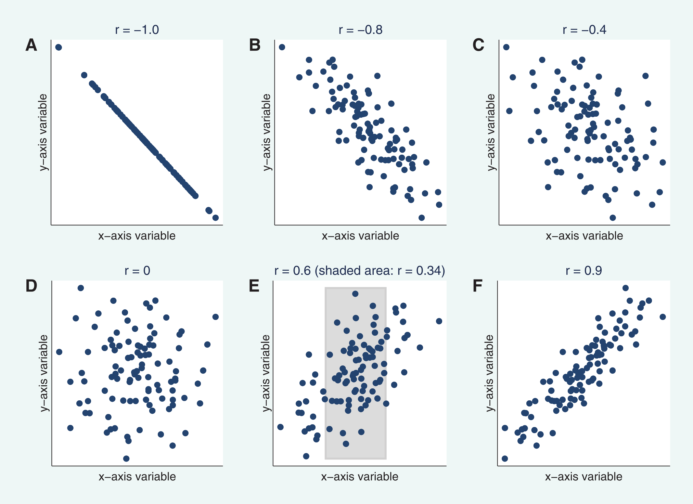{width="100%"}

<br>

Pearson's $r$ is strictly a measure of the **linear** correlation between two variables, and will therefore misrepresent the degree of correlation if there is a **non-linear** relationship[^04-correlation-3], as illustrated in the figure below, also from @schober2018.

[^04-correlation-3]: For non-linear relationships, [Spearman's rank correlation coefficient](https://en.wikipedia.org/wiki/Spearman%27s_rank_correlation_coefficient) is a better choice.

<center>

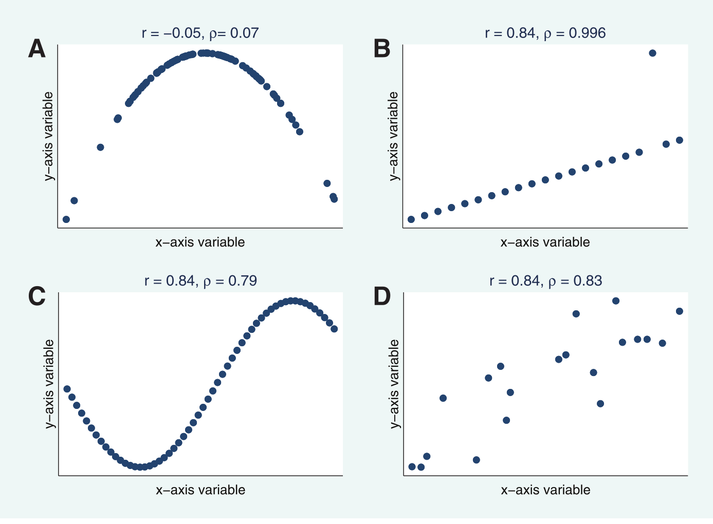{width="80%"}

</center>

There are multiple ways to define Pearson's $r$, for example depending on whether we are assessing the correlation for an entire *population* of data i.e., the entire group you are looking to analyse[^04-correlation-4], or assessing the correlation for a *sample* i.e., a subset of the population.

[^04-correlation-4]: For example, analysis of **all** adults in the UK or **all** scores on a particular test.

A common formulation for $r$ is as follows:

$$r= \frac{\sum_{i=1}^{n}(x_{i}-\bar{x})(y_{i}-\bar{y})}{\sqrt{\sum_{i=1}^{n}(x_{i}-\bar{x})^2}\sqrt{\sum_{i=1}^{n}(y_{i}-\bar{y})^2}}$$ 

where $x_i$ and $y_i$ are the paired observations for the two variables you are studying, $\bar{x}$ and $\bar{y}$ are the mean values for $x$ and $y$, and $n$ is the number of observations.

We can summarise this even more simply as follows:

$$r=\frac{\text{Cov}(XY)}{\sigma_{X}\sigma_{Y}}$$

The numerator is the **covariance**, a measure of the joint variability between the variables $X$ and $Y$, while the denominator is the product of the **standard deviations** of the two variables. The standard deviations $\sigma_{X}$ and $\sigma_{Y}$ measure the dispersion of the observations around their respective means. As the covariance value is influenced by the measurement units, dividing by the product of the standard deviations normalises the output to between $-1$ and $+1$.

Let's use an example to illustrate, using data from @russell1975[^04-correlation-5], with paired observations of nicotine yield (mg) $x$ and carbon monoxide yield (mg) $y$ for 12 brands of cigarette.

[^04-correlation-5]: As used in the BMJ guide to [correlation and regression](https://www.bmj.com/about-bmj/resources-readers/publications/statistics-square-one/11-correlation-and-regression).

$$\begin{array}{cc}
\text{Nicotine yield (mg)} & \text{Carbon monoxide yield (mg)}\\
\hline
0.1 & 4.8\\
0.2 & 6.3\\
0.2 & 6.3\\
0.7 & 10.4\\
0.8 & 12.3\\
1.1 & 14.6\\
1.1 & 14.6\\
1.2 & 15.4\\
1.0 & 17.2\\
1.6 & 12.9\\
1.2 & 19.3\\
1.4 & 20.5\\
3.4 & 16.8\\
2.0 & 20.2
\end{array}$$

Here is a plot of the paired observations, adapted from @russell1975:

<center>

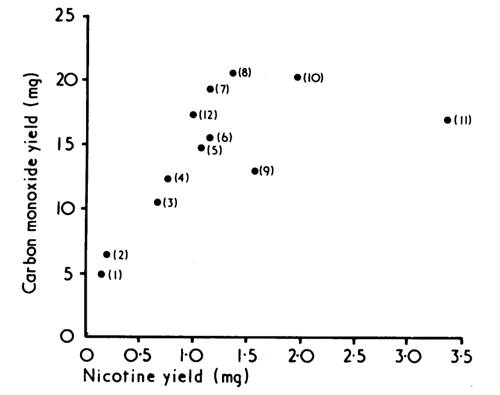{width="50%"}

</center>

Plugging these paired observations into our full equation above, the numerator calculates the differences between each value and their respective means $\bar{x}\approx1.14$ and $\bar{y}\approx13.69$. The summed product of these paired differences is $\approx38.97$.

For the denominator, we use the *squared* differences between each value and the mean i.e., $(x_{i}-\bar{x})^2$ and $(y_{i}-\bar{y})^2$. The demoninator is calculated as the product of the square root of the summed squared differences for $x$ and $y$, which in this case equals $\approx56.97$. Therefore:

$$r= \frac{\sum_{i=1}^{n}(x_{i}-\bar{x})(y_{i}-\bar{y})}{\sqrt{\sum_{i=1}^{n}(x_{i}-\bar{x})^2}\sqrt{\sum_{i=1}^{n}(y_{i}-\bar{y})^2}}\approx\frac{38.97}{56.97}\approx0.68$$

::: question
What is your interpretation of the correlation coefficient?
:::

<details>

<summary>Answer</summary>

$r=0.68$ is indicative of **positive** correlation between nicotine yield $x$ and carbon monoxide yield $y$.

</details>

<br>

Here is the data, if you want to do the calculations yourself[^04-correlation-6], for example in Excel:

[^04-correlation-6]: I've rounded the numerator and denominator and the resulting $r$ value to simplify presentation, so if you do decide to do the calculations yourself, the values may differ very slightly. Values generated using [PlotDigitizer](https://plotdigitizer.com/).

```{python, eval=FALSE}
# Data from Russell et al. (1975)
nicotine = [0.1, 0.2, 0.2, 0.7, 0.8, 1.1, 1.1, 1.2, 1, 1.6, 1.2, 1.4, 3.4, 2]
carbon_monoxide = [4.8, 6.3, 6.3, 10.4, 12.3, 14.6, 14.6, 15.4, 17.2, 12.9, 19.3, 20.5, 16.8, 20.2]
```

We now know how to calculate Pearson's $r$ and could begin to measure the association between election results (the topic of the previous practical) and other variables of interest, such as the average income, education levels, or ethnic diversity of the US counties, as described in the [data section](#correlaton_data).

*However*, there is a **problem**. Pearson's $r$ and other similar correlation metrics, such as Spearman's rank correlation coefficient $ρ$, are **aspatial** measures i.e., they do not take the spatial distribution of the data sets into account. We know from our exploration of spatial autocorrelation that we can often reject the hypothesis of *spatial randomness*, indicating the presence of clustering or dispersion of the data values.

In turn, there is a need for a measure of **bivariate spatial association**[^04-correlation-7], which not only takes into account the numeric similarity of paired observations, but also incorporates the spatial structure of the data and the topological relationships between observations.

[^04-correlation-7]: The term **association** is a general term referring to any form of dependency between variables. **Correlation** is a specific form of association, focusing on the degree of *linearity*.

The following figure from @lee2001 (the key academic work for this week) is an excellent illustration of why this is so important.

<center>

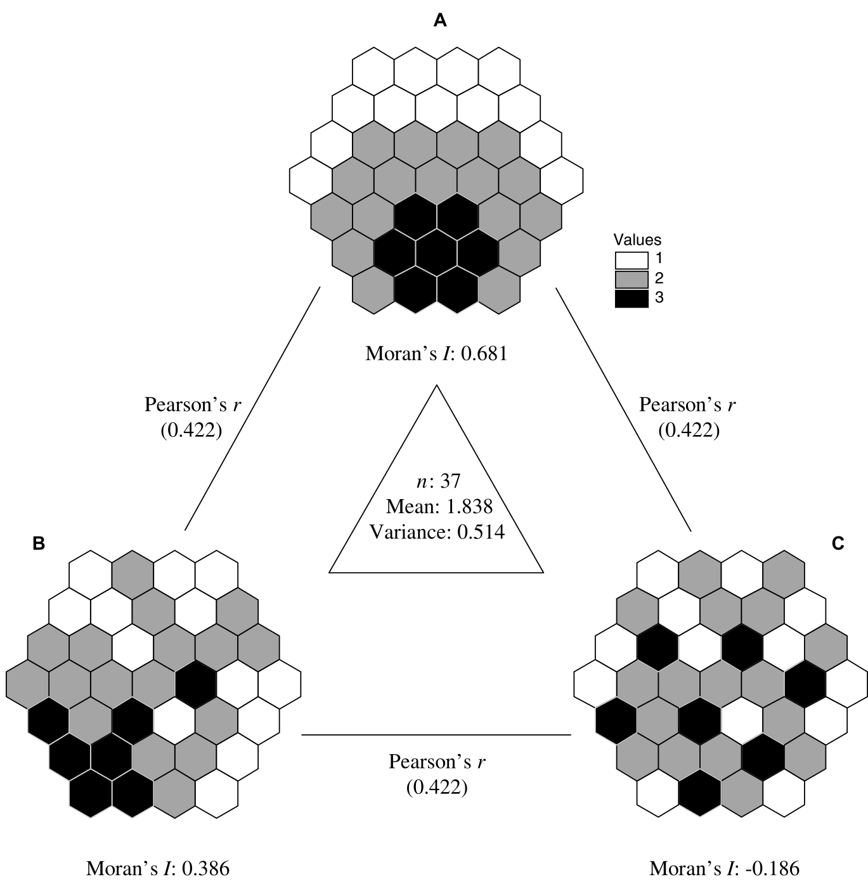{width="70%"}

*Three spatial realisations of a hypothetical numeric vector*

</center>

The figure shows three different spatial distributions $A,B,C$, where the colour of each cell denotes the value $1,2,3$. As these dataset have the same number of observations $n=37$ and the same *distribution* of values (i.e., $7\times\text{black},17\times\text{grey},13\times\text{white}$), the mean and variance are also identical.

::: question
Based on the visual patterns and Moran's $I$, how would you describe the pattern of spatial autocorrelation for each dataset?
:::

The Pearson's correlation coefficient for each dataset pair ($A-B$, $B-C$, $A-C$) is also identical, with $r=0.422$ i.e., a moderate positive correlation. This occurs because Pearson's $r$ is calculated using deviations from the mean e.g., $(x_{i}-\bar{x})^2$, and for estimating the covariance, the product of those deviations for each **pair of observations** i.e., $(x_{i}-\bar{x})(y_{i}-\bar{y})$. It does take spatial structure into account.

To illustrate why that matters, below are the distributions $B$ and $C$ from @lee2001, where I've labelled some of the cells $b_1,b_2,\cdots,b_n$ and $c_1,c_2,\cdots,c_n$. For calculating Pearson's $r$, the calculations use the paired observations i.e., $b_n + c_n$.

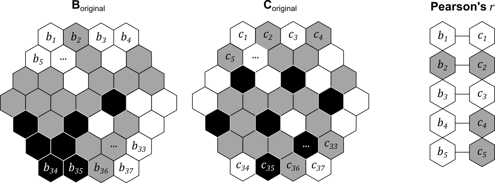{width="100%"}

<br>

**However**, we can easily shuffle the objects to generate a new distribution, while retaining the paired structure, as shown below i.e., $b_1$ is still paired with $c_1$, and so on.

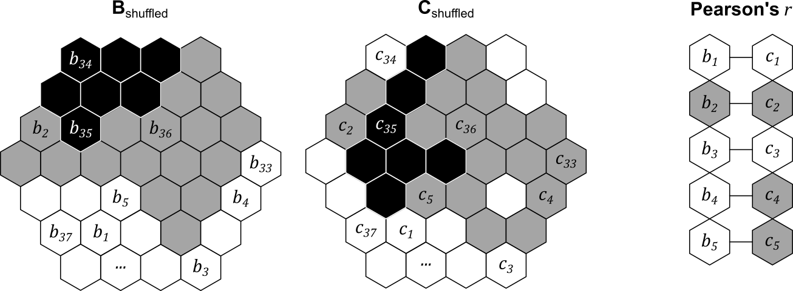{width="100%"}

<br>

The overall correlation coefficient $r$ would be unchanged, because the dataset mean, variance and paired structure would be unchanged. However, each dataset now has a very different degree of spatial autocorrelation, and in turn, a very different level of **spatial co-patterning**. In total, we could generate $n$ ([factorial](https://en.wikipedia.org/wiki/Factorial)) different pairs of spatial patterns ($!n$) given the number of observations $n$. For example, with three paired observations, there are $!3=3\times2\times1=6$ possible configurations:

<center>

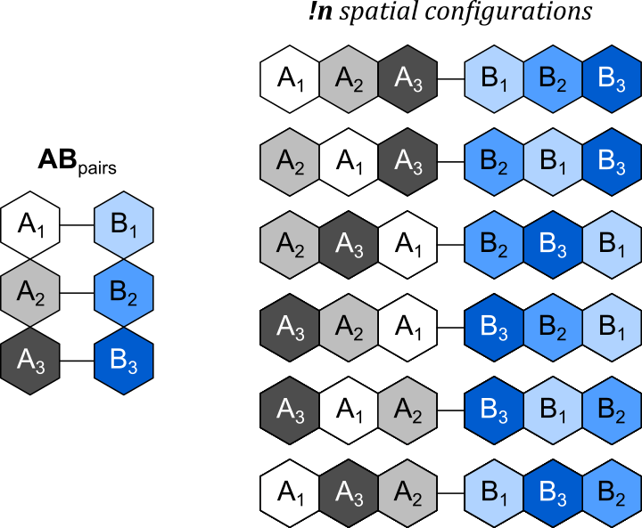{width="50%"}

*Possible spatial configurations for* $n=3$

</center>

This is the key message of the original figure from @lee2001. While the global correlation $r$ is identical for each dataset pair ($A-B$, $B-C$, $A-C$), $A-B$ appears (qualitatively) to show a higher level of spatial co-patterning, with higher values of $A$ and $B$ found in similar locations on the map. By comparison, $B-C$ and $A-C$ do not seem to show clear spatial co-patterning. This possible difference between the datasets is masked by Pearson's $r$.

In this practical, we are going to introduce a measure of **bivariate spatial association** developed by @lee2001, which "*captures the relationship between two variables, taking the topological relationship among observations into account*".

### Pre-processing

To begin:

> Open ArcGIS, initialise a new project in the `practical-4` directory, establish a connection to `data` and then load the **contiguous** US county data `us_county_500k_contig_cf` (projected CRS, n=3109) that we produced in Practical 3.

As we previously used a *dynamic* table join to link the geometries to the 2024 election results, the fields of interest (e.g.,`gop_perc`, `dem_perc`) are no longer present in the Attribute Table.

> Load `2024_US_County_Level_Presidential_Results.csv` but this time use a **static** table join to link the election results to our county geometries, joining using the `NAMELSAD` and `county_name` fields, and selecting the `gop_perc` and `dem_perc` "Transfer Fields".

As discussed above, we want to explore whether the observed patterns in the variable of interest are **associated** or **correlated** with other variables. To investigate this:

> Load the tables containing the poverty, education, and demographic indicators [`poverty_2023.csv`, `education_2023.csv`, `demographics_2024.csv`].

While some of these datasets contain "county name" fields, not all do. Instead, we'll join the fields of interest to the county geometries using the Federal Information Processing Series ([FIPS](https://www.census.gov/library/reference/code-lists/ansi.html)) code, which is present in all the datasets e.g., the `FIPS_code` attribute.

As discussed in Practical 3, these are currently in different data formats, which you can inspect via the Attribute Table → right click Fields → Data Type. In `us_county_500k_contig_cf`, `GEOID` = `Text`, but in the `education_2023` table (for example), `FIPS_Code` = `Long` i.e., numeric. As these different data formats would preclude any matches i.e., $01003_{text}\neq01003_{numeric}$, we'll need to do some data processing to ensure the formats are consistent. This could be achieved by converting the text `GEOID` to numeric, or the numeric `FIPS_Code` to text. To minimise the number of format conversions, we'll do the former.

> Open the Attribute Table for `us_county_500k_contig_cf` and use Calculate Field to specify a new field `GEOID_int`, "Field Type" = `Long`, using the following expression: `int(!GEOID!)`.

With our FIPS code in the correct data format:

> Use [Join Field](https://doc.esri.com/en/arcgis-pro/latest/tool-reference/data-management/join-field.html?tabs=dialog) to produce static table joins between `us_county_500k_contig_cf` and the eduction, poverty and demographic tables, joining based on `GEOID_int` and `FIPS_code`.
>
> To simplify our analysis, we are only going to transfer some key fields, including:
>
> -   `MEDHHINC_2023` (poverty): Median household income (\$)
> -   `PCTPOVALL_2023` (poverty): Percentage of the total population in poverty
> -   `WA_perc` (demographics): Percentage of the total population classed as "white"
> -   `Less_High_School_Graduate_perc` (education): Percentage of adults who are *not* high school graduates
> -   `High_School_Graduate_perc` (education): Percentage of adults who are high school graduates (or equivalent)
> -   `College_or_associate_perc` (education): Percentage of adults completing some college or associate degree
> -   `Bachelor_or_higher_perc` (education): Percentage of adults with a bachelor's degree or higher

When complete, all the fields should be present in the Attribute Table:

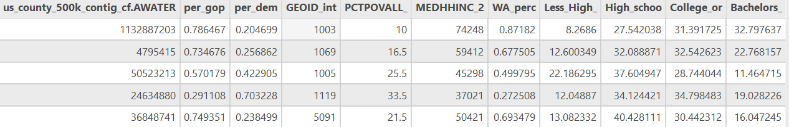{width="100%"}

::: note
As we are using the shapefile (`.shp`) format, field names can be a maximum of 10 characters. This explains why our field names have been truncated i.e., `Less_High_School_Graduate_perc` → `Less_High_`. For this set of field names, we can still identify which field is which, so for simplicity we will continue with this data format. A more rigorous approach would to be save as a layer in our project **geodatabase** or use a more modern spatial data format.
:::

To finish the pre-processing:

> Remove all the standalone tables from ArcGIS. These are no longer necessary, given our use of *static* table joins via [Join Field](https://doc.esri.com/en/arcgis-pro/latest/tool-reference/data-management/join-field.html?tabs=dialog).

### Exploratory analysis

Before we define and evaluate our measure of bivariate spatial association [@lee2001], we should always undertake some initial exploratory analysis.

> Modify the layer symbology and inspect the Attribute Table to investigate the eduction, poverty and demographic variables.

::: question
What is the average poverty percentage for the US counties?
:::

::: question
What is the minimum and maximum county-level median income?
:::

::: question
How would you describe the distribution of the demographic variables i.e., `WA_perc`?
:::

> Use Create Chart → Scatter Plot to investigate the relationships between `gop_perc` and the other county-level variables.

::: question
Are there any interesting relationships?[^04-correlation-8] Does the sign of the relationship ($-|+$) match your expectations?
:::

[^04-correlation-8]: Note that the Scatter Plots report $R^2$ i.e., the proportion of the variation in the dependent variable (`gop_per`) that is predictable from the independent variable. This is different from $r$, which is focused on the degree of correlation only. In addition, both $R^2$ and $r$ are global statistics - we have not yet incorporated the spatial structure of the data.

<center>

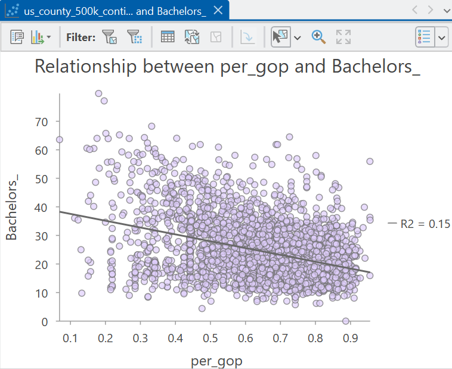{width="50%"}

*Relationship between the Republican vote share and the percentage of adults with a bachelor's degree or higher*

</center>

Finally, it is worth exploring the **spatial patterns** in our data, for example:

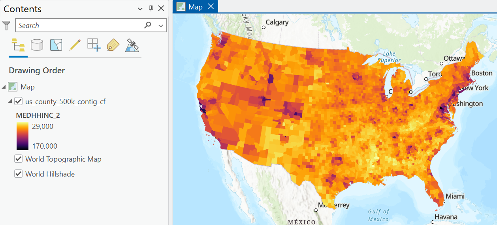{width="100%"}

<br>

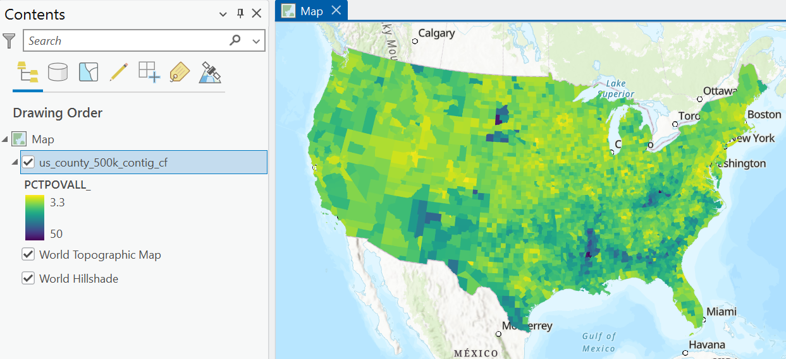{width="100%"}

<br>

> Create your own visualisations for the eduction, poverty and demographic variables.

::: question
Can you identify any interesting spatial patterns or clustering? What might explain these?
:::

This qualitative approach is useful, but as we discussed in the [previous practical](#election_results), our ability to identify **meaningful** spatial patterns is not perfect, with potential for Type I and Type II errors. Instead, we should use a statistical approach to assess for spatial autocorrelation.

We already know that there is global positive spatial autocorrelation of the Republican vote share, as revealed using Moran's $I$ [@moran1948]. We also have information on the distribution of clusters (HH, LL) and outliers (LH, HL), as identified using local Moran's $I_i$ [@anselin1995]. We also compared these results to those produced by Getis and Ord's $G$, $G_{i}$ and $G_{i}^{*}$ [@getis1992].

> Using tools of your choice, investigate **global** and **local** spatial autcorrelation for the eduction, poverty and demographic variables. I would recommend focusing on the median household income, the percentage of the total population classed as "white", and the percentage of adults with a bachelor's degree or higher.

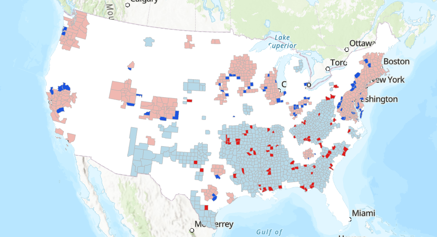{width="100%"}

<br>

::: question
What is your interpretation of spatial autocorrelation for these datasets? Is there evidence of clustering, randomness, or divergence?
:::

::: question
Which **spatial weights** method did you choose and why?
:::

As you will have discovered, we can reject the hypothesis of **spatial randomness** for many of the variables of interest. As a result, while we *can* use Pearson's $r$ to assess the strength and direction of the correlation between our variables[^04-correlation-9], this measure is not taking into account the autocorrelation that is present, as we discussed in the [introduction](#justify_spatial_corr). As a result, we should be critical:

[^04-correlation-9]: Although there is no dedicated tool in ArcGIS to achieve this.

::: question
Is Pearson's $r$ capturing the "true" correlation between our spatial variables?
:::

### Understanding bivariate spatial association

Based on this reasoning, we need to use a more appropriate measure, which incorporates the following distinct forms of association, as discussed by @hubert1985 and @lee2001:

-   **point-to-point association** i.e., the numerical relationship between two variables measured at the same location (as measured using Pearson's $r$).
-   **spatial association** i.e., the spatial clustering of the data (for example, as measured using Moran's $I$)

This measure would enable us to investigate:

::: question
Are the two variables numerically related **and/or** do they exhibit similar geographic patterns?
:::

#### Lee's $L$ 

One solution to this is Lee's $L$ [@lee2001], which is defined as:

$$L_{XY}=\frac{n}{\sum_i(\sum_{j}w_{ij})^2}\frac{\sum_{i}[(\sum_{j}w_{ij}(x_{j}-\bar{x}))(\sum_{j}w_{ij}(y_{j}-\bar{y}))]}{\sqrt{\sum_{i}(x_{i}-\bar{x})^2}\sqrt{\sum_{i}(y_{i}-\bar{y})^2}}$$
This **looks** quite complicated (and it took me a while to untangle the mathematics!), but there are lots of components here that you should be familiar with[^notation].

[^notation]: If you read @lee2001, you'll notice the notation in Equation 12 is slightly different to that provided above. I've made some small changes (not affecting the calculations) for consistency with other equations we've used previously. For example, $w_{ij}$ relates to the values in the spatial weights matrix, introduced [here](#spatial_lag), which is defined by @lee2001 as $v_{ij}$. 

For example, the **spatial lag** is present $\sum_{j}w_{ij}(x_{j}-\bar{x})$, which we introduced in the [previous practical](#spatial_lag) and which forms a key component of Moran's $I$. Remember this is the *weighted value of a variable for each locations neighbourhood* and here is calculated using the deviation from the mean value i.e., $x_{j}-\bar{x}$. 

The spatial lag is present in the **numerator** on the right hand side: 

$$\sum_{i}[(\sum_{j}w_{ij}(x_{j}-\bar{x}))(\sum_{j}w_{ij}(y_{j}-\bar{y}))]$$

which can be summarised as follows. For each location $i$:

- compute the **spatial lag** for the mean-centered variable $x$ i.e., the weighted neighbourhood value.
- compute the **spatial lag** for the mean-centered variable $y$. 
- multiply the spatial lags together.

The numerator is therefore the sum of this product for all $i$ locations. 

It may be helpful to understand this visually, so:

> Inspect the schematic below, which illustrates the process for a single focal feature (Sante Fe County, New Mexico, GEOID: 35049). 

{#local_l_schematic width="100%"}

<br>

The process is very similar to that introduced in the [previous practical](#lag_schematic). A minor difference is that here we are using standardised (mean-centered) values. The more striking difference is that the process involves **two** variables, rather than one, in this case the Republican vote share (`gop_perc`) and the percentage of the total population in poverty (`PCTPOVALL_2023`). Standardised values for each variable are multiplied by the corresponding spatial weights (in this case, row-standardisation has been used, so $w=1/7$[^lee_focal]), and then summed to produce the **spatial lags**. The value for the focal feature is the product of these spatial lags, which here is $-0.52$. This process would be repeated for all features in the dataset, and the final numerator value is the sum of those values $\sum_{i}$. 

[^lee_focal]: In the schematic above, I've used a traditional neighbourhood definition, which would typically exclude the focal feature. Having tested the ArcGIS implementation of $L$, and carefully read the [documentation](https://doc.esri.com/en/arcgis-pro/latest/tool-reference/spatial-statistics/how-bivariate-spatial-association-works.html#DD4), the implementation **does** include the focal feature: "*All features will have a weight equal to one for the weight of the feature to itself, even if the spatial weights file does not have these weights assigned.*". 

We can interpret the values for the focal feature as follows:

- the spatial lag for the Republican vote share $x$ is **negative** at $-0.25$ i.e., the neighbours of $i$ have a weighted Republication vote share that is *below* the global average. 
- the spatial lag for the poverty percentage $y$ is **positive** at $2.09$ i.e., the neighbours of $i$ have a weighted poverty percentage that is *above* the global average. 

When combined:

- the product of the spatial lags is **negative**[^product_pos_neg], which is indicative of a negative local spatial association between $x$ and $y$ i.e., the neighbourhood is characterised by a relatively low Republican vote share but a relatively high poverty percentage, with respect to the global mean values.
- the focal feature would therefore contribute negatively to the overall test statistic $L$. 

[^product_pos_neg]: As covered last week, when both values are positive or both values are negative, the cross-product is positive i.e., Positive $\times$ Positive = Positive, and Negative $\times$ Negative = Positive. By comparison, if the signs of the values differ, the cross-product is negative i.e., Positive $\times$ Negative = Negative.

If you'd like to run through the calculations yourself to help your understanding, here are the data: 

```{python, eval=FALSE}
# Neighbourhood values (Queen's contiguity) for Sante Fe County, New Mexico, GEOID: 35049
gop_perc = [0.39, 0.33, 0.46, 0.38, 0.67, 0.24, 0.41]
poverty_perc = [18.5, 3.8, 11.7, 13.5, 23, 24.7, 20.9]

# Global means
gop_mean = 0.66
poverty_perc_mean = 14.5
```

The **denominator** for the right hand side of Lee's $L$ is as follows: 

$$\sqrt{\sum_{i}(x_{i}-\bar{x})^2}\sqrt{\sum_{i}(y_{i}-\bar{y})^2}$$

This should be very familiar, as it is identical to the denominator for Pearson's $r$, albeit with slightly different notation. This is capturing the **standard deviations** of the two variables, measuring the dispersion of the observations around their respective means. This approach standardises the numerator (which measures the similarity of the spatial lag patterns of $x$ and $y$ for all locations) by the overall variability of the two variables (see [here](#normalisation_figure) for a refresher). 

The following schematic outlines how that would be applied to the Sante Fe example, where local $L$ is divided by the product of the standard deviations ($0.92$):

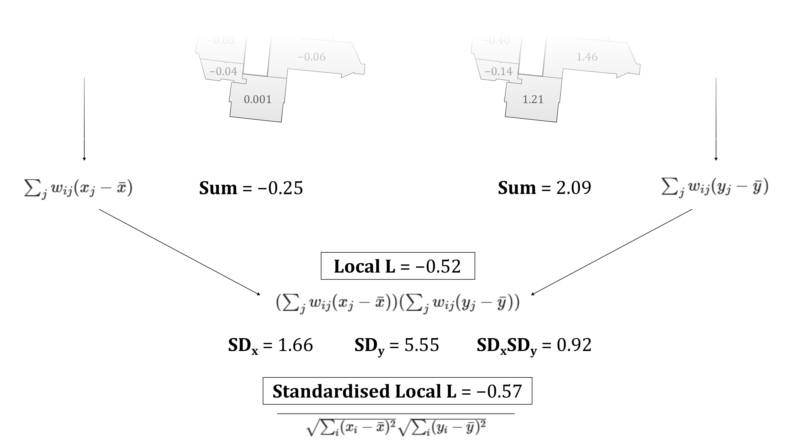{width="100%"}

<br>

As with Moran's $I$, the left hand side of the equation accounts for the number of observations and their spatial weights:

$$\frac{n}{\sum_i(\sum_{j}w_{ij})^2}$$

::: question
How is this different to the approach used for Moran's $I$? 
:::

<details>

<summary>Answer</summary>

If you compared the two equations carefully, you will have noticed that the denominator for Moran's $I$ is $\sum_{i}\sum_{j}w_{ij}$, whereas for Lee's $L$ it is $\sum_i(\sum_{j}w_{ij})^2$. This difference arises because Lee's $L$ is based on the **product of two spatial lags**, whereas Moran's $I$ is based on the cross-product between an observation and the spatial lag of the same variable. 

The aim here is to remove the effect of different neighbourhood sizes and weight magntiudes. In Moran's $I$ this is achieved by scaling based on the total sum of weights in the spatial weights matrix. This is appropriate because the numerator involves a single spatial lag, which represents a single application of the spatial weights matrix. For Lee's $L$, **two** spatial lags are calculated, one for $x$ and $y$, representing two applications of the spatial weights matrix. As these two spatial lags are then multiplied, normalisation accounts for the squared influence of the row sums of the spatial weights.

For example, take the following binary spatial weights matrix, with the row sums (# neighbours) included:

$$W=\begin{bmatrix}0 & 1 & 1 & 1 \\ 1 & 0 & 1 & 0 \\ 1 & 1 & 0 & 0 \\ 1 & 0 & 0 & 0\end{bmatrix} \rightarrow \begin{matrix}3 \\ 2 \\ 2 \\ 1 \end{matrix} $$

For Moran's $I$, normalisation is based on the sum of all the non-zero weights in the spatial weights matrix ($\sum_{i}\sum_{j}w_{ij}$) i.e., $1 + 1 + 1 +\cdots + 1=8$. 

For Lee's $L$, normalisation is based on the sum of the squared row sums in the spatial weights matrix $(\sum_{j}w_{ij})^2$ i.e., $3^{2}+2^{2}+2^{2}+1^{2}=18$.

In Moran's $I$, the first feature has three neighbours, which would contribute $3$ to the total sum of weights. In Lee's $L$, the same neighbours contribute to the spatial lags for both $x$ and $y$. When these spatial lags are multiplied, the contribution of the neighbourhood is also multiplied, so the corresponding weight is proportional to $3^{2}=9$. 

As a final point, this normalisation is **not** required when row-standardisation is used. 

</details>

<br>

::: note
If there's anything you didn't understand, now is the time to ask! 
:::

#### Interpreting Lee's $L$

To understand the typical outputs of Lee's $L$:

> Inspect the following illustrative examples, reproduced from @lee2001. These are the same spatial distributions $A, B, C$ used in the [introduction](#justify_spatial_corr).

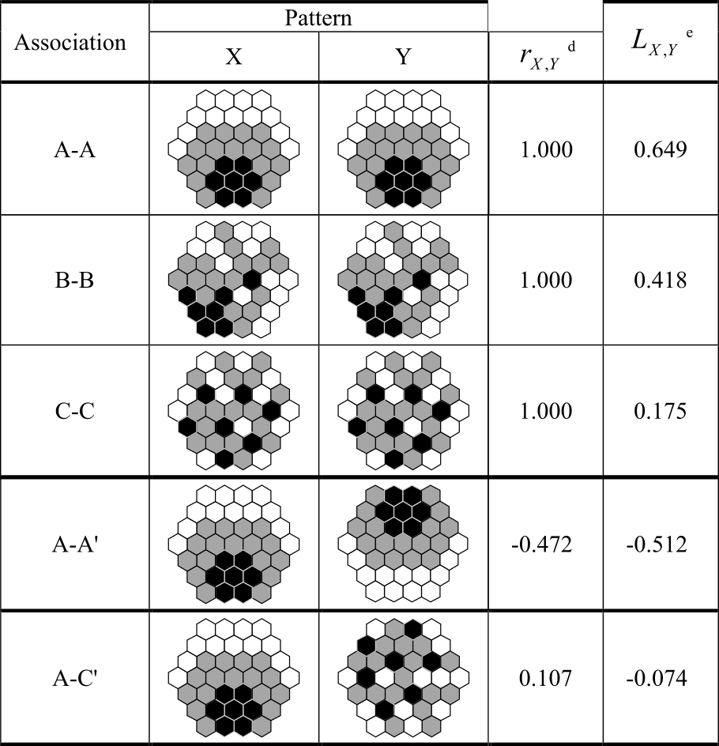{width="100%"}

<br>

Our first example is a self-comparison of $A$ vs. $A$. Unsurprisingly, Pearson's $r=1$, indicating a perfect positive linear correlation. However, Lee's $L$ is only 0.649.

::: question
Can you think why this might be?
:::

<details>

<summary>Answer</summary>

Intuitively, we might expect Lee's $L$ to also equal 1. Fundamentally, we are comparing the same dataset against itself... surely this should produce perfect co-patterning? 

The answer is **no**. This is because Lee's $L$ is not comparing the values of $A$ vs. the (identical) values of $A$, as with Pearson's $r$. It is comparing the spatially lagged values of $A$ (numerator) with the overall variation in the original values of $A$ (denominator). As we discussed in the previous practical, the former is a *smoothed* version of the original values, whereby the spatial lag is a weighted average of its neighbours. 

In turn, Lee's $L$ allows us to evaluate:

::: question
How closely do the spatial patterns of the two variables correspond after accounting for their neighbourhood structures?
:::

</details>

> Investigate the $B-B$ and $C-C$ comparisons.

Here you'll notice that for $B-B$ and $C-C$, Pearson's $r$ is also $1$, because the attribute values are identical. However, Lee's $L$ is lower, at $0.418$ and $0.175$. These examples are an excellent illustration of what Lee's $L$ is trying to detect, which is the magnitude of neighbourhood-level variation compared to the magnitude of the original variation.

For the $A-A$ comparison, there is evidence of relatively strong co-pattering ($L=0.649$). Progressively lower neighbourhood similarity for $B-B$ and $C-C$ is reflected in lower $L$ values, particularly for $C-C$, where **negative** spatial autocorrelation is observed (Moran's $I=-0.186$). As the standard deviation of the datasets is identical (the denominator in Lee's $L$), any variability in $L$ must therefore reflect their different spatial structures. 

These self-comparisons are useful to understand $L$, but the comparisons of $A-A'$ (flipped) and $A-C$ are more typical of actual data. 

::: question
What is your interpretation of $A-A'$ and $A-C$. 
:::

<details>

<summary>Answer</summary>

For $A-A'$, this is indicative of moderate to strong negative spatial association between the variables ($L=0.512$) i.e., locations where $A$ has relatively high neighbourhood values tend to correspond to locations where $A'$ has relatively low neighbourhood values, and vice versa. 

For $A-C$, there is both weak attribute similarity ($r=0.107$) and very weak spatial co-pattering ($L=-0.074$). 

</details>

<br>


#### Local Lee's $L$

Lee's $L$, like Moran's $I$, is a **global** statistic, providing information on the degree of point-to-point association and spatial association for a dataset *as a whole*. 

However, we often want to go further:

::: question
Which *parts* of the map show spatial co-patterning?
:::

Luckily we don't need to do any further calculations, because the global value for $L$ is calculated based on feature-specific $L$ values. We've already covered how those are calculated in some detail, including in the [schematic](#local_l_schematic) above. These $L$ values indicate whether the focal feature is characterised by positive, negative or negligible local spatial association. 

The **statistical significance** of the global and local $L$ values can be determined by permutation tests, as with Moran's $I$ and $I_{i}$. For the latter, this allows us to distinguish statistically significant categories (High-High, Low-Low, High-Low, Low-High), much like with local Moran's $I_{i}$. 

### Running bivariate spatial association

That's enough theory. Let's play with some data.

> Open the Geoprocessing tool [Bivariate Spatial Association (Lee's L)](https://doc.esri.com/en/arcgis-pro/latest/tool-reference/spatial-statistics/bivariate-spatial-association.html?tabs=dialog), using `us_county_500k_contig_cf` as the "Input Features", with `per_gop` and `PCTPOVALL_2023` as the analysis fields[^variable_order] and use Queen's contiguity. Save the output features to the project directory with a suitable name e.g., `L_gop_pov_qc`

[^variable_order]: Unlike regression, the order of the variables is not important here i.e., correlation $\text{correlation}\:A-B=\text{correlation}\:B-A$.

The tool has produced a striking map of local $L$, but before we explore it, we need to investigate the global results, which are shown here:

<center>

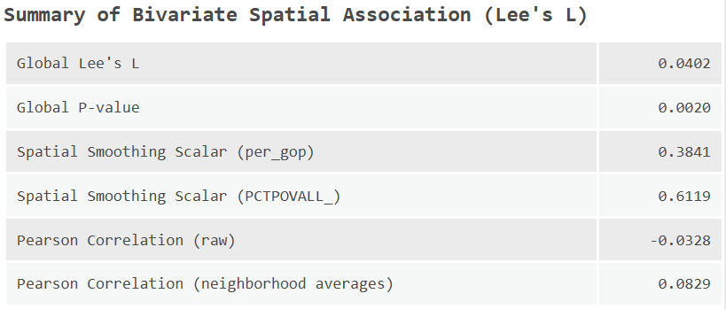{width="60%"}

</center>

::: question
What is your interpretation of the global level results, including $L$ and it's associated $p$ value, and Pearson's $r$ (`Pearson Correlation - raw`).
:::

The ArcGIS implementation also returns the **spatial smoothing scalar** for both variables. We haven't defined this yet, as it doesn't feature directly in the main $L$ equation, but you'll notice it's very similar:

$$SSS_X=\frac{n}{\sum_{i}(\sum_{j} w_{ij})^2}\frac{\sum_{i}(\sum_{j}w_{ij}(x_{j}-\bar{x}))^2}{\sum_{i}(x_{i}-\bar{x})^2}$$

Broadly this is measuring the degree of variation in a single spatially smoothed variable, with values closer to $1$ indicating strong positive spatial autocorrelation, and values closer to $0$ indicating strong negative spatial autocorrelation. 

In our case, while the global $p$ value is "significant" $p<0.05$, the magnitude of both $L$ and $r$ is very small. As a result, the statistical significance of the result is unlikely to meaningful. Instead, it likely reflects the fact that both variables show autocorrelation, but with little cross correlation between them. 

While we should be cautious about the local statistics in light of this, the Attribute Table still contains some useful information, such as local $L$ and the neighbourhood averages for each variable[^not_spatial_lag].

[^not_spatial_lag]: Note these are not exactly the same as the **normalised** spatial lags we calculated above i.e., $\sum_{j}w_{ij}(y_{j}-\bar{y})$. They appear to be $\sum_{j}w_{ij}y_{j}$. 

::: question
What is local $L$ for our test county (Sante Fe County, GEOID: 35049)? Why does this differ from the [calculations](#local_l_schematic) above? 
:::

<details>

<summary>Answer</summary>

This is because the ArcGIS implementation includes the focal feature in the calculations. 

</details>

<br>

Given the unclear global pattern, let's investigate some other bivariate associations.

> Re-run [Bivariate Spatial Association (Lee's L)](https://doc.esri.com/en/arcgis-pro/latest/tool-reference/spatial-statistics/bivariate-spatial-association.html?tabs=dialog), comparing against the percentage of the population with a bachelor's degree of higher (`Bachelors_or_higher_perc`). Use the same spatial weights approach for consistency. 

::: question
Is education level associated with the Republican vote share? Does this match your expectations?
:::

::: question
Do $r$ and $L$ differ and what does this suggest?
:::

::: question
Where are the clusters of **positive** spatial association (high-high, low-low)? What might explain these?
:::

::: question
Where are the clusters of **negative** spatial association (high-low, low-high)?
:::

[Bivariate Spatial Association (Lee's L)](https://doc.esri.com/en/arcgis-pro/latest/tool-reference/spatial-statistics/bivariate-spatial-association.html?tabs=dialog) also produces a Lee's $L$ scatter plot, which shows the neighbourhood weighted averages (spatial lags) for each feature for both variables, as well as those features classed as statistically significant:

<center>

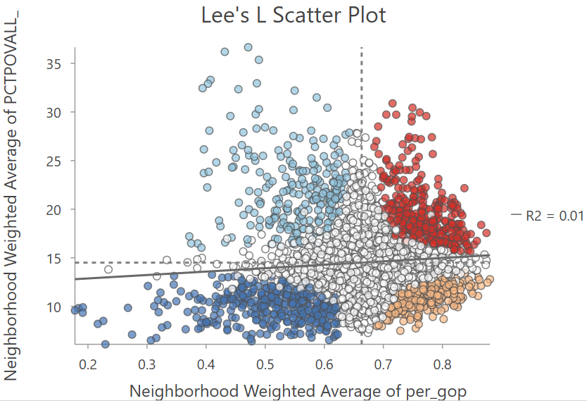{width="60%"}

</center>

In my view, a more accurate visualisation would be based on the normalised spatial lags i.e., $\sum_{j}w_{ij}(x_{j}-\bar{x})$, given this is the basis for Lee's $L$. However, unnormalised neighbourhood averages are more easily interpretable, reflecting the typical values observed in the raw data. 

> Repeat the analysis, looking at the percentage of the population classed as "white" (`WA_perc`) and the median household income (`MEDHHINC_2023`).

::: question
Which indicators show positive or negative spatial association with the Republican vote share? 
:::


::: problem
James, some values for your testing. Can you reproduce these?

<br> 

-   White % [`WA_%`]:
    -   An example of **positive** association i.e., as White % increases, GOP vote percent increases.
    -   Lee's L = -0.243755, P-value = 0.002, Pearson Correlation = -0.384821
-   Bachelor degree % [`Bachelors_or_higher_%`]:
    -   An example of **negative** association i.e., as Bachelor degree % increases, GOP vote percent decreases.
    -   Lee's L = 0.30255, P-value = 0.002, Pearson Correlation = 0.539114
-   In both cases, Lee's L \< Pearson's R
-   Median income [`MEDHHINC_2023`]:
    -   A **negative** association, but in this case Lee's L \~ Pearson's R
    -   Lee's L = -0.209754, P-value = 0.002, Pearson Correlation = -0.215725

<br>

A further observation - all of the reported P-values are **identical** (0.002). Needs evaluating.
:::

### Now that's what I call spatial correlation...

In this practical we've introduced Lee's $L$ which measures the association between two spatial variables, taking into account their spatial structure and the arrangement of values across neighbouring locations. While Pearson's $r$ (and similar aspatial metrics) measure **point-to-point association** i.e., the numerical relationship between two variables measured at the same location, Lee's $L$ evaluates whether this relationship is reflected in the spatial patterns of the two variables. 

To finish the practical:

::: question
Can you describe the key differences between Pearson's $r$ and Lee's $L$?
:::

::: question
How do we interpret the global and local results?
:::

::: question
How might the results change if an alternative spatial weighting approach was used? i.e., *distance based, $k$ neighbours.* 
:::

If you are satisfied with your understanding... **congratulations!** You have completed the practical and should now have a thorough understanding of the limitations of aspatial measures of correlation (when applied to spatial data), and alternative measures which take spatial structure into account. 

[**Finished!**](#index)


## Extra {#correlation-extra}

I've provided you with some other county-level datasets in `data/us-census`, including age-standardised [mortality](https://hdpulse.nimhd.nih.gov/data-portal/mortality/map?age=001&age_options=age_11&cod=247&cod_options=cod_15&comparison=states_to_us&comparison_options=comparison_statename_to_us&race=00&race_options=race_6&ratetype=aa&ratetype_options=ratetype_2&ruralurban=0&ruralurban_options=ruralurban_3&sex=0&sex_options=sex_3&statefips=99&statefips_options=area_states&yeargroup=5&yeargroup_options=yearmort_2), [unemployment](https://www.ers.usda.gov/data-products/county-level-data-sets/county-level-data-sets-download-data), and [internet adoption](https://www.census.gov/data/experimental-data-products/local-estimates-of-internet-adoption.html).

::: question
Can you find any interesting associations?
:::

::: question
Is there any pattern to the spatial and non-spatial measures of association?
:::

::: question
What are some limitations of our approach?
:::

<details>

<summary>Answers</summary>

There are a few obvious limitations to our approach:

- As ever, the results are sensitive to our designation of the spatial weights matrix.
- We're also using the same spatial weights matrix for both variables. There might be circumstances where we'd want to use different neighbourhood definitions, see @illanas2025.
- We're also only dealing with **bivariate** associations, rather than a combination of factors, which might ultimately be needed to **explain** spatial variability in Republican vote share. We'll explore this in [Practical 7](#spatial_regression) and [Practical 8](#gwr).

</details>

<br>

For those of you interested in exploring further, there are lots of other county-level datasets available, for example on [diabetes prevalence](https://usdss.cdc.gov/diabetes/surveillance.html), [drug overdoses](https://data.cdc.gov/National-Center-for-Health-Statistics/VSRR-Provisional-County-Level-Drug-Overdose-Death-/gb4e-yj24/about_data), or even [crop yields](https://quickstats.nass.usda.gov/#24E0CEE2-1271-3635-A1ED-7A50CF2BBCDA) but some data wrangling would be required to bring these into ArcGIS.

## Resources

-   Lee, S.I. ([2001](https://doi.org/10.1007/s101090100064)). Developing a bivariate spatial association measure: an integration of Pearson's r and Moran's I. Journal of geographical systems, 3(4), pp.369-385.
-   Lee, S.I. ([2017](https://doi.org/10.1007/978-3-319-17885-1_1524)). Correlation and Spatial Autocorrelation. In: Shekhar, S., Xiong, H., Zhou, X. (eds) Encyclopedia of GIS. Springer, Cham.
-   Illanas, S., Gómez-Rubio, V., Vicente, J. and Acevedo, P. ([2025](https://doi.org/10.1016/j.ecolind.2025.113551)). Assessment of bivariate relationships between spatial patterns: Revisiting the global and local L bivariate indices for wildlife management and conservation[MT1.1]. Ecological Indicators, 175, p.113551.
-   Wolf, L.J. ([2024](https://doi.org/10.1080/24694452.2024.2326541)). Confounded Local Inference: Extending Local Moran Statistics to Handle Confounding. Annals of the American Association of Geographers, 114(6), 1216–1231.
