# Point Patterns {#point_patterns}

## Introduction

### Aims {.unnumbered}

The aims of this practical are to:

1.  Understand the key differences between point-pattern analysis and point-process modelling.
2.  Understand common approaches used to analyse the spatial distribution of point data.
3.  Apply these approaches to an ecological dataset.

### Application {.unnumbered}

To that end, we'll analyse the patterns in a Point dataset, using research-grade species observations of *Panthera tigris* from [iNaturalist](https://www.inaturalist.org/observations?place_id=any&view=species), obtained via the Global Biodiversity Information Facility ([GBIF](https://www.gbif.org/species/search)).

### Data {.unnumbered}

The data for this practical are available in [`data/gbif`] as follows:

-   Species observations of *Panthera tigris* (N=4449, 2 June 2026) obtained via GBIF.org [[Source](https://doi.org/10.15468/dl.hjrenk)]
-   Protected areas of India (*National Parks and Wildlife Sanctuaries*), built from [OpenStreetMap](www.openstreetmap.org) data [[Source](https://geo.ejatlas.org/layers/geonode:Protected_Area_India_Final#)]

### Tools {.unnumbered}

*Point Patterns*

[Kernel Density](https://doc.esri.com/en/arcgis-pro/latest/tool-reference/spatial-analyst/kernel-density.html?tabs=dialog) (Spatial Analyst Tools), [Mean Center](https://doc.esri.com/en/arcgis-pro/latest/tool-reference/spatial-statistics/mean-center.html?tabs=dialog) (Spatial Statistics Tools), [Median Center](https://doc.esri.com/en/arcgis-pro/latest/tool-reference/spatial-statistics/median-center.html?tabs=dialog) (Spatial Statistics Tools), [Standard Distance](https://doc.esri.com/en/arcgis-pro/latest/tool-reference/spatial-statistics/standard-distance.html?tabs=dialog) (Spatial Statistics Tools), [Directional Distribution (Standard Deviational Ellipse)](https://doc.esri.com/en/arcgis-pro/latest/tool-reference/spatial-statistics/directional-distribution.html?tabs=dialog) (Spatial Statistics Tools), [Average Nearest Neighbor](https://doc.esri.com/en/arcgis-pro/latest/tool-reference/spatial-statistics/average-nearest-neighbor.html?tabs=dialog) (Spatial Statistics), [Multi-Distance Spatial Cluster Analysis (Ripley's K Function)](https://doc.esri.com/en/arcgis-pro/latest/tool-reference/spatial-statistics/multi-distance-spatial-cluster-analysis.html?tabs=dialog) (Spatial Statistics), [Find Point Clusters](https://doc.esri.com/en/arcgis-pro/latest/tool-reference/big-data-analytics/find-point-clusters.html?tabs=dialog) (GeoAnalytics Server Tools)

*Data Management*

[Spatial Join](https://doc.esri.com/en/arcgis-pro/latest/tool-reference/analysis/spatial-join.html?tabs=dialog) (Analysis Tools), [Clip](https://doc.esri.com/en/arcgis-pro/latest/tool-reference/analysis/clip.html?tabs=dialog) (Analysis Tools), [Dissolve](https://doc.esri.com/en/arcgis-pro/latest/tool-reference/data-management/dissolve.html?tabs=dialog) (Data Management Tools), [Generate Tessellation](https://doc.esri.com/en/arcgis-pro/latest/tool-reference/data-management/generatetesellation.html?tabs=dialog) (Data Management Tools), [Minimum Bounding Geometry](https://doc.esri.com/en/arcgis-pro/latest/tool-reference/data-management/minimum-bounding-geometry.html?tabs=dialog) (Data Management), [Create Random Points](https://doc.esri.com/en/arcgis-pro/latest/tool-reference/data-management/create-random-points.html?tabs=dialog) (Data Management), [XY Table To Point](https://doc.esri.com/en/arcgis-pro/latest/tool-reference/data-management/xy-table-to-point.html?tabs=dialog) (Data Management Tools), [Calculate Geometry Attributes](https://doc.esri.com/en/arcgis-pro/latest/tool-reference/data-management/calculate-geometry-attributes.html?tabs=dialog) (Data Management Tools)

------------------------------------------------------------------------

## Practical

### Value and object patterning {#point_introduction}

In our exploration of [spatial autocorrelation](#spatial_autocorrelation) and [spatial correlation](#spatial_correlation), we focused on how the **values** associated with objects can vary across discretised space.

For example, we investigated the spatial patterns in the county-level Republican vote share for the 2024 US election, using Moran's $I$ [@moran1948], local Moran's $I_i$ [@anselin1995], and Getis and Ord's $G$, $G_{i}$ and $G_{i}^{*}$ [@getis1992] to assess for spatial randomness, positive spatial autocorrelation and negative spatial autocorrelation. We also investigated the degree to which the vote share was spatially associated with other county-level datasets, using Lee's $L$, a bivariate spatial association measure [@lee2001].

One thing we *haven't* explored is the spatial patterning of the **objects themselves**, rather than the patterning of the values alone.

In our exploration of spatial autocorrelation, we asked:

::: question
Are the **values** randomly distributed or is there evidence of spatial structure? i.e., *clustering and/or divergence.*
:::

Today we will ask:

::: question
Are the **objects** randomly distributed or is there evidence of spatial structure?
:::

Within this context, **point pattern analysis** seeks to visualise and describe the spatial distribution of points, with the understanding that their locations and distribution reveals information about the **important underlying processes**.

For example, here are some [iNaturalist](https://www.inaturalist.org/observations?place_id=any&view=species) point observations of *Canis lupus* (the wolf) in the contiguous United States, obtained via [GBIF](https://www.gbif.org/species/search).

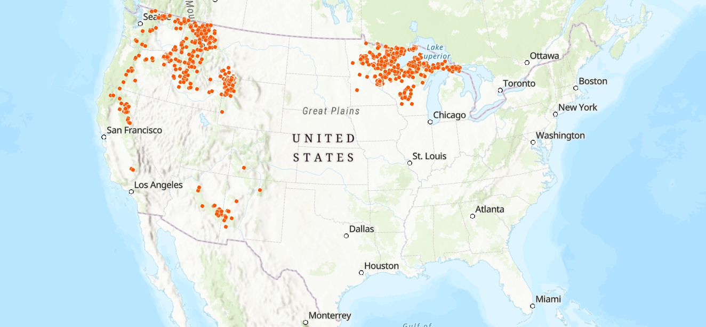{width="100%"}

*iNaturalist observations of Canis lupus, which you can also explore [here](https://www.gbif.org/occurrence/search?taxonKey=QLXL&view=map&datasetName=iNaturalist+research-grade+observations). I'd recommend ["Lone Wolf"](https://www.penguin.co.uk/books/448173/lone-wolf-by-weymouth-adam/9781529158335) by Adam Weymouth for your next read...*

At this scale, the distribution of *Canis lupus* observations appears to be spatially structured, perhaps reflecting differences in climate, habitat availability, topography, human influence, or environmental protection.

This example reveals an important distinction between **point processes**, which generate point patterns, and **point-patterns**, which are the realisations of those processes. In turn, while point pattern analysis is primarily **descriptive** (e.g., are the points clustered, dispersed or random?), this is a necessary step to **understand** the processes which give rise to those patterns.

In short:

::: note
**Points** *are a reflection of* **Process***, so by understanding patterns, we can begin to reveal processes.*
:::

In this practical, we will focus on point pattern analysis, introducing techniques to characterise the spatial distribution of points. You will be able to explore point-process modelling in more detail in the Semester 2 unit GEOG71922 *Spatial Ecology* with [Matt Dennis](https://research.manchester.ac.uk/en/persons/matthew.dennis/).

### Pre-processing

In today's practical, we are using research-grade species observations of *Panthera tigris* from [iNaturalist](https://www.inaturalist.org/observations?place_id=any&view=species), obtained via [GBIF](https://www.gbif.org/species/search).

To begin:

> Open ArcGIS, initialise a new project in the `practical-5` directory, establish a connection to `data` and load `occurrence.csv`, which is a simplified version of the iNaturalist data containing the locations of *Panthera tigris* observations (`decimalLatitude`, `decimalLongitude`), plus a few other key attributes (e.g., `year`, `gbifID`)

> You can inspect individual observations by navigating to `https://www.gbif.org/occurrence/<id>`, updating `<id>` with a value stored in the `gbifID` field.

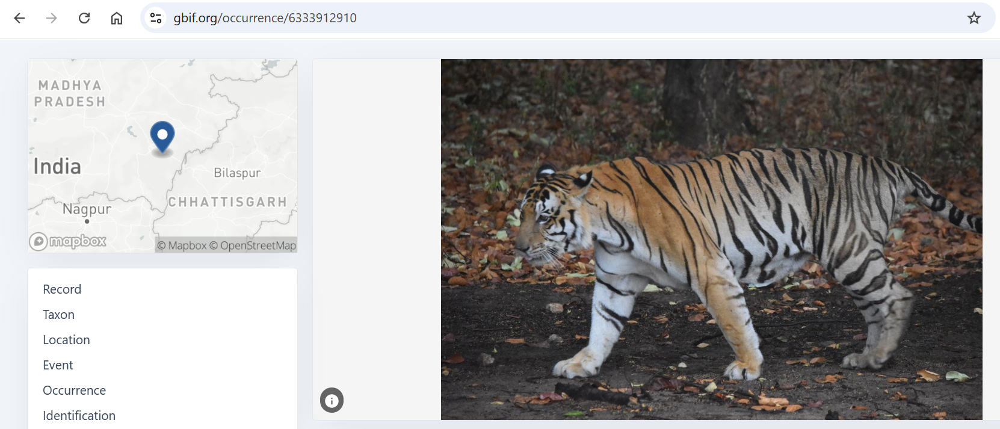{width="100%"}

> Use [XY Table To Point](https://doc.esri.com/en/arcgis-pro/latest/tool-reference/data-management/xy-table-to-point.html?tabs=dialog) to create a point feature layer based on the `decimalLatitude` and `decimalLongitude` fields, using EPSG [4326](https://epsg.io/4326) and saving in the project **geodatabase**[^05-point-patterns-1] as `tiger_points`.

[^05-point-patterns-1]: This is necessary because the `gbifID` field has a "Data Type" of `Big Integer`, which is a 64-bit data type. The shapefile format can't handle this, and if you try to save in your project directory as a shapefile, you'll encounter [`ERROR 000308`](https://doc.esri.com/en/arcgis-pro/latest/tool-reference/tool-errors-and-warnings/001001-010000/tool-errors-and-warnings-00301-00325-000308.html): *Invalid field type*. This is not an issue when saving as a feature class in the geodatabase.

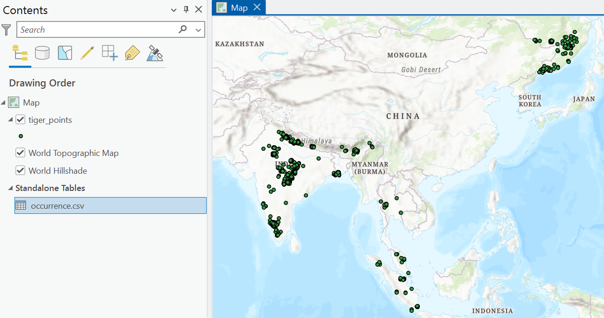{width="100%"}

Next, we are going to subset these points to our area of interest, the [Indian subcontinent](https://en.wikipedia.org/wiki/Indian_subcontinent), using the `Natural Earth` data from Practical 1.

> Load `ne_10m_admin_0_countries.shp` and use Select by Attributes to select India, Nepal, Bhutan and Bangladesh, and export the selected features as `indian_subcontinent`.

Next, we are going to **clip** our *Panthera tigris* observations to our area of interest, which is an example of an **overlay** operation. In this case, we only want to retain the points that overlay the clip feature:

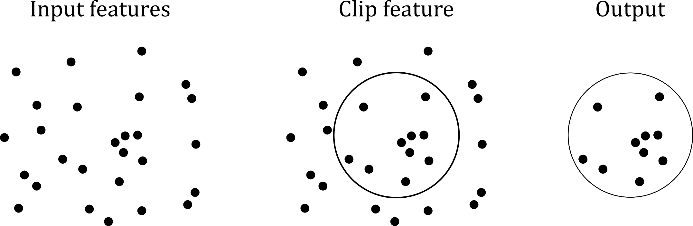{width="100%"}

> Use the Geoprocessing tool [Clip](https://doc.esri.com/en/arcgis-pro/latest/tool-reference/analysis/clip.html?tabs=dialog) to subset the point data to the area of interest, and save as `tiger_points_clip`.

> When complete, remove any original layers e.g., `occurrence`, `tiger_points`, `natural-earth`.

For some of our later analyses, we need to define an **observation window**. We'll explore this concept more fully later on, but as a brief introduction, this is the region within which point patterns are observed and analysed. Here, this is represented by the Natural Earth data, subset to the Indian subcontinent.

At present, this layer consists of *four* separate features, one for each country, which is evident in the Attribute Table and on the Map View. It would be simpler if this was a single feature, which we can produce by **dissolving** our layer, a process which aggregates separate features into one:

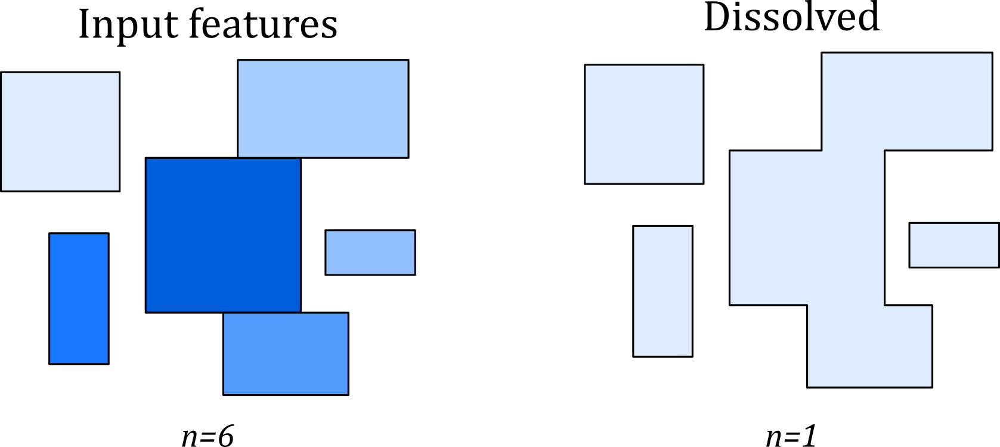{width="80%"}

 

We can dissolve all features into one, shown above, or can dissolve based on shared attributes, as shown below:

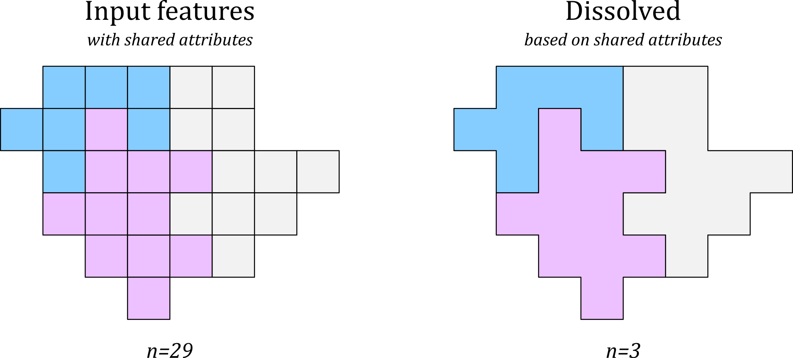{width="80%"}

> Use [Dissolve](https://doc.esri.com/en/arcgis-pro/latest/tool-reference/data-management/dissolve.html?tabs=dialog) to dissolve the `indian_subcontinent` layer. Leave "Dissolve Fields" and "Statistics Fields" blank and run.

::: note
If you want to develop your understanding of [dissolving](https://doc.esri.com/en/arcgis-pro/latest/tool-reference/data-management/dissolve.html?tabs=dialog), you can do some testing on the main `Natural Earth` dataset. The "Dissolve Fields" option will allow you to dissolve by an attribute (e.g., `CONTINENT`), while the "Statistics Fields" will allow to calculate aggregate statistics for those dissolved features (e.g., `POP_EST`, Sum).

 

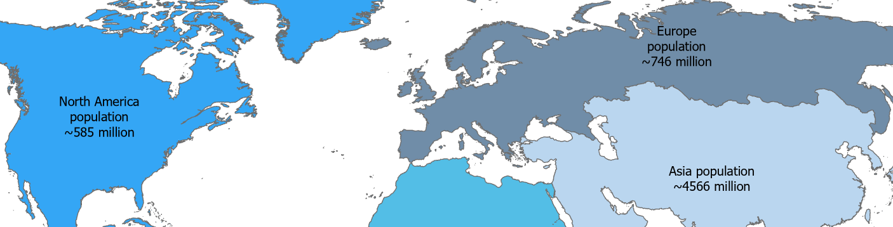{width="100%"}
:::

Here is our current dataset, showing the iNaturalist observations clipped to our study area, which has also been dissolved into a single feature:

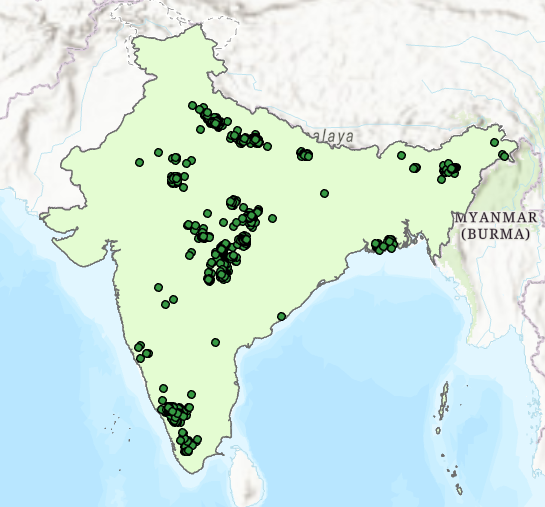{width="60%"}

This is a reasonable approach to define our study area based on political and (to some extent) topographic boundaries e.g., the Himalayas, although we can be critical here:

::: question
Does the tiger recognise these political boundaries?
:::

As final task before we begin to analyse point patterns, we need to consider our choice of **projection**. In previous practicals, we've largely been dealing with *topological* issues, for example when utilising contiguity weights. By comparison, we haven't dealt with *geometric* issues in great depth e.g., measuring areas or distances.

In this practical, we are in the realm of **geometry**. Accurate measurements of the distances between points is necessary if want to characterise the spatial distribution of points with any degree of confidence. As a result, the choice of the coordinate reference system (CRS) is an important one!

::: question
How then do we select a suitable CRS?
:::

In general, I would recommend the following approach[^05-point-patterns-2]:

[^05-point-patterns-2]: This should be familiar to those of you taking GEOG71551: *Understanding GIS*

-   For global analysis, or if in doubt, use ellipsoidal (geodesic) measurement, taking the shape of the Earth into account.
-   For smaller areas, and for computational efficiency, it would be appropriate to use a suitable projected CRS, selecting a distortion property to minimise (i.e., shape, area, or distance).

For individual countries, we would typically use a national grid designed for this purpose, such as the British National Grid (EPSG [27700](https://epsg.io/27700)). This is a *conformal* example, so is designed to minimise shape distortion, but is sufficiently accurate for most area and distance calculations.

Our study area is much larger, so doesn't fit neatly into a national grid e.g., EPSG [6207](https://epsg.io/6207). As a result, our options are to either (i) select from a list of published CRS', which can be found [here](https://epsg.io/), or (ii) we can define our own. For the latter, there are a couple of straightforward ways to achieve this.

Our **first** approach is via the [Projection Wizard](https://projectionwizard.org/) which allows you to select the geographic extent of interest and distortion property e.g.,

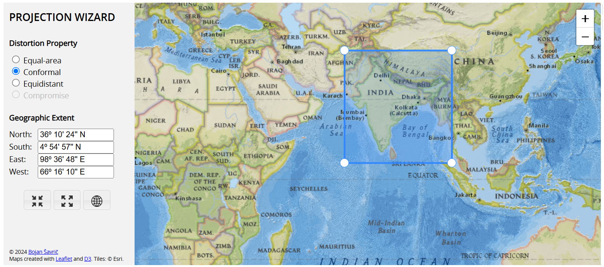{width="100%"}

Based on these choices, the Projection Wizard defines a CRS which minimises distortion of the selected property:

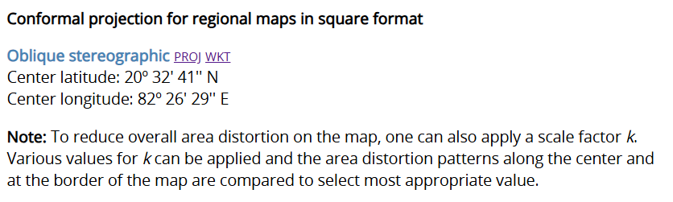{width="70%"}

To use this CRS, we can:

-   Select `WKT`[^05-point-patterns-3], copy the information to a text file (e.g., in Notepad), and save with the extension `.prj`, denoting a projection (CRS) file.
-   In ArcGIS, we can apply this to our map by right clicking the Map in the Contents Pane → Coordinate Systems → Add, then "Import Coordinate System" and "Apply".

[^05-point-patterns-3]: WKT (Well-Known Text) and PROJ are both formats used to define coordinate reference systems.

Our **second** approach is very similar, but in this case the CRS definition is done via ArcGIS. This can be achieved by:

-   Navigating to Coordinate Systems → New suggested projected coordinate system.
-   Providing a name and selecting a geographic coordinate system. `WGS 1984` is a common choice here, as it provides a good *overall* fit between the ellipsoid (a mathematical approximation of the Earth's overall shape) and the [geoid](https://doc.esri.com/en/arcgis-pro/latest/help/mapping/properties/geoid.html).
-   Defining our geographic extent, which can be the extent of an individual layer (e.g., `indian_subcontinent_dissolve`), all the map layers, or the current visible extent.
-   Selecting a distortion property to minimise (e.g., conformal, equal-area, equidistant).

> Use either method to select a suitable **conformal** projection for our area of interest.

As discussed previously, we have updated the **map** CRS, but this doesn't change the CRS of the features, which are being reprojected "on-the-fly".

> Finalise preprocessing by using [Project](https://doc.esri.com/en/arcgis-pro/latest/tool-reference/data-management/project.html?tabs=dialog) to reproject the relevant point and polygon data to your new CRS.

### Visualisation {#point_vis}

In the following sections, we are going to look at ways we can **visualise** the *Panthera tigris* observations, before we characterise their **centrography**, **randomness** and **clustering**, replicating the workflow of Sergio J. Rey, Dani Arribas-Bel and Levi J. Wolf in their book [Geographic Data Science with Python](https://geographicdata.science/book/).

The raw point observations, as shown below, can tell us a lot about the distribution of *Panthera tigris*, but this visualisation also *obscures* a great deal of information. For example, multiple observations at the same location are hidden. Moreover, while we can see there are broad regions with lots of observations, and conversely, regions with no observations, it is impossible to assess which of those regions have a greater **density** of observations at this map scale, given the overlap between the point symbologies.

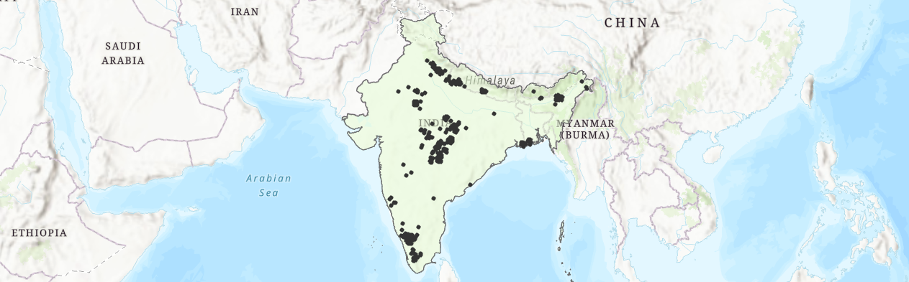{width="100%"}

There are a few alternative visualisations which could be used to address this. One approach is to create a **grid** across the study area, and then symbolise the cells based on the number of observations within each cell. This is useful, because when looking at the points in isolation (at the sub-continent scale), there are lots of high observation clusters. When *tesselated*, there may be one or two areas that stand out (e.g., \>500 observations).

We could also use this grid as the basis for statistical testing, for example using [$χ^2$](https://en.wikipedia.org/wiki/Chi-squared_test), which compares the number of observations in each cell (or *quadrat*) vs. an even distribution of observations across the cells. Unfortunately, this is rather tricky to do in ArcGIS, although quite simple in Python e.g., via [`pointspats`](https://pysal.org/pointpats/generated/pointpats.QStatistic.html).

To generate a grid across our study area:

> Use the Geoprocessing tool [Generate Tessellation](https://doc.esri.com/en/arcgis-pro/latest/tool-reference/data-management/generatetesellation.html?tabs=dialog), setting the extent to match your **projected** layer for the Indian subcontinent, using "Shape Type" = `Square`, and setting the "Size" to 2000 km^2^.

Your output should resemble the following.

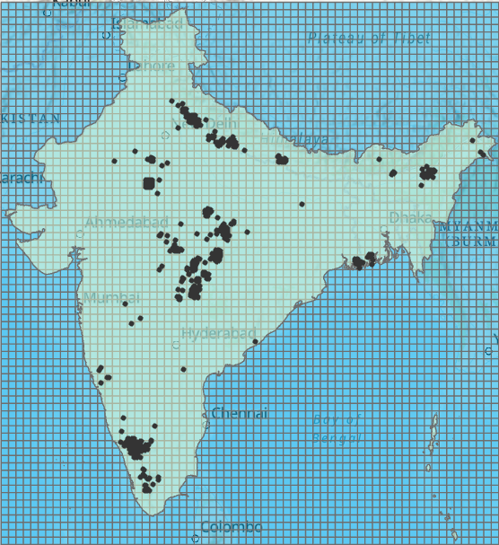{width="50%"}

 

Next we want to calculate the number of observations per grid cell, and this can be achieved in a few different ways. One approach would be to use a **Spatial Join**. Previously, we've combined datasets based on shared **attribute** information using a *table join* i.e., via a common attribute value (e.g., ID). A spatial join combines datasets based on shared **spatial** information i.e., via a common geographic location, as shown below:

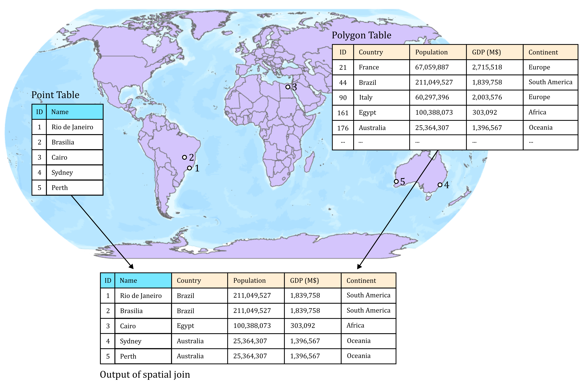{width="100%"}

 

While we could use a [Spatial Join](https://doc.esri.com/en/arcgis-pro/latest/tool-reference/analysis/spatial-join.html?tabs=dialog), we're not really interested in the **attributes** of either layer (we just want the number of observations), so we can achieve this more simply via [Summarize Within](https://doc.esri.com/en/arcgis-pro/latest/tool-reference/analysis/summarize-within.html?tabs=dialog), as follows:

> Open [Summarize Within](https://doc.esri.com/en/arcgis-pro/latest/tool-reference/analysis/summarize-within.html?tabs=dialog) using the newly created grid as the "Input Polygons" and the observation points as the "Summary Features". The "Summary Fields" option allows us to calculate statistics for different fields but here can be left blank. Ensure "Add shape summary attributes" is checked, as this will return the number of points per input polygon[^05-point-patterns-4].

[^05-point-patterns-4]: Or the length of lines or areas of polygons depending on the "Input Summary Features" geometry type.

The Attribute Table should now contain a `Count of Points` field.

> Modify the grid symbology based on this attribute.

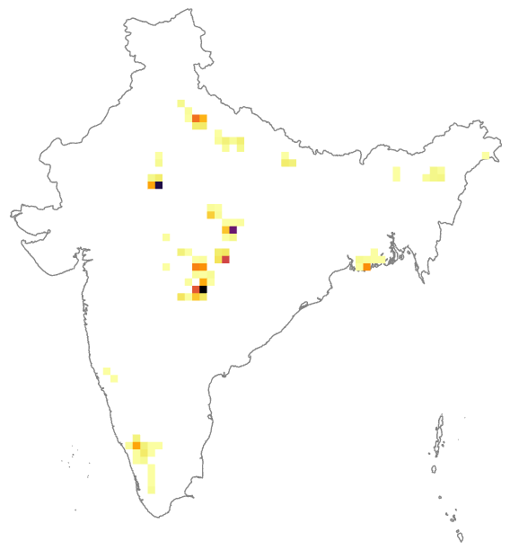{width="50%"}

::: question
How has your interpretation of the distribution of observations changed, compared to the raw points?
:::

::: question
Did you symbolise using **Graduated** Colours (discrete classes) or **Unclassed** Colours (continuous)? How would this influence your interpretation?
:::

A **quadrat** approach can be very effective for revealing spatial patterns, especially when analysed statistically e.g., $χ^2$. However, there are some limitations. For example, the results will vary as the grid extent, cell size, and cell shape changes (e.g., square, hexagon). More fundamentally, we have represented a potentially **continuous** phenomena (i.e., the *probability* of observing a tiger) in a **discrete** way, with sharp boundaries between cells. If we change our grid specification, and where those boundaries fall, we might influence our interpretations. This is a great example of the Modifiable Aerial Unit Problem @openshaw1984.

An alternative approach, which is (arguably) a better reflection of the continuous nature of the phenomena, is **kernel density estimation** (KDE) which creates a smooth surface representing the estimated density (relative probability [^05-point-patterns-5]) or intensity (expected number) of occurrences across space. In the interests of brevity, we won't go into the underlying methodology here, but if you're interested you can consult the [documentation](https://doc.esri.com/en/arcgis-pro/latest/tool-reference/spatial-analyst/how-kernel-density-works.html) and related literature e.g., @silverman2018. KDE can be applied to two-dimensional spatial data (i.e., $xy$ coordinates) to produce a continuous density (or intensity) surface, but is also commonly applied to one-dimensional data (i.e., a vector of values) to produce a [smooth density curve](https://en.wikipedia.org/wiki/Density_estimation), as used in my previous research [@dortch2022b], and visualised below:

[^05-point-patterns-5]: A [probability density function](https://en.wikipedia.org/wiki/Probability_density_function) describes the likelihood that a variable will fall within a specific range of values.

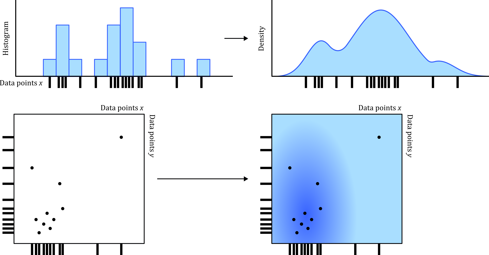{width="100%"}  

> Run the [Kernel Density](https://doc.esri.com/en/arcgis-pro/latest/tool-reference/spatial-analyst/kernel-density.html?tabs=dialog) tool using the occurrence points as the "Input point feature", "Population Field" = `NONE`, and set the "Output cell size" to 20000 (m) for consistency with the grid created earlier. For "Method", we can choose either Planar or Geodesic measurement[^05-point-patterns-6]. Although we are using a projected CRS for our data, if in doubt, use a geodesic approach.

[^05-point-patterns-6]: For each cell in the output grid, the calculated probability is based on the number of points around the cell, weighted by distance, so accurate distance measurement is important.

If successful, the tool should return a raster layer, where its dimensions are determined by the minimum and maximum coordinates of the input layer.

::: question
How your interpretation changed when using KDE?
:::

> Explore changing search radius e.g., 20,000 m^2^ to 200,000 m^2^, and the the effect of including barriers i.e., the study area polygon.

The kernel density raster produced by [Kernel Density](https://doc.esri.com/en/arcgis-pro/latest/tool-reference/spatial-analyst/kernel-density.html?tabs=dialog) is *static*. We can perform create a similar output *dynamically* via Symbology → Heat Map, although this is arguably less robust i.e., the "Radius" setting is in screen units (points), rather than map units (meters, feet, etc).

> Explore the Heat Map settings (Method, Radius).

::: question
Is the default colour scale an appropriate choice? See @crameri2020
:::

### Centrography {#point_centro}

If you were presented with a set of values (e.g., measurements of [species richness](#species-richness) in a forest) and were asked to describe the dataset, you would probably calculate some summary statistics, such as measures of central tendency (e.g., mean, median, mode), or measures of dispersion (e.g., standard deviation, range, interquartile range). In doing so, we are attempting to capture the core properties of the dataset.

In much the same way, we can measure the **centrography** of a spatial dataset i.e., the "*degree of centrality in a point pattern*". The mean center and the median center are two examples, and both can be used to represent the center of mass. In isolation, these measures don't provide a great deal of information, but are important for measuring **dispersion**, which we'll introduce in a moment.

> Run the [Mean Center](https://doc.esri.com/en/arcgis-pro/latest/tool-reference/spatial-statistics/mean-center.html?tabs=dialog) and [Median Center](https://doc.esri.com/en/arcgis-pro/latest/tool-reference/spatial-statistics/median-center.html?tabs=dialog) tools using the observations points as the input.

::: question
What does the difference between the mean and median locations tell you about the spatial distribution of observations?
:::

Answer

The mean center is the arithmetic average of the coordinate values. The median center is defined as the location which minimises the overall distance to all features in the dataset. The latter is a more robust measure of central tendency as it is less affected by extreme observations. You can read about ArcGIS implementation [here]((https://doc.esri.com/en/arcgis-pro/latest/tool-reference/spatial-statistics/median-center.html?tabs=dialog)), while the `PySAL` [documentation](https://pysal.org/notebooks/explore/pointpats/centrography.html#Euclidean-Median-$(x_%7Bem%7D,y_%7Bem%7D)$) is also worth a read.

In this case, the mean location is further north than the median, which is indicative of **skew** i.e., the mean is being biased northwards by Himalayan observations.

 

Using these measures of central tendency, we can evaluate the **standard distance** i.e., on average, how far are observations from the geometric mean center? This is analogous to the standard deviation and is a measure of **dispersion**.

> Run the [Standard Distance](https://doc.esri.com/en/arcgis-pro/latest/tool-reference/spatial-statistics/standard-distance.html?tabs=dialog) tool. This produces a circle with a radius equal to the standard distance. This can be modified using the "Circle Size" option, while the "Weight Field" can be used if the points are not of equal importance. For example, in an ecological setting we might want to weight observations based on the *strength of evidence* e.g., a photograph vs. a [pugmark](centrography) vs. [scat](https://www.wildlifetrusts.org/wildlife/how-identify/identify-poo).

For this dataset, the standard distance is 560913.288262 m[^05-point-patterns-7] i.e., on average, observations are \~560 km from the mean center. As above, this value is not particularly meaningful in isolation, but it can be useful through comparison. For example, if we were comparing observations for two species (e.g., *Panthera tigris* vs. *Canis lupus*), differences in the standard distance would reflect the degree of compaction or dispersion of the two species ranges.

[^05-point-patterns-7]: This value may vary slightly depending on your choice of CRS, as [Standard Distance](https://doc.esri.com/en/arcgis-pro/latest/tool-reference/spatial-statistics/standard-distance.html?tabs=dialog) uses planar rather than geodesic measurement.

As a final measure of centrography, the **standard deviational ellipse** can be used to represent the center and dispersion of a point pattern, but also its orientation.

> Run [Directional Distribution (Standard Deviational Ellipse)](https://doc.esri.com/en/arcgis-pro/latest/tool-reference/spatial-statistics/directional-distribution.html?tabs=dialog), which should produce the following:

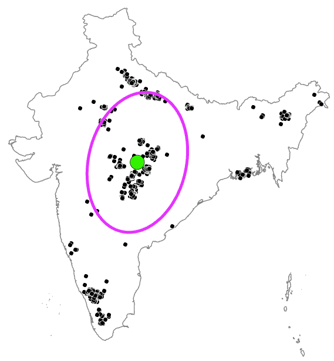{width="50%"}

::: question
What does this visualisation tell you?
:::

Answer

The **Standard Deviational Ellipse** is an extension of standard distance, and also uses the mean center for calculations, which is defined in the Attribute Table as `CenterX` and `CenterY`. This should be identical to the outputs of [Mean Center](https://doc.esri.com/en/arcgis-pro/latest/tool-reference/spatial-statistics/mean-center.html?tabs=dialog) and [Standard Distance](https://doc.esri.com/en/arcgis-pro/latest/tool-reference/spatial-statistics/standard-distance.html?tabs=dialog).

Unlike standard distance, which measures average coordinate dispersion, the standard deviational ellipse measures dispersion separately in $x$ and $y$, which can be used to calculate the direction of greatest dispersion, see [here](https://doc.esri.com/en/arcgis-pro/latest/tool-reference/spatial-statistics/h-how-directional-distribution-standard-deviationa.html). Unlike standard distance, this provides information on the orientation and shape of the distribution (e.g., compact vs. directional).

For our data, there is greater dispersion on the N-S axis (`YStdDist`) vs. the E-W axis (`XStdDist`), and a slight rotation of \~13 degrees (`Rotation`), which is probably a reflection of observations in the NE e.g,. Arunachal Pradesh, Assam and Bangladesh, coupled with those in the SW e.g., Kerala, Karnataka.

By comparison, if the distribution of species observations was uniform or spatially random, we would except identical $x$ and $y$ dispersion and no rotation.

 

### Randomness {#p5_randomness}

So far we've explored how to [visualise](#point_vis) our point patterns to maximise the information on display, and introduced some measures of [centrography](#point_centro) which we can use to characterise the point pattern. A logical progression from this is to assess spatial **randomness** i.e.,

::: question
Are the **objects** randomly distributed or is there evidence of spatial structure?
:::

One way to achieve this is via **quadrat statistics**, as introduced above, in which the *observed* number of points per quadrat is compared with an even distribution, and with statistical significance assessed using $χ^2$, for example. While we cannot assess statistical significance in ArcGIS without [additional Python packages](https://doc.esri.com/en/arcgis-pro/latest/arcpy/get-started/what-is-conda.html), we can assess the distribution qualitatively, by summarising and visualising the `Count of Points` field in the grid Attribute Table.

::: question
What is the mean and median of the number of observations per quadrat? How would you characterise the distribution?
:::

An alternative approach is Clark-Evans $R$ [@clark1954], which is a commonly used measure of the degree of clustering or dispersion of a point pattern, defined as:

$$R=\frac{\bar{r}_A}{\bar{r}_E}$$ which is the ratio $R$ of the **actual** mean nearest neighbour distance $\bar{r}_A$ and the **expected** mean nearest neighbour distance $\bar{r}_E$. $R<1$ is indicative of clustering i.e., the actual mean nearest neighbour distance is less than the expected value, while $R>1$ is indicative of ordering i.e., dispersion. If $R\approx1$, this would be indicative of spatial randomness.

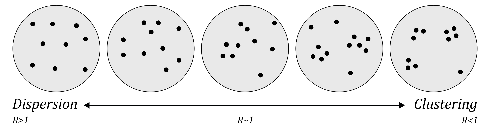{width="100%"}

 

The calculation of $\bar{r}_A$ is as follows:

$$\bar{r}_A=\frac{\sum r}{n}$$ where $r$ is a vector of distances between each point and its nearest neighbour and $n$ is the number of points.

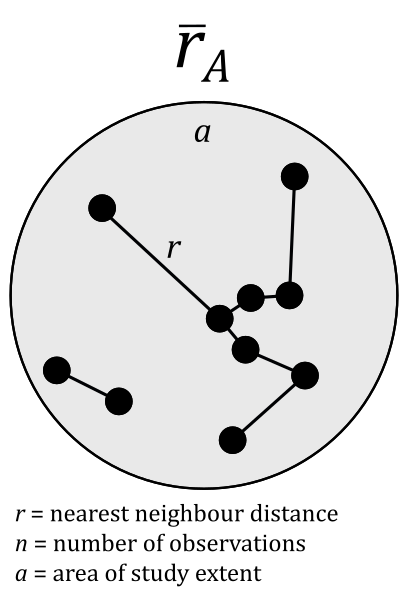{width="30%"}

 

The expected mean nearest neighbour distance $\bar{r}E$ is calculated using a Poisson point process[^05-point-patterns-8], which can be simplified to:

[^05-point-patterns-8]: We'll introduce Poisson distributions in **Practical 10**: *Spatial Interaction Modelling*.

$$\bar{r}E = \frac{1}{2\sqrt{p}}$$

where $p$ is the density of observed points i.e., number of points per unit of area, which is simply $n/a$, where $a$ is the area of the study extent.

The **z-score** for Clark-Evans $R$ can tell us whether the observed value of $R$ is significantly different from the expectation under complete spatial randomness. It represents the number of standard deviations that $\bar{r}_A$ differs from $\bar{r}_E$, and is calculated as follows:

$$z=\frac{\bar{r}_A-\bar{r}_E}{SE}$$

where $SE$ is the standard error of the expected mean distance[^05-point-patterns-9] i.e., the amount of variation in the mean due to random chance:

[^05-point-patterns-9]: The constant $0.26136$ is derived by @clark1954.

$$SE = \frac{0.26136}{\sqrt{n^2/a}}$$

#### Observation window

Before we test the ArcGIS implementation of Clark-Evans $R$, it is worth reflecting on the inputs it requires: $r, n$ and $a$. The nearest neighbour distances $r$ and the number of observations $n$ are fixed in our analysis (although the measured distances will vary depending on the choice of CRS and distance measurement approach), but the area of our study extent $a$ is not.

This leads us nicely onto a key concept in point pattern analysis, which is the **observation window**. Earlier we defined this as "the region within which point patterns are observed and analysed". While this is easy to define e.g., analysing the distribution of *Panthera tigris* for India-alone, or India and Bangaladesh, or the entire Indian subcontinent, this definition can have a significant impact on our assessment of spatial randomness, both qualitatively and statistically.

For example, take the following distribution of points, where the observation window is represented by the circled area:

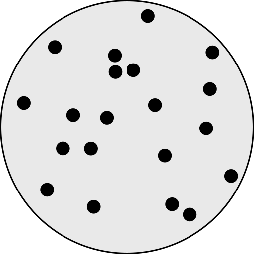{width="50%"}

 

::: question
How would you characterise the distribution of the points? Random, clustered, or dispersed?
:::

Now take a look at the **same** distribution of points, but with a *different* observation window:

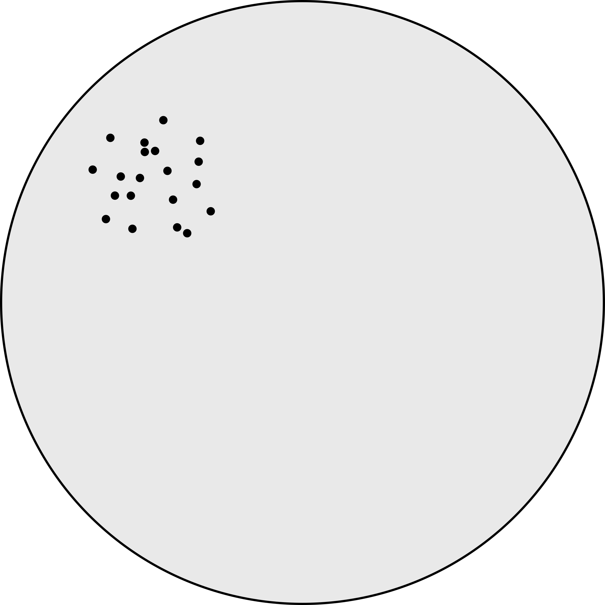{width="50%"}

 

::: question
Would you characterise the distribution differently to before?
:::

These examples illustrate the importance of the observation window - the same point pattern can *look* random or clustered, depending on the scale of the observation. This also affects our statistical measures of randomness, influencing Clark-Evans $R$ via the area value $a$.

In the ArcGIS implementation of this technique, which is referred to as [Average Nearest Neighbor](https://doc.esri.com/en/arcgis-pro/latest/tool-reference/spatial-statistics/average-nearest-neighbor.html?tabs=dialog), somewhat confusingly without any reference to @clark1954, the default value for $a$ is the area of a minimum enclosing rectangle around the input points, with some examples [here](https://doc.esri.com/en/arcgis-pro/latest/tool-reference/data-management/minimum-bounding-geometry.html?tabs=dialog), or the user can specify their own value for $a$.

> Run [Average Nearest Neighbor](https://doc.esri.com/en/arcgis-pro/latest/tool-reference/spatial-statistics/average-nearest-neighbor.html?tabs=dialog), using Euclidean (planar) distance measurement. Select "Generate Report" amd for now leave "Area" blank and run. This should produce the following:

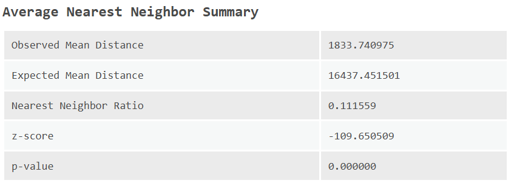{width="70%"}

::: question
What is your interpretation of Clark-Evans $R$ (`Nearest Neighbor Ratio`) and the z-score and $p$ value?
:::

Answer

*Remember that your measured distances might differ slightly from mine depending on the CRS definition.*

In my analysis, the observed mean distance $\bar{r}_A\approx1830\;\text{m}$ i.e., on average, the nearest observation is \~2 km away. By comparison, the expected distance $\bar{r}_E\approx16,400\;\text{m}$ i.e., we would *expect* an average of \~16 **km**, based on the default value for $a$. This is a rather large difference, which is reflected in the extremely high z-score, and the highly significant $p$ value.

This interpretation is backed up the `.html` report, which sums it up nicely: "*Given the z-score of -109.650509, there is a less than 1% likelihood that this clustered pattern could be the result of random chance.*" In fact, this is a rather conservative statement, as this would equate to $p=0.01$, when the reported $p$ value is actually many times smaller.

 

> Evaluate the impact of changing the observation window (`area`). For example, you could use the area of the Indian subcontinent polygon. This can be calculated using [Calculate Geometry Attributes](https://doc.esri.com/en/arcgis-pro/latest/tool-reference/data-management/calculate-geometry-attributes.html?tabs=dialog), specifing a "Field" name of your choice and using `Area` for the "Property" option. This will produce a new field in the Attribute Table for the Indian subcontinent layer, which can then be pasted into [Average Nearest Neighbor](https://doc.esri.com/en/arcgis-pro/latest/tool-reference/spatial-statistics/average-nearest-neighbor.html?tabs=dialog).

::: question
How has changing $a$ influenced $\bar{r}_E$ and the corresponding z-score? Has this changed your interpretations?
:::

### Cluster analysis

While our appraisal of randomness is sensitive to the observation window, we can be reasonably confident here that the point pattern is not random, and instead is highly **clustered**. In this final section, we are going to investigate the existence and location of individual clusters.

This is analogous to the different information provided by Moran's $I$ and $I_{i}$. While the former is used to investigate **global** spatial autocorrelation, much like Clark-Evans $R$ provides information on the degree of clustering for a dataset *as a whole*, we would use Moran's $I_{i}$ to reveal *where* spatial autocorrelation is present within a dataset.

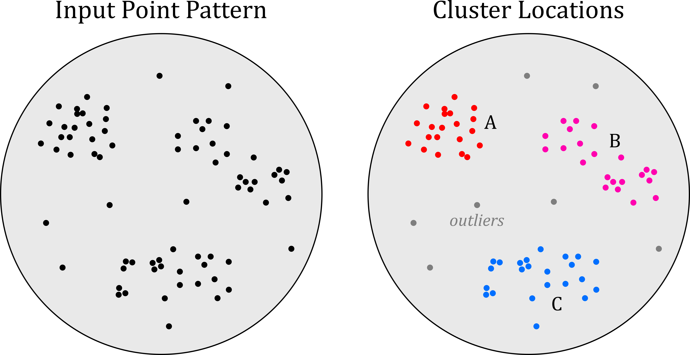{width="70%"}

 

There are lots of approaches we could use to identify point clusters, but we'll focus on a very widely used algorithm known as DBSCAN (*Density-Based Spatial Clustering of Applications*)[@ester1996]. As the name implies, this is a density-based clustering algorithm, which defines clusters based on two user-defined parameters:

-   the minimum number of points $m$ required to form a cluster.
-   a search distance $\epsilon$, which defines a maximum radius of a neighborhood around a point.

You'll be pleased to know that the implementation of DBSCAN is too complicated to run through here, but we can talk through the algorithm in some detail. DBSCAN classifies points as either:

-   **core**, for those inside a cluster with a least $m$ points in the cluster within distance $\epsilon$.
-   **border**, for those inside a cluster with less than $m$ points in the cluster within distance $\epsilon$.
-   **noise**, for those outside a cluster.

This is achieved by:

1.  Finding the number of points within $\epsilon$ of very point, and identifying the core points (those with $\ge m$ neighbours).
2.  Connecting the core points if they are within $\epsilon$ of each other. Connected core points define a cluster.
3.  If a non-core point is within $\epsilon$ of a core point, it is classed as a border point.
4.  If a non-core point is not within $\epsilon$ of a core point, it is classed as an outlier point.

 

Here is a schematic I've created to help you understanding the process:

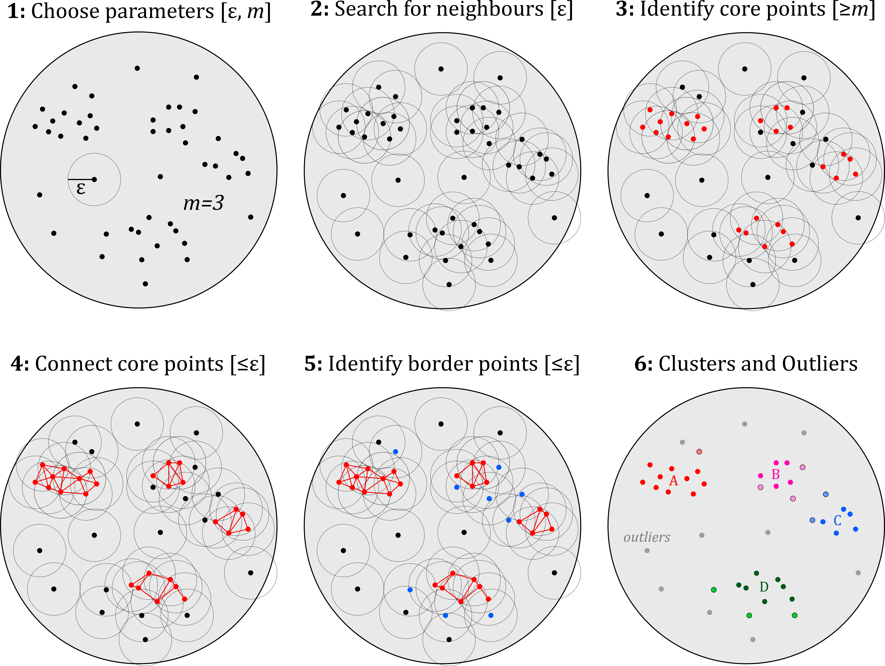{width="100%"}

 

DBSCAN is a very powerful and flexible algorithm. This flexibility is both a strength and limitation, however, as the number and distribution of clusters is highly sensitive to the selection of $m$ and $\epsilon$.

::: question
How would you pick $m$ and $\epsilon$ for our current analysis?
:::

Suggestion

I would probably derive $m$ from a desired percentage of the dataset. For example, if we wanted the minimum cluster size to be 1% of the number of observations, this would be $m=45$, based on the \~4,500 observations.

Selecting $\epsilon$ is more challenging, but in this case I think we can do so quite confidently based on ecological grounds and the home range of *Panthera tigris* i.e., how far does the tiger typically travel? @naha2016 report average home ranges of 56.4 km^2^ (female) and 110 km^2^ (male) for tigers in the Sundarban of India and Bangladesh. @sarkar2016 report average home ranges of 73.6 km^2^ (female) and 132.7 km^2^ (male) in the Panna Tiger Reserve, central India, although they can travel much further [@hussain2022]. I'll use $\epsilon=110$ km.

 

> Run [Find Point Clusters](https://doc.esri.com/en/arcgis-pro/latest/tool-reference/big-data-analytics/find-point-clusters.html?tabs=dialog), setting the "Minimum Features per Cluster" $m$ to 45 and "Search Distance" $\epsilon$ to 110. For "Clustering Method", use `DBSCAN`, and save with an informative name e.g., `dbscan_m45_e110`.

::: problem
James - This was failing with ERROR 001409: Failed to write to the output location (P Drive). The tool seemed to run effectively until then, as the messages lists: Number of Clusters 7, Noise features 52. It worked when saving to C!
:::

This should produce the following output, which seems a reasonable characterisation of the degree of clustering, with seven main clusters (containing core and border points), plus outliers. It is worth emphasising that there is no "correct" output here, as the results are entirely dependent on our choice of $m$ and $\epsilon$.

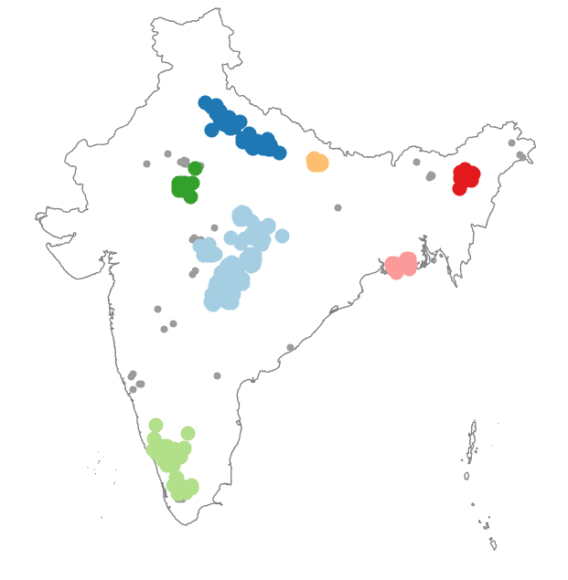{width="50%"}

> Explore how the results change with different values for $m$ and $\epsilon$.

Another option in [Find Point Clusters](https://doc.esri.com/en/arcgis-pro/latest/tool-reference/big-data-analytics/find-point-clusters.html?tabs=dialog) is **HDBSCAN**, which is a modification of DBSCAN that allows clusters of different densities to be identified, with $\epsilon$ varying across the modelled area, see @campello2013 and @mcinnes2017. HDBSCAN could be more effective if clusters are characterised by different densities, or if there are theoretical grounds for varying the value of $\epsilon$ e.g., tiger species with different home ranges, such as the *Panthera tigris altaica*[^05-point-patterns-10] (the Amur tiger), see @long2021a.

[^05-point-patterns-10]: If you're interested in related reading, I'd recommend ["Great Soul of Siberia"]() by Sooyong Park, and ["The Amur River"](https://www.penguin.co.uk/books/439320/the-amur-river-by-thubron-colin/9781529110890) by Colin Thubron.

> Re-run [Find Point Clusters](https://doc.esri.com/en/arcgis-pro/latest/tool-reference/big-data-analytics/find-point-clusters.html?tabs=dialog) using `HDBSCAN`.

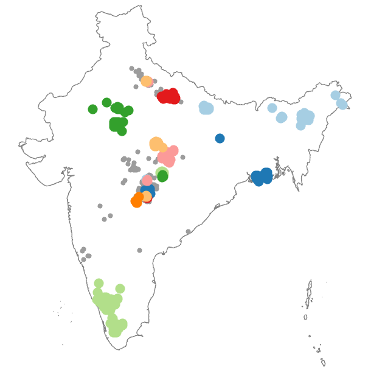{width="50%"}

::: question
What is your appraisal of the HDBSCAN results? Which output do you think is "best"?
:::

Suggestion

In my view, DBSCAN has produced the more reasonable and more [parsimonious](https://en.wikipedia.org/wiki/Occam's_razor) result. It is also more defensible, with $\epsilon$ selected based on ecological grounds, rather than arbitrarily based on the degree of point clustering.

 

### Summary

In this practical, we have **visualised** and characterised the **centrography**, **randomness** and **clustering** of *Panthera tigris* observations. A few summary thoughts to finish:

Analysing point-patterns is great, but as we discussed in the [introduction](#point_introduction), is really only a precursor to studying **point processes** i.e., which spatial factors and mechanisms give rise to the observed distribution of points? You can explore point-process modelling from an ecological perspective in GEOG71922 *Spatial Ecology*. A species distribution model is an excellent example of a point-process model, see @elith2009.

It is also worth emphasising the importance of the **observation window**. This has a direct influence on some statistical measures (e.g., Clark-Evans $R$), but arguably is a more fundamental issue. Our assessment of the degree of dispersion, randomness and clustering of a point pattern is always dependent on the scale of observation. In turn, we must be careful to match our scale of observation to the operational scale of the phenonemon, see @mcmaster2004.

Finally, one key concept we haven't considered is **uncertainty**. In our analysis, *Panthera tigris* observations are represented by points with high digital precision. In reality, all spatial observations are characterised by some degree of uncertainty. The iNaturalist dataset we've been working with does include uncertainty estimates, although it is not exactly clear how these are derived. If you investigate closely, you may notice that there are many points at the same exact location, and some with reported positional uncertainty of $± 30$ km. A more rigorous analysis of point patterns would take that uncertainty into account, for example by pertubating each point based on the stated uncertainty...

...and with that, **congratulations!** You have completed the practical and should now have an appreciation for the complexities of point pattern analysis, and be able to implement some key approaches in ArcGIS.

[**Finished!**](#index)

## Extra

There is a smorgasbord of extra content this week, allowing you to explore another clustering algorithm (Ripley's $K$) and test the sensitivity of our analysis to the observation window. For those of you want to use species observations in your own work, I have also included instructions on how to download these from GBIF.

### Ripley's alphabet of clustering functions

"*Statistical Inference for Spatial Processes*" by @ripley_statistical_1988 is a highly influential work which provided an "alphabet" of functions for analysing points patterns, named $G, F, K$ and $L$. Unfortunately, not all of these are implemented in ArcGIS, hence their exclusion from the main part of the practical. They are available in the Python package [`pointpats`](https://pysal.org/pointpats/user-guide/ripley.html), and the R package [`spatstat`](https://doi.org/10.18637/jss.v012.i06), and elsewhere, with a good walkthrough of $G$ and $F$ in ["Geographic Data Science with Python"](https://geographicdata.science/book/notebooks/08_point_pattern_analysis.html#ripleys-alphabet-of-functions). 

In ArcGIS, the only available function is Ripley's $K$, via the [Multi-Distance Spatial Cluster Analysis (Ripley's K Function)](https://doc.esri.com/en/arcgis-pro/latest/tool-reference/spatial-statistics/multi-distance-spatial-cluster-analysis.html?tabs=dialog) geoprocessing tool, alongside the following [documetation](https://doc.esri.com/en/arcgis-pro/latest/tool-reference/spatial-statistics/multi-distance-spatial-cluster-analysis.html?tabs=dialog) and [guidance](https://doc.esri.com/en/arcgis-pro/latest/tool-reference/spatial-statistics/h-how-multi-distance-spatial-cluster-analysis-ripl.html). 

It is not within the scope of the practical to discuss the mathematics of $K$ in detail, but as a brief introduction, Ripley's $K$ is similar to Clark-Evans $R$, in that it also evaluates point-neighbour distances. However, unlike $R$, which measures the distance to only the nearest neighbour, $K$ measures the actual distance to all neighbours within a defined distance threshold ($K_{A}$), and compares this to the expected number of neighbours at that defined distance ($K_{E}$) to evaluate the degree of clustering, randomness or dispersion. Importantly, $K$ is **multi-scale**, so rather than testing the degree of clustering for a single distance, $K$ operates over a range of distances, testing each one in turn. In turn, $K$ can be used to detect clustering or disperson across multiple spatial scales. 

Ripley's $K$ can be interpreted visually, with comparison of the expected pattern, produced assuming complete spatial randomness (blue line $±$ confidence envelope), with the observed spatial pattern, as shown below. Significant deviations above the expected pattern ($K_{A}>K_{E}$) indicate **clustering** at that defined distance, and deviations below the expected pattern ($K_{A}<K_{E}$) indicate **dispersion**. Correspondence between the observed and expected pattern ($K_{A}\approx K_{E}$) indicates spatial randomness:

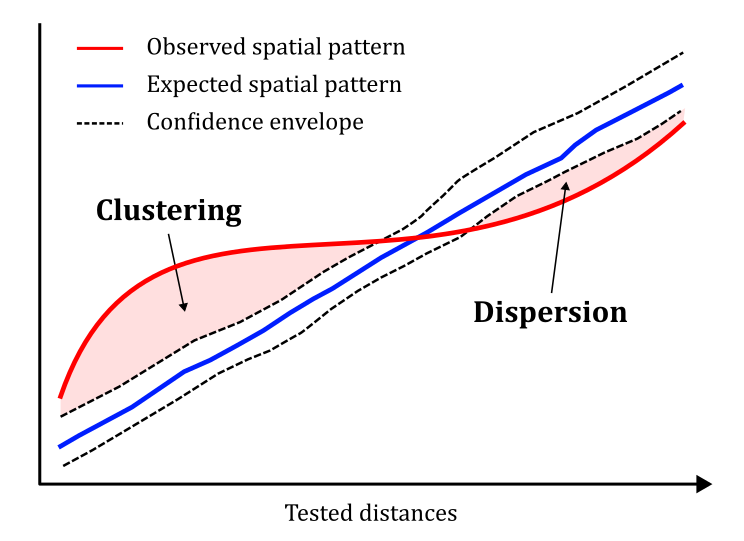{width="60%"}

> Have a play with [Multi-Distance Spatial Cluster Analysis (Ripley's K Function)](https://doc.esri.com/en/arcgis-pro/latest/tool-reference/spatial-statistics/multi-distance-spatial-cluster-analysis.html?tabs=dialog), which should produce a standalone table of results, containing $K_{A}$ and $K_{E}$ for the tested distances, and the $K$ function chart. The confidence envelope is calculated based on the number of permutations - more is better, but at the cost of computation time...

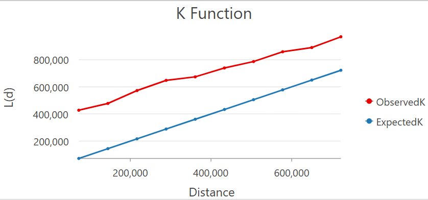{width="60%"}

*Ripley's $K$ chart (no permutations)*

::: question
What is your interpretation of the $K$ function chart? 
:::

As with other metrics, Ripley's $K$ is sensitive to the calculation area, which can be specified with the "Study Area Method" option. Additional processing is also often used to correct points near the boundary of the observation window, as these will have part of their defined neighbourhood outside of the study area, where points cannot be observed, see [here](https://doc.esri.com/en/arcgis-pro/latest/tool-reference/spatial-statistics/multi-distance-spatial-cluster-analysis.html?tabs=dialog). This is less of an issue for Clark-Evans $R$, as this is based on the single nearest neighbour. Solutions include using an isotropic correction (i.e., weighting neighbours based on the amount of the search area inside the observation window), or excluding points which are too close to the boundary for a given distance. 

### Testing the observation window {.unnumbered}

To evaluate the effects of the **observation window**, we could analyse our point patterns at a different scale, for example focusing on a single national park. In the following section, I'll provide some instructions to analyse *Panthera tigris* observations within the Corbett Tiger Reserve, the first in India, and named after [Jim Corbett](https://en.wikipedia.org/wiki/Jim_Corbett), an Anglo-Indian hunter, naturalist, and [author](https://en.wikipedia.org/wiki/Man-Eaters_of_Kumaon).

> Load the protected areas feature layer [`data/gbif/protected-area-india.shp`] and use Select by Attributes to subset to the `Corbett National Park`. For consistency with the previous analysis, [project](https://doc.esri.com/en/arcgis-pro/latest/tool-reference/data-management/project.html?tabs=dialog) the data to the conformal projection used elsewhere.

> Following the approach used above, filter the observations to those within the reserve using [Clip](https://doc.esri.com/en/arcgis-pro/latest/tool-reference/analysis/clip.html?tabs=dialog).

The area of the observation window is critical for our calculations, so:

> Calculate the reserve area using [Calculate Geometry Attributes](https://doc.esri.com/en/arcgis-pro/latest/tool-reference/data-management/calculate-geometry-attributes.html?tabs=dialog), and then assess the degree of clustering using Clark-Evans $R$ i.e., [Average Nearest Neighbor](https://doc.esri.com/en/arcgis-pro/latest/tool-reference/spatial-statistics/average-nearest-neighbor.html?tabs=dialog), using the calculated area as an input.

::: question
What is your interpretation of Clark-Evans $R$ (`Nearest Neighbor Ratio`) and the z-score and $p$ value?
:::

One weakness of the dataset is that we have many points at the same location. These *could* be repeat observations or it could reflect the positional uncertainty of the data. Either way, it would be interesting to repeat the analysis with only unique locations:

> Use [Delete Identical](https://doc.esri.com/en/arcgis-pro/latest/tool-reference/data-management/delete-identical.html?tabs=dialog) to filter to unique locations, using `Shape` as the input for "Fields", and then re-run [Average Nearest Neighbor](https://doc.esri.com/en/arcgis-pro/latest/tool-reference/spatial-statistics/average-nearest-neighbor.html?tabs=dialog).

::: question
How has Clark-Evans $R$ changed?
:::

An interesting comparison would also be with a completely random distribution.

> Use [Create Random Points](https://doc.esri.com/en/arcgis-pro/latest/tool-reference/data-management/create-random-points.html?tabs=dialog) to generate a set of random points, using the extent of the Corbett Tiger Reserve as the "Constaining Feature Class" and setting the "Number of Points" to match the number within the nature reserve, and then re-run [Average Nearest Neighbor](https://doc.esri.com/en/arcgis-pro/latest/tool-reference/spatial-statistics/average-nearest-neighbor.html?tabs=dialog).

::: question
Is the result clustered ($R<1$) or dispersed ($R>1$)?
:::

::: question
How does this change if you double the calculation area?
:::

### Downloading data from GBIF {#gbif_download .unnumbered}

To download species-observation data **manually** from GBIF:

> [Register](https://www.gbif.org/user/register) for GBIF.

> Navigate to [Get data - Species](https://www.gbif.org/taxon/search) and use "Full text search" to search for the species of interest e.g., *Canis lupus* (Linnaeus, 1758, Gray Wolf)

> Select the species → Occurrences 

> Apply Filters of interest e.g., Country or area (`United States of America`), Dataset (`iNaturalist Research-grade Observations`), Location (Has coordinates = `Yes`) 

> Download simple occurrence data (`csv`)

If using and publishing the data, make sure to include the recommended data attribution e.g., GBIF.org (7 July 2026) GBIF Occurrence Download <https://doi.org/10.15468/dl.vdnczk>

It is also possible to download data via a **geoprocessing tool** in ArcGIS [[Source](https://www.arcgis.com/home/item.html?id=927944e867624504bfd6c489b0d2aec7)] [[Instuctions](https://techdocs.gbif.org/en/data-use/importing-gbif-data-into-arcgis)].

## Resources

-   Baddeley, A., Rubak, E., & Turner, R. ([2015](https://doi.org/10.1201/b19708)). Spatial Point Patterns: Methodology and Applications with R (1st ed.). Chapman and Hall/CRC.
-   Ripley, B.D. ([2012](https://doi.org/10.1017/CBO9780511624131)) Statistical Inference for Spatial Processes, Cambridge University Press
-   Clark, P.J. and Evans, F.C. ([1954](https://doi.org/10.2307/1931034)). Distance to nearest neighbor as a measure of spatial relationships in populations. Ecology, 35(4), pp.445-453.
