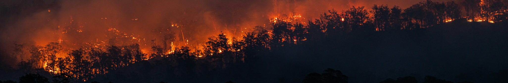

# (PART\*) Spatial Modelling {.unnumbered}

# Interpolation {#interpolation}

## Introduction

### Aims {.unnumbered}

The aims of this practical are to:

1.  Introduce deterministic and geostatistical approaches for analysing spatial data.
2.  Understand how common spatial interpolation techniques work.
3.  Perform interpolation in ArcGIS and become familiar with common
    applications e.g., for prediction, as an input for spatial
    regression.

### Application {.unnumbered}

To achieve this, we'll apply interpolation techniques to UK temperature
data from [Met
Office](https://weather.metoffice.gov.uk/maps-and-charts/temperature-map#?model=ukmo-ukv&layer=temperature&bbox=%5B%5B46.6795944656402,-32.12402343750001%5D,%5B60.823494332539646,24.125976562500004%5D%5D)
[automatic monitoring
stations](https://www.metoffice.gov.uk/research/climate/maps-and-data/uk-synoptic-and-climate-stations),
obtained via the [Land Observations
API](https://datahub.metoffice.gov.uk/docs/o/category/observations/overview). We'll tackle a problem also faced by the Met Office - given limited meteorological observations, how do we [predict](https://www.metoffice.gov.uk/research/climate/maps-and-data/data/haduk-grid/haduk-grid) the weather for unsampled locations?  

### Data {.unnumbered}

-   Met Office temperature data, available in [`data/met-office`]
    [[Source](https://datahub.metoffice.gov.uk/docs/o/category/observations/overview)]
-   The Earth Topography (ETOPO) 2022 global digital elevation model,
    produced by the National Oceanic and Atmospheric Administration
    (NOAA), available in [`data/noaa`]
    [[Source](https://www.ncei.noaa.gov/products/etopo-global-relief-model)]
    [[Paper](https://doi.org/10.5194/essd-17-1835-2025)]

### Tools {.unnumbered}

[Extract Values to
Points](https://doc.esri.com/en/arcgis-pro/latest/tool-reference/spatial-analyst/extract-values-to-points.html?tabs=dialog)
(Spatial Analyst Tools),
[IDW](https://doc.esri.com/en/arcgis-pro/latest/tool-reference/geostatistical-analyst/idw.html?tabs=dialog)
(Geostatistical Analyst Tools), [Empirical Bayesian
Kriging](https://doc.esri.com/en/arcgis-pro/latest/tool-reference/geostatistical-analyst/empirical-bayesian-kriging.html?tabs=dialog)
(Geostatistical Analyst Tools), [Geostatistical
Wizard](https://doc.esri.com/en/arcgis-pro/latest/help/analysis/geostatistical-analyst/get-started-with-geostatistical-analyst-in-arcgis-pro.html#9E3),
[Exploratory
Interpolation](https://doc.esri.com/en/arcgis-pro/latest/tool-reference/geostatistical-analyst/exploratory-interpolation.html?tabs=dialog)
(Geostatistical Analyst Tools)

------------------------------------------------------------------------

## Practical

Context: Interpolation techniques are used to estimate unknown values at new
locations based on known measurements from surrounding sample points.

We could use our species observation Points (*Panthera tigris*) from
[Practical 5](#point_patterns) here, but it's not an ideal example, for
a few reasons:

1.  Our Points don't have corresponding `values` that could be used for
    spatial interpolation e.g., animal height, age, or mass for each
    observation.

2.  As our Points represent individual observations, we would typically
    have to aggregate these data in some way to perform interpolation
    i.e., either via
    [tessellation](https://doc.esri.com/en/arcgis-pro/latest/tool-reference/data-management/generatetesellation.html?tabs=dialog)
    to a grid or by generating a new Point dataset, where the `value`
    represents the number of observations within a specified distance.

3.  As demonstrated in [Practical 5](#point_patterns), the distribution
    of *Panthera tigris* observations is highly clustered and
    non-continuous, with observations primarily in designated nature
    reserves. Interpolation techniques will typically struggle to
    capture this spatial pattern, and instead, we'd probably want to use
    a *species distribution model* (an example of a *point-process
    model*) in this situation. You can learn about these in [Spatial
    Ecology](https://www.manchester.ac.uk/study/masters/courses/list/07053/msc-geographical-information-science/)
    in Semester 2.

4.  Finally, our species observations are *Presence-Only* data (i.e.,
    recorded observations of *Panthera tigris*), and we have no access
    to corresponding *Absence-data*, which you can read about more fully
    in @grattarola2023 and @kent2011. As a result, we do not know
    whether the "gaps" in our [Point-pattern](#p5_randomness) analysis
    reflects true absence, or simply sampling bias [@hughes2021].

**Instead**, we are going to apply interpolation to a **continuous**
entity that *could* be measured anywhere within our study area (temperature), but
which is represented by a finite number of sampled locations (monitoring stations).

### Pre-processing

[1] Exploratory data analysis

-   Load CSV [`observations-20260716_1400.csv`] which includes
    temperature data from 127 monitoring stations, with data from
    2026-07-16 at 14:00:00.
-   [XY Table to
    Point](https://doc.esri.com/en/arcgis-pro/latest/tool-reference/data-management/xy-table-to-point.html?tabs=dialog)
-   Symbology
-   Direct to [spatial autcorrelation](#spatial_autocorrelation) and
    [point pattern](#point_patterns) analysis
- Scatter Plot of Latitude vs. Temperature

[2]
[Project](https://doc.esri.com/en/arcgis-pro/latest/tool-reference/data-management/project.html?tabs=dialog)
to British National Grid (27700)

[3] Elevation correction

As the weather stations are at different elevations, this can complicate
analysis e.g., compare Aonach Mor (\~18.1°C) with Tulloch Bridge
(\~27.1°C), just \~17 km apart! One solution is to produce
elevation-corrected temperature, normalising to sea level. This can be
used by applying the **environmental lapse rate** of \~6.49°C / km i.e.,
for every 1000 m of elevation gained, the temperature (on average) would
be \~6.49°C lower.

-   Load the ETOPO DEM [`etopo-2022.tiff`]
-   Use [Extract Multi Values to
    Points](https://doc.esri.com/en/arcgis-pro/latest/tool-reference/spatial-analyst/extract-multi-values-to-points.html?tabs=dialog)
    to store the elevation value (m) for each monitoring station as
    `elev`. *Note* this is a highly generalised representation of
    topography, and there are many more detailed datasets available
    e.g., [OS Terrain
    5](https://www.ordnancesurvey.co.uk/products/os-terrain-5). In the
    interests of file size and processing time...
-   Due to this generalisation, a small number of the elevation values
    are implausible (i.e., < 0 m). Correct these by using Calculate Field,
    updating `elev` using: 0 if !elev! \< 0 else !elev!
-   We can now produce an elevation-corrected temperature (`sl_temp`),
    using Calculate Field:
    -   Field = Double
    -   Equation = !temp! + (!elev! \* 0.00649)
    -   i.e., increasing the temperature by 0.00649°C for every 1 m above
    sea level.

*Note* it is recognised that this is at best an approximate, as the
lapse rate can vary spatially and temporally e.g., temperature
inversions.

Our dataset is now ready for interpolation, so remove the original csv
and topographic raster.

### Interpolation types

::: task
Discuss **deterministic** and **geostatistical** approaches.

Briefly introduce the history of **econometrics** (Practicals 2 - 5, 7 - 8) and **geostatistics** (Practical 6)

Discuss **global** and **local** interpolators, and **exact** and **approximate** interpolators.
:::

The ArcGIS Pro
[documentation](https://doc.esri.com/en/arcgis-pro/latest/help/analysis/geostatistical-analyst/deterministic-methods-for-spatial-interpolation.html)
is a useful overview, including for individual tools e.g.,
[IDW](https://doc.esri.com/en/arcgis-pro/latest/help/analysis/geostatistical-analyst/how-inverse-distance-weighted-interpolation-works.html)

### Deterministic interpolation: proximity

[4] [Create Thiessen
Polygons](https://doc.esri.com/en/arcgis-pro/latest/tool-reference/analysis/create-thiessen-polygons.html?tabs=dialog),
Output Fields = All Fields, Symbolise.

i.e., *Assign the value of the closest sampled location to unsampled
locations*.

A historic interpolation method, designed by @thiessen1911 for
meteorological data (rainfall).

### Deterministic interpolation: IDW

[5] We'll continue with a more common interpolation method, inverse
distance weighting, via
[IDW](https://doc.esri.com/en/arcgis-pro/latest/tool-reference/spatial-analyst/idw.html?tabs=dialog):

-   Input: Monitoring stations
-   Z value field: `sl_temp`
-   Output raster: *suitable name*
-   Output cell size: default (units of CRS, m)
-   Leave all inputs as default, which we'll explore further later on
    (Power, Search neighborhood, \# neighbors, sector type)

::: task
*TO DO*: include IDW equation and explanation.
:::

$$\hat{Z}_j=\frac{\sum_iZ_i/d_{ij}^{n}}{\sum_i1/d_{ij}^{n}}$$ Source:
<https://mgimond.github.io/Spatial/chp16_0.html>

[6] Interpret outputs:

-   IDW produces predictions within the bounds of the input data, hence
    *interpolation*, rather than *extrapolation*

::: question
Does IDW produce the key spatial trends in temperature?
:::

::: question
Are there are any regions where model performance varies? 
:::

[7] The
[IDW](https://doc.esri.com/en/arcgis-pro/latest/tool-reference/spatial-analyst/idw.html?tabs=dialog)
tool used above has produced a static layer, and we could re-run the
tool with different settings to explore their impact on the predicted
surface. We can achieve this much more simply, however, via the
[Geostatistical
Wizard](https://doc.esri.com/en/arcgis-pro/latest/help/analysis/geostatistical-analyst/get-started-with-geostatistical-analyst-in-arcgis-pro.html#9E3).
This tool includes a range of deterministic and geostatistical
interpolation methods and guides the user as they construct and evaluate
the performance of an interpolation model.

As a result, while all of the interpolation methods can be run in a
standalone tool, such as
[IDW](https://doc.esri.com/en/arcgis-pro/latest/tool-reference/spatial-analyst/idw.html?tabs=dialog)
or [Empirical Bayesian
Kriging](https://doc.esri.com/en/arcgis-pro/latest/tool-reference/geostatistical-analyst/empirical-bayesian-kriging.html?tabs=dialog),
the Geostatistical Wizard can offer a more streamlined and dynamic
experience.

[8] First run with the [Geostatistical
Wizard](https://doc.esri.com/en/arcgis-pro/latest/help/analysis/geostatistical-analyst/get-started-with-geostatistical-analyst-in-arcgis-pro.html#9E3):

-   Select Deterministic Methods
-   Inverse Distance Weighting
-   Source Dataset and Data Field
-   Leave `Weight Field` blank: this allows us to weight each
    observation i.e., some Points will have more / less impact on the
    output surface

The output should be identical to the
[IDW](https://doc.esri.com/en/arcgis-pro/latest/tool-reference/spatial-analyst/idw.html?tabs=dialog)
output, but this is difficult to assess given the different symbologies.

To assess this, the most rigorous approach is as follows:

-   Select Finish to export the layer to the Map
-   This is a Shapefile Feature Class, so we need to Export Layer - To
    Rasters
-   Use [Minimum Bounding Geometry](https://doc.esri.com/en/arcgis-pro/latest/tool-reference/data-management/minimum-bounding-geometry.html?tabs=dialog) to create a bbox for the met station data (`Envelope`)
-   Use [Create Random Points](https://doc.esri.com/en/arcgis-pro/latest/tool-reference/data-management/create-random-points.html?tabs=dialog) to create n (100) random points within bbox
-   We can then use [Extract Multi Values to Points](https://doc.esri.com/en/arcgis-pro/latest/tool-reference/spatial-analyst/extract-multi-values-to-points.html?tabs=dialog)
    to sample both rasters at our original Point locations, storing
    values modelled via the IDW tool (`pred_idw`) and those produced by
    the Geostatistical Wizard (`pred_gw`)
-   Create Chart - Scatter Plot - R2

::: task
Explain why we aren't using the Met Office locations for validation i.e., IDW is an *exact* interpolator - the values **should** match the input!
:::

Broadly, the two tools are returning similar values when the
default settings are used (R^2^ = 0.99), albeit with some minor to moderate
differences.

We could create a new field to summarise these differences:
abs(!pred_idw!-!pred_gw!), mean = 0.5°C, max = 1.64°C.

::: problem
**James** can you reproduce this? The outputs of IDW and the
Geostatistical Wizard don't show systematic error (R2=0.99), but there are
deviations for most points. Perhaps I've missing something in the tool setup, but intuitively we would expect the IDW to be the same "under the hood".
:::

[9] Now that we know how to run IDW, we need to explore and understand
the key properties that influence the modelled surface, rather than
simply accepting the defaults. Open the [Geostatistical
Wizard](https://doc.esri.com/en/arcgis-pro/latest/help/analysis/geostatistical-analyst/get-started-with-geostatistical-analyst-in-arcgis-pro.html#9E3):

> Click on the map to identify the predicted value (for the current
> settings)

> Change Point size for visibility and toggle 'Show Source Dataset' to
> identify the Points which are contributing to the predicted value at
> the current location, where the colour represents the weight (inverse
> distance)

> If we modify 'Maximum Nieghbours', we can see how this increases the
> size of the 'Source Dataset'. Note that once the maximum reaches \~70,
> the number of selected neighbours stops increasing, presumably because
> ArcGIS curtails this process once they have a negligble impact on the
> output. 

::: task
*To do* find documentation to support this.
:::

> We can also change 'Sector Type'. Default = 1 i.e., we will look for
> nearest N neighbours within that area. If we increase to 4 or 8
> sectors (and modify their `Angle`), we look for N neighbours per
> sector.

Using different sector types can prevent prevent directional bias i.e., if there is only sector, the K nearest points might be in one broad direction (e.g., N). Splitting into multiple sectors forces neighbors to come from different directions. 

> An important setting is **power** which determines the influence of
> the input points on the prediction, as a function of distance. The
> default is 2 i.e., $distance^2$. As we increase this parameter, closer
> points play an increasingly important role in the output. Compare
> power = 1 - 10.

> For example, if we set k = 100, this is resembling the output of
> proximity interpolation (Thiessen)

> Power can also be optimised, which is via *root-mean-square cross
> validation* which we'll discuss more fully in the next section.

[10] Cross validation of IDW

On the next tab, we are presented with *predicted* values, *errors*,
and the *distribution* of the predicted values.

These are derived from
[cross-validation](https://doc.esri.com/en/arcgis-pro/latest/help/analysis/geostatistical-analyst/performing-cross-validation-and-validation.html),
which involves removing a single point from the input dataset,
re-running interpolation, and then evaluating the deviation of the
predicted value from the input value. This is repeated for all points in
the input dataset.

This can be used to calculated root-mean-square error (RMSE):

$$\sqrt{\sum_{i=1}^n(O_i-M_i)^2} $$ which is the square root of the sum
($\sum$) of the squared differences between observed values ($O_i$,
*input temperature*) and modelled values ($M_i$, *interpolated
temperature*). This is the average distance between the model
predictions and the observed values and is expressed in the units of the
observed values (i.e., °C).

> Interpret the RMSE value (\~2.66) and the correspondence between
> observed and modelled

> Inspect the pattern of error - is this systematic? (X = measured
> values, Y = error)

> Inspect the distribution of values

### Geostatistical interpolation: Ordinary Kriging

::: task
To start, we'll discussing the origin of geostatistics and the key differences with deterministic methods i.e., incorporating the spatial structure of the data (*variography*, spatial autocorrelation). As summarised in the [documentation](https://doc.esri.com/en/arcgis-pro/latest/help/analysis/geostatistical-analyst/kriging-in-geostatistical-analyst.html): "*Some of the spatial variation ... can be modeled by random processes with spatial autocorrelation, and require that the spatial autocorrelation be explicitly modeled*."
:::

**Kriging**, developed and popularised by @krige1951 and @matheron1963,
is synonymous with the field of geostatistics, and comes in [many
versions](https://doc.esri.com/en/arcgis-pro/latest/help/analysis/geostatistical-analyst/what-are-the-different-kriging-models-.html),
including Ordinary, Universal, Co-kriging, Indicator, and Empirical
Bayesian, some of which we'll use today. Understanding how these work,
and selecting the appropriate version for your data and analysis, is
therefore critical.

#### Variograms

One of the key components of all forms of Kriging is the variogram,
which measures the difference between data points at specific distances
i.e., the similarity of data points (y) with distance (x).

::: task
Include schematic [example](https://doc.esri.com/en/arcgis-pro/latest/help/analysis/geostatistical-analyst/creating-empirical-semivariograms.html)
:::

::: task
Include variogram example here and explain key components (range, nugget, sill). What do they represent?
:::

As usual, this can be calculated for us via the Geostatistical Wizard.
While there isn't a standalone tool to produce a variogram in ArcGIS, we can
produce one manually with a bit of data wrangling, and this is useful to
develop your understanding.

[11] Use [Generate Near
Table](https://doc.esri.com/en/arcgis-pro/latest/tool-reference/analysis/generate-near-table.html?tabs=dialog),
using the weather stations as input, unchecking "Find only closest
feature".

[12] Use [Join
Field](https://doc.esri.com/en/arcgis-pro/latest/tool-reference/data-management/join-field.html?tabs=dialog)
to add relevant temperature values to the near table, using "Field
Mapping"

-   IN_FID - FID - `sl_temp`, rename to `orig_temp`
-   NEAR_FID - FID - `sl_temp`, rename to `dest_temp`

[13] Calculate average squared difference (`delta`, Double) using
Calculate Field as follows:

$$γ=\frac{(Z_2-Z_1)^2}{2}$$

i.e., ((!orig_temp!-!dest_temp!)\*\*2)/2

[14] Create variogram **cloud**, see @ploner1999 - Create Chart -
Scatter Plot (`NEAR_DIST`, `delta`).

This is the empirical data of distances vs. differences, that is used as the basis for
subsequent geostatistical modelling.

[15] This is large and very noisy dataset (\~16,000 point pairs), so
before producing a model to describe the observed pattern, it is typical
to bin the points into intervals, referred to as **lags**, and calculate
summary statistics for each lag. 

As above, this is done for us via the Geostatistical Wizard, but we can
achieve this manually using Calculate Field again (`lag`, Long 32-bit
integer), using the following code: int(!NEAR_DIST! // 25000), which
sorts our distances into lags of 25 km i.e., 0 - 25 km is lag 0, 25 - 50
km is lag 1, and so on.

Use [Summary
Statistics](https://doc.esri.com/en/arcgis-pro/latest/tool-reference/analysis/summary-statistics.html?tabs=dialog)
on the Near Table, calculating the mean of the differences (`delta`),
using `lag` as the case field. The output of this tool can be visualised
using Create Chart - Scatter Plot, which reveal how the *average*
difference between points changes with distance. We would refer to this
as the **sample variogram**.

To clarify, the manual approach we've taken here has been used for
illustrative purposes, and hopefully you should now have a better
understanding of the data that underpin the later modelling. In future,
you should use the Geostatistical Wizard, the standalone tools, or other
implementations, which give you greater control over the data and model
choices e.g., our selection of a 25 km lag size is somewhat arbitrary!

#### Ordinary Kriging {.unnumbered}

Now that we understand the variogram cloud (i.e., empirical data showing
distances and differences for each point pair) and the sample variogram
(i.e., simplification of the empirical data into bins or **lags**), the
next step is to produce models which describe the trends observed in the
sample variogram.

This can be achieved using a number of different approaches, and we'll
start with a widely used version of Kriging, known as *Ordinary
Kriging*. The assumes the data has a constant, but unknown mean
(*stationarity*)

[16] Ordinary Kriging via the Geostatistical Wizard, although this can
also be acheived via
[Kriging](https://doc.esri.com/en/arcgis-pro/latest/tool-reference/spatial-analyst/kriging.html?tabs=dialog)
(Spatial Analyst Tools).

-   In the former, selecting Kriging / CoKriging, and then Ordinary
    Kriging, using `sl_temp` as the data field
-   For each Kriging method, we can generate a range of
    [outputs](https://doc.esri.com/en/arcgis-pro/latest/help/analysis/geostatistical-analyst/what-output-surface-types-can-the-interpolation-models-generate-.html):
    -   *Prediction* i.e., the interpolated values (default)
    -   *Standard Error* i.e., errors associated with those interpolated
        values (standard deviation)
    -   *Probability* i.e., the probability that the interpolated value
        will be above or below a predefined threshold (e.g., pollutant
        level)
    -   *Quantile* i.e., a layer for the specified quantile (e.g.,
        10^th^, 95^th^)
-   Determine Transformation type (None)
-   Determine Order of Trend Removal (None)

This produces the sample variogram for our dataset, which we produced
above in [15] albeit with different settings (lag size, number of
lags).

Our **objective** is to produce a variogram model (blue line) which
achieves the best match with the sample variogram (blue crosses), which
is built upon the variogram cloud (red points, binned). As summarised in
the
[documentation](https://doc.esri.com/en/arcgis-pro/latest/help/analysis/geostatistical-analyst/fitting-a-model-to-the-empirical-semivariogram.html),
our model should:

-   Pass through the center of the cloud of binned values (red dots).
-   Pass as closely as possible to the averaged values (blue crosses).

The initial model produced by the tool is as follows: $0*Nugget+9.5457*Stable(128310,1.3057)$

[17] Variogram calibration 

**However**, our ability to achieve the above is sensitive to our choice of model, with [11 options](https://doc.esri.com/en/arcgis-pro/latest/help/analysis/geostatistical-analyst/fitting-a-model-to-the-empirical-semivariogram.html)
for the user (i.e., Stable, Gaussian, Circular, Exponential, ...), as well as the
choice of lag size (measured in the units of the CRS, m), and their
combination. For example, if our lag size is too large, short-range autocorrelation may be masked. 

> Keep a note of the current lag size, and then change this to 25000 (25 km), matching the setting using in [15] above. If you increase the number of lags (50), the sample variogram should match the binned values produced previously. When you're happy you understand this, return to the default lag size (15954.53388184552) and number (12).

There are various techniques that can be used for selecting the lag size and the number of lags. 

For lag size, we can use [Average Nearest Neighbour](https://www.esri.com/en-us/arcgis/products/arcgis-pro/overview) to determine the average distance between points and their nearest neighbour (36183.191699 m).

For number of lags, this can be half of the largest distance between any two points (1254273.865999 m / 2 = 627136.932999 m), divide by the lag size (~17).

::: task
*To do* discuss [cutoff](https://eol.pages.cms.hu-berlin.de/gcg_quantitative-methods/Lab14_Kriging.html#Cutoff_and_lag_width)
:::

Another approach is to use **cross-validation** i.e., for a given model type (i.e., Stable, Gaussian, Circular, Exponential, ...), adjust the lag size and the sample variogram parameters (nugget, sill, range) and then assess performance via cross-validation, returning the combination with the lowest RMSE. 

::: task
*To do* include a schematic of the different model types e.g., [here](https://mgimond.github.io/Spatial/chp16_0.html#experimental-variogram-model). Note there are some useful schematics and equations [here](https://doc.esri.com/en/arcgis-pro/latest/tool-reference/3d-analyst/how-kriging-works.html#9B6) 
:::

> Using the `Stable` model, select `Optimize model` to perform cross-validation.

::: question
Is this a good fit to the sample variogram?
:::

::: question
What is the range? What does this mean?
:::

*Answer*: distance at which two points are no longer correlated.

> Replicate this approach with other model types.

::: question
Which model types are candidates and which show a poor fit to the sample variogram?
:::

Based on my testing, there are some models which aren't worth considering further (e.g., `Exponential`) and others which show promise (`Stable`, `Gaussian`, `K-Bessel`). Of these both `Stable` and `K-Bessel` return a lag size similar to our previous rule-of-thumb using  [Average Nearest Neighbour](https://www.esri.com/en-us/arcgis/products/arcgis-pro/overview). We'll use the former (`Stable`) = $2.2216*Nugget+10.762*Stable(261220,1.3479)$, which is also known as the Matérn model elsewhere. 

:::
*To do* discuss other options here (anisotropy). Note that while we can edit the model parameters manually here (nugget, sill, range) or use a combination of models to represent complex behaviour, it is very challenging to finalise the settings without some form of validation. 
:::

:::
*To do* inspect the semivariogram **map**, which gives the weights, and visualises [anisotropy](https://www.spatialanalysisonline.com/HTML/core_concepts.htm). How do we interpret this? 
:::

[18] Neighbourhood calibration 

The following tab should be familiar following our exploration with IDW in [9].

> Explore the effects of changing the number of neighbours and sector type.

::: question
Does this have a significant effect on the outcome surface? If not, why might this be?
:::

*Answer*: Because the weights are primarily contributed by the variogram model. If this is well fitted, nearby points receive most the weight, so adding additional distant points has little impact, because of low weighting.  

[19] Cross-validation of Ordinary Kriging

> Following the cross-validation of the IDW results, explore the final tabs to evaluate model performance.

:::question
How has RMSE changed? Is it significantly better or worse? 
:::

*Answer* RMSE is slightly lower (~2.43 vs. 2.66°C).

Additional metrics and plots are provided for Ordinary Kriging, including QQ plots, which are good way of visualising whether data follow a specific theoretical distribution (e.g., a normal distribution). While it is not within the scope of this unit to interrogate these in detail, the 1:1 line represents the theoretical distribution, while the points (the dataset) represent the actual distribution of the data. If these converge, it suggests that the data match that distribution. Any significant deviations suggests otherwise! See this [post](https://stats.stackexchange.com/questions/101274/how-to-interpret-a-qq-plot) on Stack Exchange for a good explanation. 

> Finish the Geostatistical Wizard, and export the output layer to raster. 

::: question
How does the Ordinary Kriging layer compare to the output of IDW? 
:::

### Geostatistical interpolation: Universal Kriging

In the introduction above, we noted that *Ordinary Kriging* assumes *stationarity* i.e., the data has a constant, but unknown mean. The critical among you might have questioned this choice, in the context of our dataset. 

::: question
Do we expect there to be a constant mean (unknown) temperature across the British Isles, for the measured datetime? 
:::

**No!** Our [automatic monitoring stations](https://weather.metoffice.gov.uk/maps-and-charts/temperature-map#?model=ukmo-ukv&layer=temperature&bbox=[[47.010225655683485,-32.12402343750001],[61.05828537037916,24.125976562500004]]) span approximately 10 degrees of latitude, from as far south as the Isles of Scilly to as far north as Lerwick on the Shetland Islands. It is highly likely that the mean temperature will vary across this area, so our assumption of a constant mean is not easily defensible. Perhaps this is why our model performance (RMSE) is only slightly improved compared to IDW? 

As a result, we should use a method that assumes the data mean is **not** constant, but varies gradually across space
according to a mathematical function (*non-stationarity*). We should use this approach whenever we expect non-stationarity i.e., trends in climate, elevation... This is known as **University Kriging**:

$$Z(s)= μ(s)+ε(s)$$
::: task
*To do* describe equation
:::

:::
*To do* describe the Universal Kriging approach fully i.e., a structural trend (e.g., temperature changing with latitude) is subtracted from the original measured points, and then spatial autocorrelation is modelled from the random errors. To make a prediction, the structural trend is added back to the predictions. As per the [documentation](https://doc.esri.com/en/arcgis-pro/latest/tool-reference/3d-analyst/how-kriging-works.html) "*Universal kriging should only be used when you know there is a trend in your data and you can give a scientific justification to describe it.*"
:::

[20] Re-open the Geostatistical Wizard, select Universal Kriging and then think carefully about Order of Trend Removal:

- Constant: removes a constant value, which is not valid given our assumption of non-stationarity. 
- First: removes a linear gradient e.g., temperature decreasing from south to north.
- Second: removes a quadratic surface (curved gradients)
- Third: removes a cubic polynomial.

With model parsimony in model, a **first order** polynomial is the most appropriate choice here, as we have a clear scientific justification for a linear gradient i.e., temperature with latitude. There is perhaps scope to explore a second order polynomial, which might do a better job of incorporating gradients related to longitude (e.g., proximity to North Atlantic). There are lots of other aspects involved, distance to the coastline seems to be important too. 

[21] Polynomial Construction

On the next tab, we can influence the construction of the polynomial, and a key parameter is the "Exploratory Trend Surface Analysis" which can range from 0 - 100. When 0, the trend is a global polynomial interpolation i.e., a single smooth function applied to the entire dataset. Values > 0 represent local polynomial interpolation, where increasing values equate to more local interpolation.

> Explore how changing the "Exploratory Trend Surface Analysis" influences the underlying trend surface, and how this affects the number of contributing points. 

*Note* this step of the analysis is also a form of interpolation, and can be run independently using [Trend](https://doc.esri.com/en/arcgis-pro/latest/tool-reference/spatial-analyst/trend.html?tabs=dialog) (Spatial Analyst Tools) or via `Local Polynomial Interpolation` in the Geostatistical Wizard.

> For model testing, let's keep the value at 0 for global polynomial interpolation. 

[22] Variogram calibration 

As before, the next tab presents us with the variogram, with opportunities to calibrate.Note, however, that this is not identical to the variogram for Ordinary Kriging, which was based on the input temperature data only. Here, this the variogram of the residuals (measured - modelled), after the trend surface specified in [21] has been removed.

For interpretation, we might expect to see:

- A low or moderate nugget at distance zero
- An increase in $γ$ with distance
- A clear sill

> Optimise the model again, using the `Stable` model for consistency with our Oridinary Kriging approach.

[23] Cross-validation of Universal Kriging

> Explore the final tabs to evaluate model performance.

:::question
How has RMSE changed? Is the model improved compared to Ordinary Kriging?  
:::

When evaluating our models, we are looking for:

- Mean Error close to 0, indicating removal of bias. i.e., the average of the residuals (+ or -):  $\frac{1}{n}\sum\limits_{i=1}^{n}(z_i−\hat{z}_i)$
- RMSE as small as possible (equation above). It is also important to note that this is **not** the RMSE for the input locations, because as an exact (most of the time) interpolator, Kriging retains the values of the input. Instead, this is how well the model predicts unknown locations (via cross-validation)
- Mean Standardized Error: $\frac{z_i−\hat{z}_i}{σ_i}$ i.e., the difference between observed and prediction, divided by the predicted standard error
- RMS Standardised close to 1:
- RMSE ~ Average Standard Error, indicating uncertainty is appropriately estimated
- In the Cross-validation table, "Predicted" is not the final value, but the prediction when cross-validation is used (when point *n* is removed)

::: task
Move these descriptions earlier.
:::

**Overall**, we can say that Universal Kriging has slightly outperformed Ordinary Kriging. This may be because the latter was already capturing much of the latitudinal gradient through spatial autocorrelation. 

However, we have a strong theoretical reason to use Universal > Ordinary Kriging, irrespective of the degree of performance improvement. 

::: question
Having produced a number of models (proximty, IDW, OK, UK), what is your overall appraisal of their performance?
:::

::: question
What are the strengths and limitations of the various models?
:::

*Answer*: One limitation of Kriging is its sensitivity to mis-specification of the variogram model (directly affecting the interpolation weights). 

To **summarise**, we have introduced some important *deterministic* and *geostatistical* interpolation methods, capturing some of the key choices involved and the sensitivity of the outputs to those choices. As you will know from your exploration of the Geostatistical Wizard, we have only really scratched the surface, with lots of Kriging variants developed for different situations, alongside a suite of alternative methods. 

For selecting a interpolation method, we need to think carefully about theory as well as model performance, see @heusler2025, @rufino2021 and @li2011 for some targeted reading.

## Extra

As an exact interpolator, Universal Kriging has reproduced the temperature values at our input monitoring stations. Via cross-validation, we know that prediction accuracy at unsampled locations is lower (~2°C). What might be causing this?

A good way to understand the error is to simply plot the residuals. This can be achieved by exporting the cross-validation table (Save Table to Feature Class) and visualising. 

::: question
Is there any obvious pattern to the residuals? 
:::

::: question
Is there any pattern to absolute error? Use Calculate Field, `abs(err)`
:::

*Answer*: reduced performance in Scotland, which makes sense, where we have some stark and difficult to explain differences e.g., Bealach Na Ba vs. Aultbea.

::: question
Is there evidence of spatial autocorrelation?
:::

Interestingly, we have evidence of of *dispersion* (Given the z-score of -3.331125, there is a less than 1% likelihood that this dispersed pattern could be the result of random chance.)

::: problem
Not a problem *per se*, but need to develop a satisfactory explanation for why this occurs, or how to address. It is likely because the interpolation is smoothing local temperature extremes.
:::

## Resources

-   Krige, D.G. ([1951](https://hdl.handle.net/10520/AJA0038223X_4792))
    A statistical approach to some basic mine valuation problems on the
    Witwatersrand. J Chem Metal Min Soc S Afr, December, 119–139
-   Matheron, G. ([1963b](https://doi.org/10.2113/gsecongeo.58.8.1246))
    Principles of geostatistics. Econ Geol 58(8):1246–1266
-   Oliver, M.A. and Webster, R.
    ([1990](https://doi.org/10.1080/02693799008941549)). Kriging: a
    method of interpolation for geographical information systems.
    International Journal of Geographical Information System, 4(3),
    pp.313-332.
-   Diggle, P.J., Tawn, J.A. and Moyeed, R.A.
    ([1998](https://doi.org/10.1111/1467-9876.00113)). Model-based
    geostatistics. Journal of the Royal Statistical Society Series C:
    Applied Statistics, 47(3), pp.299-350.
-   Rufino, M.M., Albouy, C. and Brind'Amour, A.
    ([2021](https://doi.org/10.1016/j.ecolmodel.2021.109501)). Which
    spatial interpolators I should use? A case study applying to marine
    species. Ecological Modelling[MT3.1], 449, p.109501.
