# (PART\*) Spatial Modelling {.unnumbered}

# Interpolation {#interpolation}

## Introduction

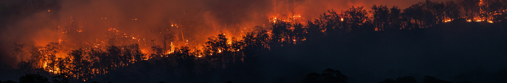

### Aims {.unnumbered}

The aims of this practical are to:

1.  Introduce deterministic and geostatistical approaches for analysing
    spatial data.
2.  Understand how common spatial interpolation techniques work.
3.  Perform interpolation in ArcGIS and become familiar with common
    applications e.g., for prediction, as an input for spatial
    regression.

### Application {.unnumbered}

To achieve this, we'll apply interpolation techniques to UK temperature
data from [Met
Office](https://weather.metoffice.gov.uk/maps-and-charts/temperature-map#?model=ukmo-ukv&layer=temperature&bbox=%5B%5B46.6795944656402,-32.12402343750001%5D,%5B60.823494332539646,24.125976562500004%5D%5D)
[automatic monitoring
stations](https://www.metoffice.gov.uk/research/climate/maps-and-data/uk-synoptic-and-climate-stations),
obtained via the [Land Observations
API](https://datahub.metoffice.gov.uk/docs/o/category/observations/overview).
We'll tackle a problem also faced by the Met Office - given limited
meteorological observations, how do we
[predict](https://www.metoffice.gov.uk/research/climate/maps-and-data/data/haduk-grid/haduk-grid)
the weather for unsampled locations?

### Data {.unnumbered}

-   Met Office temperature data, available in [`data/met-office`]
    [[Source](https://datahub.metoffice.gov.uk/docs/o/category/observations/overview)]
-   The Earth Topography (ETOPO) 2022 global digital elevation model,
    produced by the National Oceanic and Atmospheric Administration
    (NOAA), available in [`data/noaa`]
    [[Source](https://www.ncei.noaa.gov/products/etopo-global-relief-model)]
    [[Paper](https://doi.org/10.5194/essd-17-1835-2025)]

### Tools {.unnumbered}

[Extract Values to
Points](https://doc.esri.com/en/arcgis-pro/latest/tool-reference/spatial-analyst/extract-values-to-points.html?tabs=dialog)
(Spatial Analyst Tools),
[IDW](https://doc.esri.com/en/arcgis-pro/latest/tool-reference/geostatistical-analyst/idw.html?tabs=dialog)
(Geostatistical Analyst Tools), [Empirical Bayesian
Kriging](https://doc.esri.com/en/arcgis-pro/latest/tool-reference/geostatistical-analyst/empirical-bayesian-kriging.html?tabs=dialog)
(Geostatistical Analyst Tools), [Geostatistical
Wizard](https://doc.esri.com/en/arcgis-pro/latest/help/analysis/geostatistical-analyst/get-started-with-geostatistical-analyst-in-arcgis-pro.html#9E3),
[Exploratory
Interpolation](https://doc.esri.com/en/arcgis-pro/latest/tool-reference/geostatistical-analyst/exploratory-interpolation.html?tabs=dialog)
(Geostatistical Analyst Tools)

------------------------------------------------------------------------

## Practical

### Introduction

In the following introduction, I provide a rationale for interpolation,
some background on spatial econometric and geostatistical approaches to
spatial analysis, and discuss the practical data.

#### Why interpolate? {#why_interpolate}

In the [previous practical](#point_patterns), we characterised the
**centrography**, **randomness** and **clustering** of a point pattern,
based on the understanding that the point locations and their overall
distribution was a reflection of the relevant influencing factors and
mechanisms. In short, the geography of the points was **important**,
being a realisation of point processes.

In other circumstances, the distribution of points can be less
meaningful. For example, the spatial arrangements of points may simply
reflect how the data was collected, rather than being the result of the
process we are interested in. In this case, the geography of the points
is **secondary**, where the presence (and absence) of points is *not* a
realisation of point processes, but a direct consequence of sampling
strategy.

This matters because many geographic phenomena or processes are
**spatially continuous** (e.g., temperature, elevation, air pollution),
but our data collection is often limited to discrete sampling locations.
In these circumstances, our interest lies *less* in the specific values
measured at the sampling locations[^06-interpolation-1], but in
understanding and characterising the continuous nature of the phenomena.
In turn, our aim is to move from a discrete to a continuous estimate of
the phenomenon, which enables prediction of unknown values at new
locations based on known measurements from surrounding sample points.
This is **spatial interpolation**.

[^06-interpolation-1]: Although of course we should still design a
    robust and representative sampling strategy, and collect the best
    data with the available time and resources, as discussed in
    **GEOG62411** *Data Acquisition for GI Scientists*.

#### Econometrics and Geostatistics

This difference between *discretised* and *continuous* modelling of
space is a reflection of two distinct but closely-related fields of
spatial analysis: **spatial econometrics** and **geostatistics**. Both
focus on analysis of spatial data and grapple with similar concepts
(e.g., spatial structure, spatial dependence), but using very different
tools and originating from different academic backgrounds and
industries.

Much of this unit utilises spatial econometric methods, which are
focused on analysis of *discretised space* (i.e., "areal data"), where
continuous space is broken down into discrete zones (e.g., counties,
countries), often represented by Polygons or Points. The spatial
structure of these data is represented by the spatial weights matrix
$\mathbf{W}$ and spatially lagged variables, which underpin analysis of
spatial autocorrelation using Moran's $I$ and $I_{i}$ [@moran1948;
@anselin1995a] and spatial correlation using Lee's $L$ [@lee2001]. As
we'll discover in later weeks, $\mathbf{W}$ is also a key component of
both global [@anselin2002] and local spatial regression [@brunsdon1996;
@fotheringham2017]. Perhaps the most influential figure in the field of
spatial econometrics is [Luc
Anselin](https://spatial.uchicago.edu/directory/luc-anselin),
particularly since the publication of *Spatial Econometrics: Methods and
Models* in 1988 [@anselin1988a]. For an overview of the history of the
field, I would recommend @anselin2010 and @elhorst2026, but as a *brief*
introduction, spatial econometrics arose from the field of
econometrics[^06-interpolation-2], with the recognition that "*economic
phenomena localized in a certain space must often be explained by causal
factors in other spaces*" [@paelinck1978] i.e., spatial dependence. In
short, spatial econometric methods seek to account for the spatial
**dependence** i.e., observations being related across space, and
spatial **heterogeneity** i.e., observations or processes varying across
space, that characterise spatial data, where the underlying observations
are **discrete** spatial entities.

[^06-interpolation-2]: The statistical study of economics.

In contrast, the field of **geostatistics** focuses on processes
operating over **continuous space** and developed from the work of
@krige1951b and @matheron1963a, which introduced new methods to estimate
ore reserves in South African gold mines. @diggle2007 provides a useful
summary of the geostatistical perspective, which focuses on phenomena
which exist continuously throughout a region (e.g., air pollution). At
every point within that region, there is a "true" air pollution value,
but this is not directly observable. Instead, the researcher has access
to a finite set of measurements $Y_{1}, Y_{2}, \cdots, Y_{n}$ at
locations $X_{1}, X_{2}, \cdots, X_{n}$. Importantly, the values $Y_{i}$
are not necessarily equal to the true underlying values, with
uncertainty introduced by measurement error or noise. Under the
conventional assumption that the sampling locations $X_{i}$ are
independent of the underlying spatial process, geostatistics seeks to
model the unknown spatial pattern, accounting for spatial dependence and
measurement error. This enables prediction at unsampled locations i.e.,
**interpolation**. Geostatistics therefore deals with the same
geographic issues as spatial econometrics, such as spatial dependence
(i.e., autocorrelation), but using alternative methods, such as
semi-variograms, which we'll introduce today.

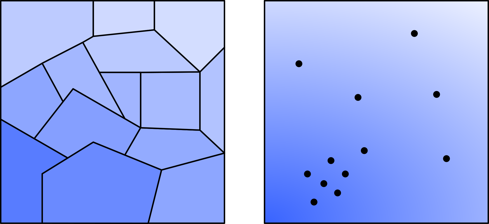{width="75%"}

#### Data description

Spatial interpolation is a key component of geostatistics, and is used
to predict unknown **values** at new locations based on known
measurements from surrounding sample points. We could use our
observations points of *Panthera tigris* from [Practical
5](#point_patterns) to demonstrate this, but it's not an ideal example,
for a few reasons:

1.  Our points don't have corresponding **values** that could be easily
    used for spatial interpolation e.g., animal height, age, or mass.

2.  As demonstrated in [Practical 5](#point_patterns), the distribution
    of *Panthera tigris* observations is highly clustered and
    **non-continuous**, with observations primarily in designated nature
    reserves. Most interpolation techniques will struggle to capture
    this spatial pattern, and instead we'd probably want to use a
    species distribution model in this situation. You can learn about
    these in [Spatial
    Ecology](https://www.manchester.ac.uk/study/masters/courses/list/07053/msc-geographical-information-science/)
    in Semester 2.

3.  Our species observations are *presence-only* data (i.e., recorded
    observations of *Panthera tigris*), and we have no access to
    corresponding *absence-data*, which you can read about more fully in
    @grattarola2023 and @kent2011. As a result, we do not know whether
    the "gaps" in our [point pattern](#p5_randomness) reflect true
    absence, or simply sampling bias [@hughes2021].

4.  As a final consideration, and linking back to the introductory
    [discussion](#why_interpolate), one of the key assumptions in our
    analysis of *Panthera tigris* was that the observed point patterns
    were a reflection of point processes. Most traditional
    geostatistical approaches to interpolation, including those
    introduced today, assume (often implicitly) that the sampling
    approach (and by definition, the point pattern) is non-preferential
    i.e., sampling locations were not determined or influenced by the
    underlying process. This is unlikely to be the case for *Panthera
    tigris*, as sampling intensity and locations are likely influenced
    by the knowledge that tiger populations are higher in protected
    areas. While this is not a "deal breaker" for a geostatistical
    approach, it does require alternative methods [@diggle2010].

Instead, we are going to apply interpolation to a **continuous** entity
that *could* be measured anywhere within our study area (air
temperature), but which is represented by a finite number of discrete
sampling locations ([Met
Office](https://weather.metoffice.gov.uk/maps-and-charts/temperature-map#?model=ukmo-ukv&layer=temperature&bbox=%5B%5B46.6795944656402,-32.12402343750001%5D,%5B60.823494332539646,24.125976562500004%5D%5D)
[automatic monitoring
stations](https://www.metoffice.gov.uk/research/climate/maps-and-data/uk-synoptic-and-climate-stations)).

### Pre-processing

To begin:

> Open ArcGIS, initialise a new project in the `practical-6` directory,
> establish a connection to `data` and load
> `observations-20260716_1400.csv`, which includes air temperature
> measurements from 127 Met Office monitoring stations, with data from
> 2026-07-16 at 14:00:00. Use [XY Table to
> Point](https://doc.esri.com/en/arcgis-pro/latest/tool-reference/data-management/xy-table-to-point.html?tabs=dialog)
> (EPSG: [4326](https://epsg.io/4326)) and save to the project directory
> e.g., `met_office_temp`.

As we are focused on the British Isles:

> [Project](https://doc.esri.com/en/arcgis-pro/latest/tool-reference/data-management/project.html?tabs=dialog)
> the resulting layer to the British National Grid (EPSG
> [27700](https://epsg.io/27700)), update the map CRS to match, and then
> investigate the dataset.

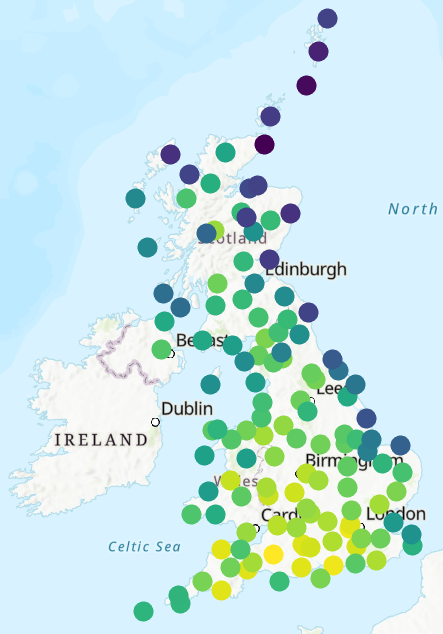{width="50%"}

 

::: question
What was the average measured temperature (`temp`) for that datetime?
:::

::: question
Does the monitoring station location (`latitude`, `longitude`) influence
the measured temperature?
:::

> Investigate spatial autocorrelation using [Spatial Autocorrelation
> (Global Moran's
> I)](https://doc.esri.com/en/arcgis-pro/latest/tool-reference/spatial-statistics/spatial-autocorrelation.html?tabs=dialog)
> and [Cluster and Outlier Analysis (Anselin Local Moran's
> I)](https://doc.esri.com/en/arcgis-pro/latest/tool-reference/spatial-statistics/cluster-and-outlier-analysis-anselin-local-moran-s.html?tabs=dialog),
> and review the Practical 2 [materials](#weights-extra) for a refresher
> on constructing the spatial weights matrix for points.

::: question
Is there evidence of global spatial autocorrelation?
:::

::: question
Is there evidence of positive local spatial autocorrelation (HH, LL) or
negative local spatial autocorrelation (HL, LH)?
:::

Following on from our analysis of [point patterns](#point_patterns):

::: question
How would you characterise the distribution of Met Office monitoring
stations? e.g., [Centrography](#point_centro) and
[Randomness](#p5_randomness).
:::

Before we can use our temperature data for spatial interpolation, it is
worth noting that the monitoring stations are at different elevations,
which can complicate analysis. For example, the temperature at [Tulloch
Bridge](https://www.metoffice.gov.uk/research/climate/maps-and-data/location-specific-long-term-averages/gfhesbk6q)
was recorded as \~27.1°C, but on nearby [Aonach
Mor](https://www.metoffice.gov.uk/research/climate/maps-and-data/location-specific-long-term-averages/gfh7qbnkj),
\~17 km away but \~1000 m higher, it was just \~18.1°C.

One solution is to produce an *elevation-corrected temperature*,
normalising to sea level. This can be produced by applying the standard
**environmental lapse rate** of \~6.49°C per km i.e., for every 1000 m
of elevation gained, the temperature (on average) would be \~6.49°C
lower.

> Load the Earth Topography (ETOPO) 2022 global digital elevation model
> `etopo-2022.tiff` and use [Extract Multi Values to
> Points](https://doc.esri.com/en/arcgis-pro/latest/tool-reference/spatial-analyst/extract-multi-values-to-points.html?tabs=dialog)
> to store the elevation value (m) for each monitoring station as
> `elev`.

::: note
Note this is a highly generalised representation of topography, and
there are many more detailed datasets available e.g., [OS Terrain
5](https://www.ordnancesurvey.co.uk/products/os-terrain-5). In the
interests of file size and processing time...
:::

Due to this generalisation, a small number of the elevation values are
implausible (i.e., `elev`\< 0 m).

> Use Calculate Field, updating `elev` using:
> `0 if !elev! < 0 else !elev!` to set all negative values to 0.

We can now calculate our sea-level equivalent temperature as follows:

> Create a new field in the Attribute Table using Calculate Field
> (`sl_temp`, "Field Type" = `Double`), using the following expression:
> `!temp! + (!elev! * 0.00649)`, which increases each temperature value
> by 0.00649°C for every 1 m above sea level.

::: note
Note it is recognised that this is at best an approximate, as the
lapse rate can vary spatially and temporally e.g., temperature
inversions.
:::

Our dataset is now ready for interpolation, so:

> Remove the original standalone Met Office table, the ETOPO raster, and
> any other map layers (e.g., the points *before* projection to the
> British National Grid).

### Interpolation types

Before we explore spatial interpolation methods in more detail, it is
important to first discuss some of key differences between the methods.

The first important distinction is between **deterministic** and
**geostatistical** approaches. [*Deterministic*](https://doc.esri.com/en/arcgis-pro/latest/help/analysis/geostatistical-analyst/deterministic-methods-for-spatial-interpolation.html) approaches produce
spatial predictions at unsampled locations based on pre-determined
mathematical rules, applied to the geometric properties and values of
the observations. A widely-used example would be Inverse Distance
Weighting ([IDW](https://doc.esri.com/en/arcgis-pro/latest/help/analysis/geostatistical-analyst/how-inverse-distance-weighted-interpolation-works.html)), in which the predicted value at a location is
calculated based on the measured values and their proximity, with nearby
observations weighted more heavily than distant observations, in
accordance with Tobler's Law [@tobler1970].

While [*geostatistical*](https://doc.esri.com/en/arcgis-pro/latest/help/analysis/geostatistical-analyst/what-are-geostatistical-interpolation-techniques-.html) methods also incorporate the geometric properties
and values of the observations, these methods assume that the
observations are a partial and imperfect realisation of the true
underlying spatial process, which can be treated as a *spatial random
process*. This is not to say that the process itself is physically
random (e.g., temperature is predictably influenced by factors such as
latitude, elevation, and humidity), but that the value of the process at
an unobserved location can be represented as a *random
variable*[^06-interpolation-3], reflecting our uncertainty about its
unknown value.

[^06-interpolation-3]: A [**random
    variable**](https://en.wikipedia.org/wiki/Random_variable) is a
    function which describes the range of possible values that could
    occur, and their probabilities. For example, let's say the "true"
    (unobserved) temperature at a location is $17.6$ °C. The possible
    values at that location might be $..., 17.0, 17.1, 17.2, ...$, each
    with different probabilities of occurrence. In turn, there is a
    random variable for each unobserved location in the modelling area,
    and collectively these are referred to as a **spatial random
    field**. 

Geostatistical methods model the spatial dependence (i.e., spatial
autocorrelation) between values at different locations to produce a
model of the underlying spatial process. This model can then be used for
prediction, rather than relying solely on pre-determined mathematical
rules, such as those used in IDW. The most commonly used geostatistical
method is Kriging [@krige1951], along with its many
variants.

Another important distinction is between **global** and **local**
interpolators. *Global* interpolators make predictions for unsampled
locations based on the entire set of values in the dataset (although
these may be weighted based on distance, for example), while local
interpolators make predictions based on a smaller set of neighbouring
locations. This is analogous to the calculation of [spatial
weights](#define_sw), which could incorporate all of the objects in the
dataset (e.g., inverse distance), or alternatively could use a binary
approach to define neighbouring ($w=1$) and non-neighbouring objects
($w=0$).

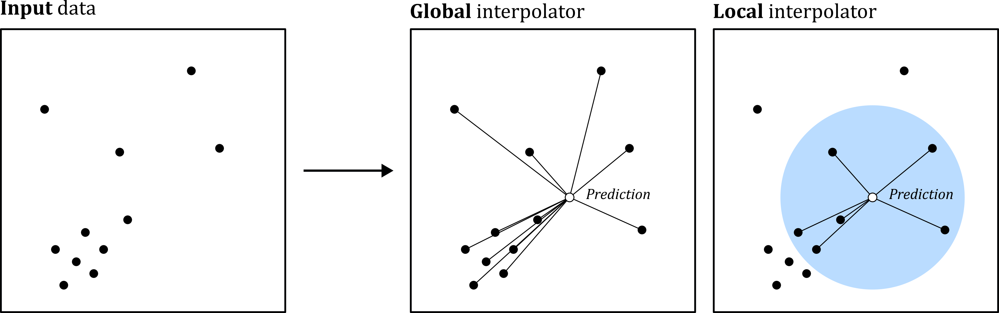{width="100%"}

 

Finally, the outputs of spatial interpolation can be described as either
**exact** or **approximate**. *Exact* methods will force the predicted
values to match the observed values, whereas *approximate* methods can
produce predicted values which differ from the observed values at the
measurement locations.

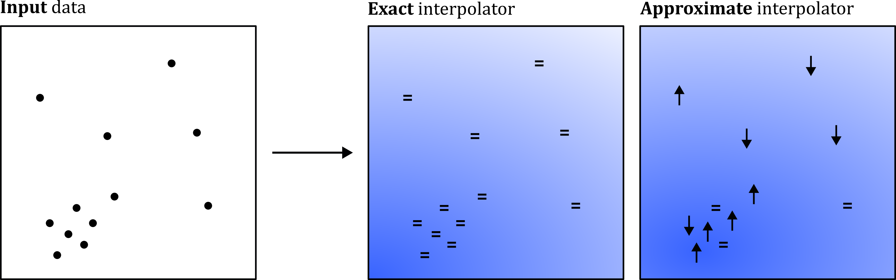{width="100%"}

  

### Deterministic interpolation: proximity

The simplest form of deterministic spatial interpolation is **proximity** or **Thiessen** interpolation, which assigns the value of the closest sampled location to unsampled locations.

A historic interpolation method, designed by @thiessen1911 for meteorological data (rainfall), proximity interpolation involves the construction of a set of polygons around each sampling point, where all locations within the polygon are closer to the sampling point than any other point in the dataset[^thiessen_link].

[^thiessen_link]: We introduced this approach briefly in the [Extra](#weights-extra) section of the **Spatial Weights** practical. These polygons are referred to as *Thiessen* polygons after @thiessen1911, or *Voronoi* polygons after mathematician Georgy Feodosevich Voronoy. 

> Use [Create Thiessen Polygons](https://doc.esri.com/en/arcgis-pro/latest/tool-reference/analysis/create-thiessen-polygons.html?tabs=dialog), with "Output Fields" = `All Fields`. Save the output with a suitable name e.g., `met_office_thiessen` and then modify the Symbology to explore the result. 

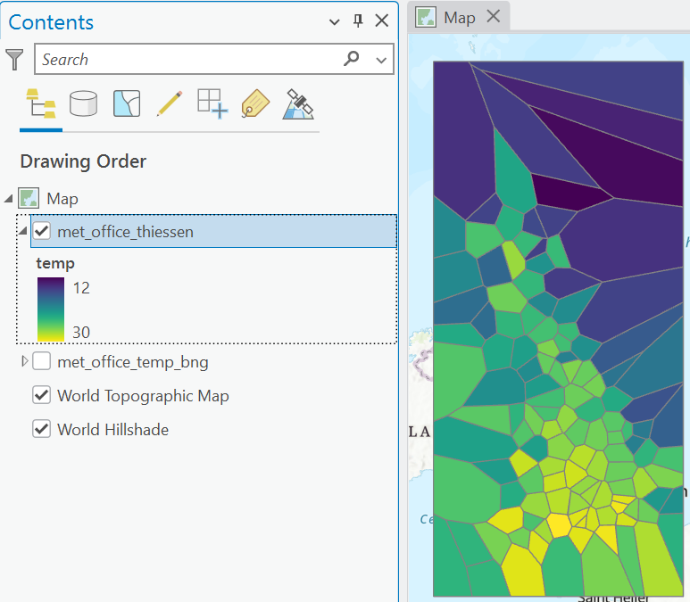{width="60%"}

 

::: question
To what extent do you think is this a good representation of the "true" (unobserved) spatial variation in temperature? 
:::

Interpretation

I think you'll agree that this is *unlikely* to be a good representation of the true variability in air temperature, given the abrupt changes in temperature at polygon boundaries. Our expectation is that air temperature would vary gradually with space. 

To assess the quality of this output more rigorously, we could compare the "predicted" values with an independent set of air temperature values, held back from the original analysis. For example, this could be measurements from the [Weather Observations Website](https://wow.metoffice.gov.uk/) (WOW), which allows anyone to contribute weather data from their own monitoring station, although sadly this has been recently retired. 

 

### Deterministic interpolation: IDW

A more commonly used deterministic interpolation method is **Inverse Distance Weighting** (IDW), in which the estimated value $\hat{Z}_{j}$ at location $j$ is a distance-weighted average of the observed values, defined as:

$$\hat{Z}_j=\frac{\sum_{i}z_{i}w_{i}}{\sum_{i}w_{i}}$$

where $z_{i}$ is the observed value at location $i$ and $w_i$ is the corresponding weight, which can be calculated as:

$$w_{i}=\frac{1}{d_{i}^{p}}$$

Here $d_{i}$ is the distance between locations $i$ and $j$, and $p$ is the power coefficient, which determines how the influence of observations varies with distance i.e., as $p$ increases, nearer observations are weighted more heavily, and vice versa. 

For example, take the following distribution of observations and values:

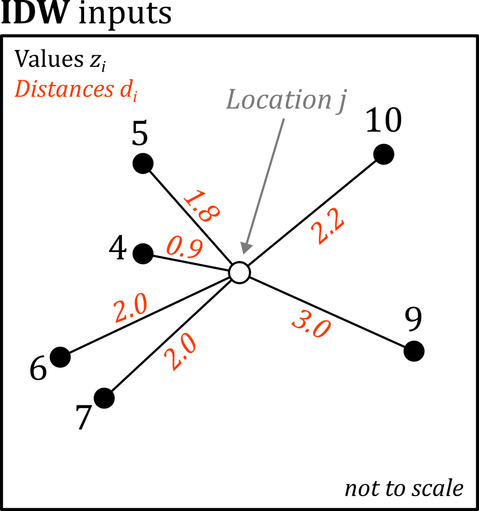{width="40%"}

 

Here is a summary of the above observations, including the values $z_i$ and the corresponding distances $d_{i}$:

$$\begin{array}{cc}
z_{i} & d_{i}\\
\hline
5 & 1.8\\
10 & 2.2\\
9 & 3.0\\
7 & 2.0\\
4 & 0.9\\
6 & 2.0\\
\end{array}$$

A typical power coefficient might be $p=2$, so we can calculate the weight $w_i$ for each observation as:

$$\begin{array}{cc}
w_{i}\\
\hline
0.31\\
0.21\\
0.11\\
0.25\\
1.23\\
0.25\\
\end{array}$$

Using an IDW approach, the closest observation has the highest weight ($z_i=4, w_i=1.23$) and the furthest observation has the lowest weight ($z_i=10, w=0.11$). We can modify the influence of distance on the weights via $p$, as shown below:

$$\begin{array}{cc}
& w_{i} & & \\
p=1 & p=2 & p=4\\
\hline
0.56 & 0.31 & 0.10\\
0.45 & 0.21 & 0.04\\
0.33 & 0.11 & 0.01\\
0.50 & 0.25 & 0.06\\
1.11 & 1.23 & 1.52\\
0.50 & 0.25 & 0.06\\
\end{array}$$

Continuing with $p=2$, the numerator includes the weighted observations, while the denominator is based on the weights alone:

$$\begin{array}{cc}
z_{i}w_{i} & w_{i}\\
\hline
1.54 & 0.31\\
2.07 & 0.21\\
1.00 & 0.11\\
1.75 & 0.25\\
4.94 & 1.23\\
1.50 & 0.25\\
\end{array}$$

$$\begin{array}{cc}
\sum_{i}z_{i}w_{i} & \sum_{i}w_{i}\\
\hline
12.80 & 2.36\\
\end{array}$$

The estimated value $\hat{Z}_{j}$ at location $j$ is therefore:

$$\hat{Z}_{j}=\frac{\sum_{i}z_{i}w_{i}}{\sum_{i}w_{i}}=\frac{12.80}{2.36}\approx5.42$$

To run IDW in ArcGIS:

> Use the Geoprocessing tool [IDW](https://doc.esri.com/en/arcgis-pro/latest/tool-reference/spatial-analyst/idw.html?tabs=dialog) (Geostatistical Analyst Tools), with the Met Office monitoring stations as the "Input point features", "Z value field" = `sl_temp`, and "Power" $p=2$. Use a suitable name for the "Output Raster", but leave the "Output geostatistical layer" blank. For now, leave all other inputs as the default, including the Output cell size, Search Neighbourhood, Neighbour count, and Sector Type, as we'll explore these in a moment.

IDW produces predictions within the  the bounds of the input data, hence *interpolation*, rather than *extrapolation*. 

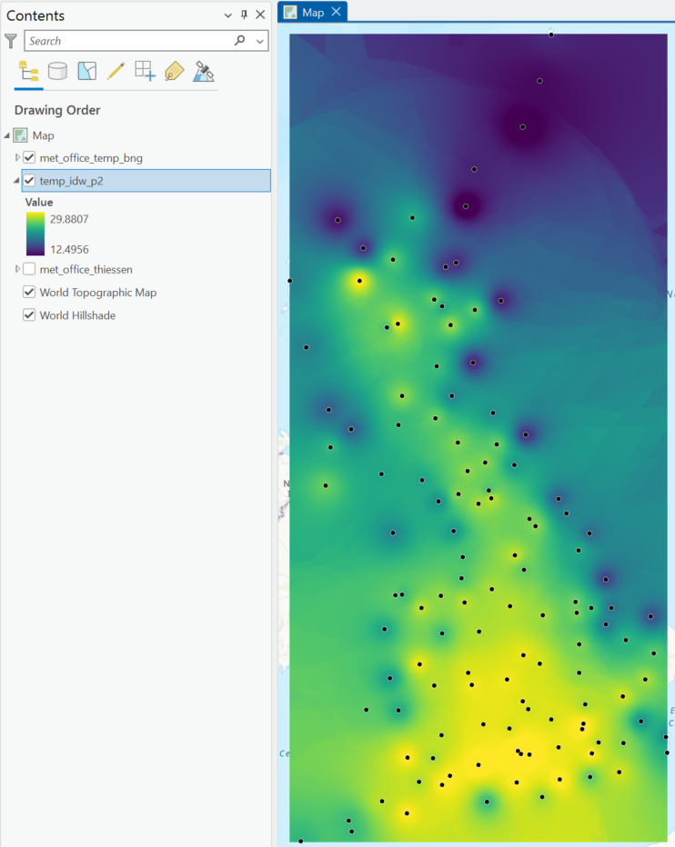{width="40%"}

 

::: question
Does IDW produce the key spatial trends in temperature?
:::

::: question
Are there are any regions where model performance varies?
:::

The [IDW](https://doc.esri.com/en/arcgis-pro/latest/tool-reference/spatial-analyst/idw.html?tabs=dialog) tool used above has produced a static layer, and we could re-run the
tool with different settings to explore their impact on the predicted
surface (e.g., varying $p$). We can achieve this much more simply, however, via the [Geostatistical
Wizard](https://doc.esri.com/en/arcgis-pro/latest/help/analysis/geostatistical-analyst/get-started-with-geostatistical-analyst-in-arcgis-pro.html#9E3). This workflow includes a range of *deterministic* and *geostatistical*
interpolation methods and guides the user as they construct and evaluate
the performance of an interpolation model.

As a result, while all of the interpolation methods can be run in a standalone tool, such as [IDW](https://doc.esri.com/en/arcgis-pro/latest/tool-reference/spatial-analyst/idw.html?tabs=dialog) or [Empirical Bayesian Kriging](https://doc.esri.com/en/arcgis-pro/latest/tool-reference/geostatistical-analyst/empirical-bayesian-kriging.html?tabs=dialog), the Geostatistical Wizard can offer a more streamlined and dynamic experience.

> Open the [Geostatistical Wizard](https://doc.esri.com/en/arcgis-pro/latest/help/analysis/geostatistical-analyst/get-started-with-geostatistical-analyst-in-arcgis-pro.html#9E3), which is available under Analysis &rarr; Workflows. Under "Deterministic Methods", select "Inverse Distance Weighting" and choose the relevant "Source Dataset" and "Data Field" (`sl_temp`). Leave "Weight Field" blank[^weight_field] and then press **Finish**, which should export a default IDW output to the Map View.

[^weight_field]: This option allows the user to apply further weighting to each observation, in addition to the distance-based weighting which is intrinsic to IDW. For example, if the monitoring stations used different equipment with varying levels of accuracy and precision, we might want to weight some observations more highly than others. 

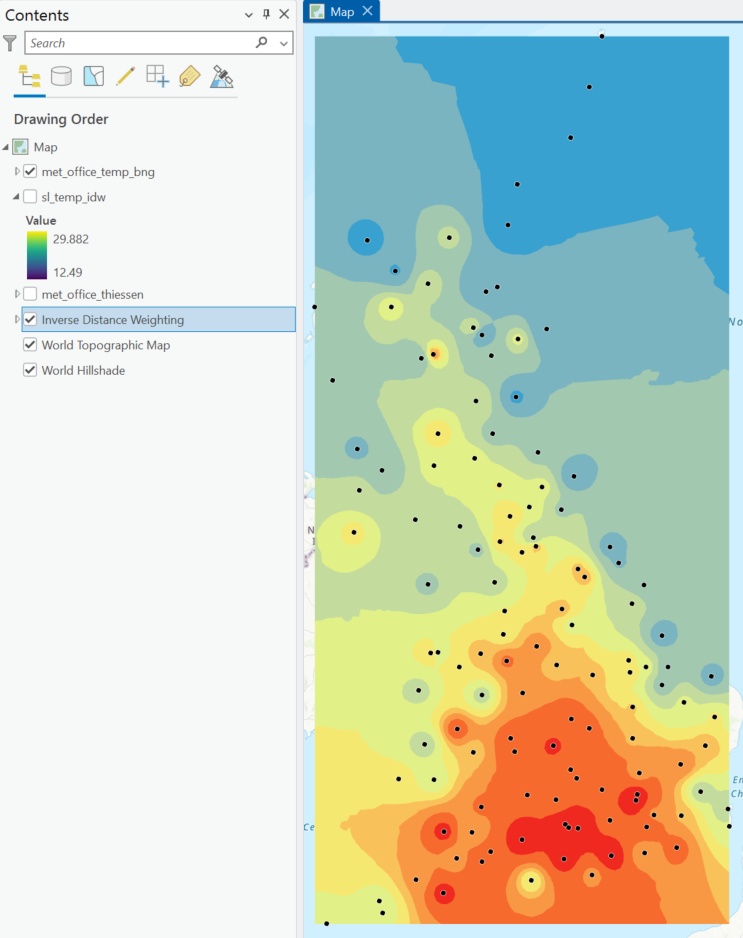{width="40%"}

 

The Geostatistical Wizard output *should* be identical to the output of the standalone
[IDW](https://doc.esri.com/en/arcgis-pro/latest/tool-reference/spatial-analyst/idw.html?tabs=dialog) tool, but this is difficult to assess, given the different layer symbologies and data formats (i.e., vector and raster). 

> Export Layer &rarr; To Rasters, using the default settings, and save to the project directory with a suitable name e.g., `temp_idw_gw`. 

To apply the symbology of an existing layer:

> Right click the layer in the Contents Pane with the symbology you want to apply &rarr; Sharing &rarr; Save as Layer File, saving to the project directory. To apply this to the IDW raster produced by the Geostatistical Wizard, navigate to Symbology &rarr; Import from Layer File. 

Using this approach, there is a clear correspondence between the outputs, although the intensity of values seems to differ in places, when the same colour scale is used:

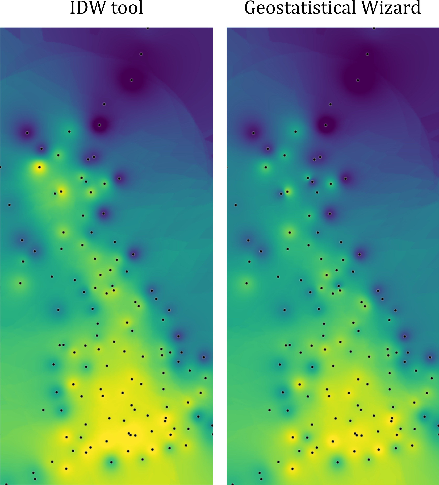{width="70%"}

 

::: problem
**James** can you reproduce the above plots, and the outputs below? The outputs of IDW and the
Geostatistical Wizard don't show systematic error (R2=0.99), but there
are deviations for most points. Perhaps I've missing something in the
tool setup, but intuitively we would expect the IDW to be the same
"under the hood".
:::

A more rigorous approach to assess the degree of correspondence would be to generate a set of a random points within the modelled area, and compare the predicted values from both methods at those points. 

::: question
Why can't we just use the Met Office monitoring stations for this purpose? 
:::

Answer

IDW is an **exact** interpolator, so the predicted values from both methods should match the observed values at the monitoring station locations. 

 

> Use [Minimum Bounding Geometry](https://doc.esri.com/en/arcgis-pro/latest/tool-reference/data-management/minimum-bounding-geometry.html?tabs=dialog) to create a bounding box for the Met Office monitoring stations ("Geometry Type" = `Envelope`), and then use [Create Random Points](https://doc.esri.com/en/arcgis-pro/latest/tool-reference/data-management/create-random-points.html?tabs=dialog) to create 100 random points within the output geometry. 

> When complete, use [Extract Multi Values to Points](https://doc.esri.com/en/arcgis-pro/latest/tool-reference/spatial-analyst/extract-multi-values-to-points.html?tabs=dialog) to sample the IDW rasters at the random point locations, storing the values produced via the standalone IDW tool (`pred_idw`) and those produced by the Geostatistical Wizard (`pred_gw`). Inspect the relationship between the predictions using Create Chart &rarr; Scatter Plot.

::: question
How would you assess the correspondence between the IDW and Geostatistical Wizard outputs?
:::

To quantify this further:

> Create a new field in the Attribute Table to summarise the difference e.g., `abs(!pred_idw!-!pred_gw!)`.

::: question
What is the average and maximum absolute deviation between the methods?
:::

Interpretation

Broadly, the two tools are returning similar values when the default settings are used, with no evidence of **systematic error** (R^2^ = 0.99). However, there are some minor to moderate differences between the predictions, which I am unable to account for! 

 

Now that we know how to run IDW, we need to understand the key properties that influence the modelled surface, rather than simply accepting the defaults. 

> Open the [Geostatistical
Wizard](https://doc.esri.com/en/arcgis-pro/latest/help/analysis/geostatistical-analyst/get-started-with-geostatistical-analyst-in-arcgis-pro.html#9E3), 
again selecting "Inverse Distance Weighting" under "Deterministic Methods", and the correct "Source Dataset" and "Data Field" (`sl_temp`). This time select **next**. 

The following screen allows you to inspect the modelled IDW surface, and evaluate how this changes with different settings. You can:

> Click on the map to identify the predicted value (for the current IDW configuration) at location $j$. 

> Change point size for visibility and toggle "Show Source Dataset" to identify the points which are contributing to the predicted value at the current location $\hat{Z}_{j}$, where the colour represents the weight (inverse distance). 

> Modify "Maximum Nieghbours", which should then be reflected in the size of the "Source Dataset". 

The size of the source dataset is determined by the "Major and Minor Semiaxis" values, which govern the search neighbourhood around $j$. For this dataset, the default value is ~330 km[^default_semiaxis]. 

[^default_semiaxis]: I couldn't find any documentation explaining how this was calculated, but after a bit of testing, it appears to be a fraction (25%) of the diagonal length of the bounding box (i.e., the **hypoteneuse** $h$) enclosing the points. You can test this yourself by using [Calculate Geometry Attributes](https://doc.esri.com/en/arcgis-pro/latest/tool-reference/data-management/calculate-geometry-attributes.html?tabs=dialog) on the output of [Minimum Bounding Geometry](https://doc.esri.com/en/arcgis-pro/latest/tool-reference/data-management/minimum-bounding-geometry.html?tabs=dialog), storing the mininum and maximum of the $x$ and $y$ coordinates, which are (approximately) as follows: $x_\text{min}=75425$, $x_\text{max}=634483, $y_\text{min}=9956, $y_\text{max}=1207985$. The diagonal length $h$ is calculated as: $h=\sqrt{(x_\text{max}-x_\text{min})^2+(y_\text{max}-y_\text{min})^2}=1,322,051 \: \text{m}$. The ratio of the default semiaxis ($\approx330,512$) to $h$ is exactly 0.25, which is too much of a coincidence! 

::: question
With the default value, is this a **global** or **local** interpolator?
:::

> Change the "Sector Type". The default = 1, which searches for $n$ neighbours within a circle around each predicted location $j$. This can be increased to four or eight sectors, and the search neighbourhood can be rotated using the "Angle" input.  

Using different sector types can prevent directional bias i.e., if there is only sector, the $n$ nearest points might be in one broad direction (e.g., north). Splitting into multiple sectors forces neighbors to come from different directions.

> The **power** setting is our power coefficient $p$, with a default of $p=2$.

::: question
How does the modelled surface change across $p=1-10$?
:::

::: question
What does the output resemble for $p=100$?
:::

Answer

As we increase $p$, the modelled surface increasingly resembles the output of **proximity** or **Thiessen** interpolation, due to the increasing weight allocated to the closest observation. 

 

The power coefficient $p$ can also be optimised via *cross validation* which we'll discuss more fully in the next section.

> When you are happy with your chosen settings, or you have returned to the default settings, click **next**. 

#### Cross-validation of IDW {#cross-valid}

On the next tab in the Geostatistical Wizard, we are presented with *predicted* values, *errors*, and the *distribution* of the predicted values.

These are derived from [leave-one-out-cross-validation](https://doc.esri.com/en/arcgis-pro/latest/help/analysis/geostatistical-analyst/performing-cross-validation-and-validation.html), which involves removing a single point from the input dataset, re-running interpolation, and then evaluating the deviation of the predicted value from the input value *at that location*. This is repeated for all points in the input dataset.

This can be used to calculate root-mean-square error (RMSE), which is defined as:

$$\text{RMSE}=\sqrt{\sum_{i=1}^n(O_i-M_i)^2}$$ 

which is the square root of the sum of the squared differences between observed values ($O_i$, *input temperature*) and modelled values ($M_i$, *interpolated temperature*). This is the average distance between the model predictions and the observed values and is expressed in the units of the observed values (i.e., °C).

> Interpret the RMSE value and the correspondence between observed and modelled values. 

> Inspect the pattern of error, with the measured values on $x$ and the errors on $y$. 

::: question
Is the pattern systematic or random?
:::

When complete:

> Export your layer.

::: question
How different is your modified IDW output compared to the default settings?
:::

### Geostatistical interpolation: Ordinary Kriging

One disadvantage of IDW and other deterministic approaches is that there is no explicit consideration of the spatial structure of the data, while predictions are made based on pre-determined mathematical rules (e.g., $w_{i}=\frac{1}{d_{i}^{p}}$), independent of the actual spatial dependence between observations. In contrast, **geostatistical** approaches incorporate the spatial dependence of the observations (also known as **variography**) to develop a model of the underlying (unobserved) spatial process. This typically results in more accurate predictions, and importantly, allows for quantification of **uncertainty**. 

**Kriging**, developed and popularised by @krige1951 and @matheron1963,
is synonymous with the field of geostatistics, and comes in [many
variants](https://doc.esri.com/en/arcgis-pro/latest/help/analysis/geostatistical-analyst/what-are-the-different-kriging-models-.html),
including Ordinary, Universal, Co-kriging, Indicator, and Empirical
Bayesian, some of which we'll use today. Understanding how these work,
and selecting the appropriate version for your data and analysis, is
therefore critical.

#### Variogram construction

One of the key components of all forms of Kriging is the **variogram**, which represents the differences between data points at specific distances i.e., the similarity of data points $y$ with increasing distance $x$. This is used to model spatial dependence, which is the key distinction between deterministic and geostatistical approaches to interpolation. Rather than introducing a schematic of a variogram here[^sneak_peek], we'll begin by exploring how variograms are defined and constructed. While there isn't a standalone tool to produce a variogram in ArcGIS, we can produce one manually with a bit of data wrangling, and this is useful to develop your understanding. 

[^sneak_peek]: Although [here](https://en.wikipedia.org/wiki/Variogram) is a taster if you can't wait...

> Use [Generate Near Table](https://doc.esri.com/en/arcgis-pro/latest/tool-reference/analysis/generate-near-table.html?tabs=dialog), using the monitoring station data as both "Input Features" and "Near Features", and unchecking "Find only closest feature". This will return the distances between all pairs of observations (`NEAR_DIST`). 

::: question
Why is "Method" =  `Planar` suitable here?  
:::

Answer

As we are using a suitable **projected** CRS for our area of interest (EPSG [27700](https://epsg.io/27700)), errors in distance calculations will be very small, compared to an ellipsoidal (geodesic) approach.  

 

> Next use [Join Field](https://doc.esri.com/en/arcgis-pro/latest/tool-reference/data-management/join-field.html?tabs=dialog) to modify the Attribute Table of the Near Table, joining temperature values for the origins (`IN_FID`) and destinations (`NEAR_FID`) using "Field Mapping":
>
> - "Input Field" = `IN_FID`, "Join Field" = `FID`, rename `sl_temp` to `orig_temp`
> - "Input Field" = `NEAR_FID`, "Join Field" = `FID`, rename `sl_temp` to `dest_temp`

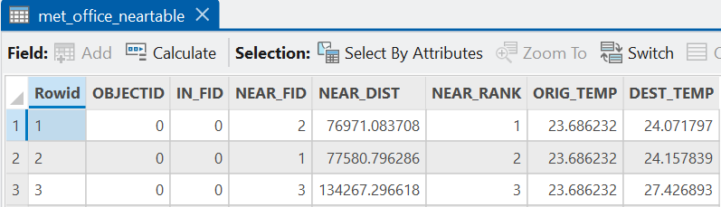{width="80%"}

 

With the distances between observations included in the Attribute Table (`NEAR_DIST`), as well as the origin-destination temperatures (`orig_temp`, `dest_temp`), we can calculate the **semivariance** ($γ$) for each pair following @matheron1963 as follows: 

$$γ=\frac{(z_2-z_1)^2}{2}$$

where $z_{1}$ and $z_{2}$ are the observed temperature values for each pair of observations. The **semivariance** is simply half the squared difference between the observed values. 

> Using Calculate Field, devise your own expression to create a `gamma` field ("Field Type" = `Double`) representing the semivariance $γ$. 

Expression

Here is an expression: `((!orig_temp!-!dest_temp!)**2)/2` or `pow(!orig_temp!-!dest_temp!, 2)/2`

 

If successful, we now have all the information we need to start building our variogram. The first step in this process is the creation of the **variogram cloud**, which represents the empirical (observed) relationship between distance and semivariance for all pairs of observations, and is the basis for subsequent geostatistical modelling, see @ploner1999.

> To create a **variogram cloud**, use Create Chart &rarr; Scatter Plot, with `NEAR_DIST` on $x$ and `gamma` on $y$. 

Your output should resemble the following:

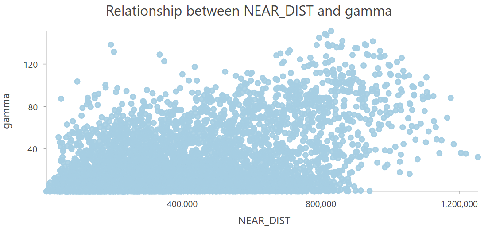{width="80%"}

 

This is large and very noisy dataset, containing around ~16,000 point pairs[^point_pairs], so a typical next step is to simplify the dataset, which is achieved by binning the paired observations into intervals, referred to as **lags**, and calculating summary statistics for each lag.

[^point_pairs]: The number of ordered pairs is calculated as $n(n-1)$, which equals 16,002 for the 127 Met Office monitoring stations. 

As above, this can be calculated for us via the Geostatistical Wizard, but we can also achieve this manually:

>  In the Attribute Table for the Near Table, use Calculate Field to create a new field (`lag`, "Field Type" = `Long 32-bit integer`), using the following expression: `int(!NEAR_DIST! // 25000)`, which sorts our measured distances into lags of 25 km i.e., distances of 0 - 25 km are lag $0$, 25 - 50 km are lag $1$, and so on.

When complete:

> Use [Summary Statistics](https://doc.esri.com/en/arcgis-pro/latest/tool-reference/analysis/summary-statistics.html?tabs=dialog) on the Near Table, calculating the mean of the semivariance values (`gamma`), using `lag` as the case field. 

The output of this tool can be visualised using Create Chart &rarr; Scatter Plot, which reveals how the *average* semivariance between points changes with distance. We would refer to this as the **sample variogram**[^alt_variogram].

[^alt_variogram]: You may also see this referred to as the **experimental** or **empirical** variogram. 

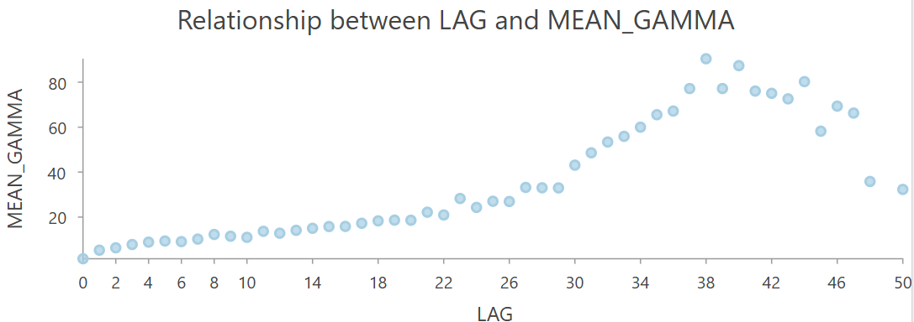{width="80%"}

 

::: note
You should now have an understanding of the **variogram cloud** (i.e., empirical data showing distances and semivariances for each point pair) and the **sample variogram** (i.e., simplification of the empirical data into bins or *lags*).
:::

To clarify, the manual approach we've taken here has been used for illustrative purposes, and hopefully you should now have a better understanding of the data that underpin the later modelling. In future, you should use the Geostatistical Wizard, the standalone tools, or other implementations, which give you greater control over the data and model choices e.g., our selection of a 25 km lag size is somewhat arbitrary!

#### Variogram modelling {.unnumbered}

The next step in the geostatistical workflow is to produce a **variogram model** which describes the trends in the sample variogram. This is a mathematical representation of the observed spatial dependence in the dataset. 

These models are fitted to the sample variogram, with a [schematic](https://en.wikipedia.org/wiki/Variogram) example here:

{width="70%"}

 

Some of this should be very familiar to you. Our **sample variogram** is present as the *observed points*, which represents the average semivariance $y$ for each lag $x$, which we calculated using [Summary Statistics](https://doc.esri.com/en/arcgis-pro/latest/tool-reference/analysis/summary-statistics.html?tabs=dialog). A **variogram model** has then been fitted to the observed points ("*empirical*" black line). This model typically has the following [components](https://doc.esri.com/en/arcgis-pro/latest/help/analysis/geostatistical-analyst/understanding-a-semivariogram-the-range-sill-and-nugget.html):

- **Range**: the distance $x$ at which spatial dependence between observations is no longer detected ($\approx25 \: \text{km}$). Observations within this range would be considered spatially autocorrelated.   
- **Sill**: the corresponding semivariance on the $y$ axis for the detected *range*. This represents the typical degree of dissimilarity (increasing $y$) for observations that are greater than the *range* apart. 
- **Nugget**: the height of the jump of the variogram model at the origin ($x=0$). Theoretically, as the distance between observations shrinks to 0, the semivariance should also equal 0. However, many fitted variogram models exhibit a discontinuity at the origin, with $γ>0$. This is typically attributed to measurement error and/or spatial variation on a scale smaller than the smallest distance between any two points [@diggle2007].

 

There are lots of Kriging variants we can use to develop the variogram model. Here we will use **Ordinary Kriging**, which assumes the data has a constant but unknown mean
(i.e., *stationarity*). 

> Open the Geostatistical Wizard &rarr; "Kriging / CoKriging", using `sl_temp` as the "Data Field" for "Input Dataset 1", and press **next**. 

For each Kriging method, we can generate a range of [outputs](https://doc.esri.com/en/arcgis-pro/latest/help/analysis/geostatistical-analyst/what-output-surface-types-can-the-interpolation-models-generate-.html), including:

- *Prediction* i.e., the interpolated values (default)
- *Standard Error* i.e., errors associated with those interpolated values (standard deviation)
- *Probability* i.e., the probability that the interpolated value will be above or below a predefined threshold (e.g., a pollutant level relative to a legal limit)
- *Quantile* i.e., a prediction layer for the specified quantile (e.g., 10^th^, 95^th^)

> Select "Ordinary Kriging" and "Prediction", leaving "Transformation type" and other settings as `None`, and press **next**. 

You will be presented with a lot of information and a great many options on the Semivariogram/Covariance Modelling tab, so we'll explore this slowly:

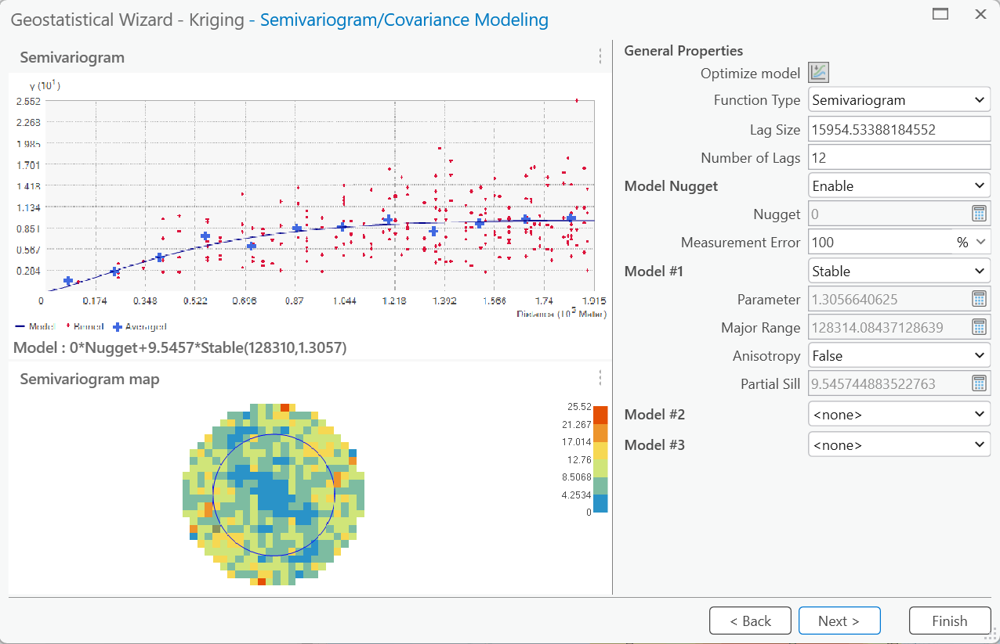{width="80%"}

 

The **sample variogram** and an initial **variogram model** are here, although using different settings for the lag size to those we selected earlier.

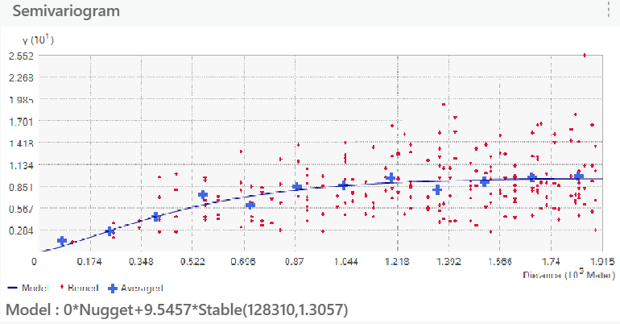{width="60%"}

 

Our **objective** is to produce a variogram model (blue line) which achieves the best match with the sample variogram (blue crosses). As a reminder, the sample variogram is built on the variogram cloud (red points, binned). As summarised in the [documentation](https://doc.esri.com/en/arcgis-pro/latest/help/analysis/geostatistical-analyst/fitting-a-model-to-the-empirical-semivariogram.html),
our model should:

- Pass through the center of the cloud of binned values (red dots).
- Pass as closely as possible to the averaged values (blue crosses).

 

The initial model produced by the Geostatistical Wizard is defined mathematically as follows:

$$0*\text{Nugget}+9.5457*\text{Stable}(128310,1.3057)$$

where $\text{nugget}=0$, $\text{sill}=9.5457$ and $\text{range}=128,310$. The model type (which we'll discuss momentarily) is referred to by esri as "Stable", which has a smoothing parameter, in this case of $1.3057$.

This model describes how semivariance changes with distance. This information is then used to calculate how observations and their values $i$ should be weighted when predicting at an unsampled location $j$. For example, let's say the distance between $j$ and $i$ is $100\:\text{km}$. If we plug the value of $100\:\text{km}$ into the model above, we can predict the semivariance, which in turn, is used to produce weights for each observation[^model_formulation]. In turn, the Kriging approach shares components with IDW, and is defined as follows:

$$\hat{Z}_j=\sum_{i=1}^n\lambda_i Z_i$$

Both methods predict values at an unsampled location ($\hat{Z}_j$), taking into account the **weighted** values at the sampled locations $Z_i$. However, while IDW uses pre-determined rules to calculate the weights for each observation[^idw_weights], Kriging calculates weights $\lambda_i$ for each observation based on the observed spatial dependence, which is represented by our model above. Importantly, weights are not calculated independently for each observation (as with IDW), but are calculated **simultaneously** for all the observations that contribute to the prediction $\hat{Z}_j$. The advantage of this is that Kriging can reduce the weights for nearby and spatially dependent observations, ensuring they are not "double counted" when predicting, as illustrated below:

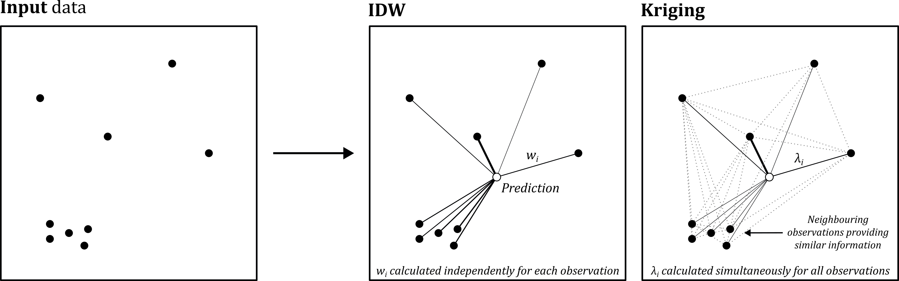{width="100%"}

 

[^idw_weights]: Weights for each observation are calculated as follows: $w_{i}=\frac{1}{d_{i}^{p}}$

[^model_formulation]: Note that we are **not** going to explore the mathematics of the model in great depth, as this requires a reasonably advanced level of understanding e.g., simultaenous equations. If you are interested in the models, some are described [here](https://doc.esri.com/en/arcgis-pro/latest/tool-reference/3d-analyst/how-kriging-works.html#DC0). Our focus is on **understanding** what the models represent and how they are applied. 
 
Before we apply our "Stable" model, we need to understand how it was developed and more broadly, variogram **calibration**. 

#### Variogram calibration

The variogram model is sensitive to the specification of the sample variogram and the properties of the model itself. There are [11 model options](https://doc.esri.com/en/arcgis-pro/latest/help/analysis/geostatistical-analyst/fitting-a-model-to-the-empirical-semivariogram.html) available to the user (i.e., Stable, Gaussian, Circular, Exponential, ...), and there is flexibility to modify the lag size (measured in the units of the CRS, m) and the number of lags, among other properties. Correct specification of the sample variogram and model is important. For example, if the selected lag size is too large, then short-range autocorrelation may be masked.

> Keep a note of the current lag size ($15954.53388184552$) and number of lags ($12$), and then update the "Lag Size" value to 25,000 m, which is the lag value we selected earlier. If you increase the "Number of Lags", this should begin to resemble the sample variogram we created earlier. When you're happy you understand this, return to the default lag size and number.

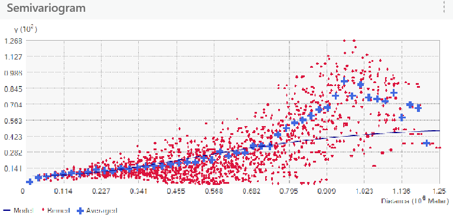{width="60%"}

 

There are various techniques that can be used for selecting the lag size and the number of lags. For example, a starting point might be the average distance between each point and their nearest neighbour, as outlined in the [documentation](https://doc.esri.com/en/arcgis-pro/latest/help/analysis/geostatistical-analyst/choosing-a-lag-size.html).

> Use [Average Nearest Neighbour](https://doc.esri.com/en/arcgis-pro/latest/tool-reference/spatial-statistics/average-nearest-neighbor.html?tabs=dialog) to calculate this. 

A rule-of-thumb for the number of lags is half of the largest distance between any two points, divided by the lag size. 

Another approach is to use **cross-validation** i.e., for a given model type (i.e., Stable, Gaussian, Circular, Exponential, ...), adjust the lag size and the sample variogram parameters (nugget, sill, range) and then assess performance via cross-validation, returning the combination with the lowest RMSE. Some of the ArcGIS model types are described [here](https://doc.esri.com/en/arcgis-pro/latest/tool-reference/3d-analyst/how-kriging-works.html#DC0). A better visualisation of model types is from the R `gstat` package, although not all are available in ArcGIS: 

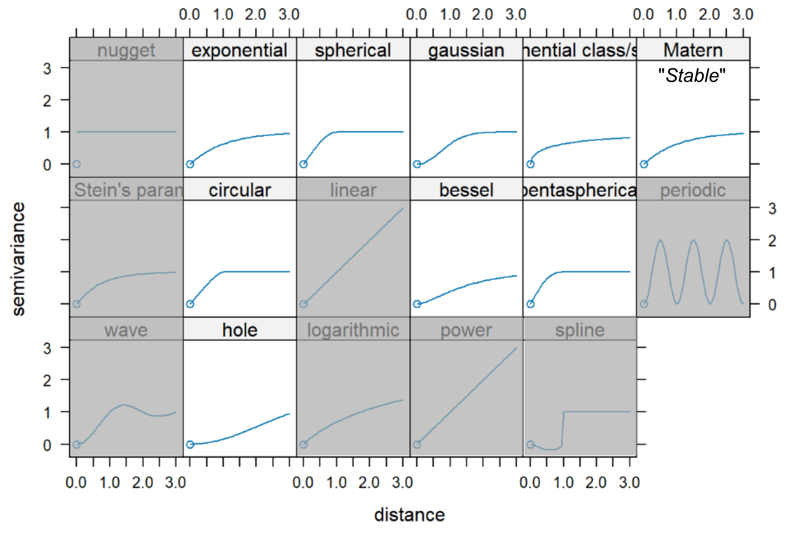{width="80%"}

 

> Using the `Stable` model, select `Optimize model` to perform cross-validation.

::: question
What is the lag size? 
:::

Answer

The lag size is $\approx32.6\:\text{km}$, which is a good approximation of the output of [Average Nearest Neighbour](https://doc.esri.com/en/arcgis-pro/latest/tool-reference/spatial-statistics/average-nearest-neighbor.html?tabs=dialog).

 

::: question
Is this a good fit to the sample variogram?
:::

Answer

In a word, **yes**. While we do not have to any quantitative measures of fit, visually the model fits our earlier criteria, passing through the variogram cloud and passing close to the sample variogram. 

 

::: question
What is the "Major range"? What does this mean?
:::

Answer

The range ($\approx260\:\text{km}$) is the distance at which spatial dependence between observations is no longer detected.

 

> Evaluate the other model types, assessing the fit between the variogram model and the sample variogram. 

::: question
Which model types are candidates and which show a poor fit to the sample variogram?
:::

Interpretation

Based on my testing, there are some models which aren't worth considering further (e.g., `Exponential`, `Rational Quadratic`), as these exhibit a poor fit between the variogram model and the sample variogram, even when cross-validation has been used. By comparison, there are others which show promise (`Stable`, `Gaussian`, `K-Bessel`). Of these, both `Stable` and
`K-Bessel` return a lag size similar to our previous rule-of-thumb using [Average Nearest Neighbour](https://www.esri.com/en-us/arcgis/products/arcgis-pro/overview).

We'll select the former (`Stable`), which is known as the Matérn model elsewhere, and which has produced the following model following cross-validation:

$$2.2216*\text{Nugget}+10.762*\text{Stable}(261220,1.3479)$$
The smoothness parameter in the Matérn model ($1.3479$) can change the shape of the function to resemble either an exponential and Gaussian shape, or something in between. The [documentation](https://scikit-gstat.readthedocs.io/en/latest/userguide/variogram.html#matern-model) for the Python package `gstat` provides a useful description and visualisation of this.  

 

For the selected model parameters, you also have access to the **semivariogram map**, which is a visual representation of how semivariance changes with both distance **and** direction: 

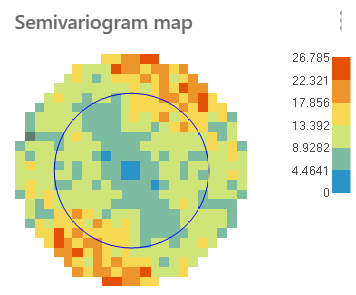{width="40%"}

 

This provides information on spatial dependence, where the colours denote the average semivariance (dissimilarity) for that distance and direction. The spatial pattern can either be *isotropic* (same in all directions), as represented by a circular or symmetrical distribution, or *anistropic* (varying with direction), as represented by an elliptical or stretched distribution. 

Within the model range[^range_def], which is denoted by the circle, there is some evidence of [anistropy](https://doc.esri.com/en/arcgis-pro/latest/help/analysis/geostatistical-analyst/accounting-for-anisotropy-using-directional-semivariogram-and-covariance-functions.html), although this is more noticeable at greater distances, with the greatest semivariance in the north-south direction, and reduced semivariance in the east-west direction. This is a reflection of the phenonemon we are studying: **temperature**. Monitoring stations which share the same *longitude* are relatively similar, even if separated by greater distances (e.g., west coast vs. east coast), whereas those which share the same *latitude* are highly dissimilar (e.g., south coast vs. north coast).  

[^range_def]: The **range** component of the variogram model i.e., the distance $x$ at which spatial dependence between observations is no longer detected, not the range of the values (i.e., min, max). 

::: note
While we can edit the model parameters manually (e.g., lag size, nugget, sill, range, anistropy), or use a combination of models to represent complex behaviour, it is very
challenging to finalise the settings without some form of cross-validation.
:::

> Press **next** to continue with the "Stable" model, and inspect the resulting interpolated surface.

The following tab should be familiar following our earlier exploration of Inverse Distance Weighting.

> Explore the effects of changing the number of neighbours and sector type.

::: question
Does this have a significant effect on the interpolated surface? 
:::

Interpretation

The weights for each observation are a product of the variogram model, as described above. If the model is well fitted, nearby points are weighted most heavily, so
including additional distant, and therefore minimally-weighted, points has little impact.

 

> Inspect the weights produced by Kriging. 

::: question
How are these different to IDW?
:::

Answer

You will have noticed that many of the weights are **negative**. This represents **spatial redundancy**. This occurs where there is spatial dependence between neighbouring observations, which are therefore providing similar information, or where an individual observation is being "screened" by those nearer to the prediction location.

 

#### Variogram evaluation

The final stage of our Ordinary Kriging analysis is to evaluate the quality of the interpolated surface, which as with IDW, is computed via [leave-one-out cross-validation](https://doc.esri.com/en/arcgis-pro/latest/help/analysis/geostatistical-analyst/performing-cross-validation-and-validation.html) (LOOCV). The "Table" (shown below) includes both `Measured` and `Predicted` values. **Importantly**, Ordinary Kriging is an **exact** interpolator, so the predicted values in the output surface should match the observed values at the monitoring station locations. 

Instead, the `Predicted` values in the table are those produced during LOOCV, when that observation has been removed from the analysis. 

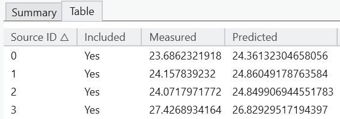{width="40%"}

 

> Evaluate the model performance using the summary statistics and plots.

The Geostatistical Wizard includes a range of [metrics](https://doc.esri.com/en/arcgis-pro/latest/tool-reference/geostatistical-analyst/cross-validation.html?tabs=dialog) for evaluation. For simplicity, we could prioritise:

- A **mean error** close to 0, indicating removal of bias. This is a simple arithmetic mean of the residuals, so the mean error can reveal if the model is systematically underpredicting or overpredicting. 
- A **RSME** as small as possible, reflecting the average distance between the model predictions and the observed values. To reiterate the discussion point above, these are the predictions produced via LOOCV. 
- A **standardised RMSE** close to 1, which is the RMSE of the standardised errors, which is a measure of whether the estimated standard errors (produced during LOOCV) are an accurate reflection of the actual prediction errors. 

::: question
How has RMSE changed?
:::
Additional metrics and plots are provided for Ordinary Kriging, including **QQ plots**, which are good way of visualising whether data follow a specific theoretical distribution (e.g., a normal distribution). While it is not within the scope of this unit to interrogate these in detail, the 1:1 line represents the theoretical distribution, while the points (the dataset) represent the actual distribution of the data. If these converge, it suggests that the data match that distribution. Any significant deviations suggests otherwise! See this [post](https://stats.stackexchange.com/questions/101274/how-to-interpret-a-qq-plot) on Stack Exchange for a good explanation.

> Finish the Geostatistical Wizard, and then export the output layer to raster.

::: question
How does the Ordinary Kriging interpolation compare to the output of IDW?
:::

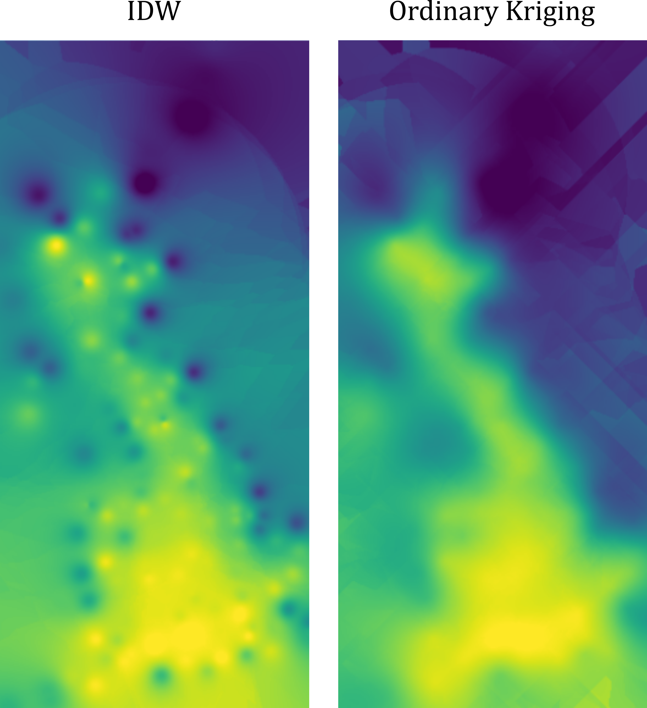{width="70%"}

 

### Geostatistical interpolation: Universal Kriging

In the introduction above, we noted that *Ordinary Kriging* assumes *stationarity* i.e., the data has a constant, but unknown mean. You might have questioned this assumption, in the context of our dataset.

::: question
Do we expect there to be a constant (unknown) mean temperature across the British Isles, for the measured datetime?
:::

Answer

**No!** Our [automatic monitoring stations](https://weather.metoffice.gov.uk/maps-and-charts/temperature-map#?model=ukmo-ukv&layer=temperature&bbox=%5B%5B47.010225655683485,-32.12402343750001%5D,%5B61.05828537037916,24.125976562500004%5D%5D) span approximately 10 degrees of latitude, from as far south as the Isles of Scilly to as far north as Lerwick on the Shetland Islands. It is highly likely that the mean temperature will vary across this area, so our assumption of a **stationarity** and a constant mean is not easily defensible. Perhaps
this is why our model performance (RMSE) is only slightly improved compared to IDW?

 

Rather than use Ordinary Kriging, we could use a method that assumes the data mean is **not** constant, but varies gradually across space according to a
mathematical function (*non-stationarity*). We should use this approach whenever we expect non-stationarity i.e., trends in climate, elevation... This is known as **University Kriging**.

This method begins by substracting a structural trend from the original measured points (e.g., temperature changing with latitude), before a variogram model is fitted to the remaining random errors[^random_detail]. Predictions are computed from the variogram model, which is used to define spatial dependence and estimate observations weights, and the original structural trend, which is added back in. As per the
[documentation](https://doc.esri.com/en/arcgis-pro/latest/tool-reference/3d-analyst/how-kriging-works.html) "*Universal kriging should only be used when you know there is a trend in your data and you can give a scientific justification to describe it.*" In our case, both requirements are met. 

[^random_detail]: This is not to imply that the values are randomly distributed, as spatial dependence may still be present. However, we removed the *deterministic* trend, leaving the stochastic component to be modelled. 

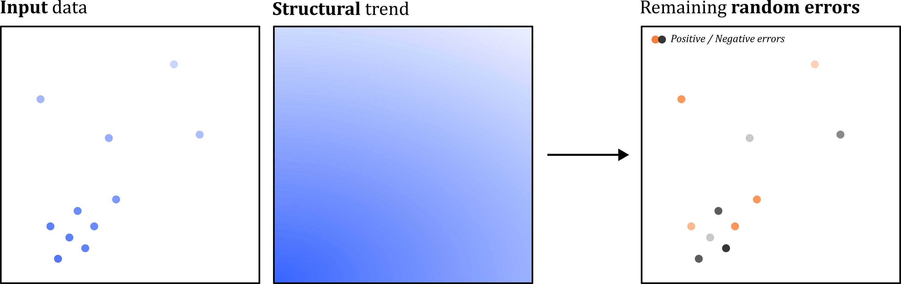{width="100%"}

 

> Re-open the Geostatistical Wizard, select "Kriging / CoKriging" with `sl_temp` as the "Data Field", and then "Universal Kriging" and "Prediction".

We need to now think carefully about the "Order of Trend Removal":

- **Constant**: removes a constant value, which is not valid given our assumption of non-stationarity.
- **First**: removes a linear gradient e.g., temperature decreasing from south to north.
- **Second**: removes a quadratic surface (curved gradients)
- **Third**: removes a cubic polynomial.

With model parsimony in mind, a **first order** polynomial is the most appropriate choice here, as we have a clear scientific justification for a linear gradient i.e., temperature decreasing with latitude. There is scope to explore a second order polynomial, which might do a better job of incorporating gradients related to longitude e.g., proximity to the North Atlantic, or distance to the coastline.

> Explore the default settings for first, second and third order trend removal. When you're happy with your understanding, select **First order** and **next**.

On the following tab, we can control the construction of the polynomial, and a key parameter is "Exploratory Trend Surface Analysis" which can range from 0 - 100. When 0, the trend is a global polynomial interpolation i.e., a single smooth function applied to the entire dataset. Values greater than 0 represent local polynomial interpolation, where increasing values equate to more local interpolation.

> Explore how changing the "Exploratory Trend Surface Analysis" influences the underlying trend surface, and how this affects the number of contributing points.

::: note
It is important to recognise that this stage of the analysis is a form of **deterministic** interpolation, and can be run independently using [Trend](https://doc.esri.com/en/arcgis-pro/latest/tool-reference/spatial-analyst/trend.html?tabs=dialog) (Spatial Analyst Tools) or via `Local Polynomial Interpolation` in the Geostatistical Wizard.
:::

In my view, and again with model parsimony in mind, the simplest form of trend removal is the most appropriate choice i.e., global polynomial interpolation (Exploratory Trend Surface Analysis = 0). While a local polynomial may produce a better fit, there is a danger of [overfitting](https://doc.esri.com/en/arcgis-pro/latest/help/analysis/geostatistical-analyst/understanding-how-to-remove-trends-from-the-data.html) and a risk that we remove the spatial structure that Kriging is designed to capture. 

> Continue with global polynomial interpolation, Exploratory Trend Surface Analysis = 0.

As with Ordinary Kriging, our next step is to define and calibrate our model variogram. However, it is important to remember that the Ordinary Kriging semivariance values $y$ were based on the observed values, whereas here, the semivariance is calculated is based on the values *after* the trend surface has been removed. 

> Explore the variogram model settings. When you are happy with your understanding, I would recommend optimising the `Stable` model again, for consistency with our Oridinary Kriging approach.

When complete:

> Explore the final tabs to evaluate model performance.

::: question
How has RMSE changed? Is the model improved compared to Ordinary Kriging?
:::

Answer

Overall, we can say that Universal Kriging has **slightly** outperformed Ordinary Kriging, although not significantly. This may be because the latter was already capturing
much of the latitudinal gradient through spatial autocorrelation.

However, we have a strong **theoretical** justification to use Universal rather Ordinary Kriging, independent of the difference in performance. 

 

### Summary {#interpolation_summary}

In this practical we have introduced a range of interpolation methods, including proximity, inverse distance weighting, and Ordinary and Universal Kriging. 

::: question
What is your overall appraisal of their performance?
:::

::: question
What are the strengths and limitations of the various models?
:::

Suggestion

A few suggestions, by no-means exhaustive:

- Proximity: A computationally efficient approach but which is probably a poor representation of continuous phenemona which change gradually through space.
- Inverse distance weighting: No consideration of spatial dependence and sensitive to $p$.
- Ordinary Kriging: Sensitive to mis-specification of the variogram model, directly affecting the interpolation weights.
- Universal Kriging: As above, but also sensitive to the specification and removal of the structural trend. 

 

To **summarise**, we have introduced some important **deterministic** and **geostatistical** interpolation methods, capturing some of the key choices involved and the sensitivity of the interpolated surface to those choices. As you will know from your exploration of the Geostatistical Wizard, we have only really scratched the surface, with lots of Kriging variants developed for different situations and data types, alongside a suite of alternative methods.

When selecting an interpolation method, we need to think carefully about theory as well as model performance, see @heusler2025, @rufino2021 and @li2011 for some targeted reading.

...and with that, **congratulations!** You have completed the practical and should now have a strong understanding of interpolation, the geostatistical perspective, and key methods. 

[**Finished!**](#index)

## Extra

As an **exact** interpolator, Universal Kriging has reproduced the temperature values at our input monitoring stations. Via cross-validation, we know that prediction accuracy at unsampled locations is lower ($\approx2\:\text{°C}$). What might be causing this?

A good way to understand the error is to simply plot the residuals. This can be achieved by exporting the cross-validation table (`Save Table to Feature Class`) and symbolising using the `Error` field.

::: question
Is there any obvious pattern to the residuals?
:::

::: question
Is there any pattern to absolute error? Use Calculate Field, `abs(!Error!)` with "Field Type" = `Double`. 
:::

Answer

In general, there appears to be evidence of reduced performance in parts of Scotland, and at higher latitudes ($y$), as shown here:

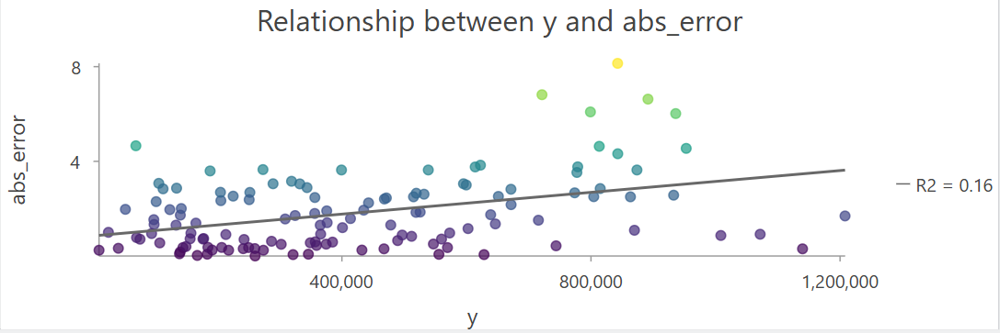{width="100%"}

 

This is perhaps unsurprising as there are some stark and difficult to explain differences between the reported temperatures e.g., Bealach Na Ba at 29.1°C (`FID` = 93) and 
Aultbea at 15.9°C (`FID` = 94).  

 

::: question
Is there evidence of spatial autocorrelation? What weights method did you choose? 
:::

Answer

There is statistically significant **clustering** ($I>0$) of the *absolute* errors, with local positive spatial autocorrelation in parts of Scotland and England, as identified by local Moran's $I_{i}$.

If you assess the spatial autocorrelation of the actual model residuals (`Error`), you may see evidence of negative spatial autocorrelation i.e., **dispersion**. This could arise due to smoothing which is inherent to Kriging predictions, particularly during cross-validation. This is best understood by considering **one-dimensional** Kriging, which is illustrated below. Unlike the Kriging variants we focused on, which interpolate in two-dimensions $x,y$, 1D Kriging can be used for interpolation within a vector of values e.g., a time-series:

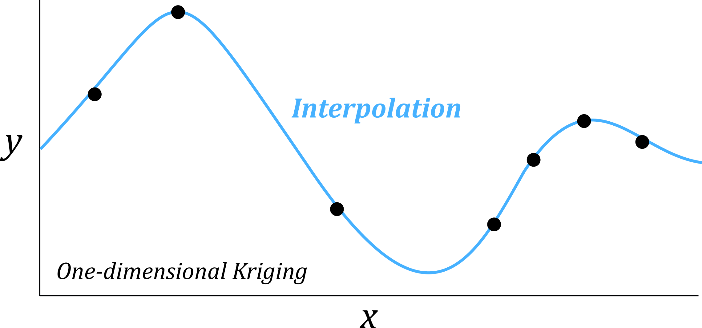{width="50%"}

 

During LOOCV, each value is removed from the model and its value predicted using the remaining observations. As Kriging predictions are smoothed towards neighbouring values, this could produce a a pattern in which neighbouring points are alternately under- and overpredicted: 

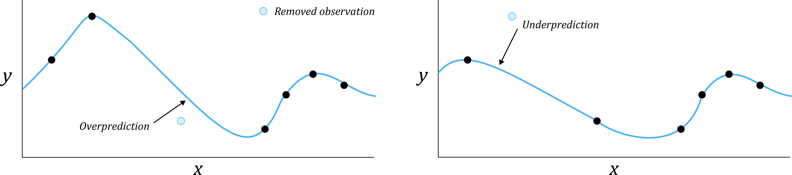{width="100%"}

 

 

If you're interested in exploring geostatistics further, the R package [`gstat`](https://r-spatial.github.io/gstat/) and the Python package [`SciKit-Gstat`](https://scikit-gstat.readthedocs.io/en/latest/) are excellent resources, as are the geostatistical walthroughs from [Paula Moraga](https://www.paulamoraga.com/book-spatial/geostatistical-data-1.html#geostatistical-data-1) and [Edzer Pebesma and Roger Bivand](https://r-spatial.org/book/12-Interpolation.html).

## Resources

-   Krige, D.G. ([1951](https://hdl.handle.net/10520/AJA0038223X_4792))
    A statistical approach to some basic mine valuation problems on the
    Witwatersrand. J Chem Metal Min Soc S Afr, December, 119–139
-   Matheron, G. ([1963b](https://doi.org/10.2113/gsecongeo.58.8.1246))
    Principles of geostatistics. Econ Geol 58(8):1246–1266
-   Oliver, M.A. and Webster, R.
    ([1990](https://doi.org/10.1080/02693799008941549)). Kriging: a
    method of interpolation for geographical information systems.
    International Journal of Geographical Information System, 4(3),
    pp.313-332.
-   Diggle, P.J., Tawn, J.A. and Moyeed, R.A.
    ([1998](https://doi.org/10.1111/1467-9876.00113)). Model-based
    geostatistics. Journal of the Royal Statistical Society Series C:
    Applied Statistics, 47(3), pp.299-350.
-   Rufino, M.M., Albouy, C. and Brind'Amour, A.
    ([2021](https://doi.org/10.1016/j.ecolmodel.2021.109501)). Which
    spatial interpolators I should use? A case study applying to marine
    species. Ecological Modelling[MT3.1], 449, p.109501.
