# Spatial Regression {#spatial_regression}

## Introduction


### Aims {.unnumbered}

The aims of this practical are to:

1.  Understand how spatial regression is different from classical (aspatial) regression and why it matters.
2.  Understand the differences between common forms of spatial regression.
3.  Use spatial regression to reveal relationships in a sociological context.

### Application {.unnumbered}

To that end, we'll apply aspatial and spatial regression to predict life expectancy at the MSOA-level ([Middle Layer Super Output Area](https://www.ons.gov.uk/methodology/geography/ukgeographies/statisticalgeographies)) in the North West of the UK.

### Data {#sr_data .unnumbered}

The data for this practical are sourced from the Department of Health and Social Care (DHSC, [Fingertips](https://fingertips.phe.org.uk/)) and the Office for National Statistics (ONS), and are available in [`data/dhsc`] and [`data/ons/msoa`] respectively. Key attributes have been retained and are described below:

-   ONS MSOA-level geometries and lookup table [[Source](https://geoportal.statistics.gov.uk/datasets/6b282db29762450881ed5159259a6e4e_0/explore?location=52.837634%2C-2.489483%2C6)]
-   ONS Economic Activity Status[^07-spatial-regression-1] [[Source](https://www.ons.gov.uk/datasets/create/filter-outputs/20ce9188-476a-4e89-af57-0285e69f7098#get-data)]
-   ONS Highest level of qualification[^07-spatial-regression-2] [[Source](https://www.ons.gov.uk/datasets/create/filter-outputs/2a85d026-ea61-492f-9b43-117b66a3af4e#get-data)]
-   ONS Disability[^07-spatial-regression-3] [[Source](https://www.ons.gov.uk/datasets/create/filter-outputs/0248ce8b-df1d-413f-a724-2d62feed9556#get-data)]
-   ONS Household income[^07-spatial-regression-4] [[Source](https://www.ons.gov.uk/employmentandlabourmarket/peopleinwork/earningsandworkinghours/datasets/smallareaincomeestimatesformiddlelayersuperoutputareasenglandandwales)]
-   DHSC Index of Multiple Deprivation[^07-spatial-regression-5] [[Source](https://fingertips.phe.org.uk/profile/local-health/data#page/0)]
-   DHSC Fuel poverty[^07-spatial-regression-6] [[Source](https://fingertips.phe.org.uk/profile/local-health/data#page/0)]
-   DHSC Life Expectancy[^07-spatial-regression-7] [[Source](https://fingertips.phe.org.uk/profile/local-health/data#page/0)]

[^07-spatial-regression-1]: Key economic variables include:\
    - `employment_dna`: Does not apply\
    - `employed_not_ftstudent`: Economically active (excluding full-time students): In employment\
    - `employed_and_ftstudent`: Economically active and a full-time student: In employment\
    - `economically_inactive_not_ftstudent`: Economically inactive (excluding full-time students)\
    - `economically_inactive_and_ftstudent`: Economically inactive and a full-time student\
    - `economic_status_total`: The total number of individuals in the corresponding geographical area with an economic activity status.\
    - *Note* some peripheral classes have been removed to simplify the analysis, so the total is not the sum of the attributes above.

[^07-spatial-regression-2]: Key education variables include:\
    - `qualification_dna`: Does not apply\
    - `no_qualifications`: No qualifications\
    - `level_one`: Level 1 and entry level qualifications e.g., 1-4 GCSEs grade A+ to C - `level_two`: Level 2 qualifications e.g., 5 or more GCSEs (A+ to C or 9 to 4)\
    - `level_three`: Level 3 qualifications e.g., 2 or more A levels or VCEs\
    - `level_four`: Level 4 qualifications or above e.g., degree (BA, BSc) or higher degree (MA, PhD, PGCE)\
    - `apprenticeships_or_similar`: Apprenticeships, vocational or work-related qualifications\
    - `qualification_total`: The total number of individuals in the corresponding geographical area with a qualification status

[^07-spatial-regression-3]: Disability related variables include:\
    - `disabled`: Disabled under the Equality Act\
    - `not_disabled`: Not disabled under the Equality Act\
    - `disabled_perc`: The percentage of individuals classed as disabled under the Equality Act, rounded to two decimal places

[^07-spatial-regression-4]: Total annual income (£) is represented by the `total_annual_income` variable.

[^07-spatial-regression-5]: The Index of Multiple Deprivation is represented by the `imd_decile` variable.

[^07-spatial-regression-6]: Fuel poverty related variables include:\
    - `fuel_poverty`: the percentage of households in the corresponding geographical area that were in fuel poverty, rounded to two decimal places.\
    - `household_poverty`: the number of households (modelled) in fuel poverty\
    - `household_total`: the total number of households

[^07-spatial-regression-7]: Life expectancy related variables include:\
    - `life_expectancy`: Life expectancy at birth\
    - `CI_lower`: Lower 95% confidence interval\
    - `CI_upper`: Upper 95% confidence interval

### Tools {.unnumbered}

[Ordinary Least Squares (OLS)](https://doc.esri.com/en/arcgis-pro/latest/tool-reference/spatial-statistics/ordinary-least-squares.html?tabs=dialog) (Spatial Statistics), [Spatial Autoregression](https://doc.esri.com/en/arcgis-pro/latest/tool-reference/spatial-statistics/spatial-autoregression.html?tabs=dialog) (Spatial Statistics), [Predict Using Spatial Statistics Model File](https://doc.esri.com/en/arcgis-pro/latest/tool-reference/spatial-statistics/predict-using-spatial-statistics-model-file.html?tabs=dialog) (Spatial Statistics Tools)

------------------------------------------------------------------------

## Practical

### Why spatial regression? {#justify_spatial_reg}

When analysing data, one of the most important questions we can ask is:

::: question
Is there an association or relationship between the variables of interest?
:::

This question is foundational, found in the fields of epidemiology[^07-spatial-regression-8], ecology[^07-spatial-regression-9], and earth science[^07-spatial-regression-10], and everything in between. By answering these questions, we can better understand the mechanisms which link the variables of interest, make predictions about the future, and inform decision-making.

[^07-spatial-regression-8]: For example, is there a relationship between smoking and the risk of lung cancer? See @doll1950.

[^07-spatial-regression-9]: For example, is there a relationship between the location of beaver dams and channel gradient? See @dennis2024.

[^07-spatial-regression-10]: For example, is there a relationship between climate and landslide occurrence? See @gariano2016.

In [Practical 4](#justify_spatial_corr), we introduced a measure of association, Pearson's $r$ [@pearson1895], with values ranging from $-1$ (perfect *negative* correlation) to $+1$ (perfect *positive* correlation). As a refresher, **association** refers to any form of dependency between variables, whereas **correlation** is a specific form of association, focusing on the degree of *linearity*.

While measures of association are useful, they primarily provide information on the **strength** and **direction** of the correlation, but little about the **nature** of the relationship between the variables i.e., how much does $Y$ change as $X$ changes? We can address this by modelling the relationship between $X$ and $Y$ and producing an equation which describes this relationship. In doing so, we can develop a deeper understanding of how the variables are related, moving beyond just strength and direction, and can use our equation to make predictions i.e., what would happen to $Y$ if we doubled $X$?

This is known as **regression**.

There are many types of regression methods, and perhaps the best known and most commonly used is **ordinary least squares** (OLS) regression. This approach is used to model the linear relationship between a dependent variable $Y$ and an independent variable (or variables) $X$, where the outcome is a best-fit regression line, as shown below.

<center>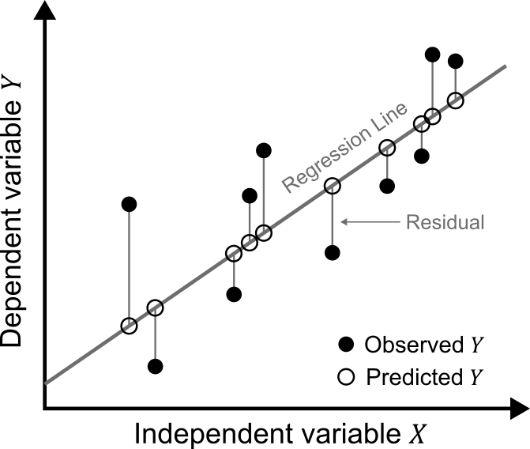{width="50%"}</center>

<br>

This is produced by minimising the sum of the squares of the residuals[^07-spatial-regression-11] between the observed dependent variable $Y$ and the predicted values of $Y$, which are produced based on the regression equation. Other regression lines, as illustrated below, might reduce the residuals for *some* of the observations, but the **total error** would be larger.

[^07-spatial-regression-11]: Hence the term **least squares**. The term **ordinary** denotes the long history of the approach, see @stigler1981, and its relative simplicity compared to other forms of regression.

<center>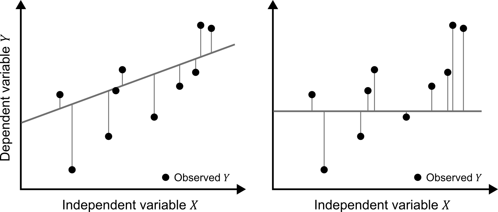{width="100%"}</center>

<br>

The regression line itself can be defined as follows:

$$Y=\beta_{0}+\beta_{1}X_{1}+\beta_{2}X_{2}+\cdots+\beta_{i}X_{i}+\epsilon$$

where $Y$ is the dependent variable of interest, $X_{i}$ is an independent variable where $\beta_{i}$ is the corresponding slope coefficient, $\beta_{0}$ is where the regression line intercepts the Y-axis, and $\epsilon$ is the random error (residual) between the observed dependent variable $Y$ and the regression equation.

Let's use a simple example to illustrate, using the ecological data from @getzin2012 from [Practical 4](#justify_spatial_corr), which consists of paired measurements of the median gap shape complexity index (GSCI) $X$ and species richness (SR) $Y$ for a forest patch (Hainich) in central Germany. Here we have a single dependent variable we want to predict (SR) and a single independent variable (GSCI).

Here is a plot of the paired measurements, redrawn from @getzin2012:

<center>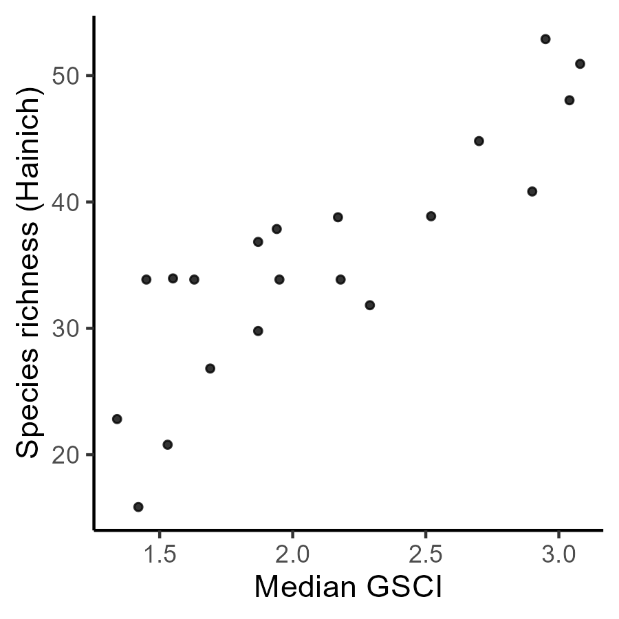{#species-richness width="50%"}</center>

You'll remember that Pearson's $r=0.86$. As discussed above, this tells us about the strength and direction of the correlation i.e., there is strong **positive** correlation between median gap shape complexity index $X$ and species richness $Y$. However, we know little about the nature of the relationship, and could **not** use this measure of association for prediction e.g.,

::: question
What species richness would we expect for a median GSCI value of $2.3$?
:::

This could be addressed via OLS regression, which for this dataset would produce the following:

<center>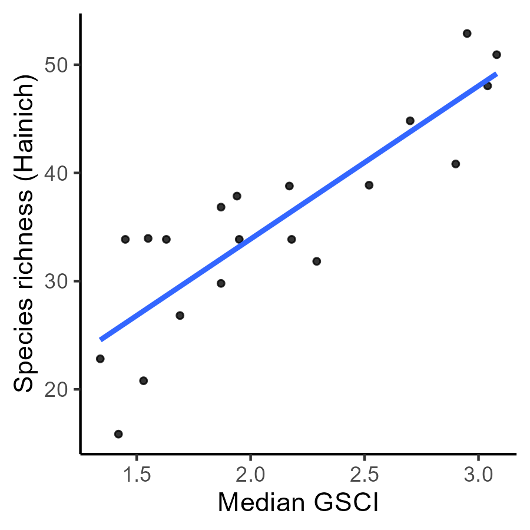{width="50%"}</center>

With only a single independent variable, the regression line is defined as:

$$Y=\beta_{0}+\beta_{1}X_{1}$$ with a calculated slope coefficient $\beta_{1}$ of 14.150 and an intercept $\beta_{0}$ of 5.595:

$$\text{SR} = 5.595 + 14.150\cdot\text{GSCI}$$ Prediction is now possible, as we can substitute in our median GSCI value of interest:

$$\text{SR} = 5.595 + 14.150\cdot2.3 = 38.14$$ Alongside the regression equation, it is also typical to calculate the **coefficient of determination** $R^2$, which measures the proportion of variance in the dependent variable that can be explained by the independent variables in the model. This typically ranges from $0$ i.e., **none** of the variance in the dependent variable is explained by the independent variables, to $1$ i.e., the variance in the dependent variable is **perfectly** explained by the independent variables.

For this dataset $R^2=0.74$, which indicates that 74% of the variance in species richness can be explained by median GSCI[^07-spatial-regression-12].

[^07-spatial-regression-12]: You can check Figure 3 in @getzin2012 to confirm this. You could also run your own OLS regression using the data [here](#justify_spatial_corr), via [Excel](https://support.microsoft.com/en-us/excel/functions/linest-function), [Python](https://www.statsmodels.org/stable/generated/statsmodels.regression.linear_model.OLS.html) or [R](https://www.rdocumentation.org/packages/stats/versions/3.6.2/topics/lm) if familiar.

*However*, there is a **problem**.

::: question
What property of the data are we **not** including in our regression?
:::

> Take some time to reflect on this question, thinking back to earlier parts of the unit, and then read the following discussion.

<br>

<details>

<summary>Discussion</summary>

We know from our analysis of *correlation* that Pearson's $r$ and other similar correlation metrics, such as Spearman's rank correlation coefficient $ρ$, are **aspatial** i.e., they do not take into account the spatial structure of the data. As a result, $r$ and $p$ provide only a partial perspective on the degree of correlation.

We also know from our exploration of spatial autocorrelation that we can often reject the hypothesis of *spatial randomness*, indicating the presence of clustering or dispersion of the data values.

In turn, we introduced a measure of **bivariate spatial association** Lee's $L$ [@lee2001], which incorporated both the numeric similarity of paired observations *and* the spatial structure of the data.

In much the same way, OLS regression is also **aspatial**, in that it incorporates the values for $Y$ and $X$ (e.g., species richness, GSCI), but with no **explicit** consideration of their geography.

This is **important** for a few key reasons.

First, the values for a dependent variable of interest $Y$ often arise from **spatial processes** which need to be explicitly accounted for. As an example, in today's practical we are going to model life expectancy for [Middle Layer Super Output Areas](https://www.ons.gov.uk/methodology/geography/ukgeographies/statisticalgeographies) (MSOAs), which comprise approximately 2,000 to 6,000 households, with a resident population of 5,000 to 15,000 persons. Life expectancy for each MSOA is undoubtedly influenced by the characteristics of the MSOA and its population e.g., level of income, deprivation, and fuel poverty. However, life expectancy might also be influenced by the characteristics of neighbouring MSOAs or nearby sites e.g., proximity to major roads, being downwind of polluting factories, access to nearby green- and blue-space, or the level of income in surrounding MSOAs, which might dictate the resources available for healthcare. Incorporating the geography of the MSOA, and its spatial dependence with its neighbours, may result in better predictions.

Incorporating geography can also be useful to minimise model error. When evaluating a regression, we would typically investigate the distribution of **residuals** and calculate summary statistics, such as **RMSE**, as introduced [last week](#cross-valid). The numerical distribution of residuals could be evaluated using a histogram, as shown below:

<center>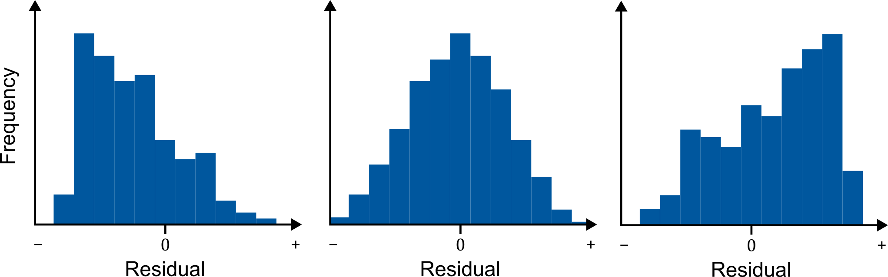{width="100%"}</center>

<br>

While this provides important information on the whether the model is systematically under- or over-predicting $Y$, it provides no information on **where** that systematic error is located. For example, perhaps our model systematically over-predicts life expectancy in certain regions, and under-predicts life expectancy elsewhere, indicating **clustering** of the model residuals i.e., positive spatial autocorrelation. By accounting for the spatial structure of the residuals (if present), we can produce models which minimise error.

Finally, and from a statistical perspective, one of the key assumptions of many tests, including OLS, is the **independence of observations** assumption. This states that each observation in your dataset (e.g., a species richness value) should not be influenced by or be related to any other observation in the dataset. Given Tobler's Law [@tobler1970], and the evidence of spatial clustering and dispersion in many datasets, as revealed using Moran's $I$ and $I_{i}$ [@moran1948; @anselin1995], we know that observations are often spatially *dependent* e.g., the Republican vote share in a particular US county is related to the vote share of its neighbours. In these situations, the independence of observations assumption is violated, and the OLS regression coefficients and errors may be biased.

</details>

<br>

------------------------------------------------------------------------

Based on the above reasoning, **spatial regression** methods are *often* more appropriate than OLS and similar aspatial regression methods when applied to spatial data, in that they incorporate the spatial structure and spatial dependence of the data, are a better representation of the spatial processes which produce the variables of interest, and can often minimise model error.

### Pre-processing

To begin:

> Open ArcGIS, initialise a new project in the `practical-7` directory, establish a connection to `data` and then load the MSOA geometries for England and Wales, stored in `MSOA_2021_EW_BGC_V3.shp`.

::: question
What is the data CRS?
:::

> Next, load and inspect the MSOA lookup table `MSOA_2021_lookup_table.csv` which contains additional attributes of interest e.g., region name [`RGN22NM`].

For our analysis, we are going to focus on the North West of England, which includes the counties of Cheshire, Cumbria, Greater Manchester, Lancashire, and Merseyside.

> Use a dynamic table join to link the geometries and lookup table via the `MSOA21CD` attribute. When complete, use Select by Attributes to filter to the North West (`RGN22NM = 'North West'`, $n=932$), and then export the selection to your project directory with a suitable name e.g., `MSOA_2021_nw`. To simplify the export, remove all the joined fields (Export Features → Fields → Field Map → Remove all below `GlobalID`).

> When complete, remove the national MSOA geometries and lookup table.

The aim of our analysis is to understand and predict **life expectancy** at the MSOA-level i.e., our dependent variable. Our independent variables, which we expect to be related to life expectancy in some way, include **economic activity**, **education**, **income**, **deprivation**, **fuel poverty** and **disability**.

> Add the datasets containing the dependent and independent variables ($n=7$) to ArcGIS. These can be found in [`data/dhsc`] and [`data/ons/msoa`].

Our next step is to join the important attributes to our MSOA geometry layer. However, we are using the well-established `shapefile` format, which limits field names to 10 characters. As we'll working with a large number of fields, where the field name contains important information e.g., `economically_inactive_and_ftstudent`, we want to preserve these names, rather than see them truncated. This could be solved by assigning longer *aliases* to each field name, but a quicker workaround is simply to switch to a more modern format.

> Use Export Features to save the MSOA geometries as a Feature Class in `practical-7.gdb`. When complete, remove the earlier version from ArcGIS, which you can check via Properties → Source → Data Source.

When complete:

> Use [Join Field](https://doc.esri.com/en/arcgis-pro/latest/tool-reference/data-management/join-field.html?tabs=dialog) to produce permanent table joins between the MSOA geometries and the standalone tables, joining based on `MSOA21CD` and `msoa_code`. Use "Transfer Fields" to join the **important** variables for each table, as listed below:
>
> -   [`dhsc-life-expectancy.csv`] = `life_expectancy_male` and `life_expectancy_female`
> -   [`ons-household-income.csv`] = `total_annual_income`
> -   [`ons-economic-activity-status.csv`] = `employed_not_ftstudent`, `economically_inactive_not_ftstudent` and `economic_status_total`
> -   [`ons-highest-level-qualification.csv`] = `no_qualifications`, `level_four` and `qualification_total`
> -   [`ons-disability.csv`] = `disabled_perc`
> -   [`dhsc-imd.csv`] = `imd_decile`
> -   [`dhsc-fuel-poverty.csv`] = `fuel_poverty_perc`

As MSOAs have varying populations, ranging from approximately 5,000 to 15,000 residents, we should take care to use proportional variables (e.g., `disabled_perc`, `fuel_poverty_perc`) or those that are not population-dependent (e.g., `imd_decile`, `total_annual_income`). For the economic activity status and qualification datasets, we can calculate proportional variables using the total number of individuals with an economic or qualification status (`economic_status_total`, `qualification_total`), focusing on the end-member classes i.e., unemployed *vs*. employed, no qualifications *vs*. level-four qualifications.

> Use Calculate Field to produce proportional variables ("Field Type" = `Double`) representing the proportion of the population employed (`employed_not_ftstudent_perc`) and not employed (`economically_inactive_not_ftstudent_perc`), and the proportion with no qualifications (`no_qualifications_perc`) and level-four qualifications (`level_four_perc`) e.g., `employed_not_ftstudent_perc` = `(!employed_not_ftstudent! / !economic_status_total!) * 100`

As we have permanently joined these attributes to our geometry layer:

> Remove the standalone tables.

### Data exploration

Before we model the relationship between our dependent and independent variables, we should always conduct an exploratory data analysis.

::: question
What is the average, minimum and maximum male and female life expectancy?
:::

> Modify the symbology to investigate the spatial patterning of life expectancy.

<center>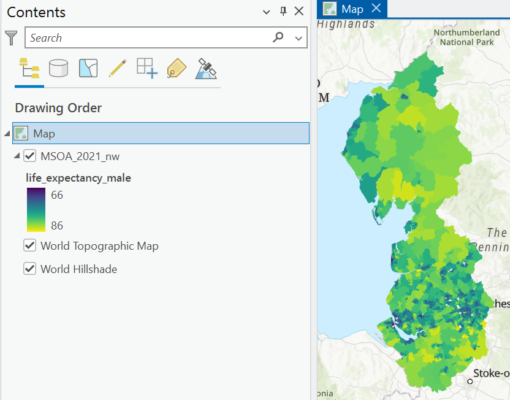{width="60%"}</center>

<br>

::: question
Are there are any clusters of high or low life expectancy? Why might this be?
:::

There are lots of options for interesting exploratory analysis. For example, you could investigate the differences in `life_expectancy_male` and `life_expectancy_female` using Primary symbology → Bivariate Colours, or by calculating the difference using Add Field.

You could also use Create Chart → Scatter Plot to investigate the bivariate relationships between our dependent variable e.g., `life_expectancy_male`, and the independent variables e.g., `total_annual_income`, `no_qualifications`, `disabled_perc`, `imd_decile`, `fuel_poverty`.

<center>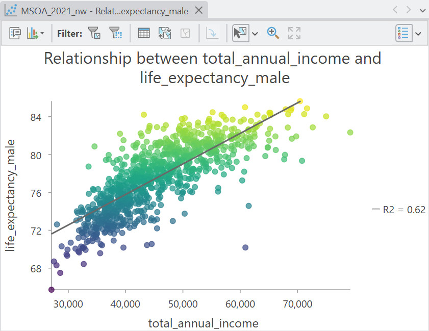{width="60%"}</center>

<br>

::: note
It is worth **emphasising** that the plots and statistics ($R^2$, coefficients $B_{0}$ and $B_{1}$) are produced using OLS i.e., they are not taking geography into account. As we know from earlier weeks of the unit, including [spatial correlation](#spatial_correlation), there are often alternative methods that are more appropriate e.g., Lee's $L$.

<br>

The regressions are also **bivariate**, in that they are assessing the relationship between the dependent variable $Y$ and a single independent variable $X$. As life expectancy is likely influenced by a wide range of factors, a **mutlivariate** analysis, incorporating multiple independent variables, would typically produce the best model.
:::

Building on that, we also need to remember **key concepts**, such as the designation of the [spatial weights matrix](https://doc.esri.com/en/arcgis-pro/latest/tool-reference/spatial-statistics/generate-spatial-weights-matrix.html?tabs=dialog) and the importance of [spatial autocorrelation](#spatial_autocorrelation), which we should always assess.

> Use the [Neighborhood Explorer](https://doc.esri.com/en/arcgis-pro/latest/tool-reference/spatial-statistics/introduction-to-neighborhood-explorer.html) to visualise the connections that underlie the spatial weights matrix.

::: question
Which spatial weights method is most appropriate for our data? Contiguity? Distance-based?
:::

<details>

<summary>Interpretation</summary>

When selecting a spatial weights method, we need to consider both **theory** and the resulting spatial weights **structure**. The latter is relatively straightforward. For example, we would typically want to avoid any isolated spatial units i.e., those with no neighbours. We could also use [row standardisation](#row_standard) to account for uneven spatial data, where there may be significant differences in the number of neighbours between spatial units. An alternative approach would be to used a fixed number of neighbours $K$ for each spatial unit.

These practical considerations are important, but more so is the theory of the **nature of the interaction** between spatial units for the **specific** geographic process.

For example, if we were focused on a geographic process which was dependent on **contact** between individuals e.g., the spread of disease, or the expansion of a species, then a contiguity-based approach would be most appropriate, as this is a representation of the nature of the interaction i.e., spatial units must be contiguous for disease to spread[^07-spatial-regression-13], or for a species to move from one spatial unit to another.

[^07-spatial-regression-13]: This is of course an oversimplification for the spread of disease in humans, given national and international movement, but is highly relevant in other settings e.g., @flood2013.

Alternatively, if the geographic process is dependent on **accessibility**, then a distance-based approach might be more appropriate. In the context of life expectancy, we might expect this to be influenced by the characteristics of nearby areas, such as the provision of hospitals, the proximity of sources of pollution, or the availability of high paying jobs within a certain commutable distance. These characteristics would affect life expectancy even if the spatial units were non-contiguous.

The geographic process could also be dependent on **structural differences** across the study area. Continuing with our life expectancy example, which we are analysing at the MSOA-level, there might be differences in how the health service is funded and managed at a higher spatial level i.e., Cheshire, Cumbria, Greater Manchester, Lancashire, and Merseyside, resulting in a different quality of care for different counties. In this situation, we might want to use *block weights*, which define neighbours based on the higher spatial level i.e., all MSOAs within Greater Manchester would be defined as neighbours, and so on[^07-spatial-regression-14].

[^07-spatial-regression-14]: **Block Weights** are not easily implemented in ArcGIS, but are available elsewhere e.g., [`pysal`](https://pysal.org/libpysal/stable/generated/libpysal.weights.block_weights.html).

To summarise, the choice of spatial weights method is critical and should be dependent on the **nature of the interaction** between spatial units for a **specific** geographic process. Different geographic processes necessitate different methods, even when the same spatial units are used (e.g., MSOA).

</details>

> Assess for global and local spatial autocorrelation for some of the attributes (e.g., `life_expectancy_male` and `life_expectancy_female`) using Moran's $I$ ([Spatial Autocorrelation (Global Moran's I)](https://doc.esri.com/en/arcgis-pro/latest/tool-reference/spatial-statistics/spatial-autocorrelation.html?tabs=dialog)) and local Moran's $I_i$ [Cluster and Outlier Analysis (Anselin Local Moran's I)](https://doc.esri.com/en/arcgis-pro/latest/tool-reference/spatial-statistics/cluster-and-outlier-analysis-anselin-local-moran-s.html?tabs=dialog)[^07-spatial-regression-15].

[^07-spatial-regression-15]: You will likely encounter WARNING [000848](https://doc.esri.com/en/arcgis-pro/latest/tool-reference/tool-errors-and-warnings/001001-010000/tool-errors-and-warnings-00826-00850-000848.html): `Features with bad records`, which arises due to missing life expectancy values in the DSHC data.

::: question
Is there evidence of spatial autocorrelation?
:::

### Ordinary least squares {#ols}

As a first foray into regression, we will begin by running and critically engaging with Ordinary Least Squares.

Before we can do so, the ArcGIS implementation of [Ordinary Least Squares (OLS)](https://doc.esri.com/en/arcgis-pro/latest/tool-reference/spatial-statistics/ordinary-least-squares.html?tabs=dialog) requires a unique ID field in our Attribute Table, which we don't have, so we'll create one:

> Use Calculate Field to produce a `unique_id` field ("Field Type" = `Long integer (32-bit)`), using the `SequentialNumber()` expression, which can be found under "Helpers".

> Now we can run [Ordinary Least Squares (OLS)](https://doc.esri.com/en/arcgis-pro/latest/tool-reference/spatial-statistics/ordinary-least-squares.html?tabs=dialog), using `unique_id` as the "Unique ID Field" and either `life_expectancy_male` or `life_expectancy_female` as the "Dependent Variable". For simplicity, we'll begin by using a single independent (Explanatory) variable: `total_annual_income`. Save the "Output Feature Class" with a suitable name, and if desired, generate an "Output Report File", saving to the `practical-7` directory.

Before we jump to interpretation, it is important to assess any warnings that appear, which in this case is as follows:

```{r, eval=FALSE, collapse=TRUE}
WARNING 000851: Use the Spatial Autocorrelation (Morans I) Tool to ensure residuals are not spatially autocorrelated.
```

This is very good advice and is described more fully [here](https://doc.esri.com/en/arcgis-pro/latest/tool-reference/tool-errors-and-warnings/001001-010000/tool-errors-and-warnings-00851-00875-000851.html).

*For now* we'll ignore this and inspect the results under "Messages", which reveals $R^2=0.62$ (`Multiple R-Squared`), matching the Scatter Chart presented above, as well as coefficients $\beta_0\approx62.86$ and $\beta_1\approx0.0003$, and *p*-values for the independent variable, alongside a wealth of information in the PDF.

::: question
What is the numeric distribution of the model residuals?
:::

As discussed in the [introduction](#justify_spatial_reg), we can also inspect the spatial patterning of the model residuals to identify whether the model is systematically over-predicting or under-predicting life expectancy in different regions[^07-spatial-regression-16].

[^07-spatial-regression-16]: We'll discuss later on how we can incorporate this information into our spatial regression models.

<center>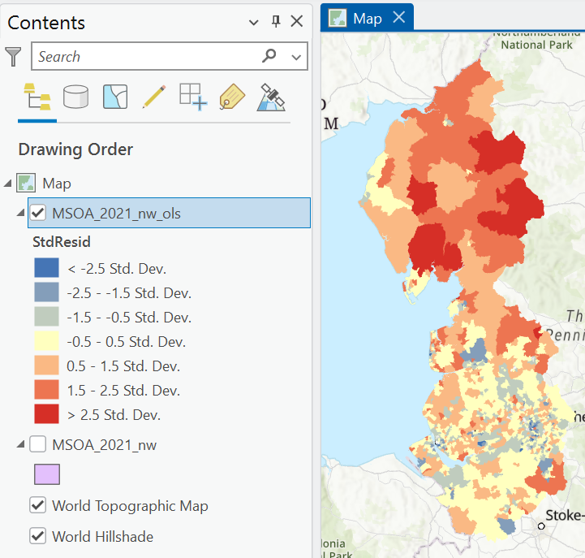{width="60%"}</center>

<br>

::: question
How does model performance vary across the study region? Is there evidence of clustering of the residuals?
:::

A visual inspection of the residuals can be useful, but a better approach is to evaluate autcorrelation statistically.

> Check for [global](https://doc.esri.com/en/arcgis-pro/latest/tool-reference/spatial-statistics/spatial-autocorrelation.html?tabs=dialog) and [local](https://doc.esri.com/en/arcgis-pro/latest/tool-reference/spatial-statistics/cluster-and-outlier-analysis-anselin-local-moran-s.html?tabs=dialog) spatial autocorrelation of the OLS residuals. Make sure to use a consistent spatial weights method, reflecting the geographic process of interest.

::: question
Is there evidence of global spatial autocorrelation?
:::

::: question
What might explain the pattern of high (HH) and low (LL) clusters, or outliers (LH, HL)?
:::

<details>

<summary>Interpretation</summary>

Based on Moran's $I$ there is clear evidence of positive global spatial autocorrelation (clustering, $I>0$), with HH clusters in parts of Cumbria and Lancashire, alongside LH outliers (e.g., Kendal, Morecambe). Conversely, there are LL clusters in the major cities of Manchester and Liverpool, with HL outliers in (presumably) more affluent areas (e.g., Didsbury, Chorlton).

As outlined in the esri [documentation](https://doc.esri.com/en/arcgis-pro/latest/tool-reference/spatial-statistics/ordinary-least-squares.html?tabs=dialog), statistically significant spatial autocorrelation of the regression residuals indicates **misspecification of the OLS model**, as well as a violation of OLS assumptions, including the **independence of errors** assumption i.e., the residual for one observation should not be related to or be predictable by the residuals of other observations.

In this situation, OLS is an inappropriate method and we should either use a spatial regression method which incorporates spatial dependence, or use methods which incorporate spatial non-stationarity[^07-spatial-regression-17].

[^07-spatial-regression-17]: This is the topic for **Practical 8**: *Geographically Weighted Regression*.

</details>

<br>

In our first model, we have used a single independent variable (`total_annual_income`). As life expectancy is influenced by a range of factors, we might be able to explain significantly more variability by including a range of variables in a *multivariate* approach. If so, we need to be aware of issues of **multicollinearity** i.e., when independent variables are highly correlated with each other, see @kim2019.

> Re-run [Ordinary Least Squares (OLS)](https://doc.esri.com/en/arcgis-pro/latest/tool-reference/spatial-statistics/ordinary-least-squares.html?tabs=dialog), including additional independent variables e.g., `disabled_perc`, `imd_decile`, and `fuel_poverty_perc`, and inspect the results table. You may also want to include economic and education attributes, and if so, make sure to use the proportional variables you calculated earlier.

<center>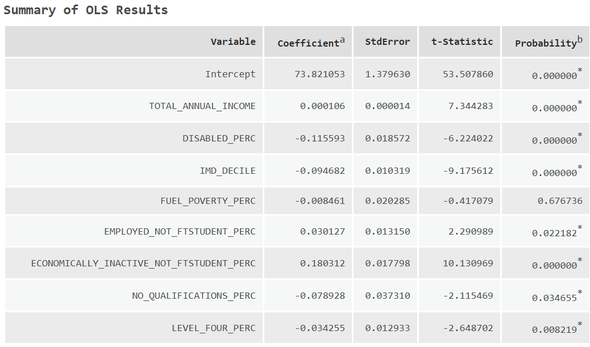{width="100%"}</center>

<br>

::: question
How much additional variability in life expectancy can be explained with our new model?
:::

There are lots of tools available to diagnose multicollinearity, one of which is the Variance Inflation Factor (VIF), which can be found in the "Summary of OLS Results" table. As a rule-of-thumb, multicollinearity is present when the VIF is higher than 5 to 10 [@kim2019].

::: question
Is there evidence of multicollinearity?
:::

If multicollinearity is present, a typical strategy is to remove highly correlated variables.

::: question
Are all the independent variables significant in the model? i.e., $p<0.05$.
:::

::: note
In **summary**, OLS is inappropriate for our analysis of life expectancy, as statistically significant spatial autocorrelation of the regression residuals indicates misspecification of the OLS model, violation of OLS assumptions, or that additional important spatial factors are missing from the model. More fundamentally, variability in life expectancy likely represents the outcome of **spatial processes**. Incorporating geography into our modelling approach may produce better predictions and minimise error.

<br>

However, it is worth **emphasising** that OLS isn't *necessarily* inappropriate for analysis of spatial data. For example, if the observations are independent, there is no clear spatial pattern to the model residuals, as evidenced using Moran's $I$ and $I_i$, and no evidence of spatial non-stationarity... use OLS! However, the results of OLS should always be evaluated critically. In many cases, alternative techniques are more appropriate.
:::

### Spatial regression {#spat_reg_details}

An alternative to OLS and similar aspatial regression methods is **spatial regression**, which incorporates **space** explicitly in the regression framework.

There are many approaches to achieve this, and today we are going to focus on two main regression models: the **spatial error model** (SEM) and the **spatial lag model** (SLM).

Both approaches address the impact of **spatial dependence**, in which the configuration and spatial arrangement of the data is important and therefore needs to be considered.

::: question
How do we know that spatial dependence is important?
:::

<details>

<summary>Answer</summary>

This is evidenced by the spatial autocorrelation present in the dependent and independent variables, and the OLS residuals.

</details>

<br>

While both model types address spatial dependence, SEM and SLM are typically selected based on different theoretical arguments and use different mathematical approaches.

The **spatial lag model** is defined as follows:

$$Y=\rho WY+X\beta+\epsilon$$

This is very similar to a standard OLS formulation, which could be written simply as $Y=X\beta+\epsilon$[^07-spatial-regression-18], but with an additional component $\rho WY$, which is a spatially lagged $Y$ variable i.e., we are including the average neighbourhood value for each observation as an additional explanatory variable.

[^07-spatial-regression-18]: As a reminder, $Y$ is the dependent variable of interest, $X$ is a variable with a corresponding coefficient $\beta$ and $\epsilon$ is the random error (residual) between the observed dependent variable $Y$ and the regression equation. Note that the intercept term $\beta_{0}$ is implicitly included in $X\beta$.

The spatial lag model therefore includes the spatial lag of the dependent variable, with the calculation approach defined in [Practical 3](#spatial_lag). In this case, the spatial lag is of life expectancy where the coefficient $\rho$ is a single value which represents the strength and direction of the spatial lag influence, much like a coefficient $\beta$. As $\rho$ increases, neighbourhood effects become increasingly important.

This approach therefore accounts for **spillover effects**, in that the dependent variable at a specific location $Y_i$ may be **influenced** by the corresponding dependent variable of its neighbours $Y_j$, which we define based on the spatial weights matrix $W$ i.e., life expectancy for an MSOA is influenced by life expectancy in neighbouring MSOAs.

The following example outlines a situation in which *diffusion of behaviour* could lead to spatial dependence:

:::: quote
“*... the behaviour is likely to be highly social in nature, and understanding the interactions between interdependent units is critical to understanding the behaviour in question. For example, citizens may discuss politics across adjoining neighbours such that an increase in support for a candidate in one neighbourhood directly leads to an increase in support for the candidate in adjoining neighbourhoods*”[^07-spatial-regression-19]

::: {style="text-align: right"}
@thesoci2015
:::
::::

[^07-spatial-regression-19]: This could partly explain the spatial dependence of the Republican vote share, which we assessed in **Practical 3**: *Spatial Autocorrelation*.

In this situation, a spatial lag model would be appropriate, as it mathematically represents the underlying spatial process, in which the outcome (dependent) variable is influenced by the neighbourhood outcomes.

Unlike SLM, which includes spatial dependence as a explanatory variable, the **spatial error model** treats residual autocorrelation as a nuisance, rather than being the result of important spatial processes, as summarised below:

:::: quote
“*spatial dependence observed in our data does not reflect a truly spatial process, but merely the geographical clustering of the sources of the behaviour of interest. For example, citizens in adjoining neighbourhoods may favour the same (political) candidate not because they talk to their neighbors, but because citizens with similar incomes tend to cluster geographically, and income also predicts vote choice. Such spatial dependence can be termed attributional dependence, as neighboring units have shared attributes that produce the clustering of behaviors*"

::: {style="text-align: right"}
@thesoci2015
:::
::::

In turn, the spatial error model assumes that the observed spatial dependence arises due to the geographical clustering of attributes[^07-spatial-regression-20], rather than being the result of spatial diffusion. This might also be due to other spatial variables that we haven't included in the analysis. Based on this reasoning, SEM assumes that the error of an observed value can be related to the errors of its neighbours, and is defined as follows:

[^07-spatial-regression-20]: For our analysis, this might be reflected by the spatial clustering of households with similar incomes, education levels, and levels of deprivation.

$$Y=X\beta+u$$

As above, this is similar to OLS, where the dependent variable $Y$ is predicted by the independent variables $X$ and its coefficients $\beta$. This prediction is modified by a residual term $u$, which is defined as:

$$u=\lambda Wu+\epsilon$$

Unlike a typical OLS, where the error term $\epsilon$ must meet certain mathematical assumptions[^07-spatial-regression-21], here the error term $u$ is modelled directly, where $Wu$ is the spatial lag of the model errors and $\lambda$ is a coefficient which represents the strength of the correlation between an observations error and that of its neighbours.

[^07-spatial-regression-21]: It is outside of the scope of this unit to delve into these in detail, but these include the **independence of errors** (discussed previously), **normality** (errors should be normally distributed), and **homoscedasticity** (the errors should be of a similar magnitude across the range of observations).

The mathematics of this are quite complicated, see @spatial2015, so the **important** thing to understand is that unlike OLS, which selects coefficients $\beta$ to produce the best fit between $Y$ and $X$ (minimising the sum of the squares of the residuals), a spatial error model finds the values for $\beta$ and $\lambda$ which best explain the observed data while accounting for the spatial correlation in the model errors. Unlike OLS, which treats the unexplained errors $u$ as independent, SEMs allow an observations errors to be partly related to the errors of its neighbours, where the strength of this relationship is controlled by $\lambda$. The values for $\beta$ and $\lambda$ are typically determined based on a [**maximum likelihood**](https://en.wikipedia.org/wiki/Maximum_likelihood_estimation) approach, which we'll discuss more fully in Practical 10.

::: note
To **summarise**, both spatial lag and spatial errors models address spatial dependence. Spatial lag models assume that this dependence arises because of diffusion across spatial units, in which the outcome (dependent) variable is influenced by the outcome of its neighbours. This is addressed by including a spatially lagged *outcome* variable $\rho WY$.

<br>

In contrast, spatial error models assume that spatial dependence arises because of attribute similarity, rather than true spatial processes. This is addressed by including a spatially lagged *error* variable $\lambda Wu+\epsilon$, which represents the relationship between an observations error and the neighbourhood errors.

<br>

Thus, the difference between SLM and SEM is both theoretical and mathematical.
:::

### Spatial error model {#sem}

To run a spatial error model in ArcGIS:

> Open [Spatial Autoregression](https://doc.esri.com/en/arcgis-pro/latest/tool-reference/spatial-statistics/spatial-autoregression.html?tabs=dialog)[^07-spatial-regression-22], selecting `Spatial Error Model (SEM)` for "Model Type" and using `life_expectancy` as the "Dependent Variable". To simplify comparison with OLS, use `total_annual_income` as the single independent variable, and for now, use `Contiguity Edges Corners` as the spatial weights method.

[^07-spatial-regression-22]: These models can also be referred to as **autoregression** models, where "auto" denotes **self** i.e., the relationship between a variable at one location (e.g., the outcome dependent variable or the model residual), and the same variable in neighbouring locations.

This should run successfully[^07-spatial-regression-23], and produce a range of output tables and a feature layer:

[^07-spatial-regression-23]: You will receive WARNING [000848](https://doc.esri.com/en/arcgis-pro/latest/tool-reference/tool-errors-and-warnings/001001-010000/tool-errors-and-warnings-00826-00850-000848.html): `Features with bad records`, which is flagging rows where we have missing data

<center>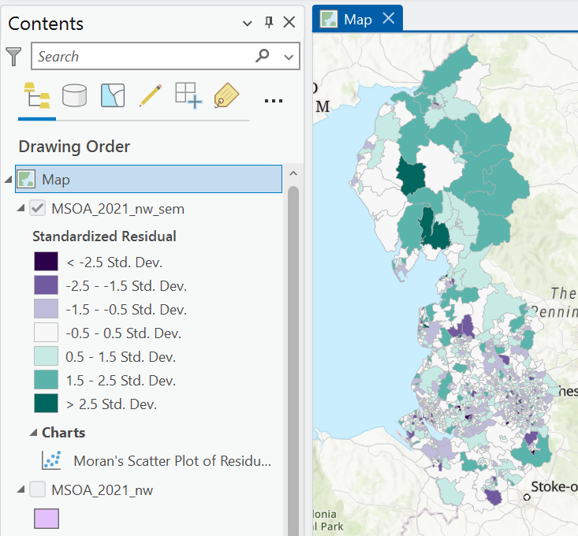{width="60%"}</center>

<br>

We'll focus on a few key statistics to start, including those in the "Summary of SAR Results" and the "Model Diagnostics" tables.

<center>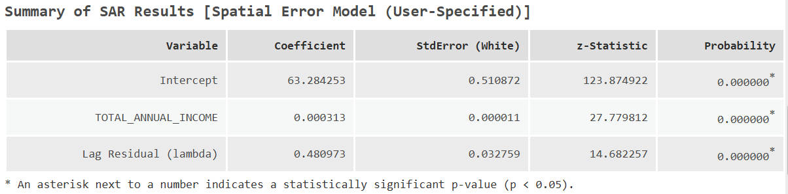{width="100%"}</center>

<br>

::: question
What is the model $R^2$ and *p*-value?
:::

::: question
Is income positively or negatively correlated with life expectancy?
:::

The lag residual coefficient ($\lambda$) for my model is $\approx0.48$. This can range from $-1$ to $+1$ and represents the strength of the correlation between an observations error and that of its neighbours.

::: question
Are errors for each observation positively or negatively correlated with that of its neighbours?
:::

<details>

<summary>Answer</summary>

The $\lambda$ value is positive ($\approx0.48$) indicating spatial clustering of errors i.e., high errors are found in neighbourhoods of high errors. A negative $\lambda$ would indicate dispersion i.e., a high error may be found in a neighbourhood of low errors, or vice versa.

</details>

<br>

The tool also produces a Moran's Scatter Plot of Residuals, described [here](https://doc.esri.com/en/arcgis-pro/latest/tool-reference/spatial-statistics/how-spatial-autoregression-works.html), and which we introduced in [Practical 3](#moran_plot). This shows the residuals on the x-axis (the difference between the observations and the predicted values) and the spatial lag of the residuals on the y-axis. If there are evenly distributed across the four quadrants, there is no discernible spatial autocorrelation.

<center>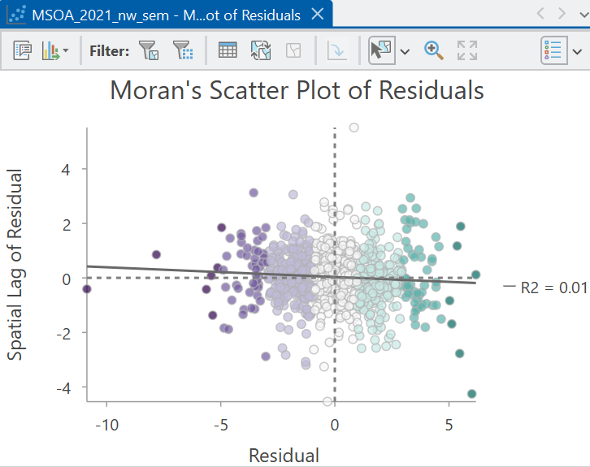{width="50%"}</center>

<br>

We can test for this directly using Moran's $I$ and $I_i$.

> Evaluate the spatial patterning of the SEM residuals using the [global spatial autocorrelation tool](https://doc.esri.com/en/arcgis-pro/latest/tool-reference/spatial-statistics/spatial-autocorrelation.html?tabs=dialog).

::: question
How has the spatial autocorrelation of the residuals changed compared to the OLS model?
:::

<details>

<summary>Answer</summary>

Previously, the distribution of OLS residuals was **clustered**, but with SEM we have now switched to a **dispersed** pattern which suggests we're overcorrecting for spatial dependence (overfitting). This may be due to misspecification of the spatial weights matrix.

The use of contiguity-based approach may be less suitable for our analysis, because the processes which govern health (i.e., `life_expectancy`) operate over broader geographic scales, rather than only over contiguous boundaries e.g., air pollution over kilometre-scales, access to hospitals, commuting patterns, employment opportunities.

It is worth noting that the *p*-value for Moran's $I$ is $>0.05$, as shown below, so while there is evidence of dispersion, it may **not** be statistically significant:

<center>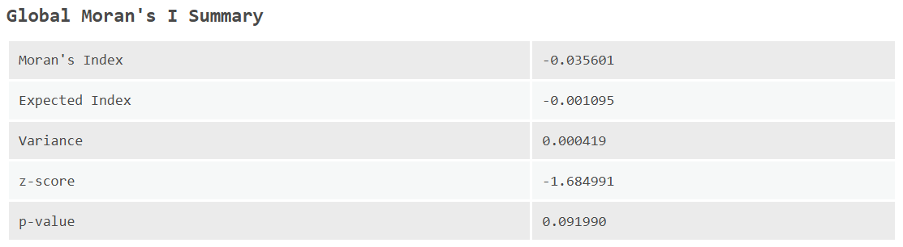{width="85%"}</center>

</details>

<br>

We can evaluate how the spatial patterning of the SEM residuals changes with different spatial weights:

> Re-run an SEM using the [Spatial Autoregression](https://doc.esri.com/en/arcgis-pro/latest/tool-reference/spatial-statistics/spatial-autoregression.html?tabs=dialog) tool, but this time using `K nearest neighbours` as the neighbourhood type ($K=10$). When complete, assess for autocorrelation using [Global Moran's I](https://doc.esri.com/en/arcgis-pro/latest/tool-reference/spatial-statistics/spatial-autocorrelation.html?tabs=dialog) and [Local Moran's I](https://doc.esri.com/en/arcgis-pro/latest/tool-reference/spatial-statistics/cluster-and-outlier-analysis-anselin-local-moran-s.html?tabs=dialog), making sure to use $K=10$ for consistency.

<center>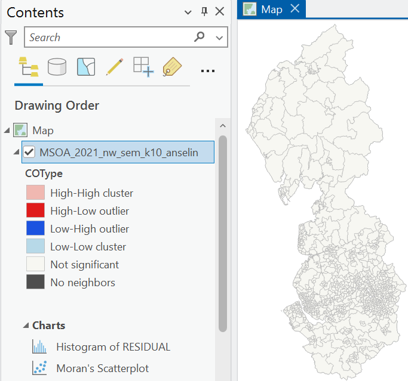{width="50%"}</center>

<br>

::: question
How has the spatial patterning of the residuals changed?
:::

<details>

<summary>Answer</summary>

Based on this spatial weights method, the distribution of residuals is now **random** and highly **non**-significant ($p\approx0.79$), as assessed using global Moran's $I$. Local Moran's $I_i$ reveals no statistically signficant hotspots or outliers.

<center>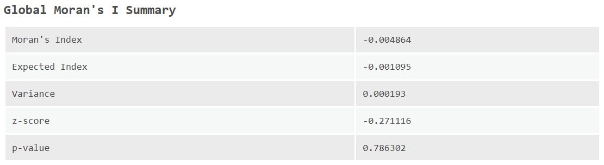{width="85%"}</center>

<br>

</details>

<br>

The results above indicate that the spatial error model has successfully accounted for spatial dependence, as there is **no** statistically significant spatial autocorrelation of the regression residuals. In turn, we can be much more confident in the model coefficients and their use for prediction.

In this case, we can see that total annual income is positively correlated with life expectancy ($\beta\approx0.0003$), with a baseline life expectancy of approximately 63 years ($\beta_0\approx63.28$). For every one unit increase in income (£1), life expectancy would increase by $\approx0.0003$ years, or more meaningfully, for every additional £10,000 increase in income, life expectancy would increase by $\approx3$ years. An interesting but sobering statistic...

> Have a go at including additional independent variables in the spatial error model.

::: question
Which variables are positively and negatively correlated with life expectancy, when spatial dependence is accounted for?
:::

<details>

<summary>Interpretation</summary>

When the full suite of independent variables are included[^07-spatial-regression-24], most are statistically significant (i.e., $p<0.05$), excluding `fuel_poverty_perc` and `employed_not_ftstudent_perc`, indicating that these factors do not influence life expectancy, or are being accounted for by one or more of the other variables:

[^07-spatial-regression-24]: These include `total_annual_income`, `disabled_perc`, `imd_decile` and `fuel_poverty_perc`, as well as the calculated proportional employment (`employed_not_ftstudent_perc`, `economically_inactive_not_ftstudent_perc`) and education fields (`no_qualifications_perc`, `level_four_perc`).

<center>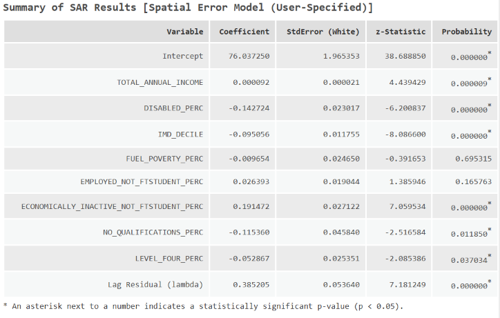{width="85%"}</center>

<br>

Disability and IMD decile are negatively correlated with life expectancy, whereas the percentage who are economically *inactive* is positively correlated, which is a little surprising. Both education attributes are negatively correlated, but the strength of this correlation is much higher for those with no qualifications.

The **key** thing to emphasise here is that by incorporating spatial dependence in the error term, we can be more confident in the calculated model coefficients, compared to those produced by OLS.

</details>

### Spatial lag model {#slm}

We can also evaluate the results of a **spatial lag** model:

> Run [Spatial Autoregression](https://doc.esri.com/en/arcgis-pro/latest/tool-reference/spatial-statistics/spatial-autoregression.html?tabs=dialog), but this time select the `Spatial Lag Model`, using the K-nearest neighbour approach ($K=10$) for consistency with the previous model. For simplicity, again use `total_annual_income` as the single independent variable.

Here are some of the key results:

<center>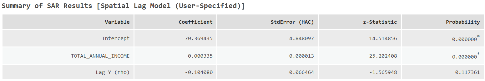{width="100%"}</center>

<br>

As we discussed above, the spatial lag model assumes that spatial dependence arises because of diffusion across spatial units, in which the outcome (dependent) variable is influenced by the outcome of its neighbours. This is addressed by including a spatially lagged *outcome* variable $\rho$, which is included above as `Lag Y (rho)`.

As with the lag residual coefficient ($\lambda$) for the SEM model, this can range from $-1$ to $+1$ and represents the strength of the correlation between an observed dependent variable and that of its neighbours.

Here, the value is negative at $\rho\approx-0.1$. This is indicative of **weak negative** spatial dependence i.e., when observed life expectancy is low, neighbourhood life expectancy is slightly higher, when *we have controlled for the independent variables in the model*[^07-spatial-regression-25]. This weak spatial dependence is evidenced by the probability value of $p\approx0.117$, which we would classify as **not** statistically significant. Based on this data, we might already begin to be cautious about the use of the spatial lag model, given only weak evidence for spatial dependence of the observations.

[^07-spatial-regression-25]: For example, Moran's $I$ on life expectancy exhibits positive spatial autocorrelation i.e., clustering ($I>0$). This spatial dependence could arise from a spatial relationship with the dependent variable (e.g., income) and/or spatial dependence of the observations, as represented by $\rho WY$. If the former explains a large proportion of the spatial dependence, then we might see only weak spatial dependence remaining.

We also need to be cautious when interpreting the coefficients of the spatial lag model. While these are included in the table above, they are not directly comparable to those produced by OLS or SEM, which can be interpreted quite simply: "How much does the dependent variable change for a one unit change in the independent variable, *when all other independent variables are held constant*?" This is not possible for SLM because of **spatial spillover** effects, and the fact that our dependent variable $Y$ is influenced by the surrounding neighbourhood values.

For example, let's imagine a spatial unit $A$. With OLS, the dependent variable at that location $Y_A$ is simply a function of the independent variable at that location $X_A$ e.g., life expectancy at $A$ is predicted by total annual income at $A$:

<center>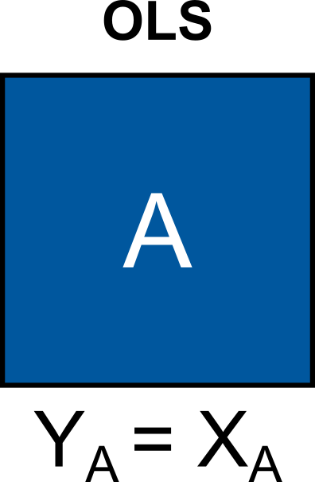{width="20%"}</center>

<br>

For spatial regression, we also consider the impact of the neighbourhood, and let's imagine $A$ has three neighbours $B,C$ and $D$, as visualised below. In a spatial lag model, life expectancy at $A$ is predicted by total annual income at $A$ **but also** life expectancy at $B,C$ and $D$. As life expectancy at $B$ is also influenced by total annual income at $B$ (and the same for $C$ and $D$), the independent variable total annual income is present in multiple locations! It affects life expectancy at $A$ **directly**, via $X_A$, and **indirectly**, via life expectancy at $B,C,D$:

<center>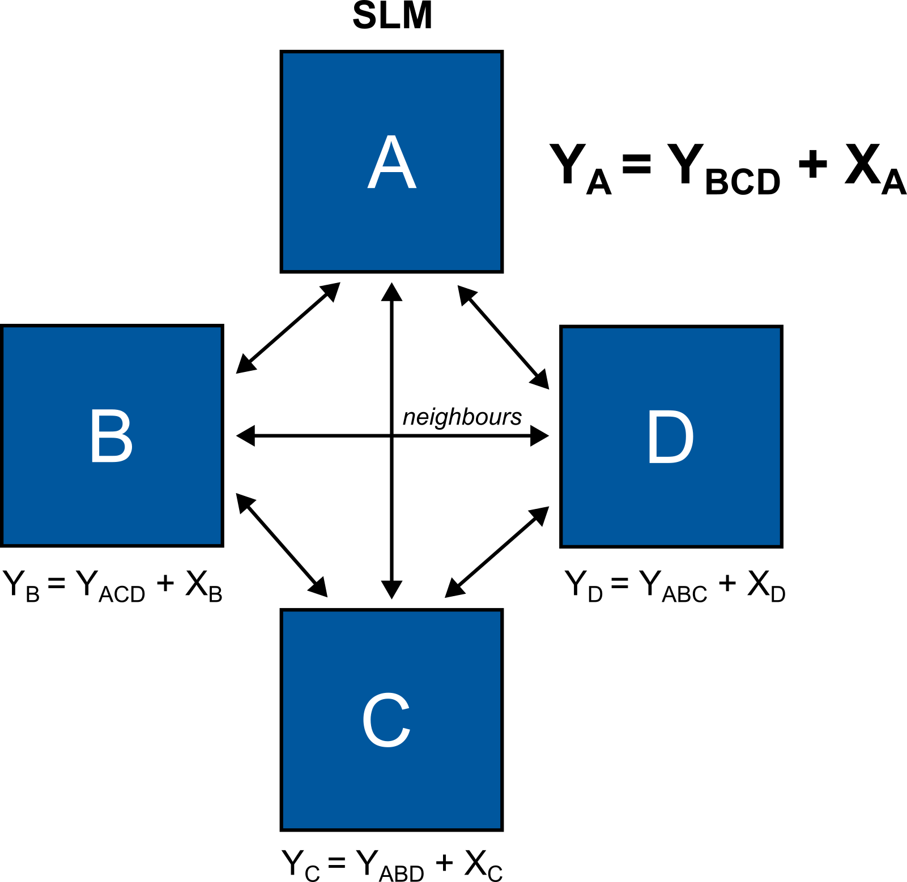{width="80%"}</center>

<br>

This allows us to distinguish two effects of an independent variable:

-   **direct** i.e., the local effect for that spatial unit.
-   **indirect** i.e., the average neighbourhood effect.

The value listed in the coefficient table above ($\approx0.0003$) is the direct effect only, and we can find the indirect and the total effects (i.e., direct + indirect) in the coefficients summary at the bottom:

<center>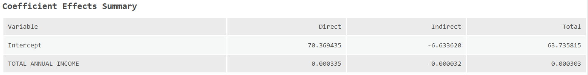{width="100%"}</center>

<br>

In this example, the indirect effects are very small at $-0.000032$, even within the context of the small direct effect of $0.000335$. Based on this reasoning, we can conclude that spatial spillover effects seem relatively unimportant for the current model setup, but this is not always the case, with a more striking example in the esri [documentation](https://doc.esri.com/en/arcgis-pro/latest/tool-reference/spatial-statistics/how-spatial-autoregression-works.html#8A0).

As a final consideration, it is worth evaluating the spatial patterning of the SLM residuals:

> Assess for autocorrelation using [Global Moran's I](https://doc.esri.com/en/arcgis-pro/latest/tool-reference/spatial-statistics/spatial-autocorrelation.html?tabs=dialog), making sure to use $K=10$ for consistency with the SLM model.

<center>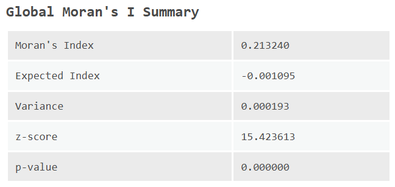{width="50%"}</center>

<br>

::: question
What is your interpretation of Moran's $I$?
:::

<details>

<summary>Interpretation</summary>

Statistically significant global spatial autocorrelation is still present in the model residuals, as evidenced in the Moran plot (below) and when tested using Global Moran's $I$ i.e., $I>0$, $p<0.05$.

<center>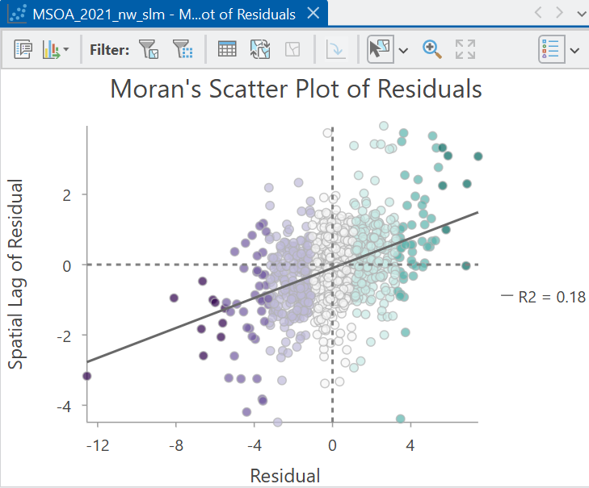{width="50%"}</center>

<br>

</details>

<br>

### Model selection {#spatial_model_selection}

You should now have a good understanding of both the **spatial error** and the **spatial lag** models and how to evaluate them. This raises the question:

::: question
Which model should we select?
:::

Model selection should be based on both **theory** and **statistical reasoning**.

For the latter, we can be quite critical of the spatial lag model for this dataset and model specification, given the spatial autocorrelation of the model residuals. This is one of the key limitations of the OLS model which we were trying to address! Moreover, the spatial lag coefficient $\rho$ was weak, negative and not statistically significant ($p\approx0.117$). By comparison, the spatial error model exhibited spatially random model residuals ($I\approx-0.005$, $p\approx0.79$), and a highly significant $\lambda\approx0.48$, indicating spatial clustering of errors.

From a theoretical perspective, we can also be cautious about whether the observed spatial dependence is a result of *diffusion of behaviour*, as assumed in the spatial lag model. In the political example presented by @thesoci2015 above, there is a clear spatial process by which political opinion and voting intention in one spatial unit might be influenced by political opinion in a neighbouring spatial unit i.e., interactions and discussion between people from different spatial units. This is less clear for our analysis of life expectancy, where it is difficult to envisage how my life expectancy is **directly** influenced by the life expectancy of my neighbours. Instead, spatial dependence in life expectancy is more easily explained by attribute similarity, and the co-patterning of income, education, employment, deprivation, and so on.

We also have other tools at our disposal to select the best model, one of which is the **Lagrange Multiplier** (LM), developed by @bera1993, and applied to spatial regression by @anselin1996, with the process outlined well in the esri [documentation](https://pro.arcgis.com/en/pro-app/3.5/tool-reference/spatial-statistics/how-spatial-autoregression-works.htm#ESRI_SECTION1_DFC61ED3F77040FEBB168A2CFC74D0CC). 

We won't go into the mathematics of the LM tests here, which you are welcome to explore in @anselin1996a. As a simple overview, the LM test begins with an OLS model and then evaluates whether incorporating the spatial lag of the outcome (SLM) or incorporating the spatial lag of the error (SEM) improves the model performance. These are known as the $\text{LM}_{\text{lag}}$ and $\text{LM}_{\text{error}}$ tests respectively. These circumstances are not mutually exclusive, so *robust* versions of these tests evaluate whether including the spatial lag of the outcome improves the model *when the spatial lag of the error has already been accounted for* ($\text{Robust}\ \text{LM}_{\text{lag}}$) and vice versa ($\text{Robust}\ \text{LM}_{\text{error}}$). 

Based on the results of these four tests, and following the process described by @anselin2014:

-   If both $LM_{lag}$ and $LM_{error}$ are not significant, then we can simply use OLS i.e., incorporating spatial dependence does not improve the model. 
-   If only one is significant, that is the model of choice.
-   If both are significant, then more robust test statistics are calculated as described above ($\text{Robust}\ \text{LM}_{\text{lag}}$, $\text{Robust}\ \text{LM}_{\text{error}}$) and the process is repeated. If only one of the robust tests is significant, that is the model of choice.

> Inspect the output from the previous [Spatial Autoregression](https://doc.esri.com/en/arcgis-pro/latest/tool-reference/spatial-statistics/spatial-autoregression.html?tabs=dialog) model, focusing on the `LM Test Results` section. 

<center>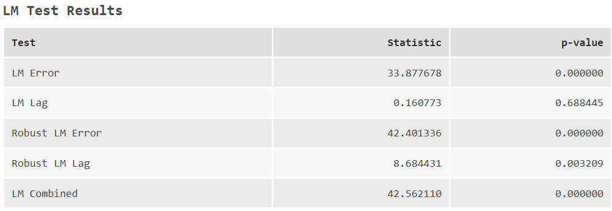{width="80%"}</center>

<br>

::: question
Based on the results above and the workflow of @anselin2014, which is our preferred model?
:::

<details>

<summary>Interpretation</summary>

Here, $\text{LM}_{\text{error}}$ is significant at $p<0.05$ whereas $\text{LM}_{\text{lag}}$ is not statistically significant at $p\approx0.69$. Based on the Lagrange Multiplier tests, we would reject SLM in favour of SEM, which accords with our theoretical and statistical interpretation above.

In future, you can allow the [Spatial Autoregression](https://doc.esri.com/en/arcgis-pro/latest/tool-reference/spatial-statistics/spatial-autoregression.html?tabs=dialog) tool to select the model for you automatically based on the LM test, using "Model Type" = `Auto-detect`, although this should not take precedence over theoretical reasoning, and your own judgement of the output statistics. 

</details>

<br>

As a final consideration, we could also run a **combined autoregressive model** (SAC) via the [Spatial Autoregression](https://doc.esri.com/en/arcgis-pro/latest/tool-reference/spatial-statistics/spatial-autoregression.html?tabs=dialog) tool. This is simply a combination of SEM and SLM, incorporating the spatial dependence of the errors as well as the spatial lag of the dependent variable. 

::: question
Why might this *not* be a suitable choice in our situation?
:::

<details>

<summary>Interpretation</summary>

Our theoretical interpretation above, and the results of the Lagrange Multiplier test, indicate that a spatial lag model is not a significant improvement compared to a standard OLS. As such, and with [model parsimony](https://en.wikipedia.org/wiki/Occam%27s_razor) in mind, there is no clear benefit to including SLM in a combined approach, when SEM is a marked improvement on its own. 

</details>

<br>

### Summary {#regression_summary}

In today's practical, we have discussed the problems with aspatial regression methods when applied to spatial data. Mathematically these methods don't account for the spatial processes which often influence the dependent variable of interest, and don't account for spatial dependence. This is important because the resulting OLS models are often misspecified or invalid when key assumptions are not met (e.g., independence of observations, independence of error). More fundamentally, as GI Scientists we are working with **spatial data**. Aspatial methods ignore a key component of that data i.e., their **geography**. Incorporating this information into the regression framework can result in unbiased coefficients, can minimise errors, and can allow us to make more accurate predictions. 

We introduced two common approaches to incorporate **spatial dependence**, namely the **spatial error model** (SEM) and the **spatial lag model** (SLM). These differ mathematically and theoretically, and should be selected based on the topic (e.g., is spatial dependence due to diffusion of behaviour or attribute similarity?) and the resulting model performance (e.g., statistical significance and the Lagrange Multiplier). 

While these are the most commonly used spatial regression models, and are easily run in ArcGIS via the [Spatial Autoregression](https://doc.esri.com/en/arcgis-pro/latest/tool-reference/spatial-statistics/spatial-autoregression.html?tabs=dialog) tool, it is worth noting that there are alternatives. Examples include the **SLX** model, which includes spatially-lagged *independent* variables (unlike SLM, which includes a spatially-lagged *dependent* variable), and the **Spatial Durbin** and **Spatial Durbin Error** models, which combine the SLX model with SLM and SEM respectively.

...and with that, **congratulations!** You have completed the practical and should now be cautious about using OLS and similar aspatial methods for spatial data analysis, and should be able to implement and evaluate spatial regression methods in ArcGIS. 

[**Finished!**](#index)

## Extra {#prac_7_extra}

In this practical we have developed global models to predict life expectancy. However, we should recognise that the model performance and the identified relationships (i.e., coefficients $\beta$) are specific to these data and the study area i.e., the North West of England.

::: question
How generalisable are our models to new locations and datasets?
:::

To test this, we can generate new spatial regression models for a different regions of England and Wales e.g., London, and assess how model performance varies. The instructions above provide further information and context, but as a brief refresher:

> Load the England and Wales MSOA geometries [`MSOA_2021_EW_BGC_V3.shp`] and lookup table [`MSOA_2021_lookup_table.csv`] and join via `MSOA21CD`. When complete, Select by Attributes using `RGN22NM = 'London'` ($n=1002$). Export the Selection to `MSOA_2021_london`, saving to `practical-7.gdb` to facilitate use of full field names. 

> Next, load the datasets containing the dependent and independent variables from [`data/dhsc`] and [`data/ons/msoa`], and join the important attributes to the London MSOA geometries (listed above). *Note* if you wish to include education, economic activity or disability status variables, these data would need to be obtained from the [ONS](https://www.ons.gov.uk/datasets/create). By comparison, the DHSC life expectancy, fuel poverty and IMD datasets contain values for all MSOAs in England and Wales, so no data wrangling required! 

::: note
To simplify the regional comparison, you may wish to use a single independent variable e.g., the effects of deprivation (`imd_decile`) on life expectancy. 
:::

> Run [Spatial Autoregression](https://doc.esri.com/en/arcgis-pro/latest/tool-reference/spatial-statistics/spatial-autoregression.html?tabs=dialog) using the same dependent and independent variables, model type (e.g., SEM) and spatial weights method (e.g., $K=10$), but for the North West and London regions separately.  

For example, here are the coefficients for a spatial lag model, where deprivation is the sole predictor of life expectancy, for the **North West**:

<center>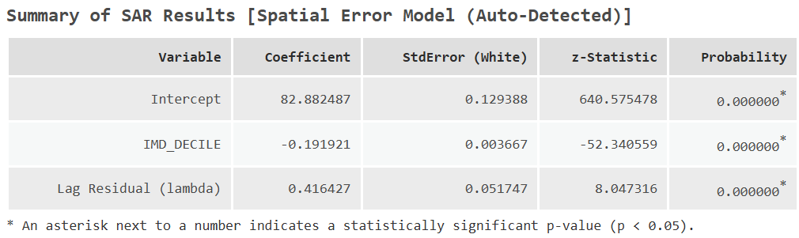{width="100%"}</center>

<br>

and for **London**:

<center>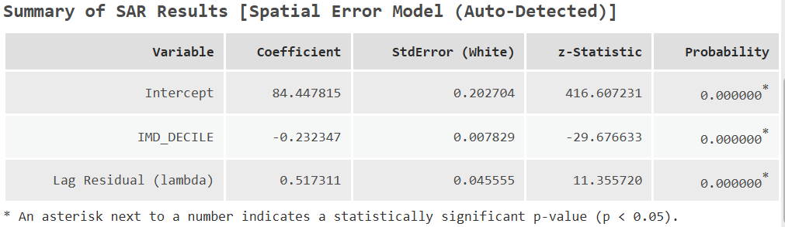{width="100%"}</center>

<br>

::: question
How well does deprivation explain life expectancy in the two regions?
:::

<details>

<summary>Answer</summary>

In the North West, $\approx0.78 \%$ of variability in life expectancy can be explained by deprivation, with $\approx0.58 \%$ explained in London. While these estimates are derived from the same modelling approaches, we should be cautious of comparing them directly, as these are **pseudo** $R^2$ values, which are described [here](https://doc.esri.com/en/arcgis-pro/latest/tool-reference/spatial-statistics/how-spatial-autoregression-works.html#E3F). 

</details>

::: question
How different is the baseline life expectancy between the two regions?
:::

<details>

<summary>Answer</summary>

This is expressed by the intercept term $B_0$, which is $\approx82.9$ in the North West and $\approx84.4$ years in London. Note that this is the intercept term when deprivation is the only predictor, and this will vary as additional predictors are added. 

</details>

::: question
How different is the new model? Does this change your interpretation of the links between MSOA-level attributes and life expectancy?
:::

<details>

<summary>Answer</summary>

Both models show that life expectancy is negatively correlated with deprivation. The estimated coefficient is slightly larger in London at $\approx-0.23$ compared to $\approx-0.19$ in the North West, *potentially* revealing a larger effect of deprivation in London. Either way, deprivation shows a similar negative effect in both regions, which lends support to the **generalisability** of our model. 

</details>

## Resources

-   Anselin, L. ([1988](https://doi.org/10.1007/978-94-015-7799-1)). Spatial econometrics: methods and models. Kluwer Academic Publishers google schola, 2, pp.283-291.
-   Anselin, L. ([2002](https://doi.org/10.1111/j.1574-0862.2002.tb00120.x)). Under the hood issues in the specification and interpretation of spatial regression models. Agricultural economics, 27(3), pp.247-267.
-   Darmofal, D. ([2015](https://doi.org/10.1017/CBO9781139051293.007)) Spatial Lag and Spatial Error Models. In: Spatial Analysis for the Social Sciences. Analytical Methods for Social Research. Cambridge University Press:96-118.
-   Gibbons, S. and Overman, H.G. ([2012](https://doi.org/10.1111/j.1467-9787.2012.00760.x)). Mostly pointless spatial econometrics?. Journal of regional Science, 52(2), pp.172-191.

```{r, eval=FALSE, echo=FALSE}

#------------ Code to generate plot of Getzin et al. (2012) data, but using regression

# Import library
library(ggplot2)

# Define data, generated using PlotDigitzer
data <- data.frame(
  gsci = c(1.42, 1.53, 1.34, 1.69, 1.45, 1.55, 1.63, 1.87, 1.87, 1.94,
               1.95, 2.17, 2.18, 2.29, 2.52, 2.90, 2.70, 2.95, 3.08, 3.04),
  sr = c(15.86, 20.79, 22.82, 26.82, 33.86, 33.95, 33.86, 29.79, 36.84, 37.86,
         33.86, 38.79, 33.86, 31.83, 38.87, 40.83, 44.82, 52.89, 50.93, 48.05)
)

# Scatter plot
g <- ggplot(data, aes(x = gsci, y = sr)) +
  geom_point(
    fill = "black",
    color = "black",
    size = 1,
    alpha = 0.8, shape = 21
  ) +
  geom_smooth(method="lm", se = FALSE) +
  labs(
    x = "Median GSCI",
    y = "Species richness (Hainich)",
  ) +
  theme_classic()

# Save
ggsave(
  plot = g,
  "./images/practical-7/getzin_regress.png",
  height = 3,
  width = 3,
  units = "in",
  dpi = 300
)

# Produce OLS
model <- lm(sr ~ gsci, data = data)
summary(model)

```
