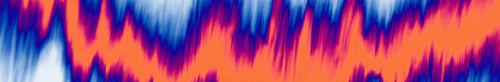

# Geographically Weighted Regression {#gwr .small-chapter}

## Introduction



### Aims {.unnumbered}

The aims of this practical are to:

1.  Understand the principles and rationale for Geographically Weighted Regression (GWR).
2.  Understand the importance of scale and the development of Multiscale Geographically Weighted Regression (MGWR).
3.  Implement and correctly interpret the outputs of GWR-MGWR when applied in a sociological context.

### Application {.unnumbered}

To achieve this, we'll use [MSOA-level](https://www.ons.gov.uk/methodology/geography/ukgeographies/statisticalgeographies) data to investigate **spatially-varying** relationships between life expectancy and key predictors in Greater Manchester, building upon the **global** models introduced in the [previous practical](#spatial_regression).

### Data {.unnumbered}

The data sources and attributes used in this analysis are described [here](#sr_data).

### Tools {.unnumbered}

[Geographically Weighted Regression (GWR)](https://doc.esri.com/en/arcgis-pro/latest/tool-reference/spatial-statistics/geographically-weighted-regression.html?tabs=dialog) (Spatial Statistics), [Multiscale Geographically Weighted Regression (MGWR)](https://doc.esri.com/en/arcgis-pro/latest/tool-reference/spatial-statistics/multiscale-geographically-weighted-regression.html?tabs=dialog) (Spatial Statistics)

------------------------------------------------------------------------

## Practical

### Pre-processing

::: task
Initial context, reiterating differences between **global** models discussed last week (OLS, spatial autoregression) and the **local** models introduced here, which consist of a series of local linear regressions, using data falling within a moving window around each feature to generate local and spatially varying coefficient estimates.
:::

[1] Load the north-west MSOA geometries from [Practical 7](#spatial_regression), ensuring the relevant joined fields are present [`life_expectancy_male`, `life_expectancy_male`, `total_annual_income`, `employed_not_ftstudent`, `economically_inactive_not_ftstudent`, `economic_status_total`, `no_qualifications`, `level_four`, `qualification_total`, `disabled_perc`, `imd_decile`, `fuel_poverty_perc`]

::: task
Reiterate key themes from [Practical 7](#spatial_regression) i.e., we can develop global models linking life expectancy to MSOA-level predictors, either using standard OLS, or incorporating the spatial structure of the data (SEM, SLM), but what if spatial non-stationarity is present?
:::

A key source for this week is @comber2023, which outlines a route map for successful applications of GWR. While this approach should be considered for future analysis, it is worth noting that that we have deviated from @comber2023 across Practicals 7 and 8, but this is by design, building from global *aspatial* regression ([OLS](#ols)) through to global *spatial* regression ([SEM](#sem), [SLM](#slm)), and in this week on to local regression ([GWR](#gwr_intro)) and multiscale local regression ([MGWR](#mgwr_intro)).

### Geographically Weighted Regression {#gwr_intro}

In [Practical 7](#spatial_regression), we demonstrated that there were statistically significant relationships between life expectancy and MSOA-level predictors, as identified by [OLS](#ols). However residuals were highly autocorrelated, as identified using Moran's *I*. In this situation, one common option is to use global spatial regression, accounting for autocorrelation as a ["nuisance"](#sem) or as a reflection of ["interaction"](#slm) between neighbouring units. An alternative option is to explore local spatial regression, which we will explore today.

[2] Run [Geographically Weighted Regression](https://doc.esri.com/en/arcgis-pro/latest/tool-reference/spatial-statistics/geographically-weighted-regression.html?tabs=dialog):

> Select Model Type i.e., whether our input data are continuous (Gaussian), binary (Logistic) or counts (Poisson). Life expectancy is a continuous variable so Gaussian. *Note* in Practical 10 we will use a Poisson approach using count data.

> As discussed last week, it is typical to include a range of independent variables, so we'll incorporate the following: [`total_annual_income`, `disabled_perc`, `imd_decile`, `fuel_poverty_perc`].

The key remaining choices are whether to use a **fixed** kernel (distance) or **adaptive** kernel (\# neighbours), as described [here](https://gdsl-ul.github.io/san/09-gwr.html#fitting-a-geographically-weighted-regression), and how to selected an appropriate **bandwidth** for each. In ArcGIS, these are referred to as the `Neighbourhood Type` (Distance or K-neighbours) and the `Selection Method` respectively (Golden Search i.e., cross-validation, Manual intervals, User-defined). We can also select the **shape** of the kernel, which is specified via the `Local Weighting Scheme` (Gaussian or Bisquare options).

::: task
**To do** Include fuller descriptions and schematics for the kernel types.
:::

For now, we'll use the default settings, and explore the initial GWR results, before exploring the effects of the settings on our output:

-   `Neighbourhood Type` = Distance band
-   `Selection Method` = Golden Search
-   `Local Weighting Scheme` = Bisquare

We will also scale our dependent and independent variables (`Scale Data` = Checked) to have a mean of zero and standard deviation of one. This standardisation is useful approach when there are large differences in the magnitude of our independent variables e.g, total annual income ranges from £27,072 to £79,191, while the proportion variables (e.g., disabed and fuel poverty %) can only span 0% to 100%.

:::
*To do* explain **why** scaling works.
:::

[3] Inspect initial outputs

First, we should always inspect *warnings* before jumping to interpretation:

```{r, eval=FALSE, collapse=TRUE}
WARNING 000642: Problems reading 18 of 932 total records.
WARNING 000848: Features with bad records (only includes first 30): OBJECTID = 21, 27, 50, 78, 107, 145, 170, 174, 367, 419, 492, 755, 791, 911, 912, 914, 921, 923.
```

This is the same warning from last week, which we can safely ignore, as this is flagging rows where we have missing data (no `life_expectancy_male`).

> Inspect the **Model Diagnostics** output.

::: question
What is our overall model performance? (R^2^ and Adjusted R^2^)
:::

Note that although GWR is constructing a series of local regressions, each with their own R^2^ value (`Local R-Squared` attribute), a global R^2^ can be calculated using the observed and predicted life expectancy values using a standard approach, described [here](https://community.esri.com/t5/spatial-statistics-questions/how-is-the-overall-r2-reported-in-gwr-being/td-p/18268) and defined as follows:

$$R^2=1 - \frac{RSS}{TSS}$$

where $RSS$ is the residual sum of squares [^08-gwr-1] and $TSS$ is the total sum of squares [^08-gwr-2].

[^08-gwr-1]: The sum of the squares of the residuals i.e., deviation of predicted life expectancy from actual life expectancy.

[^08-gwr-2]: The dispersion of the data points from the average value i.e., the difference between life expectancy in each MSOA and the mean of the MSOA life expectancy values.

> Inspect the `Relationship between Variables` Plot.

::: question
Which *global* relationships are positive or negative?
:::

> Inspect the `Distribution of Standardized Residual` plot.

::: question
How would you describe the distribution of model errors?
:::

> Inspect the `Standardized Residual vs. Predicted` plot.

::: question
Is there evidence of systematic error?
:::

> Change the layer symbology from Standardised Residual, and visualise the coefficients each of the modelled independent variables.

::: question
Are there any spatial patterns to the relationships between life expectancy and the modelled independent variables?
:::

> Change the layer symbology to the Condition Number (`CND_Number`) which is a measure of local multicollinearity. Although we have assessed for [global multicollinearity](#ols) last week, multicollinearity could be present locally, as local regressions are developed for each focal feature. As a general rule, CNs \> 30 indicate local multicollinearity. *To do* explain how the CN is calculated...

::: question
Is there evidence of local multicollinearity? Is there any spatial pattern to the Condition Numbers? Why might this be?
:::

::: problem
**Fixed**, but noted here for posterity:

The condition numbers for GWR using *unscaled* variables are extraordinarily high (625705.267212 - 12181949.0742) and show a spatial pattern. CNs \> 30 are typically used to indicate worrying levels of collinearity, see [here](https://gdsl-ul.github.io/san/09-gwr.html#global-regression). While multicollinearity is not a problem at a global level, it can be locally. This is usually solved by increasing the bandwidth, but that isn't valid here, because the fixed (distance) kernel already results in a high number of neighbours. This has been addressed by **scaling the inputs**, which has been added to the instructions above. All CNs are now \< 30 (Max = \~13.9), albeit with an interesting spatial pattern, matching the features with a smaller number of neighbours (sensitivity).
:::

#### Calibration: Fixed kernel

[4] Bandwidth selection

In our first model, we have used a **fixed** kernel, where the neighbours of each point are defined based on a distance, where the optimal distance (or bandwidth) has been selected based on the `Golden Search` method.

> Inspect the Golden Search Results table, which includes the tested distance bands, and the resulting AICc. As per the [documentation](https://doc.esri.com/en/arcgis-pro/latest/tool-reference/spatial-statistics/how-geographicallyweightedregression-works.html), this method first finds maximum and minimum distances and tests the AICc at various distances incrementally between them. The maximum distance (\~224 km) is the distance at which every feature has half the number of input features as neighbors, and the minimum distance (\~67 km) is the distance at which every feature has at least 5 percent of the features in the dataset as neighbors.

::: task
*To do* explain the AICc criterion.
:::

For our model, the `Golden Search` method has finalised with a bandwidth of 67724.0669 m (AICc = 3335.5727), although we should be aware of the following warning:

```{r, eval=FALSE, collapse=TRUE}
WARNING 110306: The final model didn't have the lowest AICc encountered in the Golden Search Results.
```

As per the [documentation](https://doc.esri.com/en/arcgis-pro/latest/tool-reference/tool-errors-and-warnings/110001-120000/tool-errors-and-warnings-110301-110325-110306.html), the Golden Search method is not guaranteed to find the lowest possible AICc, which we can see by investigating the summary table, where there is bandwidth with a lower AICc of 3335.4256. In this situation, we could re-run GWR specifying the distance manually (`Neighbourhood Selection Method` = User Defined). However, given the very small difference in AICc and the selected bandwidth (67.7 km vs. 67.2 km), this is likely to have only a small impact on the results.

It is also worth inspecting the number of neighbours for each feature, as stored in the Attribute Table (`Number of Neighbors`)

::: question
How many neighbours are there for each MSOA? How does this vary spatially?
:::

> Use the Neighbourhood Explorer, as introduced in [Practical 2](#spatial_weights), to investigate the neighbourhoods for each feature, using `Fixed Distance` as the method, and using the `Distance Band` selected by GWR.

> Change the layer symbology to visualise the number of neigbours, using Graduated or Unclassed colours.

::: question
Do you think a fixed kernel is a good choice for our MSOA dataset? How does this correlate with local model stability (`CND_Number`)?
:::

#### Calibration: Adaptive kernel

Rather than utilising a fixed kernel across the study area (distance-based), an alternative approach is to use an adaptive kernel, where the distance varies to ensure an equal number of neighbours per feature.

[5] Re-run [Geographically Weighted Regression](https://doc.esri.com/en/arcgis-pro/latest/tool-reference/spatial-statistics/geographically-weighted-regression.html?tabs=dialog), using the settings outlined in [2], using `Neighbourhood Type` = Number of neighbors, selected via `Golden Search`.

::: question
What is the overall model performance?
:::

::: question
How many neighbours are being used for each local regression? How does this differ from the fixed approach used previously?
:::

::: question
How would you describe the distribution of model errors?
:::

::: question
What is your assessment of local multicollinearity? Is the pattern different to when a fixed kernel was used?
:::

A **key question** to consider is: should I use a fixed or adaptive kernel? As a general rule:

-   When the data are relatively evenly distributed (e.g., a regular grid), use a fixed kernel.
-   When the data show clustering or uneven density, use an adaptive kernel.

For our data, while MSOAs have similar populations, they represent markedly different spatial areas (e.g., central Manchester vs. Cumbria). When a fixed kernel is used, this results in vastly different neighbourhood settings (n = 30 - 848)

#### Calibration: Local Weighting Scheme

In addition to selecting the kernel (fixed vs. adaptive), we can also select the local weighting scheme, which determines how features are weighted in the local regressions. Following Tobler's Law, those closer to the focal feature are weighted more heavily than those further away, where the local weighting scheme determines how quickly weights decrease as distances increase. There are lots of formulas that could be used here e.g., uniform, exponential, tri-cube, with useful information in @gollini2015. ArcGIS provides two widely used options: Gaussian and Bisquare.

Gaussian weighting is defined as follows:

$$
f(d)=\exp\left(-\frac{1}{2}\left(\frac{d}{h}\right)^2\right)
$$

where $d$ is the distance between features and $h$ is a bandwidth value, which can be modified to change how quickly weights decrease with distance.

::: task
*To do* Include interactive plotly figure, showcasing distances vs. bandwidths.
:::

This approach assigns a weight of 1 to the focal feature and weights for the neighboring features gradually decrease as the distance from the focal feature increases. A Gaussian weighting scheme never reaches zero, but weights for features far away from the regression feature can be quite small and have almost no impact on the regression.

By comparison, **bisquare weighting** assigns zero to all features outside of the neighborhood specified. As a result, these do not impact the local regression for the focal feature, as per the following [equation](https://bookdown.org/lexcomber/GEOG5917/modelling-with-regression-and-gwr.html#geographically-weighted-regression):

$$
f(d)=\begin{cases}\left(1-\left(\frac{d}{h}\right)^2\right)^2 & \text{if } d<h\\
0 & \text{otherwise.}\end{cases}
$$ 

::: task
*To do* As above, include interactive plotly figure, showcasing distances vs. bandwidths for bisquare method.
:::

[8] We've been using the bisquare approach so far, so re-run [Geographically Weighted Regression](https://doc.esri.com/en/arcgis-pro/latest/tool-reference/spatial-statistics/geographically-weighted-regression.html?tabs=dialog), using the same settings as before (i.e., scaling inputs, adaptive kernel, `Golden Search` method), but now setting the `Local Weighting Scheme` to Gaussian, which can be found under `Additional Options`.

::: question
Has model performance changed significantly?
:::

::: question
How has the number of neighbours changed?
:::

When using an adaptive kernel and bisquare bandwidth, `Number of Neighbors` = 153. When a Gaussian bandwidth is used, `Number of Neighbors` = 35. In reality, the latter value is somewhat misleading, because **all** the observations in the dataset contribute to the regression for the focal feature[^08-gwr-3]. The nearest 35 observations (in this case) define the bandwidth $h$, which determines the weights for all observations. For bisqaure weighting, the `Number of Neighbors` can be interpreted more easily: for each focal feature, the 153 nearest neighbours contribute to the local regression for each focal feature, weighted accordingly between 0 and 1[^08-gwr-4], while all other features are assigned a weight of 0.

[^08-gwr-3]: As per the Gaussian weighting scheme: $f(d)=\exp\left(-\frac{1}{2}\left(\frac{d}{h}\right)^2\right)$

[^08-gwr-4]: As per the Bisquare weighting scheme: $f(d)=\begin{cases}\left(1-\left(\frac{d}{h}\right)^2\right)^2 & \text{if } d<h\\ 0 & \text{otherwise.}\end{cases}$

As distant features make no contribute to the local regression using bisquare weighting, a larger number of neighbours may be required to obtain coefficient stability (assessed via AICc). By comparison, for a Gaussian kernel, the bandwidth controls how quickly weights decay, not which observations are included or excluded. For our investigation, where we expect the influence of neighboring features to diminish gradually with distance, a Gaussian approach is preferred.  

::: task
*To do* clarify that in the ArcGIS implementation, we do not have access to the $h$ parameter. This is a scenario where our analysis is being limited by the implementation we have chosen. Ideally we would modify the bandwidth and assess its impacts on our results, but that is not possible here!
:::

::: task
**Need to confirm**, is $h$ (bandwidth) the distance to the *n*th nearest neighbour, where *n* is associated with the lowest AICc?
:::

### Multiscale Geographically Weighted Regression {#mgwr_intro}

So far, so good. We've developed Geographically Weighted Regressions, taking into account non-stationarity in the relationship between life expectancy and MSOA-level predictors.

However, while this is a powerful technique, one **weakness** of standard GWR is that it utilises a fixed neighbourhood for all predictors. In our testing above, this was a distance of \~67 km (fixed kernel) and 153 neighbours (adaptive kernel). In reality, the processes being modelled might operate at different spatial scales i.e., the relationship between life expectancy and income vs. life expectancy and deprivation. This can be addressed using Multiscale Geographically Weighted Regression, which facilitates the use of parameter-specific bandwidths [@changchien2020].

::: task
*To do* Nice schematic here, in the style of the [documentation](https://doc.esri.com/en/arcgis-pro/latest/tool-reference/spatial-statistics/multiscale-geographically-weighted-regression.html?tabs=dialog)
:::

[9] Run [Multiscale Geographically Weighted Regression](https://doc.esri.com/en/arcgis-pro/latest/tool-reference/spatial-statistics/multiscale-geographically-weighted-regression.html?tabs=dialog) using the same inputs as previously:

-   Dependent = `life_expectancy_male`
-   Independent = `total_annual_income`, `disabled_perc`, `imd_decile`, `fuel_poverty_perc`
-   Scale inputs
-   Neighbourhood type = Number of neighbours (adaptive)
-   Selection method = Golden Search
-   Local weighting scheme = Gaussian

[10] There are **lots** of outputs to interpet here, so let's focus on some key tables to start:

::: question
What do the scaled coefficients for each independent variable (e.g., mean, median) tell us?
:::

::: question
What is the overall model performance for MGWR (R^2^, AICc)? *Note* that the MGWR will also return the results for a standard GWR (fixed neighbourhood scale for each variable), but this will differ from the outputs of the standalone [GWR](https://doc.esri.com/en/arcgis-pro/latest/tool-reference/spatial-statistics/geographically-weighted-regression.html?tabs=dialog) tool. This is because the standalone tool is optimised to find the bandwidth that returns the best overall model (AICc), while in MGWR, the GWR output is simply a baseline for multiscale optimisation.
:::

> Inspect the `Summary of Explanatory Variables and Neighborhoods` table, which summarises the optimal number of neighbours for each independent variable, and the number of features which are significant (95% CI).

::: question
Is there evidence of multiscale behaviour? Do some independent variables show local or global behaviour?
:::

::: question
Which independent variables are making the most important contribution to patterns of life expectancy? Could we be justified in removing some variables?
:::

[11] Inspect the visual outputs

::: question
Is there spatial clustering of the standardised residuals?
:::

::: task
We can use [Moran's *I*](https://doc.esri.com/en/arcgis-pro/latest/tool-reference/spatial-statistics/spatial-autocorrelation.html?tabs=dialog) to test for this, but how do we select for the number of neighbours? Should we match to the MGWR approach i.e., K nearest neighbors = 250, within the range of the MGWR output of 205 - 283? Is there scope for a measure which incorporates the multiple scales involved, in the style of @illanas2025a for Lee's *L*?
:::

MGWR also produces additional layers for each independent variable (`total_annual_income`, `disabled_perc`, `imd_decile`, `fuel_poverty_perc`), including the (scaled) coefficient values, representing the strength of the relationship with life expectancy, and the significance, where hatched fills denote features that are not statistically significant. *Note* that because we are using scaled coefficients, a consistent symbology scale is used for all independent variables to facilitate comparison. To investigate coefficient variability within the study area, you may want to update this, switching to Graduated or Unclassed colours, and using a variable-specific minimum and maximum.

::: question
How does the relationship between the independent variables and life expectancy vary across the study area?
:::

[12] Re-run [Multiscale Geographically Weighted Regression](https://doc.esri.com/en/arcgis-pro/latest/tool-reference/spatial-statistics/multiscale-geographically-weighted-regression.html?tabs=dialog), but removing `disabled_perc` and `fuel_poverty_perc`.

While these are likely important contributors to life expectancy, our previous model run indicates that they are having a minor impact in our model (\# significant features = 0% - 9.7%). Instead, the effects of disability and fuel poverty on life expectancy are likely being captured by the Index of Multiple Deprivation, which already incorporates indicators representing income, employment, education, health, crime, housing, and the living environment. To minimise the risk of multicollinearity, and with model [parsimony](https://en.wikipedia.org/wiki/Occam%27s_razor) in mind, a model with a smaller set of elements is preferable.

::: question

Has model performance changed significantly?

:::

### Model selection {#gwr_selection}

Over the past two weeks, we have produced a range of models linking life expectancy to MSOA-level variables i.e., [OLS](#ols), [SEM](#sem), [SLM](#slm), [GWR](#gwr_intro), [MGWR](#mgwr_intro). You may be asking yourself the following question:

::: question
Which model do I choose?
:::

Following @comber2023, a good approach is to begin your analysis with a standard [linear regression](#ols), which can be used to evaluate whether relationships are statistically significant and whether there is any evidence of autocorrelated errors. If relationships *are* significant and autocorrelated errors are *absent*, then no further analysis is required - you have discovered powerful and stationary relationships for your phenomenon and study area!

If spatial non-stationarity *is* present (autocorrelated errors), then a suitably-calibrated MGWR would be a sensible next step. The outputs can then be interrogated to inform subsequent analysis:

-   *if* bandwidths are different (as evidenced [above](#mgwr_intro)), use MGWR.
-   *if* bandwidths are all the same (rare), then use GWR.
-   *if* bandwidths tend to be global and residuals are spatially autocorrelated, then a spatial regression approach would be suitable e.g., [SEM](#sem), [SLM](#slm).

Finally, it should be recognised that other GWR variants are available (e.g., MX-GWR, see @comber2023), and there are an array of secondary model decisions to be considered, some of which we've dealt with above (e.g., collinearity), and others which you can explore further in your own reading (e.g., handling outliers). Moreover, while the route map of @comber2023 is an excellent guide, it is not prescriptive, and there is flexibility to pursue your own workflow, guided by data and theory. 

## Extra

### Model generalisation {.unnumbered}

For those interested in exploring further, we can explore how the local models change when applied to a different region.

::: task
As with Practical 7, should we switch to London here?
:::

[A] Either (i) load the data for the *North East* and *Yorkshire and Humber* created in Practical 7 [Extra](#prac_7_extra) or [ii] follow the instructions in [Extra](#prac_7_extra) to generate this dataset (i.e., filter MSOAs, join fields)

[B] Re-run [GWR](https://doc.esri.com/en/arcgis-pro/latest/tool-reference/spatial-statistics/geographically-weighted-regression.html?tabs=dialog) and [MGWR](https://doc.esri.com/en/arcgis-pro/latest/tool-reference/spatial-statistics/multiscale-geographically-weighted-regression.html?tabs=dialog).

::: question
How does model performance compare to the models developed for the North West region?
:::

::: question
What does this suggest about the generalisability of our model?
::: 

### Gradient search {.unnumbered}

For selecting the optimal bandwidth we've been using the `Golden Search` method. The [MGWR](https://doc.esri.com/en/arcgis-pro/latest/tool-reference/spatial-statistics/multiscale-geographically-weighted-regression.html?tabs=dialog) tool provides an additional method, known as `Gradient Search`, which is described in the [documentation](https://doc.esri.com/en/arcgis-pro/latest/tool-reference/spatial-statistics/how-multiscale-geographically-weighted-regression-mgwr-works.html#F38).

::: question
What are the advantages / disadvantages of this approach? Does it significantly affect your MGWR outputs?
:::

::: problem
MGWR fails when using gradient search: [ERROR 110222](<https://doc.esri.com/en/arcgis-pro/latest/tool-reference/tool-errors-and-warnings/110001-120000/tool-errors-and-warnings-110201-110225-110222.html>: Unable to estimate at least one local model due to multicollinearity (data redundancy).
:::

::: task
Remove gradient search for simplicity?
:::

## Resources

-   Brunsdon, C., Fotheringham, A.S. and Charlton, M.E. ([1996](https://doi.org/10.1111/j.1538-4632.1996.tb00936.x)), Geographically Weighted Regression: A Method for Exploring Spatial Nonstationarity. Geographical Analysis, 28: 281-298.
-   Fotheringham, A. S., Yang, W., & Kang, W. ([2017](https://doi.org/10.1080/24694452.2017.135248)). Multiscale Geographically Weighted Regression (MGWR). Annals of the American Association of Geographers, 107(6), 1247–1265.
-   Comber, A., Brunsdon, C., Charlton, M., Dong, G., Harris, R., Lu, B., Lü, Y., Murakami, D., Nakaya, T., Wang, Y. and Harris, P. ([2023](https://doi.org/10.1111/gean.12316)). A route map for successful applications of geographically weighted regression. Geographical Analysis, 55(1), pp.155-178.
