# Geographically Weighted Regression {#gwr .small-chapter}

## Introduction

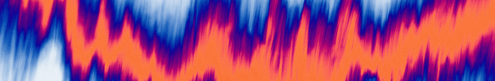

### Aims {.unnumbered}

The aims of this practical are to:

1.  Understand the principles and rationale for Geographically Weighted Regression (GWR).
2.  Understand the importance of scale and the development of Multiscale Geographically Weighted Regression (MGWR).
3.  Implement and correctly interpret the outputs of GWR-MGWR when applied in a sociological context.

### Application {.unnumbered}

To achieve this, we'll use [MSOA-level](https://www.ons.gov.uk/methodology/geography/ukgeographies/statisticalgeographies) data to investigate **spatially-varying** relationships between life expectancy and key predictors in Greater Manchester, building upon the **global** models introduced in the [previous practical](#spatial_regression).

### Data {.unnumbered}

The data sources and attributes used in this analysis are described [here](#sr_data).

### Tools {.unnumbered}

[Geographically Weighted Regression (GWR)](https://doc.esri.com/en/arcgis-pro/latest/tool-reference/spatial-statistics/geographically-weighted-regression.html?tabs=dialog) (Spatial Statistics), [Multiscale Geographically Weighted Regression (MGWR)](https://doc.esri.com/en/arcgis-pro/latest/tool-reference/spatial-statistics/multiscale-geographically-weighted-regression.html?tabs=dialog) (Spatial Statistics)

------------------------------------------------------------------------

## Practical

### Why geographically weighted regression?

In [Practical 7](#justify_spatial_reg), we introduced **spatial regression**, and two common models: the **spatial error** model (SEM) and **spatial lag** model (SLM). Unlike *aspatial* regressions (e.g., ordinary least squares), which can perform poorly when applied to spatial data, spatial regressions incorporate **space** explicitly in the regression framework by incorporating **spatial dependence**, when the properties at one location are related to or influenced by those at neighbouring locations. By modelling the spatial dependence of the errors (SEM) or the spatial dependence of the dependent variable (SLM), these methods avoid biased coefficient estimates, can minimise model error, and can allow for more accurate predictions.

We can describe all of the above models, including OLS, SEM, and SLM, as **global** regressions, as they assume spatial **stationarity**, a situation in which statistical properties do not change over space. In practical terms, this means that the relationship between an independent variable and a dependent variable does not change across the study area. For example, let's say we used OLS regression to investigate the relationship between [deprivation](https://www.gov.uk/government/statistics/english-indices-of-deprivation-2025/english-indices-of-deprivation-2025-statistical-release) and life expectancy for MSOAs in the North West of England. Here is a scatter plot of the relationship:

<center>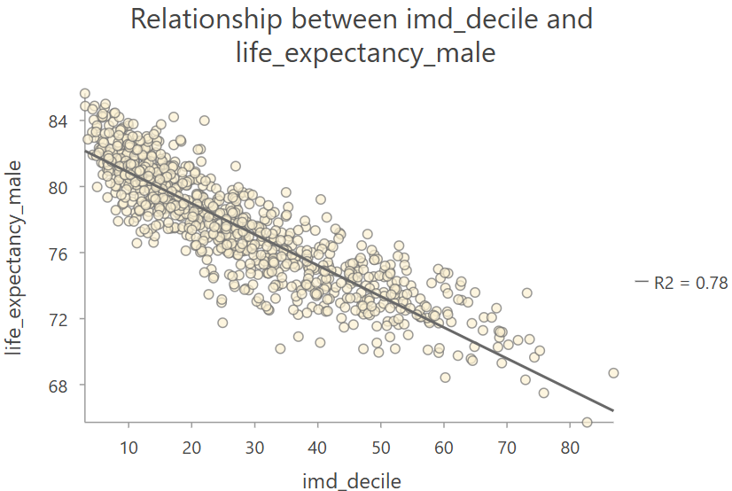{width="60%"}</center>

<br>

Here are the corresponding model coefficients:

<center>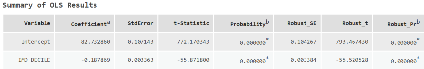{width="100%"}</center>

<br>

::: question
What proportion of the variation in life expectancy can be explained by deprivation?
:::

::: question
For every one unit increase in deprivation, how much does life expectancy change?
:::

<details>

<summary>Answers</summary>

The coefficient of determination $\text{R}^2=0.78$. This is the proportion of the total variation in $Y$ that is explained by the independent variables $X$.

The coefficient for deprivation (`imd_decile`) $\beta\approx-0.19$ i.e., as deprivation increases by one unit, life expectancy changes by $\approx-0.19$ years. In this case, higher values represent greater levels of deprivation, and vice versa, and this is associated with a reduction in life expectancy.

</details>

<br>

In the example above, the relationship between deprivation and life expectancy is represented by a single **global** value i.e., $\beta\approx-0.19$. This provides information on the strength and direction of the relationship, which in this case is *negative* i.e., as deprivation increases, life expectancy decreases, and statistically significant ($p<0.05$). This relationship is modelled as **stationary** across the study area i.e., the relationship between deprivation and life expectancy is the same in the county of Greater Manchester, as it is in Cheshire, Merseyside and Cumbria.

However, many geographic processes display spatial **non-stationarity**, a situation in which statistical properties **change** over space. Continuing with the example above, this could mean that the relationship between deprivation and life expectancy **varies across the study area** e.g., the relationship might be stronger in some regions, and weaker in others, or absent entirely in some regions. From our exploration of [spatial autocorrelation](#spatial_autocorrelation), [point patterns](#point_patterns) and even [interpolation](#interpolation), we know that processes and phenomena vary spatially... if they didn't, the field of Geography would be quite boring! The idea that *relationships* might change across space, is therefore perhaps not overly surprising.

Global regression methods cannot be used to model or capture non-stationarity, as they assume spatial (or temporal) stationarity, and produce a **single** coefficient for each independent variable, representing the relationship with the dependent variable.

By comparison, **local** regression methods produce spatially varying coefficients to capture spatial non-stationarity in the relationships between independent and dependent variables. For example, rather a single global coefficient representing the relationship between deprivation and life expectancy for the entire study area i.e., $\beta\approx-0.19$, local regression methods would produce a local coefficient for each feature in the study area.

Examples of these local regression methods include geographically weighted regression (GWR), see @brunsdon1996a, and multiscale geographically weighted regression (MGWR), see @fotheringham2017a, which we will explore today.

### Pre-processing

To begin:

> Open ArcGIS, initialise a new project in the `practical-8` directory, establish a connection to `data` and then load the **north-west** England MSOA geometries produced in [Practical 7](#prac_7_process):

<center>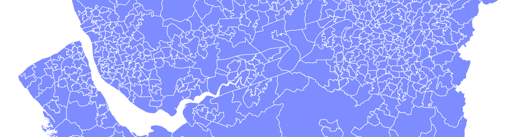{width="100%"}</center>

<br>

> Ensure that the relevant joined fields are present e.g., `life_expectancy_male`, `life_expectancy_female`, `total_annual_income`, `imd_decile`, ...

<center>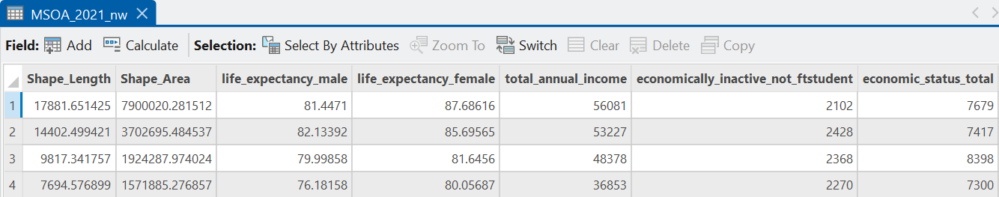{width="100%"}</center>

<br>

You will be pleased to learn that no further pre-processing is necessary! We can use the same spatial data from Practical 7 to develop **global** regressions (e.g., OLS, SEM, SLM) and **local** regressions (e.g., GWR, MGWR). Both of these approaches can be used to link life expectancy to MSOA-level predictors, but one assumes stationarity, while the other accounts for non-stationarity.

A key source for this week is @comber2023, which outlines a route map for successful applications of geographically weighted regression (GWR). While this approach should be considered for future analysis, it is worth noting that that we have deviated from @comber2023 across Practicals 7 and 8, but this is by design, building from **global aspatial** regression ([OLS](#ols)) through to **global spatial** regression ([SEM](#sem), [SLM](#slm)), and in this week on to **local spatial** regression ([GWR](#gwr_intro), [MGWR](#mgwr_intro)).

### Geographically weighted regression {#gwr_intro}

In Practical 7, we demonstrated that there were statistically significant relationships between life expectancy and MSOA-level predictors, as identified by [OLS](#ols). However, model residuals were highly spatially autocorrelated, as identified using Moran's $I$, indicating misspecification of the OLS model, violation of OLS assumptions, and/or that additional important spatial factors were missing from the model.

One way to address this is by using models which account for spatial **dependence**, which treat it as either a ["nuisance"](#sem) or as a reflection of ["diffusion"](#slm) between neighbouring units.

Spatially autocorrelated residuals could also arise due to spatial **hetereogeneity**, in which the process, relationship, or phenomenon we are modelling varies across space. If spatial non-stationarity is present[^08-gwr-1], then we might also see clustering of the residuals. This reflects the fact that a single global coefficient value would not be representative of the *spatially varying* relationship between $X$ (e.g., deprivation) and $Y$ (e.g., life expectancy), resulting in over-prediction of $Y$ in some areas, and under-prediction in others.

[^08-gwr-1]: **Non-stationarity** is a specific form of **heterogeneity**, where the relationship between an independent variable and a dependent variable varies across a study area. **Heterogeneity** is a much broader term i.e., things being dissimilar across space or time.

This can be evaluated using **geographically weighted regression** [@brunsdon1996a]. Conceptually, GWR is a modification of ordinary least squares, where the latter produces a model based on **all** of the observations in the dataset, as shown below:

<center>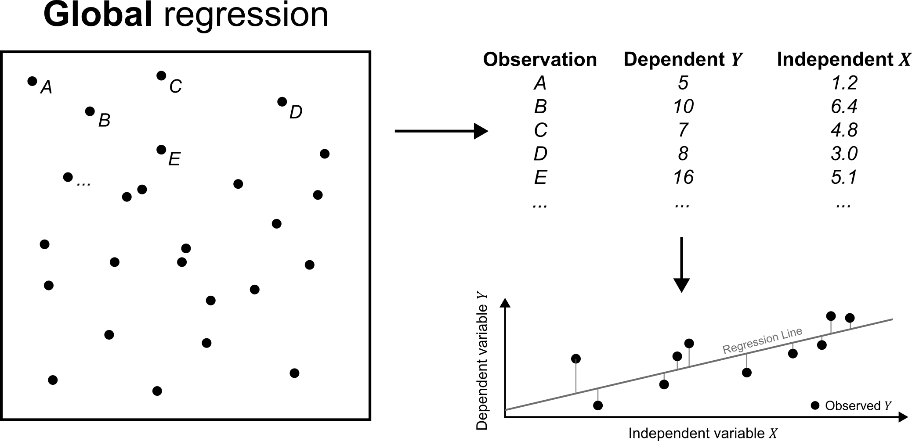{width="80%"}</center>

<br>

By comparison, GWR and other local regression methods pass a moving window across the study area, producing a local OLS model for each feature based on a subset of the observations, as shown below. This is repeated for all features in the study area.

<center>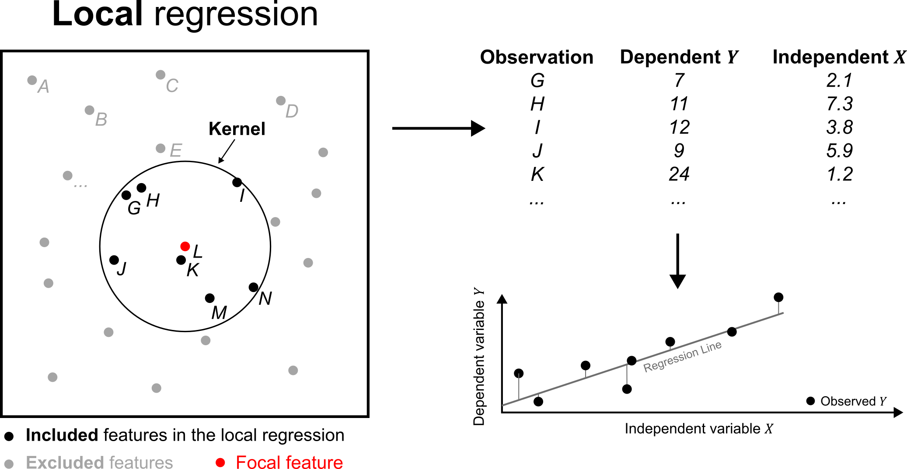{width="80%"}</center>

<br>

In the above example, a local OLS model is produced for the focal feature $K$. Points outside of a window or **kernel** around $K$ are excluded from the model, while those inside are included in the model. These data points can either contribute equally to the OLS model, or could be weighted based on the distance from the focal feature, hence the term geographically **weighted** regression. For example, we might want to weight $L$ and $K$ more heavily than $I$ and $N$, in accordance with Tobler's Law [@tobler1970]. We will explore different specifications of GWR models in more detail below, but to begin:

> Open the [Geographically Weighted Regression](https://doc.esri.com/en/arcgis-pro/latest/tool-reference/spatial-statistics/geographically-weighted-regression.html?tabs=dialog) tool, using `MSOA_2021_nw` as the "Input Features" and `life_expectancy` as the "Dependent Variable". For "Model Type", we can specify whether our input data are continuous, binary or count data[^08-gwr-2]. Life expectancy is a continuous variable so select `Continuous (Gaussian)`.
>
> <br>
>
> As discussed last week, it is typical to include a range of independent variables in a **multivariate** analysis, so we'll start by using the following "Explanatory Variable(s)": `total_annual_income`, `disabled_perc`, `imd_decile`, and `fuel_poverty_perc`.

[^08-gwr-2]: We will use a Poisson (count) approach in **Practical 10**: *Spatial Interaction Modelling*.

The key remaining choices to calibrate the GWR are whether to use a **fixed** kernel or an **adaptive** kernel, and how to select an appropriate **bandwidth** for each. In ArcGIS, these are referred to as the `Neighbourhood Type` (`Distance band` or `Number of neighbours`) and the `Neighbourhood Selection Method` respectively (`Golden search` or `Manual intervals` or `User-defined`). We can also select the **shape** of the kernel, which is specified via the `Local Weighting Scheme` under "Additional Options".

**Don't worry!** I have not yet explained what these calibration options do, and we'll explore each option in more detail below, including their effects on the output. For now, we'll use the following settings:

> Use "Neighbourhood Type" = `Distance band`, "Selection Method" = `Golden search` and "Local Weighting Scheme" = `Bisquare`.

As a final step before running our first GWR model, we will **standardise** our dependent and independent variables to have a mean of zero and a standard deviation of one. This standardisation is useful when there are large differences in the magnitude of our variables. For example, `total_annual_income` ranges from £27,072 to £79,191, while the proportional variables (e.g., `disabled_perc` and `fuel_poverty_perc`) can only span 0% to 100%. Standardisation is useful for numerical stability, but can also aid interpretation, as we can more easily compare the coefficients for different independent variables.

For example, let's say we produced a model predicting life expectancy based on income and deprivation, making sure to standardise the independent variables. If this produced the following coefficients: $\beta_\text{income}=0.8$ and $\beta_\text{deprivation}=0.3$, we can compare them directly i.e., "*A one standard deviation increase in income is associated with a 0.8 standard deviation change in life expectancy, whereas a one standard deviation increase in deprivation is associated with a 0.3 standard deviation change in life expectancy*". These coefficients are directly comparable, being expressed in the same units, which allows us to conclude that income is more important than deprivation in this example. This standardisation does not change the nature of the relationship between $Y$ and $X$, only the ease of interpretation (and numerical stability).

> Ensure "Scale Data" is **Checked**, save the output with a suitable name in `project-8.gdb`, and **run**.

This should produce a range of outputs, including a feature layer showing the spatial distribution of residuals:

<center>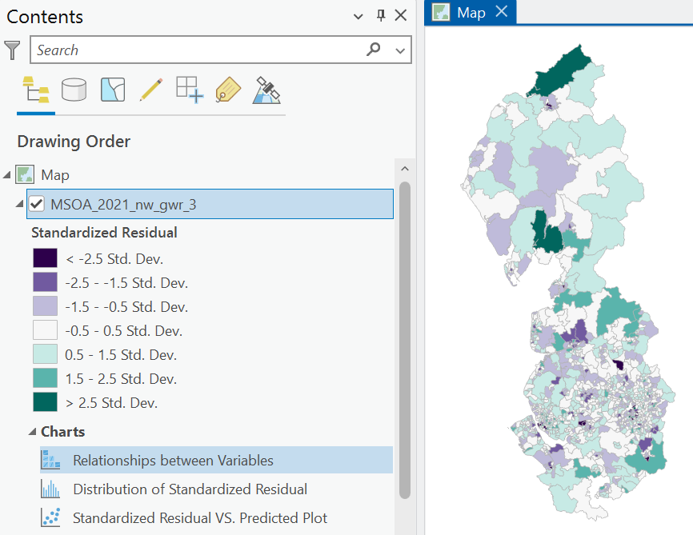{width="60%"}</center>

<br>

As always, we should always inspect **warnings** before jumping to interpretation, which in this case are as follows:

```{r, eval=FALSE, collapse=TRUE}
WARNING 000642: Problems reading 18 of 932 total records.
WARNING 000848: Features with bad records (only includes first 30): OBJECTID = 21, 27, 50, 78, 107, 145, 170, 174, 367, 419, 492, 755, 791, 911, 912, 914, 921, 923.
```

This is the same warning from last week, flagging rows where we have missing data, so we can ignore this for now.

> To begin, inspect the **Model Diagnostics** output.

<center>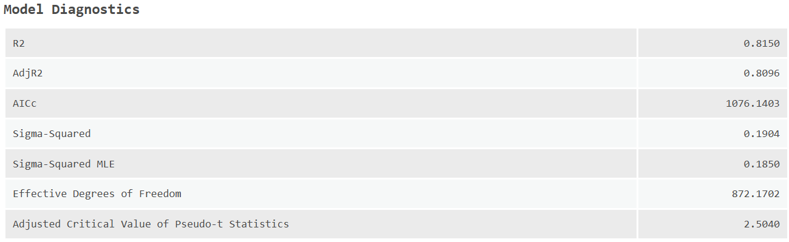{width="100%"}</center>

<br>

::: question
What is your appraisal of the overall model performance?
:::

<details>

<summary>Interpretation</summary>

Here $\text{R}^2\approx0.82$, indicating 82% of the variability in life expectancy can be explained using the MSOA-level predictors. Note that while a GWR constructs a series of local regressions, one for each feature, and each with their own local $\text{R}^2$ value (this is available as the `Local R-Squared` field in the GWR Attribute Table), a global $\text{R}^2$ can be calculated using the observed and predicted life expectancy values for each feature.

</details>

> Inspect the `Relationship between Variables` plot, which shows the pairwise relationships for all variables in the model.

<center>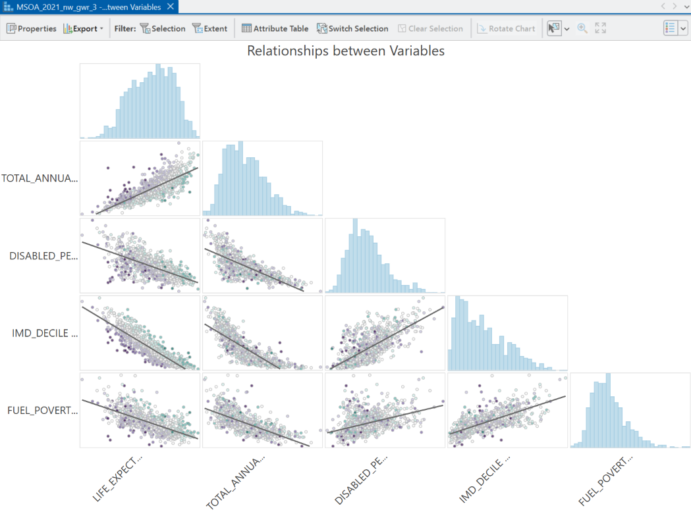{width="100%"}</center>

<br>

::: question
Which **global** relationships are positive or negative?
:::

<details>

<summary>Interpretation</summary>

These plots are linear OLS regressions. **Life expectancy** is negatively correlated with fuel poverty, deprivation and disability, and positively correlated with income, in accordance with the OLS and spatial regression results from Practical 7.

Perhaps unsurprisingly, there are also correlations between the independent variables, for example income is negatively correlated with disability. Pearson's $r$ and $\text{R}^2$ can also be calculated and added to the plot via Properties → Matrix Layout to aid interpretation.

</details>

::: question
Using the histograms in the `Relationship between Variables` plot, how would you characterise the distributions of the model variables?
:::

<details>

<summary>Interpretation</summary>

None of the variables are perfectly normally distributed, with varying degrees of **skew**. For example, both `total_annual_income` and `fuel_poverty_perc` are right skewed, indicating the presence of high value outliers i.e., MSOAs with particularly high levels of income or particularly high rates of fuel poverty.

Conversely, life expectancy is left skewed, indicating the presence of low value outliers i.e., MSOAs with particularly low life expectancy.

</details>

> Inspect the `Distribution of Standardized Residual` plot.

<center>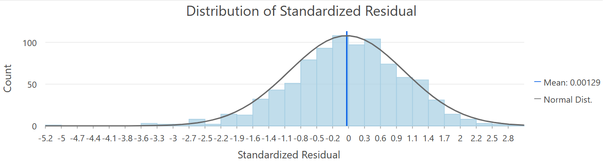{width="100%"}</center>

<br>

::: question
How would you describe the distribution of model errors?
:::

<details>

<summary>Interpretation</summary>

The model residuals *broadly* conform to a normal distribution. There is however some evidence of left skew, with life expectancy at some MSOAs significantly underpredicted.

</details>

<br>

You can modify this plot to investigate other model attributes:

> Update the plot to show the distribution of local $\text{R}^2$.

<center>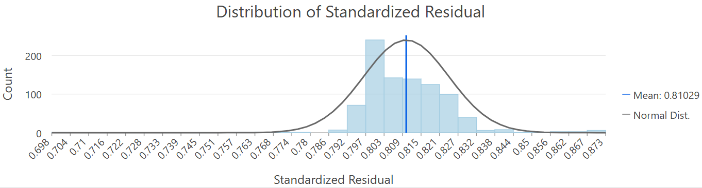{width="100%"}</center>

<br>

::: question
How does the model performance vary?
:::

<details>

<summary>Interpretation</summary>

In the context of the overall calculated model $\text{R}^2\approx0.82$, most local $\text{R}^2$ values cluster around the global value. However, for some MSOAs, the current set of independent variables explains a higher proportion of the variability in life expectancy, up to $\text{R}^2\approx0.87$, whereas for other MSOAs, a larger proportion of variability is left unexplained i.e., $\text{R}^2\approx0.70$.

</details>

> Inspect the `Standardized Residual vs. Predicted` plot, which shows standardised predicted values on the x-axis, and the corresponding residuals on the y-axis.

<center>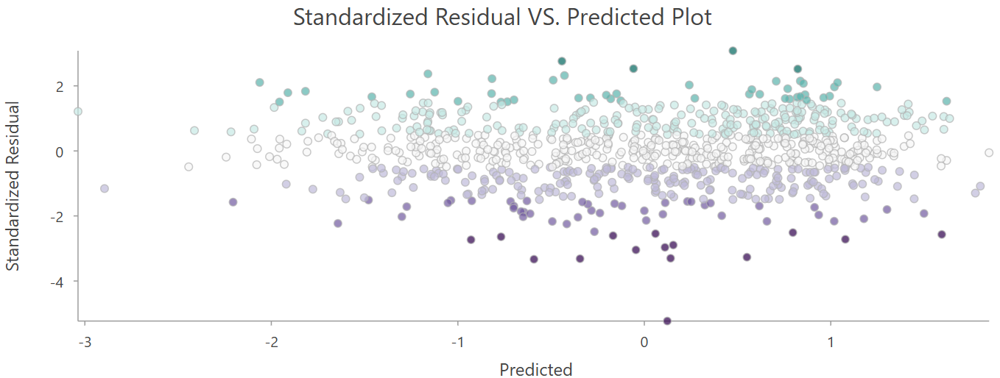{width="100%"}</center>

<br>

::: question
Is there evidence of systematic error?
:::

<details>

<summary>Interpretation</summary>

In my view, there is no strong evidence of systematic error, given the presence of **homoscedasticity** of the residuals i.e., the magnitude of the error does not appear to be related to the magnitude of the predicted value.

Here are some examples of **heteroscedastic** errors:

<center>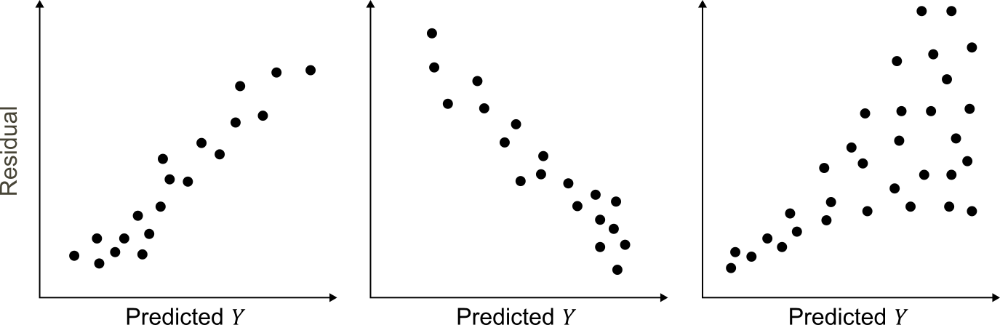{width="100%"}</center>

</details>

<br>

The current GWR feature layer shows the distribution of residuals, but you can update the symbology to investigate how the coefficients and model performance vary spatially, as shown below for local $\text{R}^2$:

<center>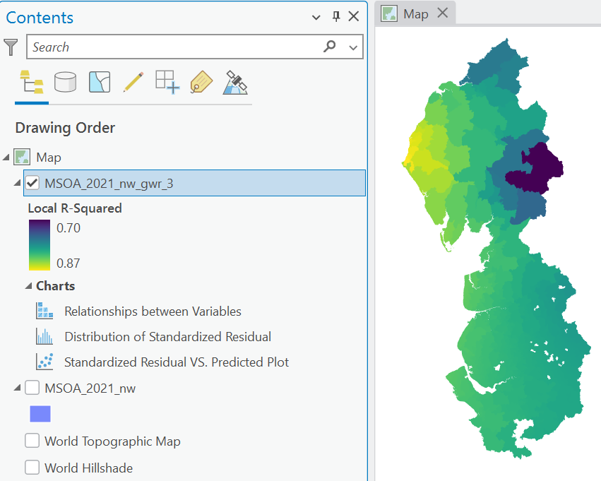{width="80%"}</center>

<br>

> Update the layer symbology to visualise the coefficients for each of the modelled independent variables e.g., `Coefficient (Scaled TOTAL_ANNUAL INCOME)`. Think **carefully** about your choice of [symbology](https://colorbrewer2.org/learnmore/schemes_full.html), as this will influence your interpretation. For example, if the local coefficients are *both* positive and negative, it would make sense to use a **diverging** colour scheme, centred on zero, as shown below. If the coefficients are *either* positive or negative, then a simpler **sequential** colour scheme would be suitable, with values and colours progressing from low to high.

<center>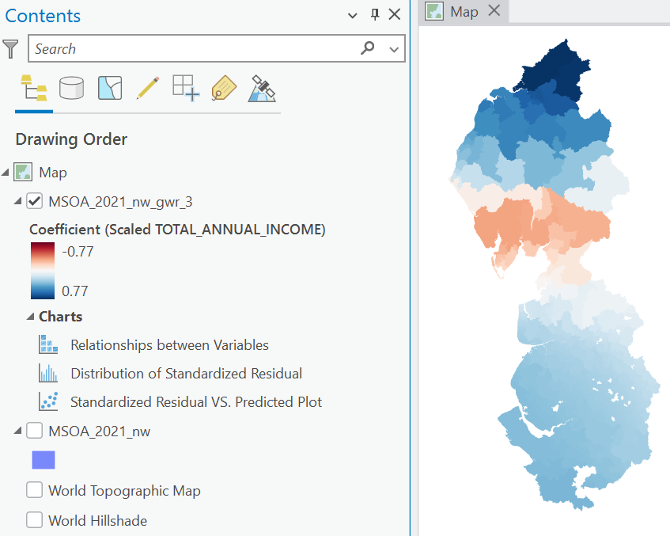{width="80%"}</center>

<br>

::: question
Are there any spatial patterns to the relationships between life expectancy and the modelled independent variables?
:::

<details>

<summary>Interpretation</summary>

In a word, **yes!** For example, total annual income generally has a positive relationship with life expectancy, but this switches to negative for parts of Cumbria. By comparison, deprivation has a consistently negative relationship with life expectancy[^08-gwr-3], as shown below, but this is particularly strong in south Cumbria.

[^08-gwr-3]: Hence the use of the **sequential** colour scheme `viridis`.

<center>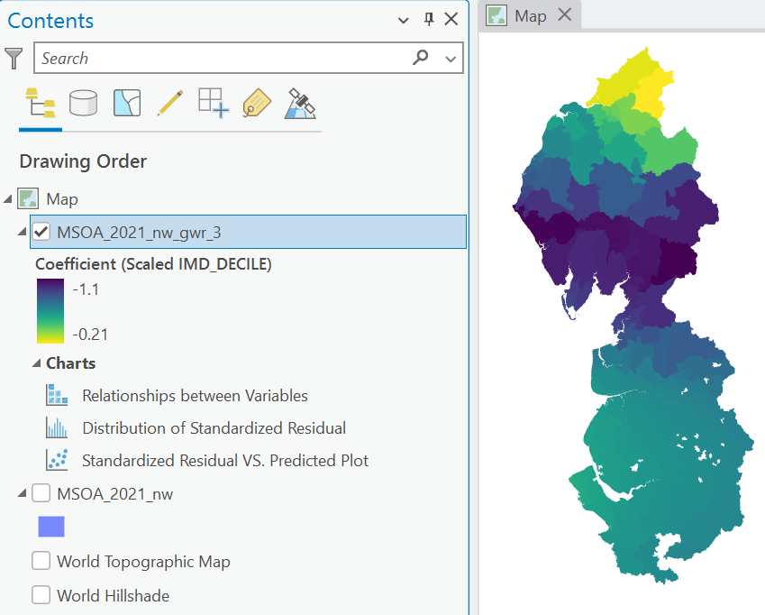{width="80%"}</center>

<br>

</details>

::: question
Based on your interpretation of the local coefficients, is there evidence of spatial **non-stationarity**?
:::

<details>

<summary>Interpretation</summary>

**Yes!** If the underlying relationships between life expectancy and the MSOA-level predictors were **stationary**, then the local coefficients should be identical across the study area. This is clearly not the case, with differences in both the magnitude of the relationships (e.g., deprivation) and even their direction (i.e., income).

</details>

<br>

As we discussed in Practical 7, when performing a **multivariate** analysis we need to be aware of issues of [**multicollinearity**](#ols) i.e., when independent variables are highly correlated with each other [@kim2019]. This is relatively straightforward to assess globally, for example via the Variance Inflation Factor (VIF), but this becomes more complicated for GWR. Rather than a single global model, GWR is producing a local regression for each feature in the dataset[^08-gwr-4], each of which could be characterised by multicollinearity.

[^08-gwr-4]: There are 932 MSOAs in our dataset, so GWR is produced 932 local regressions!

One metric we can use to assess this is the **Condition Number** ($\text{CN}$), which is represented by the `CND_Number` field in the GWR Attribute Table. We won't explore the mathematics today, but the aim of this metric is to measure the *stability* of the estimated coefficients. When variables are **collinear** (i.e., similar values for two independent variables), they contribute overlapping information and it is difficult for the model to determine which *explains* the change in the dependent variable. For example, imagine we developed a model including both total household income and total household *disposable* income i.e., household income minus taxes and debt payments. These variables are likely to be highly collinear, in that they provide very similar information. In this situation, the coefficients would be highly unstable, increasing or decreasing significantly with even small changes in the values of the variables.

This behaviour is measured by the Condition Number, with a general rule that $\text{CN's}>30$ indicate coefficient instability, and therefore, local multicollinearity [@belsley1980].

> Change the layer symbology to the Condition Number (`CND_Number`).

<center>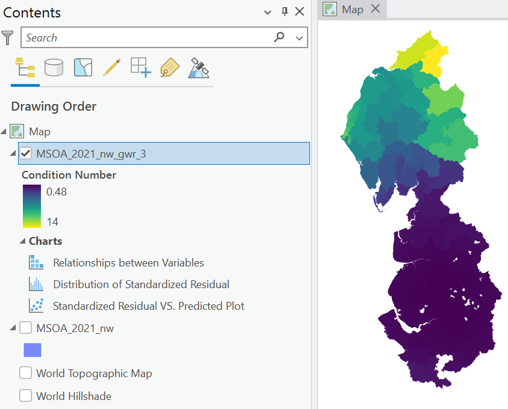{width="80%"}</center>

<br>

::: question
Is there evidence of local multicollinearity? Is there any spatial pattern to the Condition Numbers? Why might this be?
:::

<details>

<summary>Answer</summary>

There is evidence of varying levels of multicollinearity across the study area. For the most part, $\text{CN}$ values are very small, as shown in the histogram below, with mean $\text{CN}\approx1.0$ and median $\text{CN}\approx0.59$. $\text{CN}$ values are somewhat larger in parts of northern Cumbria, although consistently below the rule of thumb of $\text{CN}>30$.

<center>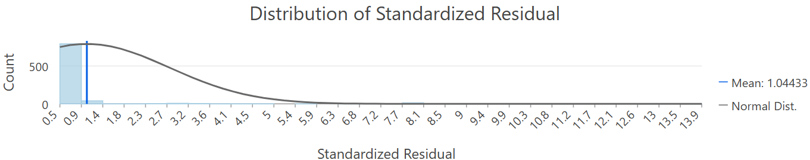{width="100%"}</center>

</details>

<br>

Before we move on to investigate the calibration of the GWR, including selecting the type and shape of the kernel (e.g., fixed vs. adaptive), it is worth reflecting on the overall model results. Unlike global regressions (e.g., OLS, SEM, SLM), which feature a small set of important model statistics, including a single coefficient for each independent variable, interpretation is much more complex for GWR. For our dataset, which consists of 932 feature, and our model, which features four independent variables, there are 3,728 coefficients, plus corresponding *p*-values and other statistics! While this requires effort to interpret and summarise, this also permits a much deeper understanding of the nature of the spatial phenomenon, including non-stationarity.

### Calibration: Fixed kernel

In our first model, we used a **fixed** kernel, where the neighbours of each feature were defined based on a fixed distance (or **bandwidth**), as shown below:

<center>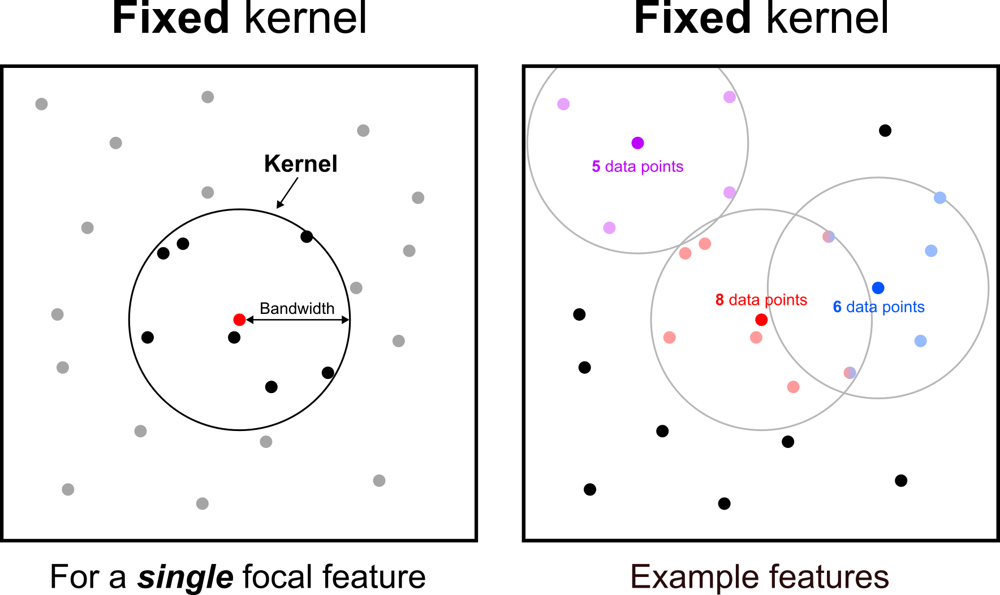{width="80%"}</center>

<br>

In other words, the same bandwidth is used for all feature, typically resulting in a different number of neighbours for each, and in turn, a different number of observations for each local regression.

::: question
How do we select the optimal bandwidth?
:::

We can specify the bandwidth **manually**, using the "Neighbourhood Selection Method" and either the `User-defined` or `Manual intervals` options, if we had a strong theoretical or process-based argument for a particular bandwidth. For example, in **Practical 5**: *Point Patterns*, we investigated the spatial distribution of *Panthera tigris* in the Indian subcontinent, noting typical home ranges of 56.4 km^2^ (female) and 110 km^2^ (male) for tigers in the Sundarban of India and Bangladesh [@naha2016] and 73.6 km^2^ (female) and 132.7 km^2^ (male) in the Panna Tiger Reserve, central India [@sarkar2016]. If we wanted to build a regression model *explaining* the spatial distribution of tigers, we might therefore be interested in spatial attributes *within* that home range (e.g., climate, topography, availability of prey) or those immediately *adjacent* to it (e.g., human influence or infrastructure which might act as a barrier to species expansion). By comparison, spatial attributes many hundreds of kilometers away are unlikely to have a significant impact. Based on this reasoning, we might use a fixed kernel, where the bandwidth approximates the home range of each tiger.

In the absence of a theoretical reason for a particular bandwidth, we can use **statistical** approaches to select the optimal bandwidth, which in ArcGIS is possible via the `Golden Search` method.

> Inspect the Golden Search Results table, which includes the tested bandwidths[^08-gwr-5], and a test statistic known as the corrected Akaike information criterion (AICc).

[^08-gwr-5]: Note that the table below has been clipped. The full range of tested bandwidths is not shown.

<center>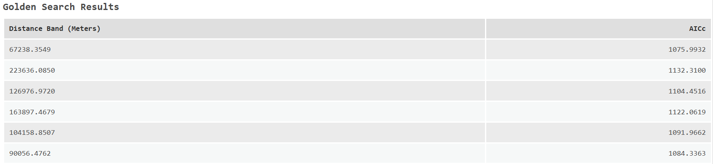{width="100%"}</center>

<br>

Like $\text{R}^2$, the Akaike information criterion [@akaike1998] is a measure of the goodness of fit of a model. We will introduce the AIC more fully in **Practical 10**: *Spatial Interaction Modelling*, as this requires understanding of a [maximum likelihood](https://en.wikipedia.org/wiki/Maximum_likelihood_estimation) approach, which we will also cover in that practical. For now, all we need to know is that **lower AICc scores are better**, balancing the performance of the model and the number of predictors, in accordance with the principle of [model parsimony](https://en.wikipedia.org/wiki/Occam%27s_razor). 

As per the [documentation](https://doc.esri.com/en/arcgis-pro/latest/tool-reference/spatial-statistics/how-geographicallyweightedregression-works.html), this method first evaluates model performance for maximum and minimum bandwidths and then calculates the AICc at various bandwidths incrementally between them. The maximum bandwidth ($\approx224 \: \text{km}$) is the bandwidth at which every feature has half the number of input features as neighbours ($932 \cdot0.5=466 \: \text{neighbours}$), and the minimum bandwidth ($\approx67 \: \text{km}$) is the bandwidth at which every feature has at least 5 percent of the features in the dataset as neighbours ($932 \cdot0.05\approx47 \: \text{neighbours}$). In short, the `Golden Search` method develops GWRs for many different bandwidths and returns the best, based on AICc. 

For our model, the `Golden Search` method has finalised with a bandwidth of $67724.0669 \: \text{m}$ (`AICc` = $1076.1403$), although we should be aware of the following:

```{r, eval=FALSE, collapse=TRUE}
WARNING 110306: The final model didnt have the lowest AICc encountered in the Golden Search Results.
```

The `Golden Search` method is not [guaranteed](https://doc.esri.com/en/arcgis-pro/latest/tool-reference/tool-errors-and-warnings/110001-120000/tool-errors-and-warnings-110301-110325-110306.html) to find the lowest possible AICc, which we can see by investigating the summary table, where there is bandwidth with a slightly lower AICc of `1075.9932`. In this situation, we could re-run GWR specifying the bandwidth manually ("Neighbourhood Selection Method" = `User Defined`). However, given the very small difference in AICc and the selected bandwidth ($67.7 \: \text{km}$ vs. $67.2 \: \text{km}$), this is likely to have only a small impact on the results.

It is also worth inspecting the number of neighbours for each feature, as stored in the Attribute Table (`Number of Neighbors`). 

::: question
How many neighbours are there for each MSOA? How does this vary spatially?
:::

> Use the Neighbourhood Explorer, as introduced in [Practical 2](#spatial_weights), to investigate the neighbourhoods for each feature, using `Fixed Distance` as the method, and using the `Distance Band` selected by GWR.

> Change the layer symbology to visualise the number of neigbours, using Graduated or Unclassed colours.

<center>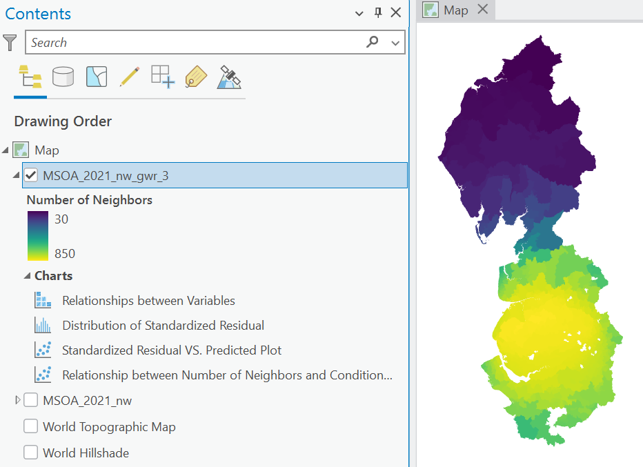{width="80%"}</center>

</details>

::: question
Do you think a fixed kernel is a good choice for our MSOA dataset? How does this correlate with local model stability (`CND_Number`)?
:::

<details>

<summary>Interpretation</summary>

As discussed above, there is evidence of varying levels of multicollinearity across the study area, with higher $\text{CN}$ values in parts of northern Cumbria, although consistently below the rule of thumb of $\text{CN}>30$.

This pattern likely reflects the **spatial structure** of the data, particularly the size and distribution of the MSOAs, and the use of a **fixed bandwidth**. In most of the North West, and particularly in the major cities of Manchester and Liverpool, MSOAs are relatively small, reflecting population density, which means that local regressions are likely to be constructed based on a **large number of neighbouring features**. By comparison, the relatively sparse population in rural areas, including in Cumbria, means that MSOAs are relatively large, so local regressions are likely to be constructed based on a **small number of neighbouring feature**. In general, smaller datasets are more sensitive to statistical issues, including multicollinearity, as individual data points carry a greater weight i.e., changing a single data point in a dataset of 10,000 observations is unlikely to have a significant impact, but what if the dataset was of only 10 observations?

The spatial variability in the Condition Number arises due to the use of a fixed bandwidth, which is applied uniformly across the study area. The optimised bandwidth of $67.7 \: \text{km}$ is a good fit overall, ensuring that most MSOAs have many neighbouring feature (as shown below) and therefore stable model coefficients. However, the fixed bandwidth is less appropriate in the sparsely populated rural areas, resulting in few neighbouring feature, small regression datasets, and less stable model coefficients.

Based on this interpretation, we may want to consider an **adaptive kernel**. 

<center>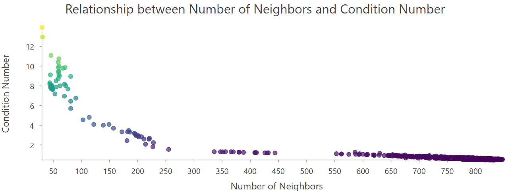{width="100%"}</center>

</details>

<br>

### Calibration: Adaptive kernel

Rather than utilising a fixed kernel across the study area (i.e., distance-based), an alternative approach is to use an **adaptive** kernel, where the bandwidth varies to ensure an equal number of neighbours per feature.

<center>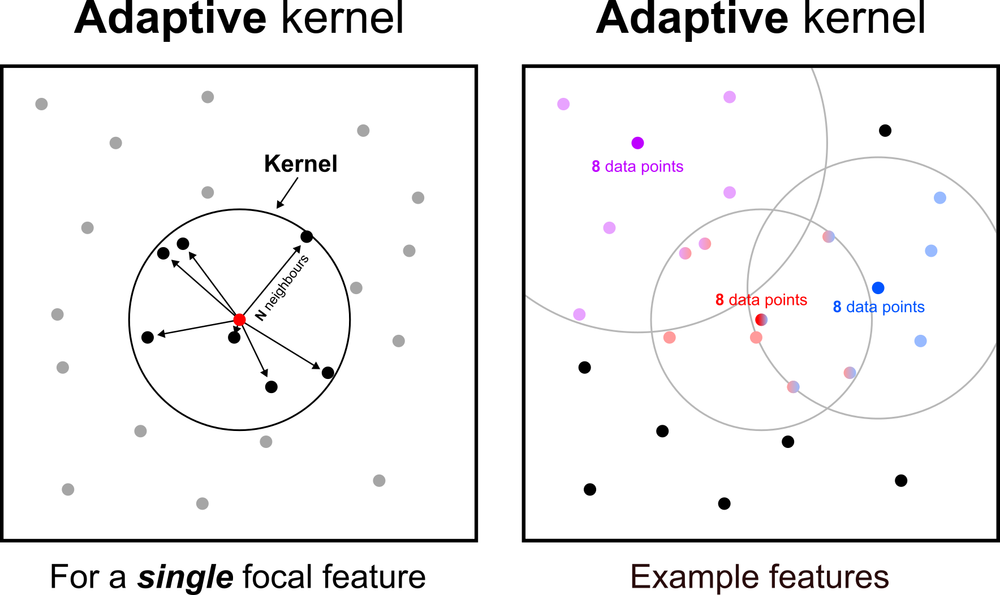{width="80%"}</center>

<br>

> Re-run [Geographically Weighted Regression](https://doc.esri.com/en/arcgis-pro/latest/tool-reference/spatial-statistics/geographically-weighted-regression.html?tabs=dialog), using the same dependent and independent variables and other settings outlined above, but this time update "Neighbourhood Type" to `Number of neighbors`, again optimising via `Golden Search`.

<center>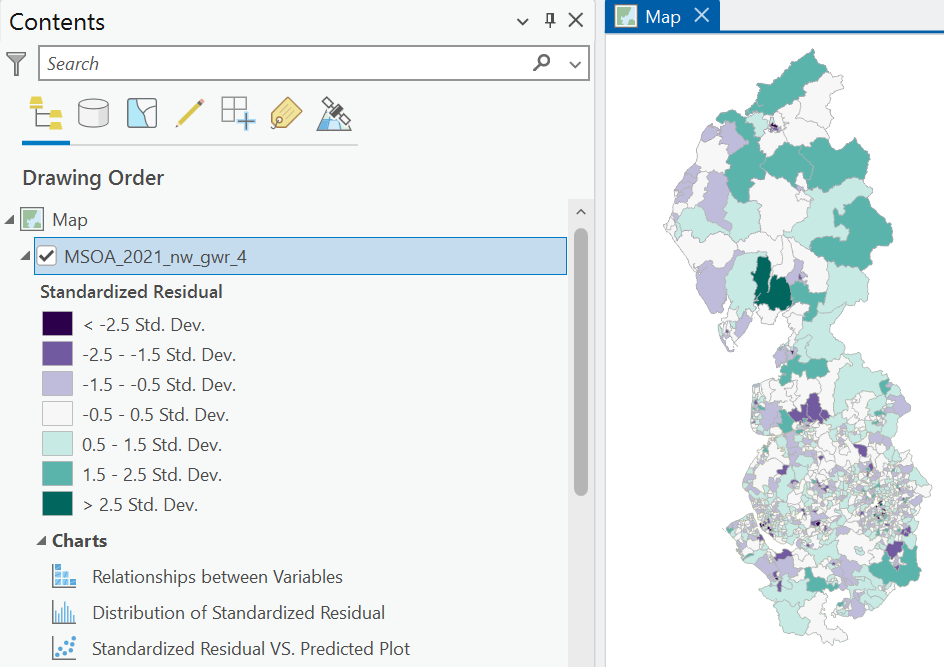{width="80%"}</center>

</details>

::: question
What is the overall model performance?
:::

<details>

<summary>Interpretation</summary>

The model $\text{R}^2\approx0.84$ which indicates that approximately 84% of variation in life expectancy can be explained by the MSOA-level predictors, when using an adaptive kernel. This is slightly higher than the model using a fixed kernel, where $\text{R}^2\approx0.82$. Similarly, the AICc is also slightly lower.

</details>

<br>

::: question
How many neighbours are being used for each local regression? How does this differ from the fixed kernel used previously?
:::

<details>

<summary>Interpretation</summary>

The number of neighbours is kept constant for all feature, and in this case the selected number of neighours is $153$, optimised using `Golden Search` and recorded in the `Number of Neighbors` field. This is achieved by modifying the bandwidth for each feature. 

</details>

<br>

::: question
How would you describe the numerical and spatial distribution of the model residuals?
:::

<details>

<summary>Interpretation</summary>

The numerical distribution of model residuals is shown below. These are approximately normally distributed. 

<center>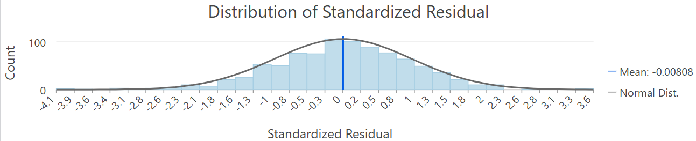{width="100%"}</center>

<br>

We could also assess the spatial distribution of the residuals using Moran's $I$. It is tempting to use a $K$ nearest neighbours approach here, setting $K=153$ to match the optimised bandwidth selected above. However, this isn't necessary, because fundamentally we are measuring two different things. For GWR, the bandwidth is the scale at which we are modelling the process. Having done so, we are interested in the **spatial dependence of the errors**, and whether this is present *once spatial heterogeneity has been accounted for*. 

As discussed in Week 3, the result will be sensitive to the designation of the spatial weights matrix. For example, when using Queen's contiguity (`Contiguity edges corners`), $I\approx-0.008$ with $p\approx0.73$, indicating that statistically significant positive or negative spatial autocorrelation is absent. 

<center>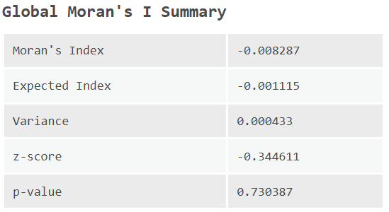{width="50%"}</center>

</details>

<br>

::: question
What is your assessment of local multicollinearity? Is the pattern different to when a fixed kernel was used?
:::

<center>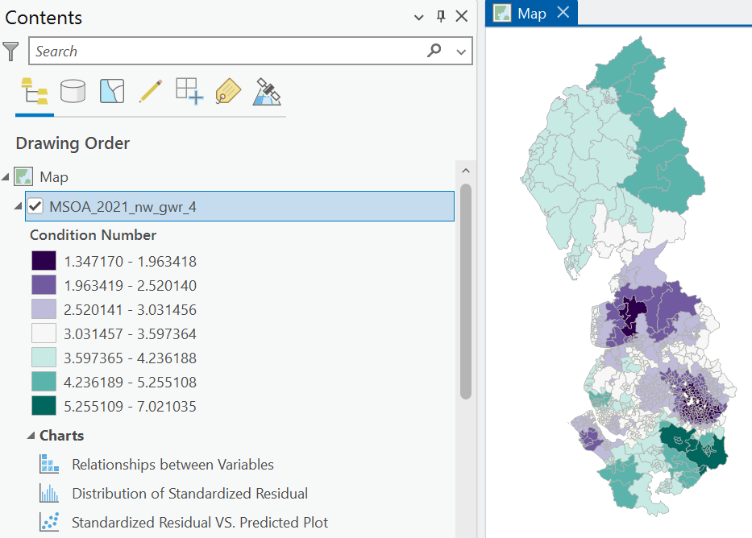{width="80%"}</center>

<br>

<details>

<summary>Interpretation</summary>

**Yes!** There is very strong and statistically significant positive spatial autocorrelation of the Condition Numbers ($I\approx0.95$, $p<0.05$), using Queen's contiguity. While all MSOAs exhibit $\text{CN}<30$, $\text{CN}$ clusters (HH, LL), as identified using local Moran's $I_i$ (see below), are found in Manchester and Liverpool and parts of Cheshire, Lancashire and Cumbria. 

**Importantly**, while the Condition Numbers for the **fixed** kernel primarily reflected the spatial structure of the data (i.e., number of neighbours), here their distribution is much more interesting, providing insight into the spatial stability of the model coefficients, and the degree of local multicollinearity. 

<center>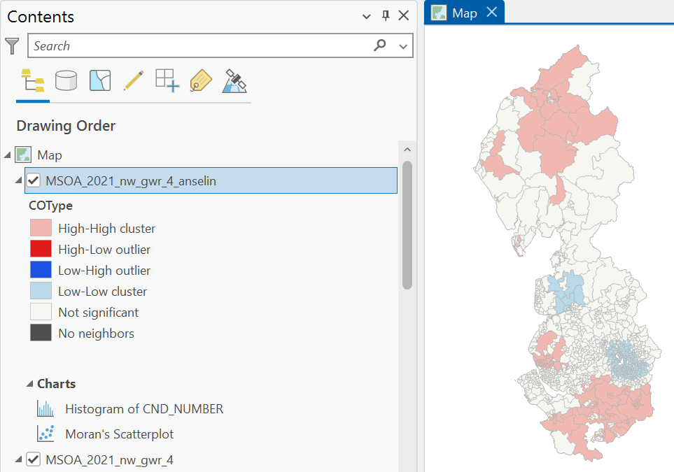{width="80%"}</center>

</details>

<br>

You may be asking the following **important question**: 

::: question
Should I use a fixed or adaptive kernel? 
:::

As a general rule:

-   When the data are relatively evenly distributed (e.g., a regular grid), use a fixed kernel.
-   When the data show clustering or uneven density, use an adaptive kernel.

For our data, while MSOAs have similar populations, they represent very different spatial areas (e.g., central Manchester vs. Cumbria). When a fixed kernel is used, this results in vastly different neighbourhood settings ($\text{n} = 30 - 848$). 

### Calibration: Local weighting scheme

In addition to selecting the kernel (fixed vs. adaptive), we can also select the **local weighting scheme**, which determines how features and their attributes are weighted in the local regressions. While we could use a *binary* approach i.e., features within the kernel are weighted uniformly, and those outside the kernel are excluded from the local regression, it is more typical to use a weighting scheme, in accordance with Tobler's Law [@tobler1970], where features closer to the focal feature are weighted more heavily than those further away. The local weighting scheme determines how quickly weights decrease as distances increase. There are lots of formulas that could be used here e.g., uniform, exponential, tri-cube, with useful information in @gollini2015. ArcGIS provides two widely used options: **Gaussian** and **Bisquare**.

Gaussian weighting is defined as follows:

$$
f(d)=\exp\left(-\frac{1}{2}\left(\frac{d}{h}\right)^2\right)
$$

where $d$ is the distance between features and $h$ is a bandwidth value, which can be modified to change how quickly weights decrease with distance. The plot below shows how weights change with different values for $h$:

<center>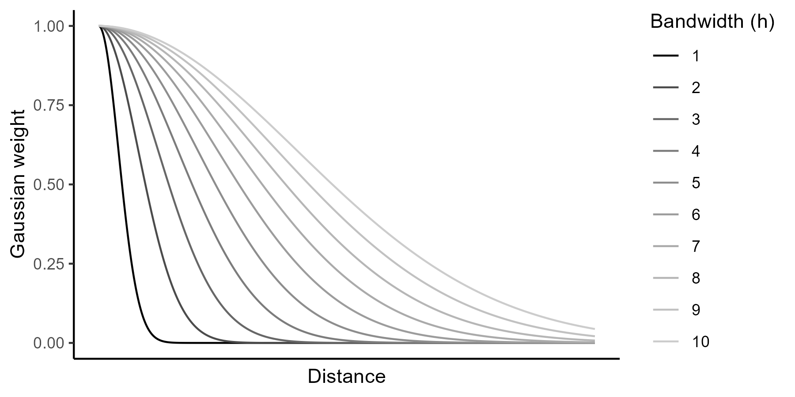{width="80%"}</center>

<br> 

This approach assigns a weight of 1 to the focal feature while weights for the neighbouring features gradually decrease as the distance from the focal feature increases. While it may look like it in the plot above, a Gaussian weighting scheme *never reaches zero*, but weights for features far away from the focal feature can be quite small and have almost no impact on the regression.

By comparison, **bisquare weighting** assigns zero to all features outside of the neighborhood specified. As a result, these do not impact the local regression for the focal feature, as per the following equation, and visualised below:

$$
f(d)=\begin{cases}\left(1-\left(\frac{d}{h}\right)^2\right)^2 & \text{if } d<h\\
0 & \text{otherwise.}\end{cases}
$$

<center>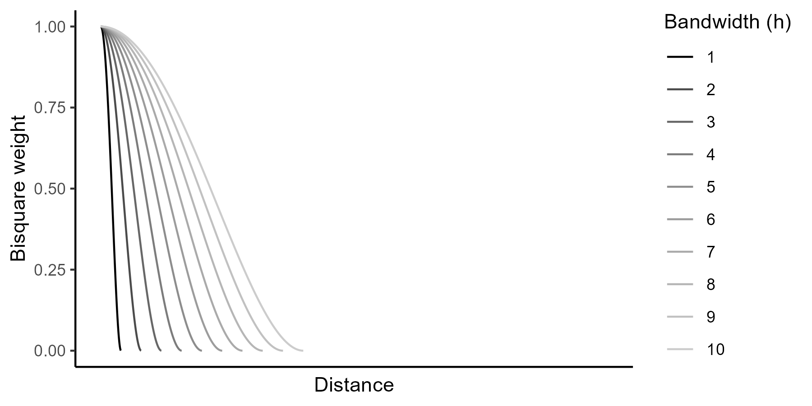{width="80%"}</center>

<br> 

We've been using the bisquare approach so far, so:

> Re-run [Geographically Weighted Regression](https://doc.esri.com/en/arcgis-pro/latest/tool-reference/spatial-statistics/geographically-weighted-regression.html?tabs=dialog), using the same settings as before (i.e., dependent and independent variables, scaling data, adaptive kernel, `Golden Search` method), but now set the "Local Weighting Scheme" to `Gaussian`, which can be found under `Additional Options`.

::: question
Has model performance changed significantly?
:::

<details>

<summary>Interpretation</summary>

**Not particularly!** While there are slight changes in the model $\text{R}^2$, AICc, and local regression coefficients, this would not have a significant impact on our interpretation of the relationships between life expectancy and MSOA-level predictors.  

</details>

<br>


::: question
How has the number of neighbours changed?
:::

<details>

<summary>Interpretation</summary>

When using an adaptive kernel and bisquare bandwidth, `Number of Neighbors` = $153$. When a Gaussian bandwidth is used, `Number of Neighbors` = $35$. In my view the latter is somewhat misleading, because technically **all** the features in the dataset contribute to the regression for the focal feature[^08-gwr-6]. However, the nearest $35$ observations (in this case) define the bandwidth $h$, which is used to assign the weights for all observations. For bisqaure weighting, the `Number of Neighbors` can be interpreted more easily: for each focal feature, the 153 nearest neighbours contribute to the local regression, weighted accordingly between 0 and 1[^08-gwr-7], while all other features are assigned a weight of 0.

[^08-gwr-6]: As per the Gaussian weighting scheme: $f(d)=\exp\left(-\frac{1}{2}\left(\frac{d}{h}\right)^2\right)$

[^08-gwr-7]: As per the Bisquare weighting scheme: $f(d)=\begin{cases}\left(1-\left(\frac{d}{h}\right)^2\right)^2 & \text{if } d<h\\ 0 & \text{otherwise.}\end{cases}$ 

As distant features make no contribute to the local regression using bisquare weighting, a larger number of neighbours may be required to obtain coefficient stability (assessed via AICc). By comparison, for a Gaussian weighting scheme, the bandwidth controls how quickly weights decay, not which observations are included or excluded. For our investigation, where we expect the influence of neighboring features to diminish gradually with distance, a Gaussian approach is preferred, although the difference between the approaches is rather small. 

</details>

<br>

### Multiscale geographically weighted regression {#mgwr_intro}

So far, so good. We've developed geographically weighted regressions, taking into account non-stationarity in the relationships between life expectancy and MSOA-level predictors.

However, while this is a powerful exploratory technique, one **weakness** of standard GWR is that it utilises a fixed neighbourhood for **all the predictors**. In our testing above, this was a bandwidth of $\approx67\;\text{km}$ (fixed kernel) or $153$ neighbours (adaptive kernel). In reality, the processes being modelled might operate at different spatial scales, with the relationships characterised by different degrees of spatial non-stationarity. For example, the spatial heterogeneity in the relationship between life expectancy and income may differ from that between life expectancy and deprivation. This can be addressed using **multiscale geographically weighted regression** ([MGWR](https://doc.esri.com/en/arcgis-pro/latest/tool-reference/spatial-statistics/multiscale-geographically-weighted-regression.html?tabs=dialog)), which facilitates the use of predictor-specific bandwidths [@changchien2020], as illustrated below:

<center>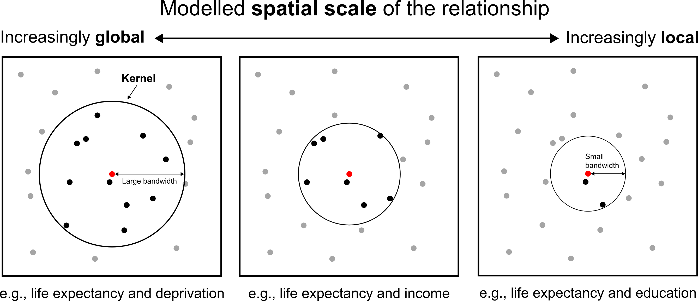{width="100%"}</center>

<br> 

> Open the [Multiscale Geographically Weighted Regression](https://doc.esri.com/en/arcgis-pro/latest/tool-reference/spatial-statistics/multiscale-geographically-weighted-regression.html?tabs=dialog) tool, and select the same inputs as above:
>
> <br>
>
> - "Input Features" = `MSOA_2021_nw`
> - "Dependent Variable" = `life_expectancy_male` or `life_expectancy_female`
> - "Explanatory (Independent) Variables" = `total_annual_income`, `disabled_perc`, `imd_decile`, and `fuel_poverty_perc`
> - Ensure "Scale Data" is **Checked**
> - "Neighbourhood Type" = `Number of neighbours` (adaptive kernel)
> - "Neighbourhood Selection Method" = `Golden Search`
> - "Local weighting scheme" = `Gaussian`
>
> <br>
>
> Save the "Output Features" with a suitable name in `project-8.gdb`, and **run**.

There are **lots** of outputs to interpet here, so let's focus on some key tables to start:

> Under Messages, inspect the "Summary Statistics for Coefficients Estimates" table.

<center>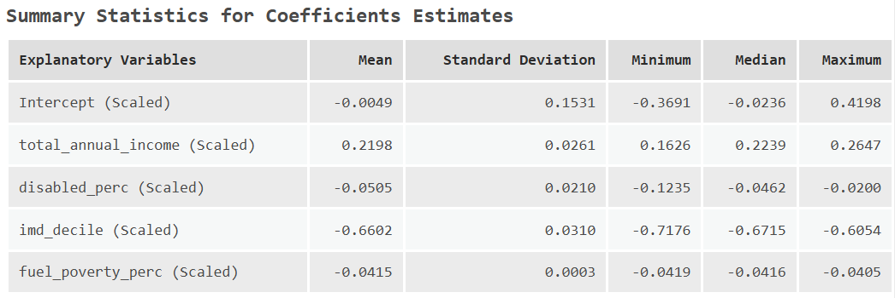{width="100%"}</center>

<br>

::: question
What do the scaled coefficients for each independent variable tell us?
:::

<details>

<summary>Interpretation</summary>

This table includes important summary statistics for each independent variable, including their average relationship with life expectancy (mean, median), and the distribution of the coefficients (minimum, maximum, standard deviation). As a reminder, the fact that there **is** variability in the local model coefficients is clear evidence of spatial **non-stationarity**. 

In addition, the MGWR has been modelled based on **scaled** variables, which as we discussed [earlier](#gwr_intro), is useful for interpretation. 

For this MGWR:

- a one standard deviation increase in **total annual income** is associated with a $0.2198$ standard deviation change in life expectancy ($+$).
- a one standard deviation increase in **disabled percentage** is associated with a $-0.0505$ standard deviation change in life expectancy ($-$). 
- a one standard deviation increase in **deprivation** is associated with a $-0.6602$ standard deviation change in life expectancy ($-$). 
- a one standard deviation increase in **fuel poverty percentage** is associated with a $-0.0415$ standard deviation change in life expectancy ($-$). 

Our interpretation might be that deprivation ($-0.6602$) and income ($0.2198$) are the most important MSOA-level variables. By comparison, the disability and fuel poverty variables are likely being captured by the index of multiple deprivation. 

</details>

<br>

::: question
Using the "Model Diagnostics" table, what is the overall MGWR model performance? 
:::

<details>

<summary>Interpretation</summary>

The MGWR $\text{R}^2\approx 0.83$ with an AICc of $\approx 1057$. Note that the MGWR tool also returns the results for a standard GWR, but the results will differ from those of the standalone [GWR](https://doc.esri.com/en/arcgis-pro/latest/tool-reference/spatial-statistics/geographically-weighted-regression.html?tabs=dialog) tool. Here the GWR output is used as a baseline model, when is then optimised by modifying the bandwidth for each predictor. In the GWR tool, a single bandwidth is used for all predictors, which is then optimised via AICc.  

</details>

<br>

> Inspect the "Summary of Explanatory Variables and Neighborhoods" table, which includes the number of neighbours for each independent variable (optimised via AICc), and the number of features which are classed as statistically significant.

<center>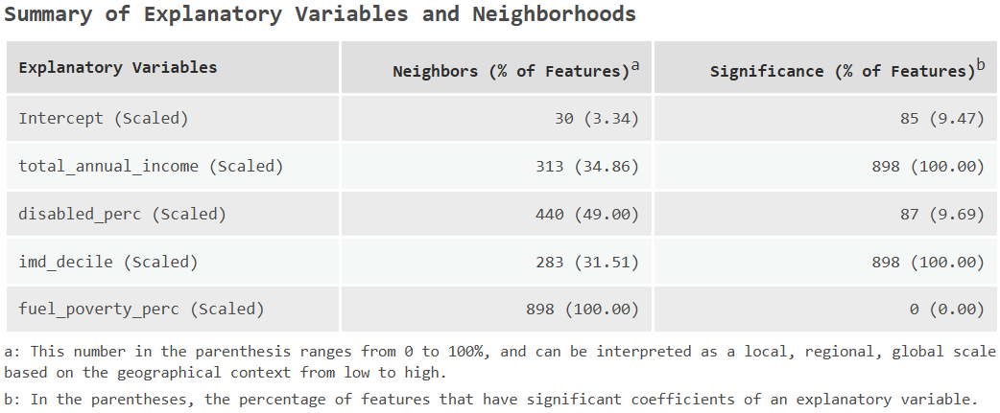{width="100%"}</center>

<br>

::: question
Is there evidence of multiscale relationships?
:::

<details>

<summary>Interpretation</summary>

**Yes**. The differing number of neighbours selected for each independent variable provides evidence of **multiscale** relationships between life expectancy and the MSOA-level predictors. For example, the relationship between life expectancy and deprivation is best explained at a *relatively* local spatial scale, indicating that the strength of the association varies across relatively small areas. In contrast, the relationship between life expectancy and fuel poverty could be described as **global**, as the optimal bandwidth encompasses all of the MSOAs. This is indicative of stationarity i.e., the relationship between life expectancy and fuel poverty is of a similar magnitude across the study area. 

</details>

<br>

::: question
Which independent variables are making the most important contribution to the spatial variability in life expectancy? Could we be justified in removing some variables?
:::

<details>

<summary>Interpretation</summary>

Building from the summary coefficients discussed above, the "Summary of Explanatory Variables and Neighborhoods" table indicates that total annual income and deprivation are **consistently important**, with statistically significant associations with life expectancy for all MSOAs. By comparison, disability is only important for a small number of MSOAs ($\approx10\%$), while fuel poverty is not classed as statistically significant for any MSOA ($0\%$). To reiterate the arguments made above, we should not jump to the conclusion that fuel poverty is therefore *unimportant*, but perhaps that the effects of fuel poverty are being captured by another variable. 

</details>

<br>

Let us now investigate the **visual outputs**, which includes feature layers for each independent variable (`total_annual_income`, `disabled_perc`, `imd_decile`, `fuel_poverty_perc`), including the coefficient values, representing the strength of the relationship with life expectancy, and the assessment of statistical significance, where hatched fills denote features that are *not* statistically significant. Note that because we are using scaled coefficients, a consistent symbology scale is used as default for all independent variables to facilitate comparison. While this is useful, it does mask coefficient variability *within* the study area, so I would recommend updating this to Graduated or Unclassed colours, using a variable-specific minimum and maximum. For example, below is the MGWR coefficient variability for `total_annual_income`: 

<center>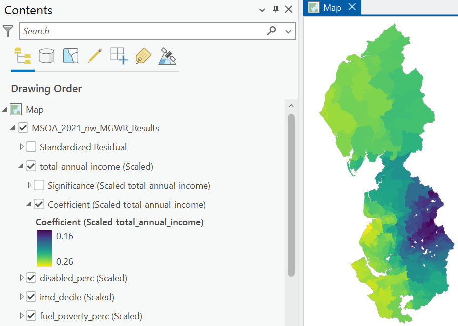{width="80%"}</center>

<br>

As a comparison, here is the MGWR coefficient variability for `disabled_perc`:

<center>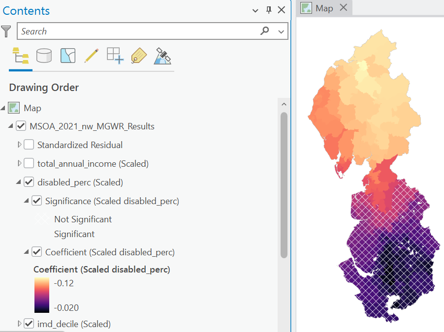{width="80%"}</center>

<br>

::: question
What is your interpretation of the statistical significance of the relationship between life expectancy and disability?
:::

<details>

<summary>Interpretation</summary>

This plot indicates that disability has a statistically significant association with life expectancy in Cumbria and parts of Lancashire, but not the remainder of the North West. The simplest and perhaps most interesting explanation is that the true underlying relationship differs spatially i.e., disability has an important effect on life expectancy in some areas but not in others. It could also reflect the multivariate nature of the analysis, and potential interactions with the other predictors. For example, a similar level of deprivation in two regions might be reflected in different impacts on life expectancy, simply as a function of the other predictors for those regions (e.g., income, deprivation, fuel poverty). It is important to remember that coefficients should not be interpreted in isolation, in that they represent the change in the dependent variable for a one unit change in the independent variable *when all other independent variables are held constant*. 

</details>

<br>

::: question
Is there spatial autocorrelation of the residuals (`S_RESIDUAL` field in the `Standardized Residual` Attribute Table)?
:::

<details>

<summary>Interpretation</summary>

Spatial autocorrelation, as estimated using Moran's $I$ and Queen's contiguity, is not statistically significant $I\approx-0.008$, $p\approx0.73$. This suggests that MGWR has captured much of the spatial heterogeneity in the relationships between life expectancy and the MSOA-level predictors.

</details>

<br>

**Overall**, the MGWR results provide fascinating (in my view) insights into the spatially varying processes that govern life expectancy, as summarised below. Deprivation and income are consistently statistically significant predictors, but their relationship with life expectancy varies spatially within the study area. Evidence of spatially varying relationships could have implications for healthcare management and policy i.e., a single, uniform policy may not be equally effective in all locations. In some areas, tackling deprivation could conceivably have the greatest impact on improving health outcomes, whereas in other areas, focusing on wealth inequality might be more effective[^caveat_intervention].

[^caveat_intervention]: Of course these are not mutually exclusive, and tackling both deprivation *and* wealth inequality would probably be best! 

<center>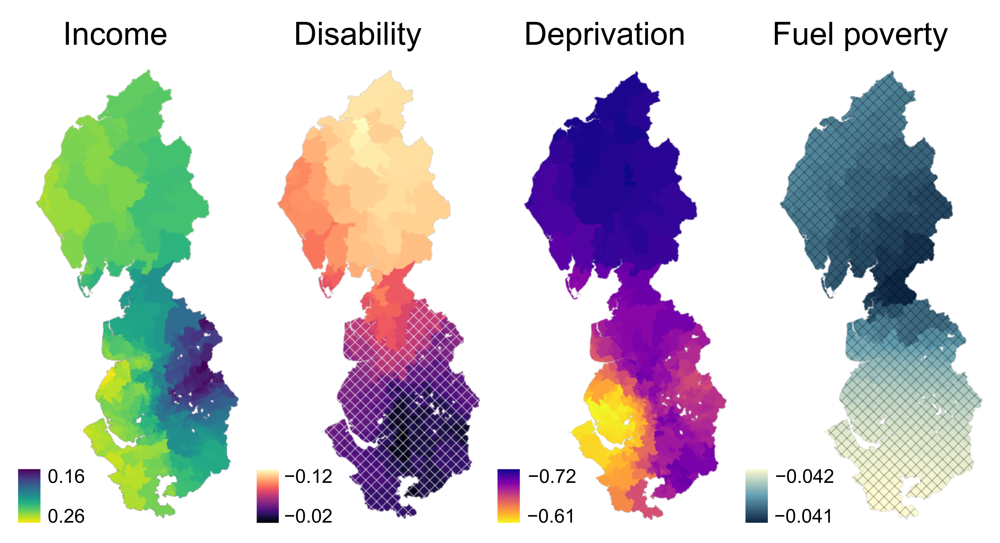{width="100%"}</center>

<br>

By comparison, while fuel poverty and disability percentage do influence life expectancy, the strength of the association is typically smaller (i.e., mean coefficients of $\approx-0.04$ and $\approx-0.05$, respectively) and not always statistically significant ($0\%$ to $\approx10\%$). Instead, the effects of disability and fuel poverty on life expectancy are likely being captured by the Index of Multiple Deprivation, which already incorporates indicators representing income, employment, education, health, crime, housing, and the living environment.  With model parsimony in mind, and to minimise the risk of multicollinearity, we could be justified in removing these variables from the model. 

> Re-run [Multiscale Geographically Weighted Regression](https://doc.esri.com/en/arcgis-pro/latest/tool-reference/spatial-statistics/multiscale-geographically-weighted-regression.html?tabs=dialog), but removing `disabled_perc` and `fuel_poverty_perc`.

::: question
Has model performance changed significantly?
:::

<details>

<summary>Interpretation</summary>

**No!** The parsimonious MGWR $\text{R}^2\approx0.83$, which is near identical to the model including `disabled_perc` and `fuel_poverty_perc`. In general, if you have two (or more) competing models with similar performance, you should select the model with the fewest number of parameters. 

</details>

<br>

### Model selection {#gwr_selection}

Over the past two weeks, we have produced a range of models linking life expectancy to MSOA-level variables i.e., [OLS](#ols), [SEM](#sem), [SLM](#slm), [GWR](#gwr_intro), [MGWR](#mgwr_intro). You may be asking yourself the following question:

::: question
Which model should I choose?
:::

Following @comber2023, a good approach is to begin your analysis with a standard [linear regression](#ols), which can be used to evaluate whether the global relationships are statistically significant and whether there is any evidence of spatially autocorrelated errors. If relationships *are* significant and spatially autocorrelated errors are *absent*, then no further analysis is required - you have discovered powerful and **stationary** relationships for your phenomenon and study area!

If spatial non-stationarity *is* present (spatially autocorrelated errors), then a suitably-calibrated MGWR would be a sensible next step. The outputs can then be interrogated to inform subsequent analysis:

-   *if* bandwidths are different (as evidenced [above](#mgwr_intro)), use MGWR.
-   *if* bandwidths are all the same (rare), then use GWR.
-   *if* bandwidths tend to be global and the residuals are spatially autocorrelated, then a global spatial regression approach would be suitable e.g., [SEM](#sem), [SLM](#slm).

Finally, it should be recognised that other GWR variants are available e.g., MX-GWR, as discussed in @comber2023, and there are an array of secondary model decisions to be considered, some of which we've dealt with above (e.g., collinearity), and others which you can explore further in your own reading (e.g., handling outliers). Moreover, while the route map of @comber2023 is an excellent guide, it is not prescriptive, and there is flexibility to pursue your own workflow, guided by data and theory.

...and with that, **congratulations!** You have completed the practical and should now have a deeper understanding of the importance of **non-stationarity** and how we can account for it via geographically weighted regression. 

[**Finished!**](#index)

## Extra

While we have developed models to capture the spatially varying relationships between life expectancy and MSOA-level predictors, we should recognise that the model performance and the identified relationships are specific to these data and the study area i.e., the North West of England. 

As in [Practical 7](#prac_7_extra), we can explore how the local models change when applied to a different region i.e., London. 

To begin:

> Either load the dataset for London [`MSOA_2021_london`] or follow the instructions [here](#prac_7_extra) to produce the dataset (i.e., filter MSOAs, join fields). 

> Following the @comber2023 routemap, run [Multiscale Geographically Weighted Regression](https://doc.esri.com/en/arcgis-pro/latest/tool-reference/spatial-statistics/multiscale-geographically-weighted-regression.html?tabs=dialog), using `total_annual_income` and `imd_decile` as the independent variables, and the same settings as above for consistency (i.e., scale data, adaptive kernel, Gaussian weighting scheme). 

::: question
How does model performance compare to the models developed for the North West region?
:::

<details>

<summary>Interpretation</summary>

Interestingly, income and deprivation explain a smaller proportion of the variability in life expectancy in London, with $\text{R}^2\approx0.67$. What other predictors do you think we might need to include? 

</details>

::: question
Are the relationships been income, deprivation and life expectancy similar to those observed in the North West?
:::

<details>

<summary>Interpretation</summary>

**Yes.** Deprivation is still negatively associated with life expectancy, with a mean coefficient of $\approx-0.63$, while income is positively correlated ($\approx0.20$), which lends support to the **generalisability** of our model. 

There are some fascinating patterns... lots to explore! 

<center>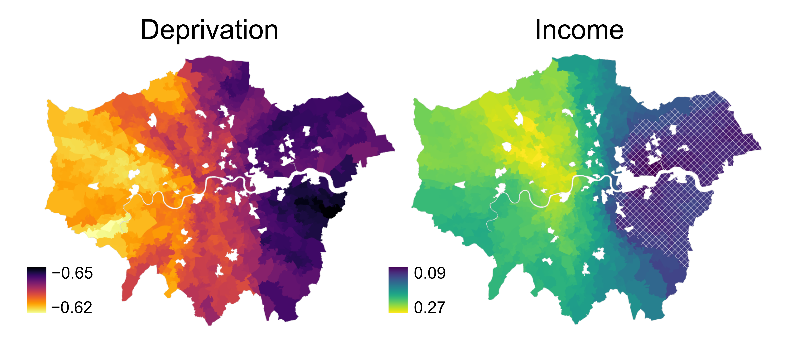{width="80%"}</center>

<br>

</details>

## Resources

-   Brunsdon, C., Fotheringham, A.S. and Charlton, M.E. ([1996](https://doi.org/10.1111/j.1538-4632.1996.tb00936.x)), Geographically Weighted Regression: A Method for Exploring Spatial Nonstationarity. Geographical Analysis, 28: 281-298.
-   Fotheringham, A. S., Yang, W., & Kang, W. ([2017](https://doi.org/10.1080/24694452.2017.1352480)). Multiscale Geographically Weighted Regression (MGWR). Annals of the American Association of Geographers, 107(6), 1247–1265.
-   Comber, A., Brunsdon, C., Charlton, M., Dong, G., Harris, R., Lu, B., Lü, Y., Murakami, D., Nakaya, T., Wang, Y. and Harris, P. ([2023](https://doi.org/10.1111/gean.12316)). A route map for successful applications of geographically weighted regression. Geographical Analysis, 55(1), pp.155-178.


```{r, eval=FALSE, echo=FALSE}
# Import library
library(ggplot2)

#------------ Code to generate plot of Gaussian and Bisquare weighting functions

# Gaussian weighting function
f <- function(d, h) {
  exp(-0.5 * (d / h)^2)
}

# Bisquare weighting function
fb <- function(d, h) {
  ifelse(d < h, 
  (1 - (d / h)^2)^2, 
  NA)
}


# Weights to evaluate
h <- seq(1, 10, 1)

# Distance values (d)
d <- seq(0,35,0.01)

# All combinations of d and h
plot_data <- expand.grid(
  d = d,
  h = h
)

# Corresponding Gaussian weights
plot_data$f <- f(plot_data$d, plot_data$h)

# Corresponding bisquare weights
plot_data$fb <- fb(plot_data$d, plot_data$h)

# Plot
g <- ggplot(plot_data, aes(x = d, y = f, colour = factor(h))) +
  geom_line(linewidth = 0.5) +
  scale_colour_grey(start=0, end=0.8, name="Bandwidth (h)")+
  #scale_colour_brewer(palette = "Blues", direction = -1, name = "Bandwidth (h)") +
  labs(
    x = "Distance",
    y = "Gaussian weight",
    colour = "Bandwidth (h)"
  ) +
  theme_classic() +
  theme(axis.text.x=element_blank(),
        axis.ticks.x=element_blank())

# Save
ggsave(
  plot = g,
  "./images/practical-8/gaussian_weighting.png",
  height = 3,
  width = 6,
  units = "in",
  dpi = 300
)

# Plot
b <- ggplot(plot_data, aes(x = d, y = fb, colour = factor(h))) +
  geom_line(linewidth = 0.5) +
  scale_colour_grey(start=0, end=0.8, name="Bandwidth (h)")+
  #scale_colour_brewer(palette = "Blues", direction = -1, name = "Bandwidth (h)") +
  labs(
    x = "Distance",
    y = "Bisquare weight",
    colour = "Bandwidth (h)"
  ) +
  scale_x_continuous(limits=c(0,15)) +
  theme_classic() +
  theme(axis.text.x=element_blank(),
        axis.ticks.x=element_blank())

# Save
ggsave(
  plot = b,
  "./images/practical-8/bisquare_weighting.png",
  height = 3,
  width = 6,
  units = "in",
  dpi = 300
)

```
