# (PART\*) Locations and Flows {.unnumbered}

# Location Allocation {#location_allocation}

## Introduction

### Aims {.unnumbered}

The aims of this practical are to:

1.  Understand the aims and theory of location allocation models.
2.  Understand the methods and criteria used for location allocation.
3.  Investigate the sensitivity of location allocations to those methods-criteria.

### Application {.unnumbered}

To that end, we'll use location allocation models to optimise locations for new [defibrillators](https://thecircuit.uk/Home/About?_gl=1*1ub1w4x*_up*MQ..*_ga*MTc0ODE0ODI2NS4xNzgzMDc1Mzk4*_ga_3WNW2WCQD1*czE3ODMwNzUzOTckbzEkZzAkdDE3ODMwNzUzOTckajYwJGwwJGgw#about), using population demand and the transport network as inputs.

### Data {.unnumbered}

-   Defibrillator locations listed on the National Defibrillator Network, managed by the British Heart Foundation and associates (The Circuit), available in [`data/bhf`] [[Source](https://www.bhf.org.uk/defibdata)]
-   Ordnance Survey (OS) Open Roads transport network, available in [`data/os/open-roads`] [[Source](https://www.ordnancesurvey.co.uk/products/os-open-roads)]
-   UK Centre for Ecology and Hydrology (UKCEH) gridded population at 1 km resolution (2021), available in [`data/ukceh`] [[Source](https://doi.org/10.5285/7beefde9-c520-4ddf-897a-0167e8918595)]
-   ONS boundaries data, filtered to the Western Isles, available in [`data/ons/national`] [[Source](https://geoportal.statistics.gov.uk/datasets/70c6937637404976a7c4be4d57dcccf0_0/explore?location=55.340000%2C-3.316939%2C5)]

### Tools {.unnumbered}

[Create Network Dataset](https://doc.esri.com/en/arcgis-pro/latest/tool-reference/network-analyst/create-network-dataset.html?tabs=dialog) (Network Analyst Tools), [Build Network](https://doc.esri.com/en/arcgis-pro/latest/tool-reference/network-analyst/build-network.html?tabs=dialog) (Network Analyst Tools), [Make Location-Allocation Analysis Layer](https://doc.esri.com/en/arcgis-pro/latest/tool-reference/network-analyst/make-location-allocation-analysis-layer.html?tabs=dialog) (Network Analyst Tools), [Near](https://doc.esri.com/en/arcgis-pro/latest/tool-reference/analysis/near.html?tabs=dialog) (Analysis Tools), [Snap](https://doc.esri.com/en/arcgis-pro/latest/tool-reference/editing/snap.html?tabs=dialog) (Editing Tools), [Round Up](https://doc.esri.com/en/arcgis-pro/latest/tool-reference/spatial-analyst/round-up.html?tabs=dialog) (Spatial Analyst Tools), [Int](https://doc.esri.com/en/arcgis-pro/latest/tool-reference/spatial-analyst/int.html?tabs=dialog) (Spatial Analyst Tools), [Create Feature Dataset](https://doc.esri.com/en/arcgis-pro/latest/tool-reference/data-management/create-feature-dataset.html?tabs=dialog) (Data Management Tools), [Raster to Point](https://doc.esri.com/en/arcgis-pro/latest/tool-reference/conversion/raster-to-point.html?tabs=dialog) (Conversion Tools), [Feature Class To Geodatabase](https://doc.esri.com/en/arcgis-pro/latest/tool-reference/conversion/feature-class-to-geodatabase.html?tabs=dialog) (Conversion Tools)

------------------------------------------------------------------------

## Practical

**Location allocation** methods are used to determine the optimum location for a facility relative to a measure of spatial demand. Typically these methods are designed to increase benefits e.g., finding a location for a new hospital that **maximises** the number of people within a time or distance threshold [@church1974], or relocating a fire station to **minimise** the average travel time to all households [@hakimi1965]. Location allocation methods can also be used to reduce costs, for example if the facility in question is "obnoxious" [@church2022] and would be expected to have a negative impact on its surroundings e.g., a hazardous waste disposal facility.

Location allocation is therefore an [**optimisation problem**](https://en.wikipedia.org/wiki/Optimization_problem), which seeks to find the best solution from all feasible solutions within the search space. Taking our example above, location allocation methods could be used to evaluate a set of *candidate* locations for a new hospital, based on the land that is available, planning regulations, or access restrictions.

Thus, location allocation is often used alongside a **constraints analysis**, which excludes locations based on a set of user-specified constraints[^09-location-allocation-1].

[^09-location-allocation-1]: This should be very familiar to you from **GEOG62411** *Data Acquisition for GI Scientists*, and our evaluation of solar installation suitability at Woodland Valley Farm.

Our analysis is focused on location allocation of defibrillators, using the Western Isles of Scotland as a case study, given links between socioeconomic deprivation, urban-ruralness and defibrillator access [@burgoine_automated_2024]. For every minute that someone’s in cardiac arrest without receiving [CPR](https://www.nhs.uk/tests-and-treatments/first-aid/cpr/) and having a defibrillator used on them, their chance of survival [decreases by 10%](https://www.nwas.nhs.uk/news/were-appealing-to-the-north-west-public-learn-how-to-save-a-life-today/). Optimising defibrillator locations to minimise response times or maximise coverage could therefore save lives.

### Pre-processing

To begin:

> Open ArcGIS Pro and create a new project `practical-9` in the correct directory, establish a connection to `data`, and then load the road network vector [`road_link_westcoast.shp`], population raster [`uk_population_2021_1km.tif`] and island vector [`west-coast-islands.shp`]. All these layers utilise EPSG: [27700](https://epsg.io/27700), and are subset to the Western Isles of Scotland.

These layers are essential for our location allocation analysis, representing the potential demand for defibrillators (i.e., population), and the routes by which those defibrillators can be accessed (i.e., the road network).

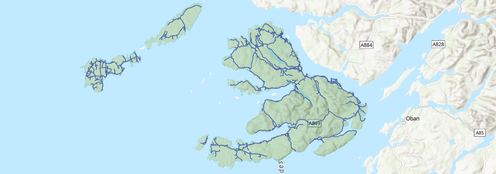{width="100%"}

 

> Load the defibrillator table (`.csv`), which contains data extracted from the National Defibrillator Network ([The Circuit](https://www.bhf.org.uk/defibdata)), and use [XY Table to Points](https://doc.esri.com/en/arcgis-pro/latest/tool-reference/data-management/xy-table-to-point.html?tabs=dialog) to utilise the geometry information that is present (`lat`, `long`, EPSG: [4326](https://epsg.io/4326)). Finally, [Project](https://doc.esri.com/en/arcgis-pro/latest/tool-reference/data-management/project.html?tabs=dialog) to the British National Grid (EPSG: [27700](https://epsg.io/27700)).

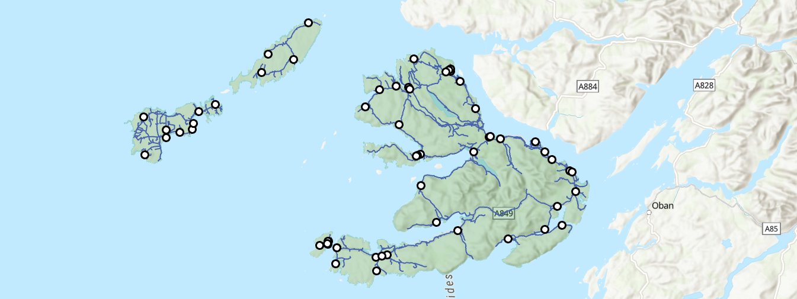{width="100%"}

 

::: question
How would you characterise the spatial distribution of defibrillators? Remember the key measures of [**Centrography**](#point_centro), [**Randomness**](#p5_randomness) and [**Clustering**](#p5_clustering) from Practical 5.
:::

::: question
Which **key concept** do we need to consider when interpreting the point pattern?
:::

Suggestion

One important concept is the **Observation Window**, the region within which point patterns are observed and analysed. This can have a significant impact on our statistical appraisal of randomness e.g., via Clark-Evans $R$. For example, you will get different results if you analysed the point pattern for the whole study region compared to a single island.

 

Our next step is to clean the defibrillator dataset, keeping valid entries and ensuring the points are spatially aligned to the road network.

> Use [Near](https://doc.esri.com/en/arcgis-pro/latest/tool-reference/analysis/near.html?tabs=dialog) to calculate the planar distance between each defibrillator ("Input Features") and the nearest vertex or edge on the road vector ("Near Features"). When complete, inspect the distances (`NEAR_DIST`), for example via "Explore Statistics" and "Visualise Statistics".

::: question
What can we infer from the distance values?
:::

Suggestion

One observation is that most defibrillator points are within $\approx100 \:\text{m}$ of the nearest road However, there are a small number $>100\:\text{m}$ away (n=15). This could represent recording errors (e.g., `FID=206`), or perhaps additional access routes which are not present in the OS Open Roads dataset, but which could be present in data generated at a larger scale e.g., [OS Transport Network](https://www.ordnancesurvey.co.uk/products/os-transport-network). Either way, we can be justified in "snapping" most of the defibrillator points to the nearest road, and removing "inaccessible" defibrillators ($>100\:\text{m}$) from the subsequent analysis.

 

> Use Select by Attributes to select the "inaccessible" defibrillators (`NEAR_DIST > 100`) and delete the selected rows (n=15).

When complete:

> Use [Snap](https://doc.esri.com/en/arcgis-pro/latest/tool-reference/editing/snap.html?tabs=dialog), which modifies the input features, to snap points to the closest edge in the road vector, using a 100 m tolerance ("Features" = `road_link_westcoast`, "Type" = `Edge`, "Distance" = `100`). Check the output for validity.

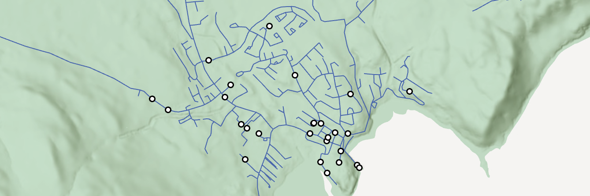{width="100%"}

 

::: note
We could subset our dataset further, for example by restricting our analysis to those with 24-hour access, but for now we'll continue with the full dataset.
:::

We have cleaned the defibrillator dataset, but we also need to clean and prepare our population **demand points**. Currently this is in a raster format, where the raster values represent the modelled population within each 1 km grid cell:

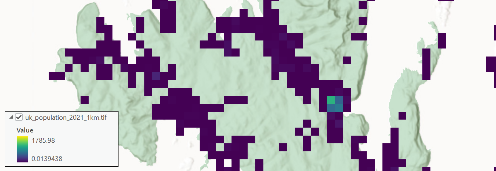{width="100%"}

 

While we could use this for analysis, this would require a more complex approach than that introduced here, for example modelling movement across the raster surface[^09-location-allocation-2]. Instead, we will use our population raster to generate *representative* demand points.

[^09-location-allocation-2]: For example, this could be achieved using a **least-cost-path** algorithm, as introduced in **GEOG62411** *Data Acquisition for GI Scientists*, or alternative routing algorithms, such as A-star [@hart1968] or Dijkstra [@dijkstra1959], as introduced in **GEOG71551** *Understanding GIS*.

> Use [Raster to Point](https://doc.esri.com/en/arcgis-pro/latest/tool-reference/conversion/raster-to-point.html?tabs=dialog) to convert the `population` raster to a point dataset (e.g., `pop_points`), where points are generated at cell centroids.

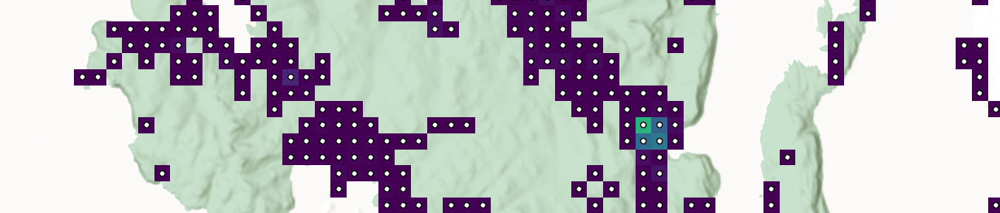{width="100%"}

 

> Next use [Near](https://doc.esri.com/en/arcgis-pro/latest/tool-reference/analysis/near.html?tabs=dialog) to calculate the planar distance between each population point ("Input Features") and the nearest vertex or edge on the road vector ("Near Features"), and then inspect the distances (`NEAR_DIST`).

Many of the calculated distances are extremely large, which has resulted in a highly skewed distribution (Mean = $\approx10\:\text{km}$, Median = $\approx1.6\:\text{km}$). This reflects the differing extents of the datasets, with the road vector restricted to the islands, while the population raster covers a much larger region.

Discounting the measurements outside of our study region, there are still many population points far from the road vector, and many "offshore", as shown below.

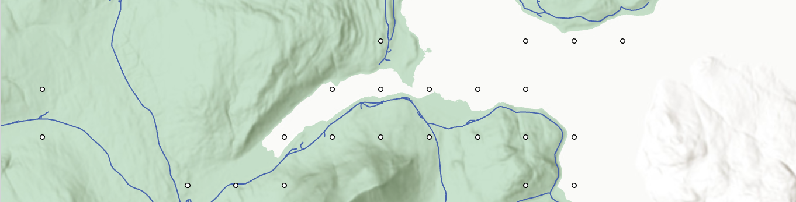{width="100%"}

 

::: question
Why has this occurred?
:::

Answer

This is because of the **generalisation** of the population raster, which aggregates population within a 1 km^2^ area. This differs from the actual spatial distribution of people i.e., the location of individual households.

 

Our next step is to align the population points to the road vector. Given the spatial resolution of the raster (1 km), we can be confident that the population are *within* $\approx700\:\text{m}$ of each cell centroid due to the Pythagorean theorem i.e., $\sqrt{0.5\:\text{km}^2+0.5\:\text{km}^2}=0.7071\:\text{km}$, as illustrated below:

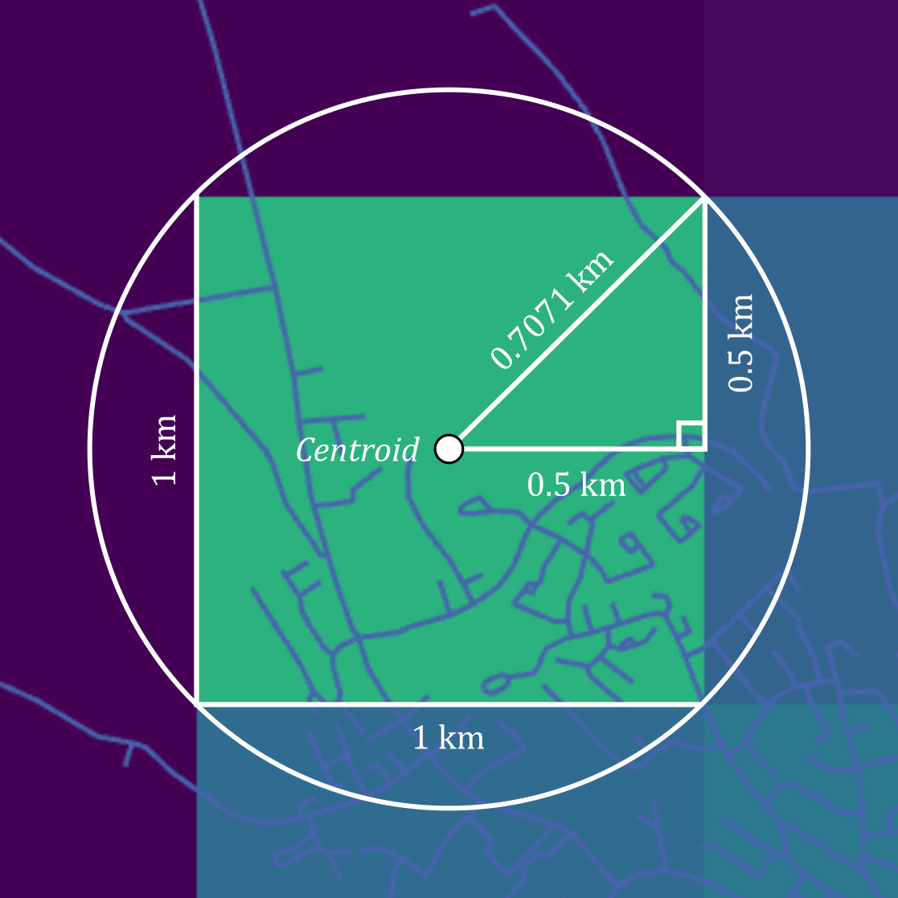{width="40%"}

 

> Use Select by Attributes to remove population points where `NEAR_DIST > 700`, and then use [Snap](https://doc.esri.com/en/arcgis-pro/latest/tool-reference/editing/snap.html?tabs=dialog) to snap population points to the closest edge on the road vector, using a 700 m tolerance ("Features" = `road_link_westcoast`, "Type" = `Edge`, "Distance" = `700`). Check the output for validity.

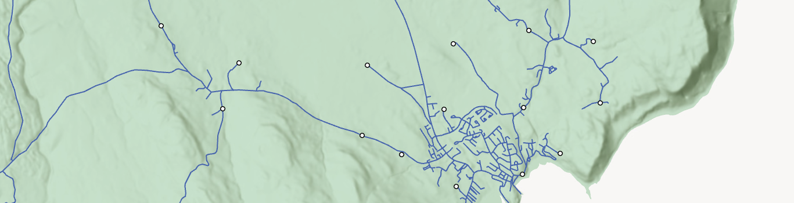{width="100%"}

 

::: note
It is recognised that this is at best an approximation of the population demand. While we have used a reasonable approach, ensuring the population total (`grid_code` field) is snapped to the closest edge of the road vector, discounting points greater than half of the cell diagonal from the centroid ($>700\:\text{m}$), the actual distribution of population would look very different.
:::

::: note
In the absence of household-level population estimates, an alternative approach would be to **simulate** more realistic spatial distributions, generating random points within each 1 km^2^ area, and constraining those points to building geometries, perhaps obtained from the [OS MasterMap Topography Layer](https://www.ordnancesurvey.co.uk/products/os-mastermap-topography-layer) or [OpenStreetMap](https://www.openstreetmap.org/#map=5/54.91/-3.43). While this would represent an improvement on our approach, which uses a single population demand point per 1 km^2^ area, it would be much more complex to implement, and would require some sensitivity testing, evaluating the location allocation outputs based on many different randomly generated population distributions.
:::

For efficiency, we are going to focus on a single island, the [**Isle of Mull**](https://en.wikipedia.org/wiki/Isle_of_Mull).

> Use Select by Attributes to select Mull in the `west-coast-island` layer ("Name" = `Mull`) and then use [Clip](https://doc.esri.com/en/arcgis-pro/latest/tool-reference/analysis/clip.html?tabs=dialog) to clip the following datasets to the geometry of the **selected** feature (Use the `_mull` suffix to denote clipped layers). This includes the road vector as well as the defibrillator points and the population demands points, both of which should have been snapped to the nearest road.

Location Allocation methods are often built upon a road or path layer, which is used to model distance or travel time. This is represented by our OS Open Roads layer, subset to the Isle of Mull. However, the ArcGIS implementation of location allocation will not work with a standard feature layer e.g., `road_link_mull`, but requires data to be stored in a [**Feature Dataset**](https://doc.esri.com/en/arcgis-pro/latest/help/data/feature-datasets/feature-datasets-in-arcgis-pro.html) which has stricter rules regarding the CRS: all layers **must** share a common coordinate system, unlike a geodatabase `gdb` or a collection of files in your project directory.

> Use [Create Feature Dataset](https://doc.esri.com/en/arcgis-pro/latest/tool-reference/data-management/create-feature-dataset.html?tabs=dialog), setting the "Output Geodatabase" to `practical-9.gdb`, choosing EPSG: 27700 for the "Coordiante System" and with a suitable name e.g., `mull_features`. An empty Feature Dataset will be initialised, and data can be imported using [Feature Class to Geodatabase](https://doc.esri.com/en/arcgis-pro/latest/tool-reference/conversion/feature-class-to-geodatabase.html?tabs=dialog), with `road_link_mull` as the "Input Features", taking care to the select the Feature Dataset `mull_features` for the "Output Geodatabase", rather than the project geodatabase.

### Network building

To perform location allocation in ArcGIS, we need to create a **network dataset** from our OS Open Roads layer. Unlike `road_link_mull`, which is simply a line vector consisting of edges and vertices, a network dataset can include additional information, for example classified junctions (connections between edges), topological connectivity, and if present, relevant network information, such as speed limits or access restrictions.

We can achieve this by:

> First creating an inital default network dataset using [Create Network Dataset](https://doc.esri.com/en/arcgis-pro/latest/tool-reference/network-analyst/create-network-dataset.html?tabs=dialog), choosing our Feature Dataset `mull_features` as the "Target Feature Dataset", selecting `road_link_mull` as the "Source Feature Class", and choosing a suitable output name e.g., `road_model`[^09-location-allocation-3].

[^09-location-allocation-3]: We can leave the "Elevation Model" as the default, although this is quite important if the network elements span different elevations, see [here](https://doc.esri.com/en/arcgis-pro/latest/help/analysis/networks/understanding-connectivity.html#2F2).

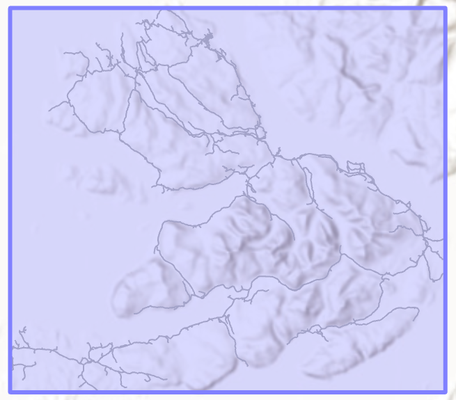{width="50%"}

 

If we have additional rules to apply (e.g., speed limits), those can be defined at this stage, as described [here](https://doc.esri.com/en/arcgis-pro/latest/help/analysis/networks/how-to-create-a-usable-network-dataset.html), otherwise we can build our network, which defines the topological connectivity (e.g., junctions).

> Run [Build Network](https://doc.esri.com/en/arcgis-pro/latest/tool-reference/network-analyst/build-network.html?tabs=dialog) to generate the network structure needed for routing, using `road_model` as the input.

When complete, the only difference should be the removal of the ["Dirty Areas"](https://doc.esri.com/en/arcgis-pro/latest/help/data/utility-network/dirty-areas-in-a-utility-network.html) polygon, which is an esri term to flag areas of the network dataset which have not been built, or have changed since the last build.

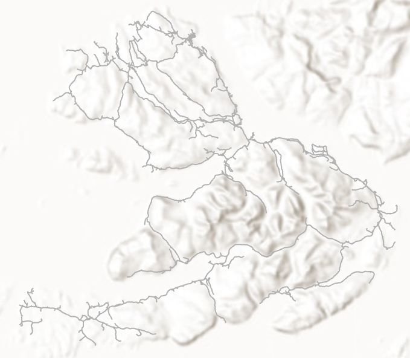{width="50%"}

 

We have now processed our input data to produce a **network dataset** that could be used for routing, calculating the distance or travel time between population demand points and current and candidate defibrillator locations, as well as a whole [range](https://doc.esri.com/en/arcgis-pro/latest/help/analysis/networks/what-is-network-analyst-.html) of other tasks.

### Optimality {#optimality_section}

When evaluating a set of candidate locations, the analyst has to make a decision on what criteria are being used to define **optimality**. Changing these criteria can produce different optimum locations, even with the same inputs for supply (e.g., defibrillator locations) and demand (e.g., population). One commonly used criterion is to select the $p$ facilities which minimise the demand-weighted average (or total) distance between demand points and the nearest of the selected facilities. This is known as the $p$-median problem[^09-location-allocation-4] [@hakimi1965; @daskin2015], as illustrated below:

[^09-location-allocation-4]: **Problem** here denotes a mathematical problem i.e., a task to be solved.

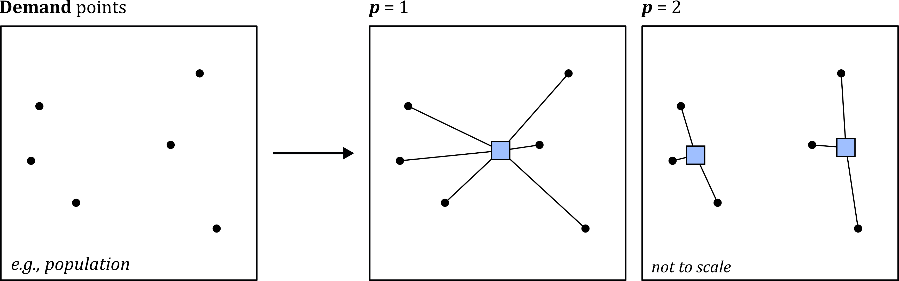{width="100%"}

 

In short, $p$-median places facilities to minimise the total travel distance (or cost or time) to the nearest demand point. Sub-optimal locations would increase the total travel distance, as illustrated here:

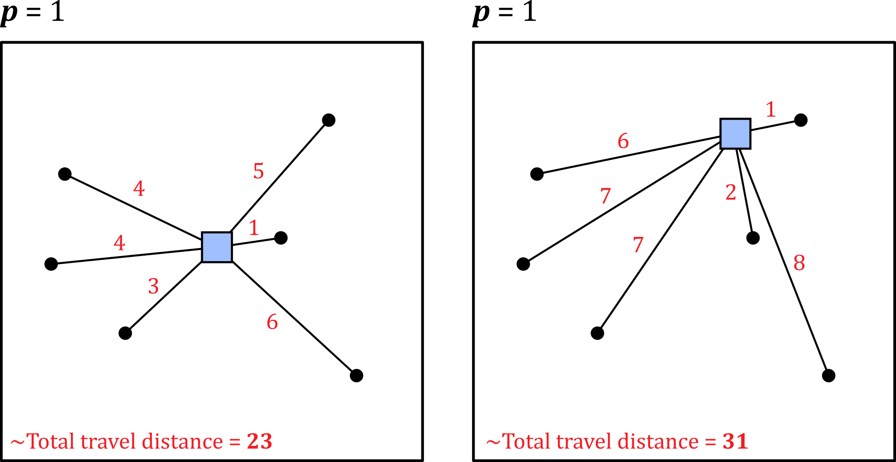{width="70%"}

 

Demand points can also be weighted, as illustrated below. For example, @leung2021 used weighted demand points to produce socioeconomically equitable defibrillator access, incorporating population deprivation, rather than the total population alone.

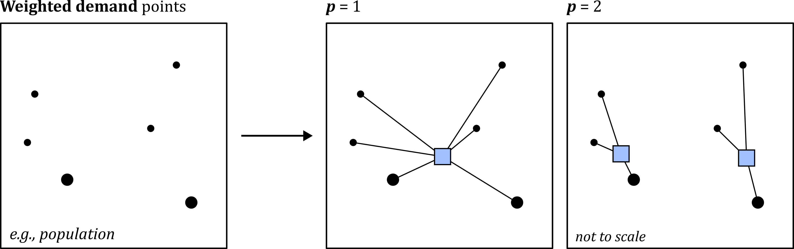{width="100%"}

 

Another commonly used criterion for location allocation is to place facilities to maximise the total amount of demand covered within a cutoff (e.g., a distance or time threshold). This is known as the **Maximise Coverage** problem [@church1974].

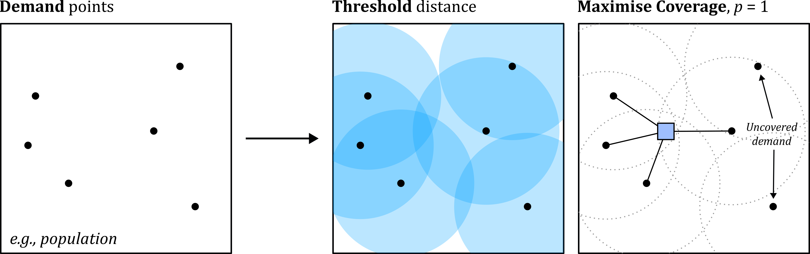{width="100%"}

 

In the example above, four of the six demand points are covered (i.e., accessible within the threshold distance), giving a coverage of $\approx66\text{%}$ when $p=1$. Moving the facility might provide coverage for the other demand points, but this would be sub-optimal, as the total coverage would be reduced.

In summary, **optimality** can be defined and evaluated using many different approaches, including $p$-median, Maximise Coverage, or [other](https://doc.esri.com/en/arcgis-pro/latest/help/analysis/networks/location-allocation-analysis-layer.html) criteria, which you read about more fully in @location2015. None of these is "correct", but your choice will depend on the location allocation problem you are addressing.

### Hueristics

Having selected a criterion (e.g., $p$-median), the next step is to evaluate the candidate locations.

When $p=1$ and/or when there is only a small set of $n$ candidate facilities, this can be completed **deterministically** i.e., evaluate each candidate, calculate it's score (e.g., total travel distance for $p$-median, or coverage % for Maximise Coverage), and return the optimum.

For most location allocation problems, this is impossible, because the number of evaluations increases dramatically as both $p$ and $n$ increase. For example, let's say we have just five candidates $n$ ($A,B,C,D,E$) and set $p=2$ i.e., we want to return the two candidates which *in combination* return the highest score. We could calculate the total number of combinations to be evaluated as:

$$\frac{n!}{p!(n-p)!}=\frac{5!}{2!(5-2)!}=\frac{120}{12}=10\:\text{combinations}$$

This is a very simple location allocation problem[^09-location-allocation-5]. However, if the task was to identify the optimium 25 facilities $p$ from 10,000 candidate facilities $n$ e.g., candidates spaced every 100 m in a 10 km^2^ area, the total number of combinations[^09-location-allocation-6] would be:

[^09-location-allocation-5]: Here are the combinations, if you want to confirm: $AB,AC,AD,AE, BC, BD,BE,CD,CE,DE$.

[^09-location-allocation-6]: $\frac{n}{p!(n-p)!}$ is used to calculate the number of combinations, excluding repetitions (i.e., a candidate facility cannot be included twice in a specific solution), and where order does not matter i.e., $ABC=ACB$.

$$\frac{n!}{p!(n-p)!}=\frac{10000!}{25!(10000-25)!}=6.26 × 10^{74}\: \text{combinations}$$

 

**This is an extremely large number.**

As a result, a deterministic approach to find the optimum solution is often impossible and instead location allocation methods typically use a **heuristic approach** to guide the search for a near-optimal ("good enough") solution[^09-location-allocation-7].

[^09-location-allocation-7]: This will be familiar to those of you taking **GEOG71551** *Understanding GIS*, and the differences between the A-star [@hart1968] and Dijkstra [@dijkstra1959] routing algorithms. Can you remember what the heuristic was for A-star?

::: note
*A heuristic is a strategy that ignores part of the information, with the goal of making decisions more quickly, frugally, and/or accurately than more complex methods.*   @gigerenzer2011
:::

It is outside the scope of this unit to delve into these heuristic approaches in detail but if you are interested you may want to explore @cooper1964, @reese2006, @daskin2015a, @mladenovic2007 and @gwalani2021. The key thing to **remember** is that for higher values of $n$ and $p$, the modelled solution may not be the **globally optimal solution** but instead is more accurately described as the **heuristic solution**.

### P-median

In the remaining sections, we are going to run some allocation location models, using the $p$-median and Maximise Coverage approaches, where the former minimises the demand-weighted average (or total) distance between demand points and the nearest of the selected facilities.

> Use the Geoprocessing tool [Make Location-Allocation Analysis Layer](https://doc.esri.com/en/arcgis-pro/latest/tool-reference/network-analyst/make-location-allocation-analysis-layer.html?tabs=dialog), with "Network Data Source" = `road_model`[^09-location-allocation-8], "Name" = `la_pmedian_mull` and "Problem Type" = `Minimize impedance` (*P*-median). Leave all other settings as the default. This may take \~5 minutes to complete...

[^09-location-allocation-8]: It is possible to use an esri created network dataset here, which includes more detailed network rules e.g., speed limits. However, this consumes ArcGIS credits, and would be a ["black box"](https://en.wikipedia.org/wiki/Black_box) approach, as we don't know how it was created!

When complete, the location allocation layer should be loaded to the Contents Pane, with groups for facilities and demand points (currently empty) and other network rules that the user might want to specify (e.g., barriers to movement).

Our next task is to add the current defibrillator locations and the demand points to the location allocation layer:

> With the location allocation layer selected in the Contents Pane, use the Location-Allocation Layer tab → Input Data → Import Facilities. On the following input screen, use `defib_points_mull` for "Input Locations". For "Property" → "FacilityType", set "Default Value" to `Required`. As these are current defibrillators, we are **requiring** that they are included in the location allocation solution.

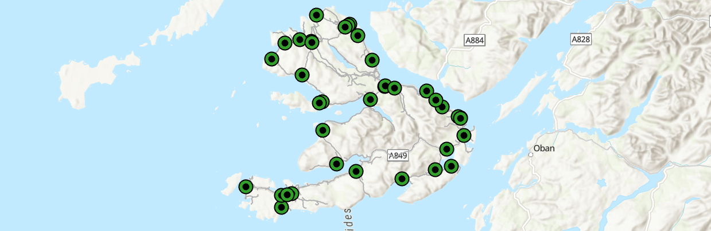{width="100%"}

 

> Repeat the above process, but this time use Input Data → Import Demand Points, selecting `pop_points_mull` for "Input Locations". For "Property" and "Weight", use "Field Name" = `grid_code`. As discussed [above](#optimality_section), here we are using a **weighted** approach, incorporating the modelled population for each point (stored in the `grid_code` field).

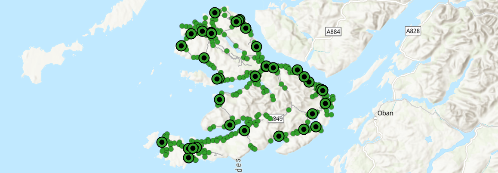{width="100%"}

 

Before we begin to allocate **new** facilities, a good first analysis would be to evaluate the **current** distribution of defibrillators relative to the weighted-demand points, using the $p$-median criterion:

> To run the location allocation analysis, first navigate to "Travel Settings" in the Location-Allocation Layer tab and specify the number of facilities to allocate. You should use $p=38$ to match the current number of defibrillators on the Isle of Mull. When complete, press Analysis → **Run**.

When complete, we should be able to inspect the allocation of demand points to the nearest facility.

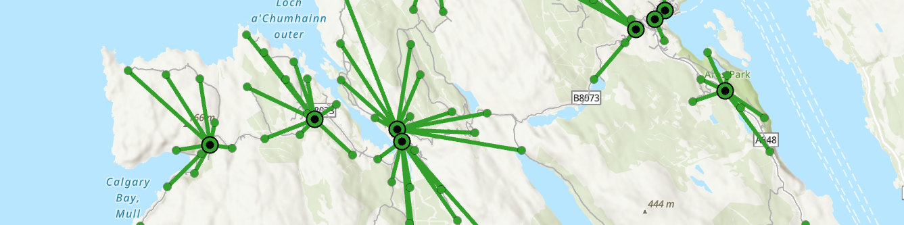{width="100%"}

 

> Inspect the output messages for "Solve", which you can access via History → Geoprocessing.

::: question
How should we interpret the "Sum of **allocated** weight" and the "Sum of valid **unallocated** weight" statistics?
:::

Answer

The sum of **allocated** weight in "Demand Points" is 3050.685136, which is the total weight of valid demand points that **were** assigned to a facility.

The sum of valid **unallocated weight** in "Demand Points" is 0, which is the total weight of valid demand points that were **not** assigned to a facility.

For the $p$-median criterion, neither of these statistics are particularly useful, because this criterion assigns all demand points to the nearest facility. In turn, and assuming that all demand points are "accessible" (e.g., aligned to the network), the sum of allocated weights should equal the total modelled population across all of the demand points. You can check this via the Attribute Table → Explore Statistics → `grid_code`.

 

::: question
What is the sum of **allocated weighted impedance** in "Demand Points" and how do we interpret it?
:::

Answer

The sum of **allocated weighted impedance** (3685274.499361) is the key **analysis metric** i.e., the total population-weighted travel cost across all demand points to their assigned nearest facility. This is calculated by multiplying each demand points weight (i.e., population) by the travel impedance to the assigned facility (i.e., distance). The total weighted impedance is the sum of these values, where the optimal solution, as assessed using $p$-median, is the set of facilities with the lowest total weighted impedance, as illustrated [above](#optimality_section).

 

We will use this first model as our baseline for comparison. Our next step is to generate a set of candidate defibrillator locations across the island, aligned to the road network, before assessing the optimum configuration using $p$-median.

> Use [Dissolve](https://doc.esri.com/en/arcgis-pro/latest/tool-reference/data-management/dissolve.html?tabs=dialog) for `road_link_mull`, choosing a suitable output name (e.g., `road_link_mull_dissolve`) and leaving all other settings as default. Next, use [Create Random Points](https://doc.esri.com/en/arcgis-pro/latest/tool-reference/data-management/create-random-points.html?tabs=dialog) to generate 100 random points (`random_mull_n100`), using the **dissolved** road vector as the "Constraining Feature Class". If we *don't* use the dissolved output, we would generate $n$ points **per feature**.

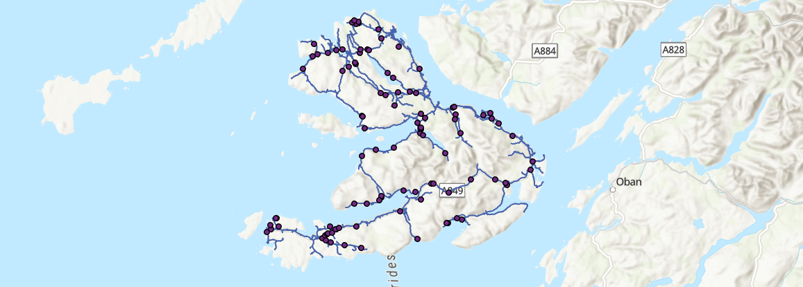{width="100%"}

 

> Return to the Location-Allocation Layer tab → Import Facilities, using the random points as the "Input Locations" and setting "Property" → "FacilityType" as `Candidate`.

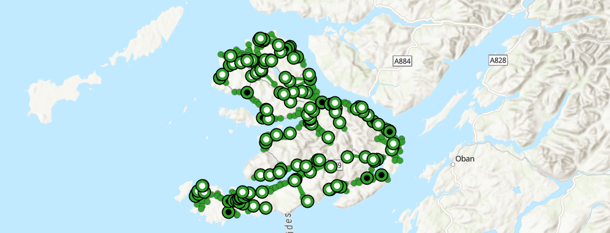{width="100%"}

 

> To evaluate these facilities, we need to set the desired number of facilities under "Travel Settings". If we leave the value as it was before ($p=38$), then the output would be identical, because we have required the current defibrillator facilities to be included in the solution. The Scottish Government has recently announced [additional investment](https://www.gov.scot/news/improving-cardiac-arrest-survival-rates/) for new defibrillators, so let's set $p=50$ i.e., there is funding for 12 more defibrillators on the island. When complete, press Analysis → **Run**.

This time there are some more interesting visual outputs to investigate, with some of the candidate facilities now reassigned as "Chosen" i.e., these are the optimum 12 candidate facilities, based on the $p$-median criterion.

::: note
Remember that we generated our candidate locations using [Create Random Points](https://doc.esri.com/en/arcgis-pro/latest/tool-reference/data-management/create-random-points.html?tabs=dialog), so your candidates, chosen candidates, and location allocation statistics will differ from mine.
:::

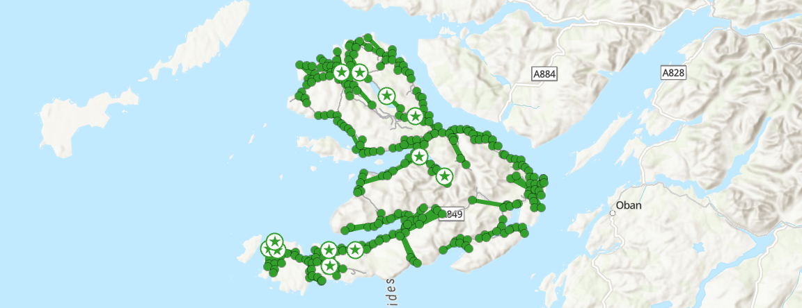{width="100%"}

 

::: question
Why haven't the "Sum of **allocated** weight" and the "Sum of valid **unallocated** weight" statistics changed?
:::

Answer

These statistics quantify the total weight of valid demand points that **were** or were **not** assigned to a facility. $p$-median assigns all demand points to a facility, and assuming that all demand points are "accessible" and assuming that we haven't changed the network, these statistics should remain the same across different optimisation models.

 

::: question
How has the sum of **allocated weighted impedance** changed and what is your interpretation?
:::

Answer

The sum of **allocated weighted impedance** is 2720895.446077 for $p=50$, compared to 3685274.499361 for $p=38$. This is a significant reduction, equivalent to $-964,379$ "person meters" of impedance (i.e., weights are population, distances are meters) and a $\approx26.2\%$ reduction in the total population-weighted travel cost.

 

As a final test of the $p$-median criterion, we could evaluate an idealised scenario i.e., the island with no existing defibrillators.

> Use [Create Random Points](https://doc.esri.com/en/arcgis-pro/latest/tool-reference/data-management/create-random-points.html?tabs=dialog) to generate **1000** random points (`random_mull_n1000`), using the **dissolved** road vector as the "Constraining Feature Class". An alternative approach would be to use regular spacing to ensure full coverage.

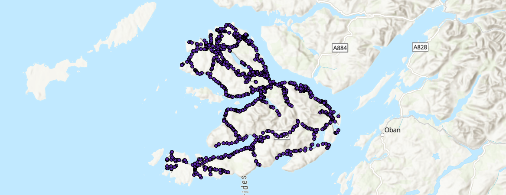{width="100%"}

 

> Next open the Attribute Table for the `Facilities` group in `la_pmedian_mull` and **delete all rows**, thereby removing all previous required, candidate, and chosen facilities. Return to the Location-Allocation Layer tab → Import Facilities, using the **1000** random points as the "Input Locations" and setting "Property" → "FacilityType" as `Candidate`.

> To facilitate comparison with the current distribution of defibrillators, set $p=38$ under "Travel Settings", and then press Analysis → **Run** i.e., we are now evaluating the optimum locations (based on the $p$-median criterion) for our existing 38 defibrillators, of the 1000 candidate facilities (not all possible locations).

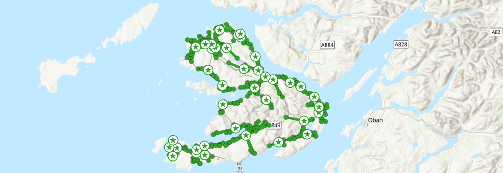{width="100%"}

 

It is worth reiterating here that the solution is not necessarily the **globally optimal solution** but instead is the **heuristic solution**. The ArCGIS heuristic is described [here](https://doc.esri.com/en/arcgis-pro/latest/help/analysis/networks/algorithms-used-by-network-analyst.html#A92), with the original formulation in @teitz1968. For $k=1000$ and $p=38$, the total number of combinations to evaluate is:

$$\frac{n!}{p!(n-p)!}=\frac{1000!}{38!(1000-38)!}=9.38 × 10^{68}\: \text{combinations}$$

 

While this is smaller than the example provided above ($p=25, k=10000$), it is still an extremely large number, therefore requiring a heuristic approach, rather than a deterministic one.

::: question
How does the sum of **allocated weighted impedance** compare to the original distribution of defibrillators ($p_{\text{original}}$), and the model with $p=50$?
:::

Interpretation

For my location allocation model, the **allocated weighted impedance** is 2430836.519422 for $p=38$, compared to 2720895.446077 for $p=50$ and 3685274.499361 for $p_{\text{original}}=38$. The absolute difference in impedance compared to $p_{\text{original}}$ is $-1,254,438$ "person meters", equivalent to a $\approx34\%$ reduction in the total population-weighted travel cost. 

One interpretation of this result is that we can improve access to defibrillators, defined as the total demand-weighted impedance between demand points and the nearest of facility (i.e., $p$-median), simply through location optimisation, without having to increase the total number!

 

::: note
Before we move on, make sure you understand what $p$-median is evaluating. While we have not investigated the underlying heuristics, you should have an understanding of the criterion, and the key choices involved (e.g., selection of $p$, weighting).
:::

### Maximise coverage

Next we are going to evaluate the **Maximise Coverage** criterion, which maximises the total amount of demand (e.g., population) covered within a cutoff (e.g., a distance threshold).

> Use the Geoprocessing tool [Make Location-Allocation Analysis Layer](https://doc.esri.com/en/arcgis-pro/latest/tool-reference/network-analyst/make-location-allocation-analysis-layer.html?tabs=dialog), with "Network Data Source" = `road_model`, "Name" = `la_maximise_mull` and "Problem Type" = `Maximise Coverage`. This time, set "Cutoff" to `1000 m` i.e., defibrillators should be located within 1 km of demand points, which is justified based on the rapid-response required in cases of Out-of-Hospital Cardiac Arrest (OHCA). Leave all other settings as the default. This may take \~5 minutes to complete...

::: problem
In ArcGIS, there is the option to switch the problem type for an existing Location-Allocation Analysis Layer i.e., from P-Median to Maximise Coverage. From my testing, this doesn't work, hence why we're creating a separate layer. **James** can you reproduce?
:::

We now need to load our current defibrillator locations and population demand points to the location allocation layer:

> Use the Location-Allocation Layer tab → Input Data → Import Facilities. On the following input screen, use `defib_points_mull` for "Input Locations". For "Property" → "FacilityType", set "Default Value" to `Required`. Repeat this process for the demand points, but this time use Input Data → Import Demand Points, selecting `pop_points_mull` for "Input Locations". For "Property" and "Weight", use "Field Name" = `grid_code`.

As before, lets first evaluate the **current** distribution of defibrillators relative to the weighted-demand points, but this time using the **Maximise Coverage** criterion:

> Set $p=38$ for "Travel Settings" and then Analysis → **Run**.

Unlike $p$-median, which allocates all demand points to a facility, Maximise Coverage prioritises the overall demand coverage given the $p$ facilities and the selected threshold distance, which can result in unallocated demand:

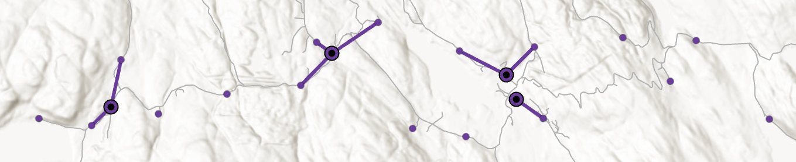{width="100%"}

 

::: question
What is your interpretation of the "Sum of **allocated** weight" and the "Sum of valid **unallocated** weight" statistics?
:::

::: question
What is your interpretation of the sum of allocated weighted impedance?
:::

Interpretation

Unlike $p$-median, which allocates all demand points to the nearest facility, thereby ensuring that the sum of **allocated** weight equals the total weight of the demand, the **Maximise Coverage** criterion maximises the total amount of demand (e.g., population) covered within a cutoff (e.g., a distance threshold). As a result, some of the demand weights can be unallocated, if they are greater than the threshold distance from the nearest facility.

For the 38 required defibrillator facilities, the sum of **allocated** weight is 2008.805185, with an **unallocated** weight of 1041.879952. Here we are interested in the ratio of allocated to unallocated weights. Given the selected distance threshold (1 km) and the current distribution of facilities and demand, we can conclude that 1041 people are not served by current distribution of defibrillators. This equates to coverage of $\approx62\%$.

The sum of allocated weighted impedance is 981885.557754, which is simply the distance between each **allocated** demand point and its assigned facility (`Total_Length` field in the "Facilities" Attribute Table), multiplied by its weighting (`DemandWeight`). You can check this value by using "Explore Statistics" on the `TotalWeighted_Length` field.

It is worth iterating that while this is a representation of the distance to facilities, this is not the criterion by which **Maximise Coverage** is evaluating and optimising location allocation.

 

Now let's evaluate the idealised scenario again i.e., the island with no existing defibrillators.

> Next open the Attribute Table for the `Facilities` group in `la_maximise_mull` and **delete all rows**, thereby removing all previous required, candidate, or chosen facilities. Return to the Location-Allocation Layer tab → Import Facilities, using the **1000** random points we generated earlier as the "Input Locations" and setting "Property" → "FacilityType" as `Candidate`.

> To facilitate comparison with the current distribution of defibrillators, set $p=38$ under "Travel Settings", and then press Analysis → **Run** i.e., we are now evaluating the optimum locations (based on the Maximise Coverage criterion) for our existing 38 defibrillators from a set of 1000 candidate facilities.

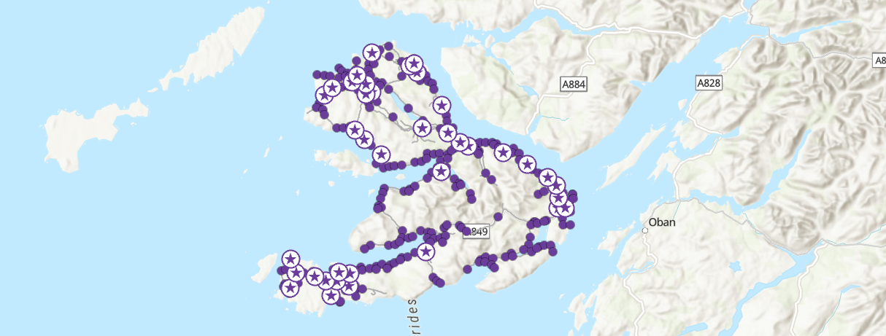{width="100%"}

 

::: question
How has the sum of allocated weighted impedance changed? Does this matter?
:::

Interpretation

For this new scenario, and for my set of random candidate locations, the sum of allocated weighted impedance is 1222049.489314, which has increased compared to $p_{\text{original}}$. If we were evaluating using the $p$-median criterion, this would be a problem, as we have increased the demand-weighted total distance!

However, Maximise Coverage is optimising for coverage, so the ratio of allocated to unallocated weights is more important. In turn, the increase in the total allocated weighted impedance is simply a reflection of the fact that more demand points have now been allocated i.e., more people can access a defibrillator within the 1 km cutoff.

 

::: question
What is your interpretation of the "Sum of **allocated** weight" and the "Sum of valid **unallocated** weight" statistics?
:::

Interpretation

For this new scenario, the sum of **allocated** weights has increased to 2541.885593, compared to 2008.805185 for $p_{\text{original}}$. As a result, the sum of **unallocated** weight has fallen by the same amount.

In turn, optimising the location of defibrillators has meant that an additional $\approx500\:\text{people}$ can now access a defibrillator within the 1 km threshold distance, and population coverage is now $\approx83\%$.

 

To finish:

> Modify the "Cost Cutoff" under "Travel Settings", for example comparing the coverage % when the distance threshold is 500 m or 5000 m.

::: question
How do the results change and which threshold do you think is most appropriate for our topic?
:::

Interpretation

When the threshold distance is large (5000 m), all demand points can be connected to defibrillator facilities (Coverage = $100\%$), so the sum of allocated weight equals the total population weight (3050.685136).

When the threshold distance is reduced to 500 m, some demand points are unallocated and there is a reduction in coverage ($\approx64\%$). However, this coverage is still comparable to the baseline model, when the threshold distance was 1 km. This is a good illustration of the value of optimisation.

Considering our focus on defibrillators, and the importance of rapid [CPR](https://www.nhs.uk/tests-and-treatments/first-aid/cpr/) and [defibrillator use](https://www.nwas.nhs.uk/news/were-appealing-to-the-north-west-public-learn-how-to-save-a-life-today/), we would be justified in using a small a threshold as possible, balanced against the costs of purchasing and maintaining a defibrillator network.

 

To confirm your understanding:

::: question
What are the key differences between the $p$**-median** and **Maximise Coverage** criteria?
:::

::: question
Which do you think is most appropriate for our topic?
:::

::: question
Why is a heuristic approach necessary?
:::

 

If you're happy with your understanding... **congratulations!** You have completed the practical and should now have an understanding of the key problem types in Location Allocation models, and be able to produce the typical inputs (e.g., demand points, networks) and implement a Location Allocation analysis in ArcGIS.

[**Finished!**](#index)

## Extra

::: question
Using the **Maximum Coverage** approach, how many facilities do we need to ensure 95% of the population are within 1 km of a defibrillator?
:::

Answer

Compared to a baseline coverage ($p_{\text{original}}$) of $\approx62\%$, and an optimised coverage of $\approx83\%$, we would need approximately 100 defibrillators to ensure 95% coverage within 1 km (Sum of allocated weight in "Demand Points" = 2937.332799 of 3050.685136, $\approx96\%$).

 

::: question
How does defibrillator accessiblity compare to other islands? Repeat the analysis for [Jura](https://en.wikipedia.org/wiki/Jura,_Scotland)...
:::

::: question
Which key population metric are we not including?
:::

Answer

The non-resident population i.e., tourists! The actual demand for defibrillators might be significantly higher at certain points of the year, while the spatial distribution of the non-resident population may differ from the resident population e.g., at [beauty spots](https://visitmullandiona.co.uk/guides/beaches-on-mull-and-iona/north-west-mull-beaches/calgary-bay/).

 

::: question
What are some of the limitations of our approach?
:::

Suggestions

A few suggestions, by no-means exhaustive:

-   Population **generalisation**: How representative are our demand points of the "true" spatial distribution of population?
-   Use of **distance** as an impedance measure: While this is a reasonable approach, would travel time be more effective?
-   Absence of **constraints**: Our analysis has evaluated the optimum locations for defibrillators without consideration of feasibility i.e., is defibrillator installation possible at our candidate locations?

 

## Resources

-   Hakimi, S.L. ([1965](https://doi.org/10.1287/opre.13.3.462)). Optimum distribution of switching centers in a communication network and some related graph theoretic problems. Operations research, 13(3), pp.462-475.
-   Church, R.L., and ReVelle, C. ([1974](https://doi.org/10.1007/BF01942293)). The maximal covering location problem. In Papers of the regional science association (Vol. 32, No. 1, pp. 101-118). Berlin/Heidelberg: Springer-Verlag.
-   Church, R.L. ([2002](https://doi.org/10.1016/S0305-0548(99)00104-5)). Geographical information systems and location science. Computers & Operations Research, 29(6), 541–562.
-   Church, R.L., & Murray, A. ([2018](https://doi.org/10.1007/978-3-319-99846-6)). Location covering models: History, applications and advancements (Advances in Spatial Science). Springer.
-   Church, R.L., & Drezner, Z. ([2022](https://doi.org/10.1016/j.cor.2021.105468)). Review of obnoxious facilities location problems. Computers & Operations Research, 138, 105468.
