# Spatial Interaction Modelling {#spatial_interaction}

## Introduction


### Aims {.unnumbered}

The aims of this practical are to:

1.  Understand the aims and common applications of spatial interaction
    (gravity) models.
2.  Understand the design and calibration of spatial interaction models.
3.  Apply spatial interaction models to a contemporary sociological
    issue.

### Application {.unnumbered}

To that end, we'll develop spatial interaction models to predict
internal migration flows between local authorities in England and Wales.

### Data {.unnumbered}

All data for this practical have been sourced from the Office for
National Statistics (ONS) at the local authority level and are found in
[`data/ons/local-authority`] as follows:

-   ONS internal migration flows for local authorities in England and
    Wales (2021)
    [[Source](https://www.ons.gov.uk/peoplepopulationandcommunity/populationandmigration/populationestimates/datasets/internalmigrationinenglandandwales)]
-   ONS district geometries (2021)
    [[Source](https://geoportal.statistics.gov.uk/datasets/ons::local-authority-districts-december-2021-boundaries-gb-bfc/about)]
-   ONS gross domestic product (GDP) per head at current market prices
    [[Source](https://www.ons.gov.uk/datasets/gdp-by-local-authority/editions/time-series/versions/2)]
-   ONS population
    [[Source](https://www.ons.gov.uk/peoplepopulationandcommunity/populationandmigration/populationestimates/datasets/estimatesofthepopulationforenglandandwales)]

### Tools {.unnumbered}

[Feature To
Point](https://doc.esri.com/en/arcgis-pro/latest/tool-reference/data-management/feature-to-point.html?tabs=dialog)
(Data Management Tools), [Generate Near
Table](https://doc.esri.com/en/arcgis-pro/latest/tool-reference/analysis/generate-near-table.html?tabs=dialog)
(Analysis Tools), [Generalized Linear
Regression](https://doc.esri.com/en/arcgis-pro/latest/tool-reference/geoanalytics-desktop/generalized-linear-regression.html?tabs=dialog)
(GeoAnalytics Desktop Tools), [Notebooks in ArcGIS
Pro](https://doc.esri.com/en/arcgis-pro/latest/arcpy/get-started/pro-notebooks.html),
[Calculate Geometry
Attributes](https://doc.esri.com/en/arcgis-pro/latest/tool-reference/data-management/calculate-geometry-attributes.html?tabs=dialog)
(Data Management Tools)

------------------------------------------------------------------------

## Practical

### Understanding Spatial Interaction Models

In 1687, Isaac Newton published *Philosophiæ Naturalis Principia
Mathematica*[^10-spatial-interactions-1], arguably the most important
scientific work in history:

[^10-spatial-interactions-1]: The Mathematical Principles of Natural
    Philosophy

<p align="center">
<a name=""></a>{width="20%"}
</p>

Alongside the laws of motion, the *Principia* included Newton's law of
universal gravitation, which describes the force of **gravity** acting
between objects. It was later formalised as follows:

$$F = G\frac{m_{1}m_{2}}{r^{2}}$$ where $F$ is the force between
objects, $m_{1}$ and $m_{2}$ are the masses of the objects, and $r$ is
the distance between them. $G$ is the Newtonian constant of gravitation,
defined as $6.674 \times 10^{-11}\; m^{3}\cdot kg^{−1}\cdot s^{−2}$ and
first measured by Henry Cavendish in 1797 [@lally1999].

This law states that the force of gravity is proportional to the objects
masses ($m_{1}m_{2}$) and inversely proportional to the square of the
distance between them ($r^{2}$) i.e., as the masses of the objects
increases, the force of gravity increases. As the distance between the
objects increases, the force of gravity decreases.

While other laws are needed in certain settings (e.g., Einstein's theory
of [general
relativity](https://en.wikipedia.org/wiki/General_relativity)), Newton's
law of universal gravitation can be used to measure the [force between
planets and
galaxies](https://www.science.org/content/article/newton-s-law-gravity-passes-its-biggest-test-ever),
the [impact of mountains on nearby
objects](https://www.bbc.co.uk/travel/article/20211007-how-a-scottish-mountain-weighed-the-planet),
or even an [apple falling from a
tree](https://www.aaas.org/membership/scientia/story-gravity).

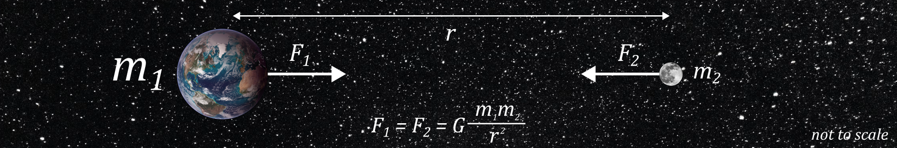{width="100%"}

This is all very interesting (*I hear you say*) but what does it have to
do with spatial analysis, and how is this relevant to **spatial
interaction models**, the topic of today's practical?

Spatial interaction models (SIMs), of which the most widely used form is
the **gravity model**, are analogous to Newton's law of universal
gravitation. However, rather than predicting the force of gravity $F$
between objects, gravity models (and SIMs more widely) are used to
predict **flows** between locations e.g., the flow of **people**,
**materials**, **money** or **information** between origins and
destinations.

A classic form for the gravity model is provided below, which you'll
notice is conceptually and mathematically similar to Newton's law above:

$$T_{ij} = k \frac{V_i^μ W_j^α}{d_{ij}^{\beta}}$$

We'll define each of the terms in a moment, but the gravity model states
that flows between an origin and a destination ($T_{ij}$) are
*proportional* to the product of the masses of the origin and the
destination ($V_{i}W_{i}$) and *inversely proportional* to the distance
between them ($d_{ij}$).

Let's take a simple example of migration between countries. Intuitively,
if countries have millions or billions of people (e.g., China, India,
United States, Indonesia, Pakistan, ...), we would expect there to be a
larger flow of people between the countries, compared to the flow
between countries with only a few thousand people (e.g., Tuvalu, Nauru,
Palau, ...). Similarly, we might expect migration to be greater for
*neighbouring* country pairs (e.g., France → Germany) and smaller for
*distant* country pairs (e.g., France → Japan). In reality, patterns of
migration might also be explained by additional drivers e.g., shared
language, cultural similarity[^10-spatial-interactions-2], wealth
inequality, to name a few.

[^10-spatial-interactions-2]: As we explored in Practical 1: [Working
    with Geographic Data](#geo_data).

Returning to our model:

-   $T_{ij}$ is the predicted flow (*of people, money, information,
    ...*) between origin $i$ and destination $j$, analogous to $F$.
-   $V_i$ is a vector of origin attributes which relate to the
    *emissiveness* of all origins $i$ i.e., the capacity of a location
    to send out flows. For example, if modelling flows of people, this
    could be the population of the origin country.\
-   $W_j$ is a vector of destination attributes which relate to the
    *attractiveness* of all destinations $j$ e.g., the employment
    opportunities or social provision of a destination country.
-   $d_{ij}$ is a matrix of costs between origins and destinations
    ($ij$) e.g., the distance, cost or travel time between countries.

The gravity model also includes a number of parameters which need to be
estimated: $k, μ, α, \beta$.

We'll discuss these parameters more fully later in the practical, but
broadly these control the importance of the variables they are
associated with. As an analogy, in Newton's law of universal
gravitation, the inverse square of the distance is used ($r^2$). For
example, if objects move to be twice as far apart, the force of gravity
would be a *quarter* of its original strength, rather than a *half*, if
$r$ was used. Similarly, the $\beta$ parameter controls the importance
of **cost** in our model. As $\beta$ increases, the cost associated with
distance would also increase, and predicted flows would decrease,
independent of $V_i$ and $W_j$.

**Overall**, the gravity model defined here, adapted from physics,
states that as the emissiveness of the origin ($V_i$) and the
attractiveness of the destination ($W_j$) increase, the predicted flow
($T_{ij}$) will increase. In contrast, as origin-destination costs
($d_{ij}$) increase, predicted flows will decrease.

We can use these models for **prediction** e.g., what might happen to
flows of people as the population and wealth of countries change in
future?

They can also be used to inform our **understanding** e.g., what are the
key factors which influence international migration?

In today's practical, we are going to develop our own gravity models to
predict internal migration flows between local authorities in England
and Wales. Relevant academic works include @dennett2013 and @rowe2024.
For those interested in other implementations, the `R` spatial
interaction [walthroughs](https://rpubs.com/adam_dennett/376877)
provided by Adam Dennett and the functionality available in the `R`
package `simodels` [@lovelace2025] were used to guide development of
this practical.

### Pre-processing

To begin:

> Open ArcGIS, initialise a new project in the `practical-10` directory,
> establish a connection to `data` and load `LAD_DEC_2021_GB_BFC.shp`,
> which contains the geometries for Local Authortiy districts in Great
> Britain.

<p align="center">
<a name=""></a>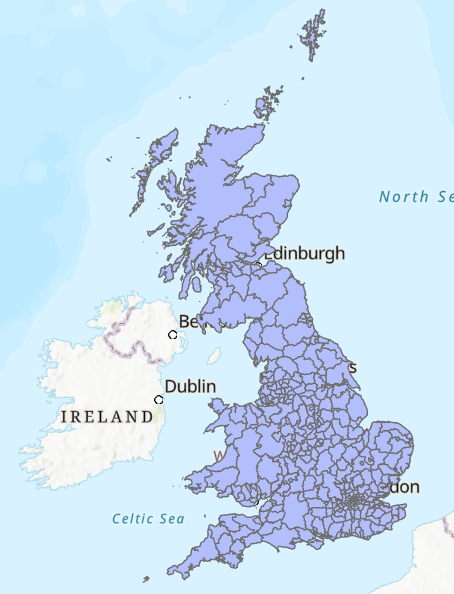{width="30%"}
</p>

One of the key components of the gravity model is $d_{ij}$, which
represents the costs between origins and destinations. In our case, we
will use the Euclidean (straight-line) distance between local authority
**centroids**:

> Use the Geoprocessing tool [Feature To
> Point](https://doc.esri.com/en/arcgis-pro/latest/tool-reference/data-management/feature-to-point.html?tabs=dialog)
> to generate centroids for each feature, using the output name
> `LAD_point`.

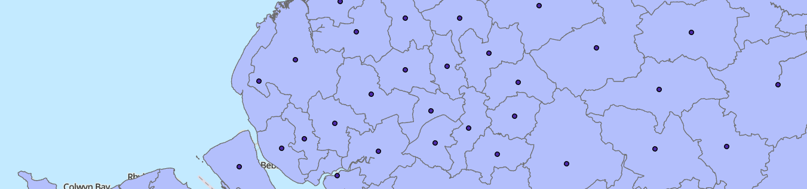{width="100%"}

There are lots of methods we could use to generate a representative
Point for each Polygon feature. For example, we could use the centre
point of the bounding geometry for each feature, calculated using
[Minimum Bounding
Geometry](https://doc.esri.com/en/arcgis-pro/latest/tool-reference/data-management/minimum-bounding-geometry.html?tabs=dialog).
We could also simply calculate the average of all the point coordinates
that comprise the Polygon boundary.

[Feature To
Point](https://doc.esri.com/en/arcgis-pro/latest/tool-reference/data-management/feature-to-point.html?tabs=dialog)
calculates the geometric centroid (i.e., center of mass) for each
feature. For irregularly shaped or multipart features, the centroid can
sometimes fall outside the Polygon boundary.

> Investigate this for `E06000053`, the Isles of Scilly.

You'll also notice that the ONS data already includes some additional
geometry information, as `BNG_E`,`BNG_N` and `LONG`,`LAT`.

> Use [XY Table to
> Point](https://doc.esri.com/en/arcgis-pro/latest/tool-reference/data-management/xy-table-to-point.html?tabs=dialog)
> to generate an additional Point dataset, saved as `LAD_ons_point`. Use
> either `BNG_E` and `BNG_N` OR `LONG` and `LAT` and make sure to select
> the correct **Coordinate System**.

{width="100%"}

<br>

The differences between these methods are *generally*
small[^10-spatial-interactions-3] and given we are using the modelled
Points to calculate an *approximate* distance between local authorities,
rather than actual travel paths (for example), we can be justified in
using the [Feature To
Point](https://doc.esri.com/en/arcgis-pro/latest/tool-reference/data-management/feature-to-point.html?tabs=dialog) output `LAD_point`.

[^10-spatial-interactions-3]: For those interested, the ONS centroids
    *might* be population-weighted (see p.14
    [here](https://ukdataservice.ac.uk/app/uploads/censusgeography2022-10-18.pdf)),
    although I haven't been able to find documentation to confirm this.
    Alternatively, the coordinates are geometric-only, but produced by
    an alternative method.

To finalise this choice:

> Use [Calculate Geometry
> Attributes](https://doc.esri.com/en/arcgis-pro/latest/tool-reference/data-management/calculate-geometry-attributes.html?tabs=dialog),
> with `LAD_point` as the "Input Features" and store the x-coordinates
> and y-coordinates of each Point as `BNG_east` and `BNG_north`
> respectively. Here we are using longer field names to distinguish
> these fields from those provided by ONS (`BNG_E`, `BNG_N`).

Now that we have a representative Point for each local authority
district, and the corresponding coordinates in the Attribute Table, we
can produce $d_{ij}$, our matrix of costs between all origins and
destinations.

> Use [Generate Near
> Table](https://doc.esri.com/en/arcgis-pro/latest/tool-reference/analysis/generate-near-table.html?tabs=dialog)
> with `LAD_point` as both the "Input" and "Near Features" and uncheck
> "Find only closest feature". Use a suitable output name (e.g.,
> `LAD_point_neartable`). Please save in the `practical-10`
> **geodatabase**, rather than the project directory, to facilitate
> later editing.

::: question
In [Generate Near
Table](https://doc.esri.com/en/arcgis-pro/latest/tool-reference/analysis/generate-near-table.html?tabs=dialog),
we used the `Planar` method for distance calculation. Why is this
appropriate?
:::

> Inspect the Near Table, which contains the feature IDs for the origin
> (`IN_FID`) and destination locations (`NEAR_FID`) and the
> corresponding distances.

::: question
What are the units for the distance measurements? Why are they being
used?
:::

Our Near Table contains $d_{ij}$, but no other information, including
the geometries of the features (for plotting) or attributes for each
origin and destination, which we will need to model **emissiveness** and
**attractiveness**. To address this:

> Load the gross domestic product (`ons-la-gdp.csv`) and population
> tables (`ons-authority-population.csv`) into ArcGIS and use [Join
> Field](https://doc.esri.com/en/arcgis-pro/latest/tool-reference/data-management/join-field.html?tabs=dialog)
> to link these data to our local authority **centroids** (`LAD_point`),
> joining based on `LAD21CD` and `la_code`. For Transfer Fields, we are
> only interested in the `gdp` and `pop` fields from each dataset.

Our next step is to join these fields to the corresponding origins and
destinations in the Near Table.

> Open [Join
> Field](https://doc.esri.com/en/arcgis-pro/latest/tool-reference/data-management/join-field.html?tabs=dialog),
> using `LAD_point_neartable` as the "Input Table" and `IN_FID` as the
> "Input Field", joining to the `LAD_Point` table via `FID`. Use "Field
> Mapping" to select the following fields and update the field names to
> indicate they are related to the **origin** location (`orig_`):
>
> -   `orig_LAD21CD`: Unique ID
> -   `orig_LAD21NM`: Name
> -   `orig_gdp`: Gross domestic product (£) per capita
> -   `orig_pop`: Population
> -   `orig_BNG_east`: British National Grid easting, produced using
>     Calculate Geometry Attributes
> -   `orig_BNG_north`: British National Grid northing, as above

> Repeat this process, but this time linking to the **destination**
> location by updating the "Input Field" to `NEAR_FID` and updating the
> field names accordingly i.e., `dest_`.

When complete, the Near Table should contain all the required origin and
destination fields:

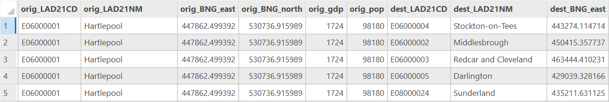{width="100%"}

This is great and we could start to plug some of the above values into
our gravity model to predict migration e.g.,

$$T_{ij} = k\frac{\text{Origin Population}_{i}^μ\times\text{Destination GDP}_{j}^α}{\text{Distance}_{ij}^{\beta}}$$

However, without **empirical data**, we would be unable to **calibrate**
our models or **test** their performance.

Luckily, the ONS provides data on internal migration flows for England
and Wales, summarising the flows of people into and out of each local
authority. We'll be using data from 2021 to match the census date of the
population and GDP datasets.

> Load the ONS internal migration data `ons-internal-migration.csv`.
> Here, `flow` represents the number of *modelled* residential moves
> (i.e., change of address) between each local authority. This dataset
> excludes any moves within local authorities, international moves, or
> those to Scotland or Northern Ireland. For the modelling approach, see
> [here](https://www.ons.gov.uk/peoplepopulationandcommunity/populationandmigration/populationestimates/methodologies/populationestimatesforenglandandwalesmid2022methodsguide#internal-migration).

::: question
What is the total number of internal migrations?
:::

::: question
Which local authority received the largest inflow from a *single* other
local authority?
:::

You'll notice that `ons-internal-migration` contains the `orig_dest`
field, which I've created to summarise the origin-destination path in a
single attribute. To link the flow data to our Near Table, we are going
to create an equivalent field in the latter:

> Using "Calculate Field" in the Near Table to create an
> origin-destination field (e.g., `orig_dest`, "Field Type" = `Text`)
> using the following expression:
> `!orig_LAD21CD! + "-" + !dest_LAD21CD!`.

> Use [Join
> Field](https://doc.esri.com/en/arcgis-pro/latest/tool-reference/data-management/join-field.html?tabs=dialog)
> for the final time, joining the internal migration table to the Near
> Table using `orig_dest`, and transferring the `flow` field. *Note this
> may take some time...*

As a final step before we can enjoy some data exploration and modelling,
it is worth doing some data cleaning:

> Remove all rows where `flow` is `<Null>`. This excludes local
> authorities whether is no empirical flow data for calibration (i.e.,
> Scotland), and should result in \~87,000 rows.

### Data exploration

Before we begin modelling, it is always worth performing some
exploratory data analysis.

::: question
Using "Visualise Statistics", how would describe the distribution of
internal migrations by local authority?
:::

::: question
Using "Summarise", which local authority received the largest **total**
inflow?
:::

::: question
Which local authority provided the largest **total** outflow?
:::

It may also be useful to visualise some of the internal migrations.
Unfortunately we can't do this for all bilateral connections without
causing ArCGIS stress, so instead:

> Use Select by Attributes to select local authority pairs where `flow`
> \> 1000. Use [XY to
> Line](https://doc.esri.com/en/arcgis-pro/latest/tool-reference/data-management/xy-to-line.html?tabs=dialog)
> to generate lines connecting the centroids, using the relevant `orig`
> and `dest` coordinates, selecting the appropriate CRS and making sure
> to "Preserve attributes". Modify the symbology to improve your
> understanding e.g., modifying line size by `flow`.

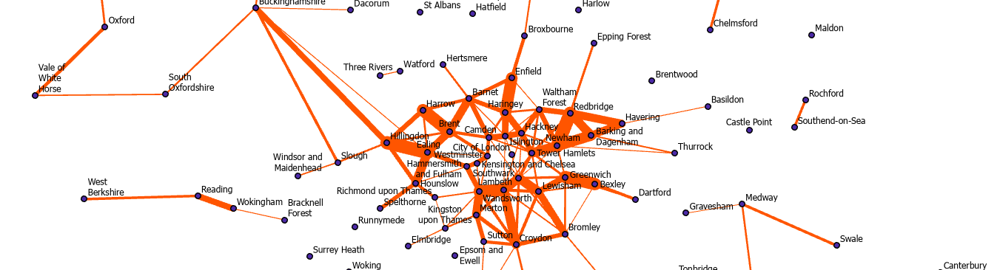{width="100%"}

> When you've finishing exploring, remove this dataset from ArcGIS. You may also want to visualise flows to and from a specific local authority e.g., Manchester = `E08000003`. 

Finally, it is worth investigating the relationships between the local
authority attributes.

> Use Create Chart - Scatter Plot to investigate the links between
> `flow` and the other fields.

::: question
Are there any interesting or promising correlations?
:::

To finish:

> Remove all the original data tables: `ons-la-gdp`,
> `ons-authority-population.csv`, `ons-internal-migration` to avoid confusion. 

### Model description

As a reminder, we'll be using a classic gravity model:

$$T_{ij} = k \frac{V_i^μ W_j^α}{d_{ij}^{\beta}}$$

where $T_{ij}$ is the predicted flow between origin $i$ and destination
$j$, $V_i$ is a vector of origin attributes which relate to the
*emissiveness* of all origins, $W_j$ is a vector of destination
attributes which relate to the *attractiveness* of all destinations $j$,
$d_{ij}$ is a matrix of costs (distance) between origins and
destinations ($ij$), and $k, μ, α, \beta$ are model parameters that need
to be estimated.

This equation can also be written as follows, as described by
@wilson1971, which is mathematically identical but removes the fraction,
so is simpler to handle:

$$T_{ij} = kV_i^μ W_j^αd_{ij}^{-\beta}$$

As outlined above, the key parameters that need to be estimated
($k, μ, α, \beta$) control the importance of the variables they are
associated with i.e., as $\beta$ increases, the cost associated with
distance increase, and predicted flows would decrease, independent of
$V_i$ and $W_j$. At this stage we don't know how to select those
parameters, so we can start with a basic set where effects scale
linearly e.g., a 1 unit increase in population might equate to a 1 unit
increase in the modelled flow from that origin. Newtons universal law of
gravitation uses a power law of $\beta=-2$, so here are the starting
values:

$$k=1, μ=1, α=1, \beta=-2$$ For $V_i$ (origin "emissiveness"), we will
use origin population (`orig_pop`) and for $W_j$ (destination
"attractiveness"), we will use destination GDP per capita (`dest_gdp`)
i.e., as the population of the origin increases and the GDP per capita
of the destination increases, we would expect a greater flow of people.

For $d_{ij}$, we'll use distance in kilometers (`NEAR_DIST` / 1000)
where the reverse effect is expected i.e., as distance between local
authorities increases, we would expect a smaller flow of people.

### Unconstrained and Total-constrained models {#unconstrained_total}

ArcGIS does not provide dedicated tools for spatial interaction models,
so we'll be conducting most of our modelling using "Calculate Field".

To begin:

> In the Attribute Table, use Calculate Field to generate a new field
> `gm1` i.e., our first gravity model ("Field Type" = `Double`). The
> expression is as follows:
> `pow(!orig_pop!, 1) * pow(!dest_gdp!, 1) * pow(!NEAR_DIST! / 1000, -2)`,
> where distance is converted from metres to kilometers. The function
> `pow()` raises the chosen object to the specified power, in this case
> $1$ or $-2$.

More simply, this is:

$$\text{Modelled Flow} = \text{Origin Population}^{1} \times \text{Destination GDP}^{1} \times \text{Distance}^{-2}$$

> Inspect the Attribute Table, which should contain the modelled values
> for `gm1`.

We would describe this as an **unconstrained model** because the values
are *unitless* and they have been produced *independently* of any
empirical flow data.

A more useful output is to ensure the sum of our modelled flows (`gm1`)
matches the sum of the empirical flows (`flow`). This is achieved by
scaling our modelled flows using the $k$ parameter, which you'll notice
was absent from our equation above. In turn, we would refer to our
output as a **total constrained** model i.e., the modelled total has
been *constrained* to the empirical total, with the scale factor $k$
calculated as follows:

$$ k = \frac{\text{Sum of empirical flows}}{\text{Sum of modelled flows}}$$

> Use "Explore Statistics" to find the sum of `flow` and `gm1`. Then use
> "Calculate Field" to generate a new field (`gm1_scale`), where the
> output is our original modelled values `gm1` multiplied by the scale
> factor.

::: note
When complete, we can check our model is **total constrained** by
comparing the sums of `flow` and `gm1_scale` using "Explore Statistics".
:::

We have produced our first model, so let's evaluate it.

> Create a Scatter Plot for `flow` and `gm1_scale`.

<p align="center">
<a name=""></a>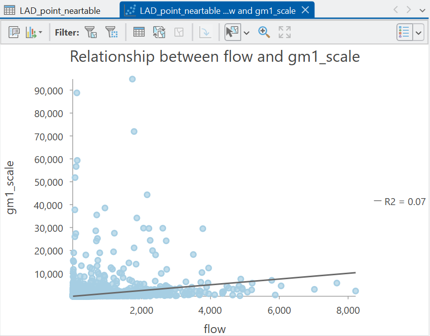{width="60%"}
</p>

::: question
What is your appraisal of model performance?
:::

::: question
What are some limitations of our approach?
:::

<details>

<summary>Answer</summary>

I think you'll agree, the performance is **pretty absymal** here
($R^2=0.07$). Our model is capturing less than 10% of the variability in empirical flows. One reason for this is we haven't tuned our parameters $k, μ, α$ or $\beta$.

</details>

### Tuning parameters

To tune our parameters $k, μ, α$ and $\beta$, a common approach is to
develop separate models to explain the observed (empirical) migration
data, and use the related model coefficients as our parameters.

#### A log-normal approach

Historically this would be achieved by taking the logarithm of both
sides of our equation:

$$\log(T_{ij}) = \log(kV_i^μ W_j^αd_{ij}^{-\beta})$$

This can also be written as follows, which converts multiplication into
addition, and powers into coefficients:

$$\log(T_{ij}) = \log(k) + μ\log(V_i) + α\log(W_j) - \beta\log(d_{ij})$$

::: note
For those interested, this is produced by the *laws of logarithms*. For
example, $\log(a) + \log(b) = \log(ab)$. Applying this to our equation
yields:

$$\log(T_{ij}) = \log(k) + \log(V_i^{μ}) + \log(W_j^{α}) + \log(d_{ij}^{-\beta})$$

Another law is that $\log(a^x) = x\log(a)$. Applying this to our
equation yields:

$$\log(T_{ij}) = \log(k) + μ\log(V_i) + α\log(W_j) - \beta\log(d_{ij})$$
As the exponent for distance is negative ($-\beta$), the coefficient is
also negative: $- \beta\log(d_{ij})$.
:::

The **important** thing to note here is that the *form* of this equation
should be familiar to you: it is effectively a **regression** model, as
covered in [Practical 7](#spatial_regression). For example, take the
equation for a multiple linear regression:

$$ Y = \beta_{0} + \beta_{1}X_1 + \beta_{2}X_2 + \cdots + \beta_{n}X_{n}$$

where $Y$ is the dependent variable, $\beta_{0}$ is the intercept term,
and $\beta_{n}$ is the slope coefficient associated with independent
variable $X_n$. This is the same structure as our logged gravity model
above.

Using this approach, we can produce a regression model to predict our
empirical flow data $Y$, minimising the sum of the squared residuals
between empirical $Y$ and predicted $Y$, where the latter is produced
using the independent variables $X$, which are our chosen inputs to the
gravity model i.e., `orig_pop`, `dest_gdp`. The slope coefficients
produced by this model ($\beta_{n}$) can be used as our parameters for
our gravity model e.g., $\beta_{0}=k$.

To **summarise**, our parameter values are calibrated or tuned to
provide the best fit with the empirical flow data.

#### A Poisson approach

**Unfortunately**, there are a number of issues with a log-normal
approach, which are outlined in detail by @flowerdew1982. For example,
this approach will only work with positive flows, since $\log(0)$ is
undefined. The approach also produces predictions of $\log(T_{ij})$,
rather than $T_{ij}$. While the latter can be estimated using
antilogarithms, the effects are typically biased, with
under-representation of large flows, and under-prediction of the total
flow.

Instead, a more rigorous approach is to use **Poisson regression** which
can handle both positive, negative and zero flows, but is also more
appropriate for skewed data.

> If you've not done so already, use "Visualise Statistics" to explore
> the distribution of `flow`.

A **Poisson** distribution, named after French mathematician [Siméon
Denis Poisson](https://en.wikipedia.org/wiki/Sim%C3%A9on_Denis_Poisson),
is often used to model discrete events e.g., whether someone migrates to
a local authority or not, and is the probability of those events
occurring in a fixed time interval, assuming:

-   the events occur at a known average rate.
-   the events are independent of the time since the last event.

The probability of $n$ events in an interval is given as:

$$\frac{λ^{n}e^{-λ}}{n!}$$

where $λ$ is the average rate of occurrence and $e$ is [Euler's
number](https://en.wikipedia.org/wiki/Leonhard_Euler).

Inspired by a Wikipedia
[example](https://en.wikipedia.org/wiki/Poisson_distribution), there
were 308 goals across 104 matches at the 2026 World Cup, giving an
average of [2.96 goals per
game](https://www.fifa.com/en/tournaments/mens/worldcup/canadamexicousa2026/articles/fifa-world-cup-goals).
This is $λ$, the average rate of occurrence.

Thus, the probability of $n$ goals in a match for this value of $λ$ is
as follows:

$$P(n \;\text{goals in a match when} \: λ = 2.96)=\frac{2.96^{n}e^{-2.96}}{n!}$$

The probability of there being 0, 1, 2, or 5 goals in a match is
therefore:

$$P(n = 0 \;\text{goals in a match})=\frac{2.96^{0}e^{-2.96}}{0!}=\frac{e^{-2.96}}{1}\approx0.052$$
$$P(n = 1 \;\text{goals in a match})=\frac{2.96^{1}e^{-2.96}}{1!}=\frac{2.96e^{-2.96}}{1}\approx0.153$$
$$P(n = 2 \;\text{goals in a match})=\frac{2.96^{2}e^{-2.96}}{2!}=\frac{8.76e^{-2.96}}{2}\approx0.227$$
$$P(n = 5 \;\text{goals in a match})=\frac{2.96^{5}e^{-2.96}}{5!}=\frac{227.2e^{-2.96}}{120}\approx0.098$$

Using the above approach, we can plot a Poisson **distribution** for
different average values $λ$ across a range of probabilities $n$, as
shown here:

<p align="center">
<a name=""></a>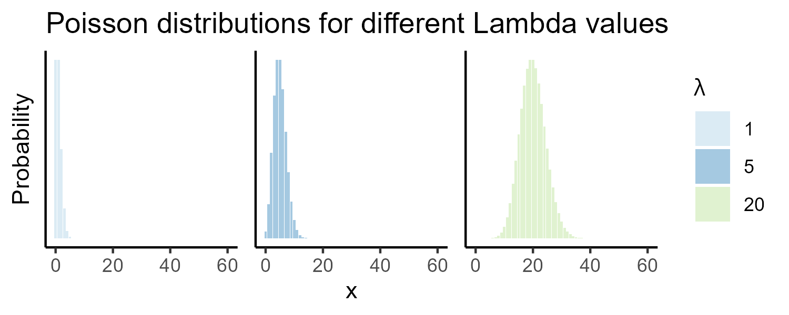{width="100%"}
</p>

The **important** thing to note with a Poisson distribution is when the
average rate of occurrence $λ$ changes (e.g., $λ = 1, 5, 20$), this is
reflected in the distribution, with increasing right skew with smaller
values of $λ$. This is unlike a normal distribution, which would look
the same if the mean of the distribution was 10, 100, or 1000:

<p align="center">
<a name=""></a>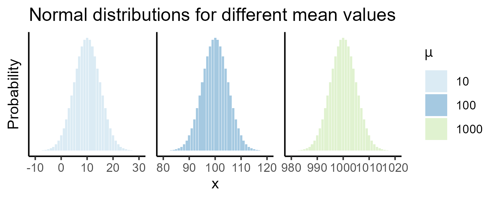{width="100%"}
</p>

So that's some background on Poisson distributions, which are more
representative of our right-skewed flow data. How do we actually utilise
this for our modelling?

When using a Poisson approach, we are assuming the following:

$$T_{ij} \sim Poisson(λ_{ij})$$

i.e., for an expected (modelled) flow $λ_{ij}$ between an
origin-destination, the actual **observed** flow $T_{ij}$ is *drawn from
a Poisson distribution*.

For example, let's say the actual observed flow between two local
authorities was 100 people. We'll use $n$ here to represent that, rather
than $T_{ij}$, for consistency with the equations above i.e., $n = 100$.
Now let's say we have produced a Poisson model that predicts flow of 80
people between the two local authorities i.e., $λ=80$. Using a Poisson
approach, we want to ask:

::: question
Given our model predicts an expected flow of 80 people ($λ$), how likely
is it that we observe 100 people ($n$)?"
:::

We can assess the **probability** using our equations above,
substituting in our values for $λ$ and $n$ i.e., based on our model, we
are expecting 80 people, how likely is the true value of 100 people?

$$P(n = 100 \; \text{when} \; λ = 80)=\frac{λ^{n}e^{-λ}}{n!} = \frac{80^{100}e^{-80}}{100!}\approx0.003939$$

In this case, the numeric probability is very small. For $λ=80$, the probability
is spread over many possible outcomes, with the highest probability at
the the centre of the distribution:

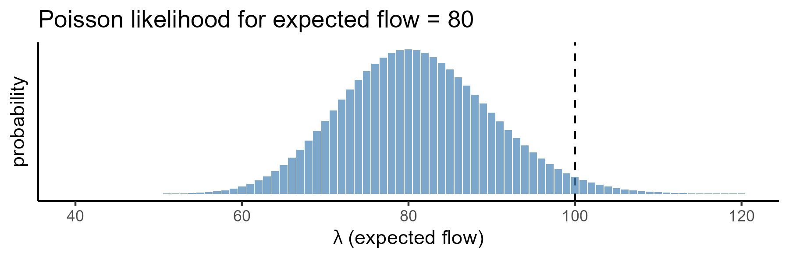{width="100%"}

To assess the probability, as demonstrated above, we need some predictions
of flow $λ$, and these can be produced using **Poisson regression**.
This is mathematically similar to the log-normal approach introduced
earlier, but here we are not predicting flow directly, but are
predicting the the mean of our Poisson distribution $λ_{ij}$, using the
same set of independent variables introduced above, and the
corresponding model parameters $k, μ, α$ and $\beta$:

$$\log(λ_{ij}) = \log(k) + μ\log(V_i) + α\log(W_j) - \beta\log(d_{ij})$$
If we take the exponent of both sides of the equation, we can model
$λ_{ij}$ directly:

$$λ_{ij} = \exp(\log(k) + μ\log(V_i) + α\log(W_j) - \beta\log(d_{ij}))$$

Unlike a log-linear approach, we are not seeking to minimise the numeric
difference between predicted and observed flows, but are seeing to
*maximise* the overall probability across all our predictions i.e., a
[**maximum
likelihood**](https://en.wikipedia.org/wiki/Maximum_likelihood_estimation)
approach.

For example, let's say we have the following observed flow values $n$
and some expected (modelled) flow values $λ$, with the latter produced with some
initial model parameters for $k, μ, α$ and $\beta$:

$$n = \begin{bmatrix} 100 & 50 & 70 & 80 & 60\end{bmatrix}$$
$$λ = \begin{bmatrix} 95 & 70 & 82 & 75 & 61\end{bmatrix}$$ The
probability of observing $n$ for each modelled value of $λ$ is
therefore:

$$P = \begin{bmatrix} 0.036 & 0.001 & 0.017 & 0.039 & 0.051\end{bmatrix}$$
The *product* of these individual probabilities is our overall **model
likelihood** $L$, which in this case is a very small
number[^10-spatial-interactions-4]... $L=0.00000000161903$.

[^10-spatial-interactions-4]: We can calculate the likelihood $L$ as the
    product of the individual probabilities i.e.,
    $L=P_{1} \times P_{2}\times \cdots \times P_{n}$. You can also
    obtain the same result by taking the logarithm of both sides, which
    can solve numerical problems i.e.,
    $\log(L)=\log(P_{1}) + \log(P_{2})+ \cdots + \log(P_{n})$.

Now let's say we have created a new model with a **different** set of values for
$k, μ, α$ and $\beta$, which will therefore produce a different set of
modelled flow values $λ$:

$$λ = \begin{bmatrix} 98 & 52 & 71 & 82 & 60\end{bmatrix}$$

The probabilities of observing $n$ for each modelled value of $λ$ is now
higher, because they are closer to the (unchanged) observed values:

$$P = \begin{bmatrix} 0.039 & 0.053 & 0.047 & 0.043 & 0.051\end{bmatrix}$$

Our model likelihood $L$ is still numerically very small but is now
approximately $134 \times$ larger than before, at $L=0.00000021725004$.

::: question
Which of the two models do you prefer and why?
:::

<details>

<summary>Answer</summary>

Our preference would be for the second model, as we have increased our
likelihood $L$ i.e., the observed data are more probable with this set
of parameters. This process would be repeated until the maximum $L$ is
obtained.

</details>

<br>

**To summarise**, using Poisson regression, we generate expected flows
$λ_{ij}$ for each origin-destination pair. These expected flows are
generated using different values for the model parameters, in our case
$k, μ, α$ and $\beta$. For each set of parameters, and for each
origin-destination pair, we can assess the probability of observing the
**empirical** flow value given the expected (modelled) flow
value[^10-spatial-interactions-5]. The model *likelihood* $L$ is the
product of these probabilities for all observations i.e., how well does
this particular set of parameters explain the observed flow? This
process is repeated, trying different values for each of the parameters
$k, μ, α$ and $\beta$ to **maximise the overall model likelihood** i.e.,
find the model parameters which make the observed data as likely as
possible.

[^10-spatial-interactions-5]: Using the following equation:
    $\frac{λ^{n}e^{-λ}}{n!}$

::: note
If there is anything you didn't understand here, now is the time to ask!
:::

#### Implementing Poisson regression

As ever, **understanding** the Poisson approach is the challenging part.
Running a Poisson regression in ArcGIS is very simple, although we do
need to do a little bit of data preparation.

As outlined above, the Poisson regression (and the alternative
log-linear approach) uses the logarithms of our independent variables,
which we can produce as follows:

> Use Calculate Field to create new logged[^10-spatial-interactions-6]
> origin population, destination GDP and distance variables e.g.,
> `log_orig_pop` (`Double`) = `math.log(!orig_pop!)`. To simplify the
> calculations for distance, you may also want to covert to kilometers
> here i.e., `math.log(!NEAR_DIST! / 1000)`.

[^10-spatial-interactions-6]: Note that Python
    [math.log()](https://docs.python.org/3/library/math.html#math.log)
    uses `e` as the default, which is consistent with the log() function
    in
    [R](https://www.rdocumentation.org/packages/base/versions/3.6.2/topics/log).
    For those more familiar with Excel, the function log() defaults to
    base10. For any future analysis, be aware of this difference! In Excel, the same result can be obtained using log(val, EXP(1)) or the LN() function.

Poisson distributions are also used to represent **discrete events**
e.g., the number of goals in a football match, or the number of internal
migrants to a particular local authority. As a result, our *decimal*
`flow` values, produced by ONS modelling, are not valid inputs. Instead,
we need to use *integer* values, which can be produced as follows:

> Use Calculate Field to create integer flow values (`flow_int`, "Field
> Type" = `Long`) using the
> [`int()`](https://docs.python.org/3/library/functions.html#int)
> function.

With our data preparation complete, we can run a Poisson regression as
follows:

> Open the Geoprocessing tool [Generalized Linear
> Regression](https://doc.esri.com/en/arcgis-pro/latest/tool-reference/geoanalytics-desktop/generalized-linear-regression.html?tabs=dialog).
> **Note** we must use the *GeoAnalytics Desktop Tools* version rather than
> the version in *Spatial Statistics Tools*, as the former allows us to
> use a standalone table as an input. Use `LAD_point_neartable` as the
> "Input Features", with `flow_int` as the "Dependent Variable" i.e.,
> our observed data. For "Model Type", use `Poisson` and for
> "Explanatory Variable(s)", use logged origin population, logged
> destination GDP, and logged distance. Store the "Output Features" in
> the project directory with a suitable name and Run.

When complete, we can evaluate and interpret the model coefficients.

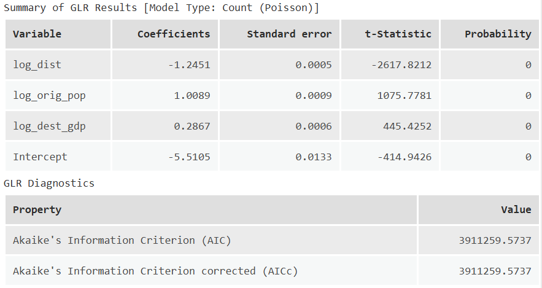{width="100%"}

The important model statistics for our analysis are the
**coefficients**, which indicate the expected change in the dependent
variable (`flow_int`) for a corresponding one unit change in the
independent variable. For example, as `log_dist` increases by 1,
`flow_int` *decreases* by 1.2451 i.e., a negative relationship. By
comparison, as `log_dest_gdp` increases by 1, `flow_int` *increases* by
0.2867 i.e., a positive relationship.

We will use these coefficients as our values for our parameters
$k, μ, α$ and $\beta$.

The output also includes the Akaike Information Criterion (AIC) which is
a measure of model performance, calculated using:

$$AIC = 2k-2\log(L)$$ This incorporates the model likelihood $L$ which
we introduced above and the number of parameters in our model $k$, which
in our case is four i.e., `log_orig_pop`, `log_dest_gdp`, `log_dist` and
the model `intercept`. While the tool doesn't allow us to investigate $L$ directly,
either for the final model or those evaluated during parameter testing,
it is a key component of model evaluation.

To use our coefficients, we are going to use the equation defined above:

$$λ_{ij} = \exp(\log(k) + μ\log(V_i) + α\log(W_j) - \beta\log(d_{ij}))$$

::: note
As we produced logged variables in advance (e.g.,
`log_orig_pop`) and used these in our Poisson regression, rather than
the raw data, we don't need to log them again.
:::

Our previous expression for an **unconstrained model** was
`pow(!orig_pop!, 1) * pow(!dest_gdp!, 1) * pow(!NEAR_DIST! / 1000, -2)`,
using our initial set of parameters. We now have some tuned parameters
we can use instead i.e., $k=-5.5105,μ=1.0089, α=0.2867,\beta=-1.2451$.

> Return to the Attribute Table, and use Calculate Field to generate a
> new field `gm2` i.e., our second gravity model ("Field Type" =
> `Double`). Try to implement the above equation, using the **logged**
> variables (e.g., `log_orig_pop`) as the inputs and the model
> coefficients as our parameters. The Python function
> [`exp()`](https://docs.python.org/3/library/math.html#math.exp) will
> need to be used.

<details>
<summary>Expression Solution</summary>
Here is the expected expression:
`math.exp(-5.105+(1.0089 * !orig_pop_log!)+(0.2867 * !dest_gdp_log!)-(abs(-1.2451) * !near_dist_log!))`
</details>
<br>

When complete, predicted flows based upon our tuned gravity model `gm2`
should be available in the Attribute Table.

> Create a Scatter Plot for `flow_int` and `gm2`.

<p align="center">
<a name=""></a>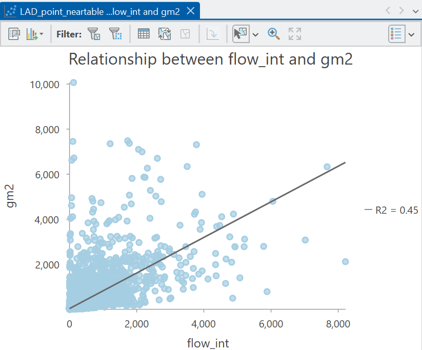{width="60%"}
</p>

::: question
What is your appraisal of model performance, now that we have tuned our
parameters $k, μ, α$ and $\beta$?
:::

<details>
<summary>Answer</summary>
Our model performance is now much improved, with $R^2=0.45$ for the
tuned model, compared to $R^2=0.07$ for the initial total constrained
model. In my view this is quite impressive: our model is capturing **45%** of
the variability in internal migration flows across England and Wales
based on just three variables i.e., the distance between origins and
destinations, and their corresponding emissiveness (population) and
attractiveness (GDP).
</details>
<br>

### Gravity model variants

To finish the practical, we are going to introduce some additional
variants of the gravity model, including *origin-constrained*,
*destination-constrained* and *doubly-constrained* models, building on
@wilson1971.

We have already introduced the
[*total-constrained*](#unconstrained_total) model, which is scaled to
ensure that the sum of all modelled flows equals the sum of all
empirical flows. The other variants are defined as follows:

-   An **origin-constrained** model[^10-spatial-interactions-7] is
    designed to constrain the total modelled flows *from each origin* to
    match the total empirical flows *from each origin*.
-   A **destination-constrained** model[^10-spatial-interactions-8] is
    designed to constrain the total modelled flows *to each destination*
    to match the total empirical flows *to each destination*.
-   A **doubly-constrained** model does both and is designed to
    constrain the total modelled flows *from each origin* AND *to each
    destination* to match the corresponding total empirical flows.

[^10-spatial-interactions-7]: Also referred to as a **production
    constrained** model.

[^10-spatial-interactions-8]: Also referred to as an **attraction
    constrained** model.

We can assess whether our model is constrained as follows:

> Use "Summary Statistics" in the Attribute Table, with `orig_LAD2NM` as
> the "Case Field", calculating the sum for `flow_int` and `gm2`. *Note*
> we are using the integer `flow_int` field here, rather than the
> decimal `flow`, as the former was used for model building.

::: question
Is our model origin-constrained?
:::

> Repeat this process for the destination local authority, using
> `dest_LAD2NM`.

::: question
Is our model destination-constrained?
:::

<details>
<summary>Answer</summary>
Our model is neither origin-constrained or destination-constrained.
While our model has been tuned (for example using $k$) to make the
observed data as likely as possible, the modelled totals for each origin
or destination do not match the empirical totals.
</details>
<br>

There are lots of situations where *origin-constrained*,
*destination-constrained* and *doubly-constrained* models can be useful.
For example an **origin-constrained** model might be suitable when the
flows from the origin (emissions) are **known** and we therefore want
our model to reproduce these. For example:

::: question
The government has data on the number of people *leaving* the country
each year. **What are their likely destination countries?**
:::

A **destination-constrained** model might be suitable when the flows to
a destination (attractions) are **known**. For example:

::: question
The government has data on the number of people *arriving* in the
country each year. **What are their likely origin countries?**
:::

A **doubly-constrained** model might be suitable when both origin and
destination flows are known, such as the [ONS
data](https://www.ons.gov.uk/peoplepopulationandcommunity/populationandmigration/populationestimates/datasets/internalmigrationinenglandandwales)
we are using in this practical.

By keeping the total values fixed, we can investigate the distribution
of flows. For example, if 20,000 people *arrive* in the Manchester local
authority and 15,000 people *leave*, a doubly-constrained model would
reproduce those *total* values. However, the **distribution** of the
origins and destinations might differ from the observed distribution
e.g., the modelled number of people leaving Manchester for Leeds might
differ from the actual number of people. If so, these differences might
help us to understand the factors which influence migration, such as the
job market, the university sector, cultural drivers, among others, and
in turn, develop better prediction models.

To finish the practical, we'll show how these gravity model variants can
be produced in ArcGIS.

### Origin-constrained models

An origin-constrained model is defined as follows:

$$T_{ij} = A_{i}O_{i}W_j^αd_{ij}^{-\beta}$$

where $O_i$ is the **known** total flow for origin $i$, defined as:

$$O_{i}=\sum_{j}T_{ij}$$

and $A_{i}$ is a balancing factor, which like the $k$ parameter in our
total-constrained model, is used to scale the modelled values to ensure
the modelled total flow for each origin equals the known total flow
$O_{i}$:

$$A_{i} = \frac{1}{\sum_{j}W_j^αd_{ij}^{-\beta}}$$ 

Let's illustrate this with a very simple example where there is a single origin $M$ and three possible destinations $X, Y, Z$. We know from government data that there are 1,000 people leaving origin $M$, so $O_{i}=1000$. Using our gravity model, we could estimate the relative pull to $X$ and $Y$ and $Z$, incorporating both destination attractiveness $W_j^α$ and distance $d_{ij}^{-\beta}$. Let's say this produces the following numeric values $X=100,Y=50, Z=150$. At the moment, the sum of these values is $300$ which does not equal our **known** flow from the origin $O_{i}=1000$, so our model is not yet constrained to $O_{i}$. Instead, these values represent the **relative pull** of each destination rather than than final predicted number of flows. To convert these to proportions, the denominator for $A_{i}$ above calculates the sum for all destinations:

$$\sum_{j}W_j^αd_{ij}^{-\beta}=100+50+150=300$$

This enables us to the calculate the balancing factor:

$$A_{i}=\frac{1}{\sum_{j}W_j^αd_{ij}^{-\beta}}=\frac{1}{300}=0.00333$$ 

Putting this together, multiplying the balancing factor $A_{i}$ by each modelled pull value $W_j^αd_{ij}^{-\beta}$ is used to generate proportions e.g.,

$$X=0.00333  \times 100 = 0.333$$
$$Y=0.00333  \times 50 = 0.167$$
$$Z=0.00333  \times 150 = 0.500$$

These proportions can be multiplied by the known total $O_{i}=1000$ to obtain the predicted flows: 

$$T_{iX} =1000 \times 0.333 = 333$$
$$T_{iY} =1000 \times 0.167 = 167$$
$$T_{iZ} =1000 \times 0.500 = 500$$

Therefore:

$$333 + 167 + 500 = 1000 = O_i$$

This conceptual approach is reflected in our Poisson regression, which is described by the following model equation:

$$λ_{ij} = \exp(μ_{i}+ α\log(W_j) - \beta\log(d_{ij}))$$

We do not include a separate origin-emissiveness term $μ\log(V_i)$ in the model, because
in an origin-constrained model, the origin total$O_{i}$ are fixed in advance.

The variable $μ_{i}$ is a vector of origin-specific intercepts, which
are represented in our model using **categorical** or [**dummy
variables**](https://en.wikipedia.org/wiki/Dummy_variable_(statistics)),
which encode categories as either zeros or ones:

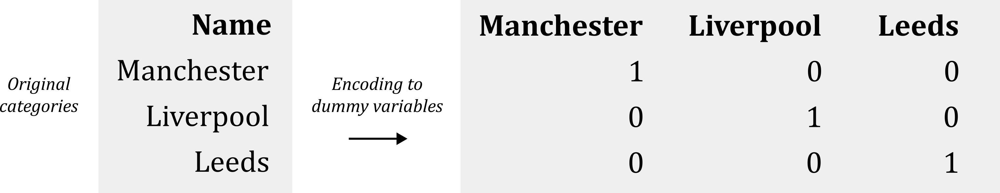{width="100%"}

These dummy variables are included in our model in exactly the same way
as other variables (e.g., `log_dest_gdp`), and produce corresponding
coefficients, which are the regression equivalents of our balancing
factors $A_{i}$.

We could produce these in ArcGIS using the [Encode
Field](https://doc.esri.com/en/arcgis-pro/latest/tool-reference/data-management/encode-field.html?tabs=dialog)
tool, for example creating dummy variables for `orig_LAD21CD`. In turn,
we could include those variables in our input for [Generalized Linear
Regression](https://doc.esri.com/en/arcgis-pro/latest/tool-reference/geoanalytics-desktop/generalized-linear-regression.html?tabs=dialog).

**Unfortunately**, this only works effectively with a small number of
categories. In our case, there are 314 local authorities in our dataset
(Explore Statistics, `Unique`), thus requiring 314 dummy variables. It
would be impractical for us to load these manually to the GLR tool,
which is also not as flexible as other implementations, which can result
in **multicollinearity** issue with this number of variables.

Instead, we are going to use a [**Python
notebook**](https://doc.esri.com/en/arcgis-pro/latest/arcpy/get-started/pro-notebooks.html),
which gives us access to Python functionality, all of the ArcGIS tools, many of which you will be familiar with e.g., [`numpy`](https://numpy.org/).
via
[Arcpy](https://doc.esri.com/en/arcgis-pro/latest/arcpy/get-started/what-is-arcpy-.html),
and some common third-party libraries.

> In Analysis → Geoprocessing, open a Python Notebook.

{width="100%"}

::: note
You will be not be writing any Python from scratch here (unlike
Understanding GIS), but I will talk through each part of the code in
turn so you understanding what is happening.
:::

> Once you are happy with your understanding, paste each code chunk into
> your Python notebook and run using the "play" button. If there are any errors, read the error
> messages and ask for help!

The first part imports the required libraries, which includes
[`numpy`](https://numpy.org/), [`pandas`](https://pandas.pydata.org/)
and [`statsmodels`](https://www.statsmodels.org/stable/index.html), as
well as `os` for interacting with the operating system and accessing
directories and files:

```{python, eval=FALSE}
import os
import arcpy
import numpy as np
import pandas as pd
import statsmodels.api as sm
import statsmodels.formula.api as smf
```

The next part creates an object `aprx` which is connected to the current
ArcGIS project, and then extracts the first `[0]` (and only) map as `m`.
We should now have access to the map layers:

```{python, eval=FALSE}
# Current ArcGIS project and return the
aprx = arcpy.mp.ArcGISProject("CURRENT")
m = aprx.listMaps()[0]
```

You can run the code using the "play" button, and if successful, the
code blocks will switch from `[*]` to `[#]` to denote completion, without
errors or warnings:

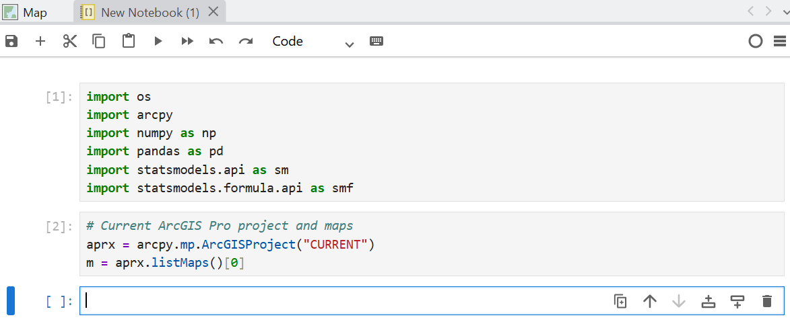{width="100%"}

We can access the map layers available in `m`, and here we are
interested in the Near Table `LAD_point_neartable`, which contains all of the fields we've
been using for modelling. This is converted to a Pandas dataframe for
easier analysis:

```{python, eval=FALSE}
# Access near table
table = m.listTables("LAD_point_neartable")[0]
table_path = table.dataSource
workspace = arcpy.Describe(table_path)

# List of fields
fields = [f.name for f in arcpy.ListFields(table_path)]

# Convert to pandas dataframe
rows = arcpy.da.SearchCursor(table_path, fields)
df = pd.DataFrame(list(rows), columns=fields)

```

We can inspect the data using `head()`:

<p align="center">
<a name=""></a>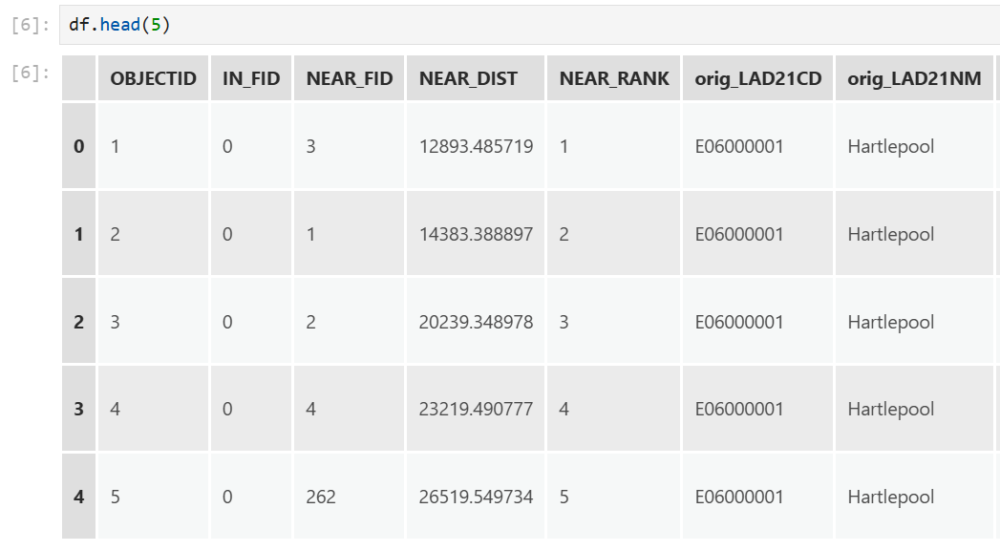{width="60%"}
</p>

Our next step is to define our model formula, including our dependent
and independent variables. This was managed for us in the [Generalized
Linear
Regression](https://doc.esri.com/en/arcgis-pro/latest/tool-reference/geoanalytics-desktop/generalized-linear-regression.html?tabs=dialog)
tool, but here we specify that manually:

```{python, eval=FALSE}
# Poisson formula
model_formula = "flow_int ~ C(orig_LAD21CD) + log_dest_gdp + log_dist - 1"
```

Here we are specifying that `flow_int` is our dependent variable, and this
is modelled (`~`) as a function of the distance between origins and destinations
`log_dist`, the destination GDP `log_dest_gdp`, and dummy variables for
the origin name `C(orig_LAD21CD)`. The [`C`
operator](https://www.statsmodels.org/stable/example_formulas.html#categorical-variables)
in `statsmodels` indicates we want to treat that variable as
"categorical", thereby creating a dummy variables for each origin. 

The final component is`-1` which removes the model intercept. When an intercept is included, one category must normally be omitted and treated as a *reference category*. For example, if there were three origins $A,B,C$, a typical model would estimate an intercept together with coefficients for $B$ and $C$, which are interpreted *relative* to $A$. This is necessary to avoid the [dummy variable trap](https://en.wikipedia.org/wiki/Dummy_variable_(statistics)), whereby there is perfect multicollinearity between the intercept term in a model and the dummy variables[^regression_matrix]. To avoid this, we remove the intercept using `-1`, allowing the model to estimate a separate coefficient for every origin (in `orig_LAD21CD`), which represent their own baseline effect, rather than measuring relative to an arbitrary baseline category.

[^regression_matrix]: We are moving towards some complex mathematics here, including how regression works in [**matrix notation**](https://en.wikipedia.org/wiki/Linear_regression). For example, if we developed a regression using a single independent variable, in matrix form the model inputs would be stored in a matrix as follows e.g., $x = \begin{bmatrix} 1 & x_1 \\ 1 & x_2 \\ \vdots & \vdots \\ 1 & x_n \end{bmatrix}$ where $1$ denotes the intercept term, and $x_n$ denotes the independent variable $x$ for each observation $n$. Following regression, the model coefficients would be stored in a separate matrix e.g., $\beta = \begin{bmatrix} \beta_0 \\ \beta_1 \end{bmatrix}$, where $\beta_0$ is the intercept coefficient and $\beta_1$ is the slope coefficient for the single independent variable. $x$ is then multiplied by $\beta$ to obtain the model predictions. Perfect multicollinearity would exist if the intercept term and **all** the categorical variables were included as dummy variables. As each observation belongs to exactly one category, the row-wise sum of the dummy variables would always equal 1. This would be a perfect duplicate of the intercept column (which also consists entirely of 1's, as shown above), making one column an exact linear combination of the others. 

We can now use this formula as an input to a Poisson regression model implemented via the `smf.glm` function,
using the following code:

```{python, eval=FALSE}

# Fit a model, using the specified formula and data, and using a Poisson approach
model = smf.glm(formula=model_formula, data=df, family=sm.families.Poisson()).fit()
```

If successful, `print(model.summary())` can be used to evaluate the
model results:

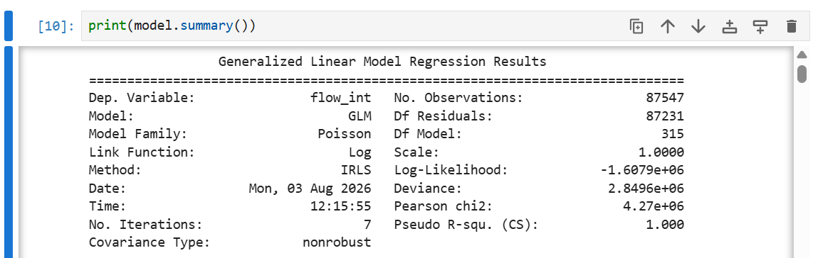{width="100%"}

Scrolling down also reveals the coefficients `coef` for each dummy variable
$μ_{i}$, which are used to scale the model predictions to match the
empirical origin flows:

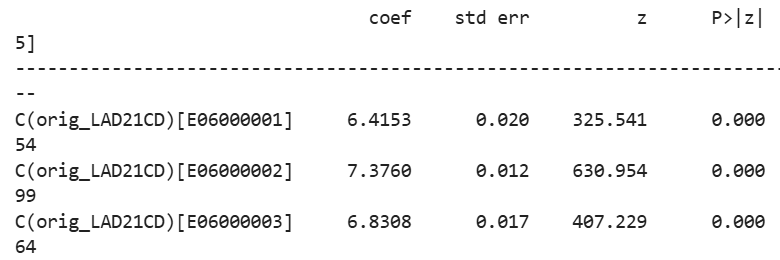{width="100%"}

We can use our model to generate predictions of flow for each row of
data, as we did for `gm1` and `gm2`. This uses the explanatory
(independent) variables stored in `df`, and stores the values in the
`df` dataframe in the `gm3` field i.e., our third gravity model.

```{python, eval=FALSE}
# Generate predictions for each row of df
df["gm3"] = model.predict(exog=df)
```

You can inspect some of the predicted values by running `df.gm3`:

<p align="center">
<a name=""></a>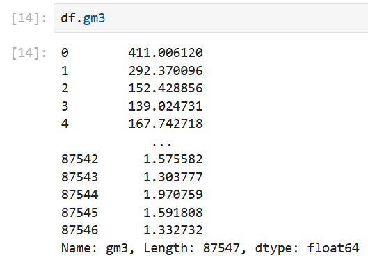{width="60%"}
</p>

Our final step is to export our dataframe to a `.csv`, which will allow
us to investigate the outputs further in ArcGIS. The code below
specifies our file name, and updates the path to the directory of our
project, as stored in `aprx.homeFolder`:

```{python, eval=FALSE}
# Set output file path (Project directory) and file name
output = os.path.join(aprx.homeFolder, "LAD_point_neartable_pred_origconst.csv")

# Export
df.to_csv(output, index=False)
```

If successful, the output file should be present in the project
directory:

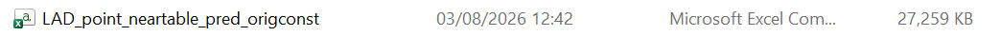{width="100%"}

We can now evaluate the results of our **origin-constrained** model.

> Load `LAD_point_neartable_pred_origconst.csv` to ArcGIS.

::: question
How could you test whether our model is origin-constrained?
:::

<details>
<summary>Answer</summary>
As before, this could be achieved using "Summarize", comparing the sum
of `flow_int` and `gm3`, using `orig_LAD21NM` as the case field.
Unfortunately, this is one of those examples where this functionality is
unavailable for a standalone table (`.csv`). To achieve this, we'd need
to export our table to the project **geodatabase**.
</details>

> Next create a Scatter Chart showing the relationship between
> `flow_int` and `gm3`.

<p align="center">
<a name=""></a>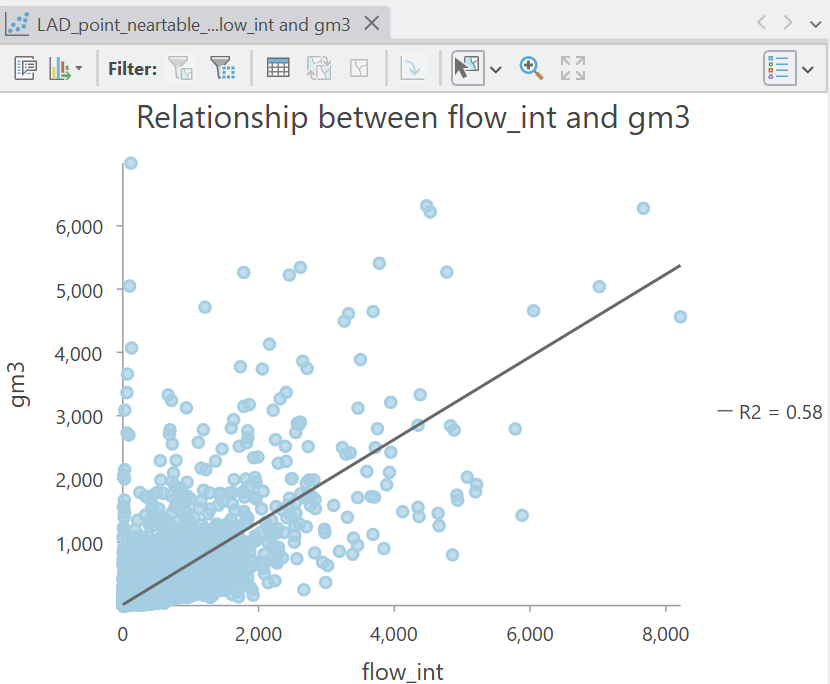{width="60%"}
</p>

::: question
What is your appraisal of the origin-constrained model performance?
:::

<details>
<summary>Answer</summary>
Our model performance has been improved by constraining the model
estimates to fit the *known* origin totals ($R^2=0.58$). 
</details>
<br>

### Destination-contrained models

The destination-constrained model is conceptually very similar to the
origin-constrained model, except this time we are constraining to match
the total flows *to each destination*, rather than *from each origin*. This is achieved by removing
destination-attractiveness $α\log(W_j)$ from the model, because in a
destination-constrained model, the destination flows are already
completely represented by another parameter[^10-spatial-interactions-9]:

[^10-spatial-interactions-9]: For simplicity I haven't provided the
    equations for the destination-constrained model in the main text,
    but for completeness, the model is as follows:
    $T_{ij} = D_{j}B_{j}V_{i}^{μ}d_{ij}^{-\beta}$, where $D_j$ is the
    **known** total flow for each destination $j$, defined as
    $D_{j}=\sum_{i}T_{ij}$. $B_{j}$ is a balancing factor which is used
    to scale the modelled values to ensure the modelled total flow for
    each **destination** equals the known total flow $D_{j}$, defined as
    $B_{j} = \frac{1}{\sum_{i}V_{i}^{μ}d_{ij}^{-\beta}}$.

$$λ_{ij} = \exp(μ\log(V_i)+ α_{i}- \beta\log(d_{ij}))$$

The variable $α_{i}$ is a vector of destination-specific intercepts,
which as before are represented in our model using **dummy variables**,
this time encoded based on the destination local authority names.

> The *origin-constrained* formula used in `statsmodels` was as follows:
> `model_formula = "flow_int ~ C(orig_LAD21CD) + log_dest_gdp + log_dist - 1"`.
> Can you modify this to produce a *destination-constrained* model
> formula?

> Adapt the formula and re-run the code to produce a new set of
> predictions for our **fourth** gravity model `gm4`, storing in your
> project directory as `LAD_point_neartable_pred_destconst.csv`.

> Load the file to ArcGIS, and evalute the predictions using a scatter
> plot.

<p align="center">
<a name=""></a>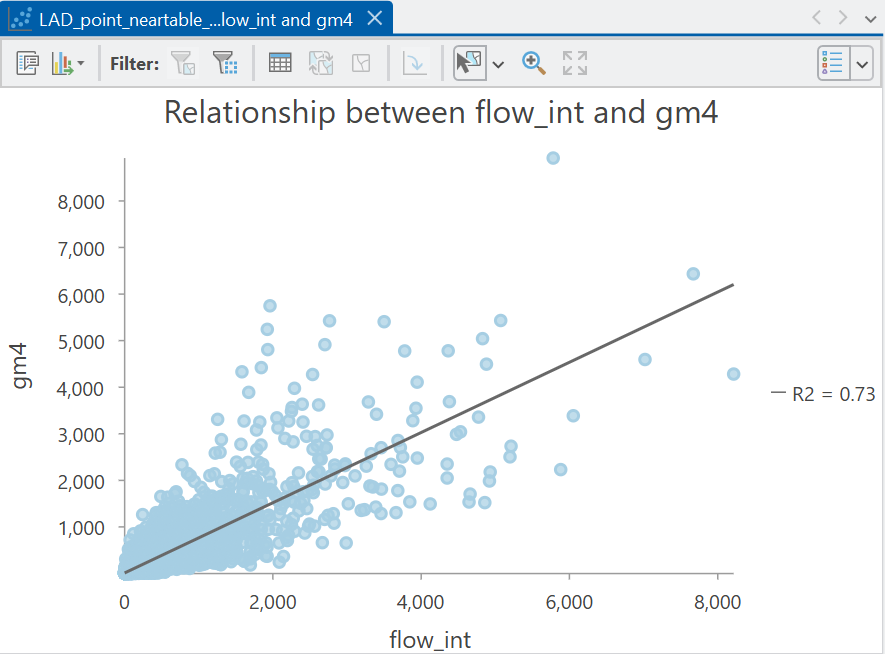{width="60%"}
</p>

::: question
How has model performance changed?
:::

### Doubly-constrained models

Our final model variant is the **doubly-constrained** model which is
designed to constrain the total modelled flows *from each origin* AND
*to each destination* to match the corresponding total empirical
origin-destination flows. This is defined as:

$$T_{ij} = A_{i}O_{i}B_{j}D_{j}d_{ij}^{-\beta}$$

where $O_{i}$ is the *known* total flow for origin $i$ and $D_j$ is the
*known* total flow for destination $j$. The challenging part is working
out the balancing factors $A_{i}$ and $B_{j}$, which are used to ensure
the total modelled flows for each origin and destination match the total
known flows.

This is challenging because $A_{i}$ is defined as:

$$A_{i} = \frac{1}{\sum_{j}B_jD_jd_{ij}^{-\beta}}$$ 

i.e., the
denominator is the sum of the modelled attractiveness for all
destinations $j$ for origin $i$. This incorporates the distance effect
$d_{ij}$, the destination attributes $D_j$ and the destination balancing
factor $B_j$.

However, $B_{j}$ is defined as:

$$B_{j} = \frac{1}{\sum_{i}A_iO_id_{ij}^{-\beta}}$$ 

The **challenge** is
that $A_i$ is needed to calculate $B_j$, but $B_j$ is needed to
calculate $A_i$, and so on. We won't go into depth about how this
conundrum is solved, except that it is solved *iteratively*, beginning
with a starting value and calculating $A_{i}$ and $B_{j}$ in turn until
the values stabilise[^10-spatial-interactions-10].

[^10-spatial-interactions-10]: For more information, Adam Dennett's
    [walkthrough](https://rpubs.com/adam_dennett/376877) is a good
    place to start, as is the paper by @senior1979c.

Our Poisson regression model is similar to the previous models but here we
have no variables for modelling emissiveness ($V_i^μ$) or attractiveness
($W_j^α$), as both total origin flows and total destination flows are
constrained in the model, using the $μ_{i}$ and $α_{i}$ dummy variables:

$$λ_{ij} = \exp(μ_{i}+ α_{i}- \beta\log(d_{ij}))$$

> The formula for a *doubly-constrained* model is as follows: `model_formula = "flow_int ~ C(orig_LAD21CD) + C(dest_LAD21CD) + log_dist"`. Re-run the code to produce a new set of predictions for our **fifth** (and final) gravity model `gm5`, storing in your project directory as `LAD_point_neartable_pred_doublyconst.csv`. 

> Load the file to ArcGIS, and evalute the predictions using a scatter plot.

<p align="center">
<a name=""></a>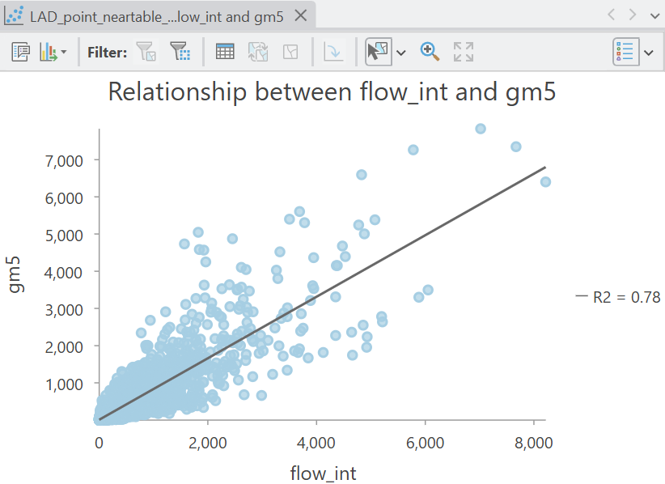{width="60%"}
</p>

Constraining our modelled origin and destination flows has improved model performance further ($R^2=0.78$), indicating that the model has captured nearly 80% of the variability in internal migrations, when *total* origin-destination flows are constrained. 

There is clearly some uncaptured variability (~22%), and evidence of under- and over-prediction of flow. However, this approach provides a baseline for further analysis i.e., what additional factors could we incorporate to capture that additional variability?  

We could use our model as a basis for **prediction** e.g., modifying the local authority populations or GDPs to investigate how flows might change in future. 

To finish:

> Export the `.csv` to the project **geodatabase** (to enable editing), use Select by Attributes to select rows where the *destination* is a local authority of your choice (e.g., Manchester = `E08000003`), and use [XY to Line](https://doc.esri.com/en/arcgis-pro/latest/tool-reference/data-management/xy-to-line.html?tabs=dialog) to generate lines connecting the origin and destination centroids, selecting the appropriate CRS and making sure to "Preserve attributes".

{width="100%"}

<br>

::: question
How well does the modelled flow to Manchester match your understanding of actual internal migration?
:::

Our models are also based on a simple set of predictors, but you could of course include a much wider range e.g., median earnings rather than GDP per capita, unemployment rate, housing affordability, or the share of working-age population. There are also a host of individual-level factors that drive migration e.g., family connections.

If applying this model to international migration, we might include a completely different set of predictors e.g., cultural similarity, as covered in [Practical 2](#spatial_weights), whether countries share a common language, or the degree of conflict within or between countries.

<br>

------------------------------------------------------------------------

**Congratulations!** You have completed the practical and should now be familiar with the conceptual and mathematical background to spatial interaction modelling, and be able to implement them in ArcGIS. 

[**Finished!**](#summary)

## Extra

There is no **extra** content this week. This is the end of challenging but hopefully rewarding semester, so use your time to focus on the assessments or take a well earned break! 

```{python, eval=FALSE, echo=FALSE}

# Python Notebook for GLR Poisson

import os
import arcpy
import numpy as np
import pandas as pd
import statsmodels.api as sm
import statsmodels.formula.api as smf

# Current ArcGIS Pro project and maps
aprx = arcpy.mp.ArcGISProject("CURRENT")
m = aprx.listMaps()[0]

# Access table
table = m.listTables("LAD_point_neartable")[0]
table_path = table.dataSource
workspace = arcpy.Describe(table_path)

# List of fields
fields = [f.name for f in arcpy.ListFields(table_path)]

# Data to pd
rows = arcpy.da.SearchCursor(table_path, fields)
df = pd.DataFrame(list(rows), columns=fields)

# Create origin-constrained formula and run glm 
model_formula = "flow_int ~ C(orig_LAD21CD) + log_dest_gdp + log_dist - 1"
model = smf.glm(formula=model_formula, data=df, family=sm.families.Poisson()).fit()

# Summary
# print(model.summary())

# Predictions
df["gm3"] = model.predict(exog=df)

# Set output file path (Project directory) and file name
output = os.path.join(aprx.homeFolder, "LAD_point_neartable_pred_origconst.csv")

# Export
df.to_csv(output, index=False)

# Create destination-constrained formula and run glm 
model_formula = "flow_int ~ log_orig_pop + C(dest_LAD21CD) + log_dist - 1"
model = smf.glm(formula=model_formula, data=df, family=sm.families.Poisson()).fit()

# Predictions
df["gm4"] = model.predict(exog=df)

# Set output file path (Project directory) and file name
output = os.path.join(aprx.homeFolder, "LAD_point_neartable_pred_destconst.csv")

# Export
df.to_csv(output, index=False)

# Create doubly-constrained formula and run glm 
model_formula = "flow_int ~ C(orig_LAD21CD) + C(dest_LAD21CD) + log_dist"
model = smf.glm(formula=model_formula, data=df, family=sm.families.Poisson()).fit()

# Predictions
df["gm5"] = model.predict(exog=df)

# Set output file path (Project directory) and file name
output = os.path.join(aprx.homeFolder, "LAD_point_neartable_pred_doublyconst.csv")

# Export
df.to_csv(output, index=False)
```

```{r, eval=FALSE, echo=FALSE}

#------------ Code to generate plot for Poisson distributions

# Import library
library(ggplot2)

# Values of lambda to plot
lambdas <- c(1, 5, 20)

# Range of x values
x <- seq(0, 60, 1)

# Create data frame of Poisson probabilities
pois_data <- expand.grid(
  x = x,
  lambda = lambdas
)
pois_data$prob <- dpois(pois_data$x, pois_data$lambda)

# Plot
g <- ggplot(pois_data, aes(x = x, y = prob, fill = factor(lambda))) +
  geom_col(alpha = 0.4, position = "identity") +
  facet_wrap(~lambda, scales = "free_y") +
  labs(
    x = "x",
    y = "Probability",
    fill = expression(lambda),
    title = "Poisson distributions for different Lambda values"
  ) + theme_classic() + scale_color_brewer(palette = "Paired") + scale_fill_brewer(palette = "Paired") +
  theme(strip.text = element_blank()) + theme(
  axis.text.y = element_blank(),
  axis.ticks.y = element_blank()
)


# Save, specify dimensions and dpi
ggsave(plot = g, "./images/practical-10/poisson.png", height = 2, width = 5, units = "in", dpi=300)

#------------ Code to generate plot for normal distributions

# Values of mean and standard deviation to plot
mus <- c(10, 100, 1000)
sigma <- 5

norm_data <- do.call(rbind, lapply(mus, function(m) {
  data.frame(
    x = seq(m - 4*sigma, m + 4*sigma, 1),
    mu = m,
    prob = dnorm(seq(m - 4*sigma, m + 4*sigma, 1), mean = m, sd = sigma)
  )
}))

norm_data$prob <- dnorm(norm_data$x, mean = norm_data$mu, sd = sigma)


# Plot
g <- ggplot(norm_data, aes(x = x, y = prob, fill = factor(mu))) +
  geom_col(alpha = 0.4, position = "identity") +
  facet_wrap(~mu, scales = "free") +
  labs(
    x = "x",
    y = "Probability",
    fill = expression(mu),
    title = "Normal distributions for different mean values"
  ) +
  theme_classic() +
  scale_color_brewer(palette = "Paired") +
  scale_fill_brewer(palette = "Paired") +
  theme(strip.text = element_blank()) +
  theme(
    axis.text.y = element_blank(),
    axis.ticks.y = element_blank()
  )

# Save, specify dimensions and dpi
ggsave(
  plot = g,
  "./images/practical-10/normal.png",
  height = 2,
  width = 5,
  units = "in",
  dpi = 300
)


#--------------

# Observed flow
T_obs <- 80

# Values of lambda (expected flow) to test
lambdas <- seq(40, 120, by = 1)

poisson_data <- do.call(rbind, lapply(lambdas, function(lambda) {
  data.frame(
    lambda = lambda,
    observed = T_obs,
    prob = dpois(T_obs, lambda = lambda)
  )
}))

# Plot
g <- ggplot(poisson_data, aes(x = lambda, y = prob)) +
  geom_vline(xintercept = 100, lty="dashed", ) +
  geom_col(fill = "steelblue", alpha = 0.7) +

  labs(
    x = expression(lambda~"(expected flow)"),
    y = "probability",
    title = "Poisson likelihood for expected flow = 80"
  ) +
  theme_classic() +
  theme(
    axis.text.y = element_blank(),
    axis.ticks.y = element_blank()
  )

# Save
ggsave(
  plot = g,
  "./images/practical-10/poisson_likelihood.png",
  height = 2,
  width = 6,
  units = "in",
  dpi = 300
)

```

## Resources

-   Wilson, A.G. ([1971](https://doi.org/10.1068/a030001)). A family of
    spatial interaction models, and associated developments. Environment
    and Planning A, 3(1), pp.1-32.
-   Haynes, K.E., & Fotheringham, A.S.
    ([1985](https://researchrepository.wvu.edu/rri-web-book/16/)).
    Gravity and Spatial Interaction Models. Reprint. Edited by Grant Ian
    Thrall. WVU Research Repository, 2020.
-   Fotheringham, A.S. and M.E. O’Kelly
    ([1989](https://www.amazon.co.uk/Spatial-Interaction-Models-Formulations-Applications/dp/0792300211))
    Spatial Interaction Models: Formulations and Applications. London:
    Kluwer Academic.
-   Dennett, A. and Wilson, A. ([2013](https://doi.org/10.1068/a45398)).
    A multilevel spatial interaction modelling framework for estimating
    interregional migration in Europe. Environment and Planning A,
    45(6), pp.1491-1507.
-   Rowe, F., Lovelace, R. and Dennett, A.
    ([2024](https://doi.org/10.4337/9781802203233.00019)). Spatial
    interaction modelling: a manifesto. In A research agenda for spatial
    analysis (pp. 177-196). Edward Elgar Publishing.
-   Liao, M. and Oshan, T.M.
    ([2025](https://doi.org/10.1111/gean.70001)). A Data‐Driven Approach
    to Spatial Interaction Models of Migration: Integrating and Refining
    the Theories of Competing Destinations and Intervening
    Opportunities. Geographical Analysis, 57(3), pp.540-554.
