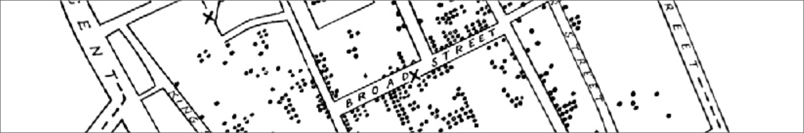

# (PART\*) Endmatter {-}

# Summary {#summary .unnumbered}

## Closing remarks {#closing .unnumbered}

 

::: task
Unit summary here.

Discuss spatial analysis, key principles, methods change through time --- often the questions don't. Hope that students are equipped with the ability to **do** spatial analysis, but more importantly, really understand **how** the techniques work - the data, the assumptions, the mathematics... all of which will enable you to critically appraise your results and those of others, and ultimately to come a better understanding of spatial patterns, processes and relationships. 

:::

In *Introduction to Spatial Analysis* we have covered... 

## Acknowledgements {.unnumbered}

The development of *Introduction to Spatial Analysis* has benefited from fruitful discussions with [Jonny Huck](https://research.manchester.ac.uk/en/persons/jonathan.huck/) and [Matt Dennis](https://research.manchester.ac.uk/en/persons/matthew.dennis/), testing by [James Tomlinson](https://research.manchester.ac.uk/en/persons/james-tomlinson-2/), and wider support from the [Mapping, Computing and Geographical Information Science](https://www.humanities.manchester.ac.uk/geography/research/groups/mapping-computing-geographical-information-science/) research group. 

I hope that *Introduction to Spatial Analysis* has inspired you to explore the topic further, and if so, I'd recommend delving into the resources listed [here](#intro-acknowledgements), alongside the wider literature included in the [reference list](#references).

*Matt*
