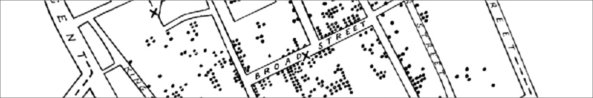

# (PART\*) Home {-}

# Introduction to Spatial Analysis {#introduction .unnumbered}

## Preface {#practical-aims .unnumbered}



*Introduction to Spatial Analysis* will introduce you to the principles and methods of spatial data analysis, with a view to developing deep understanding of how we conceptualise and model spatial patterns and relationships. You will be equipped with the knowledge and skills to identify and utilise appropriate spatial analyses, to critically assess outputs, and to communicate results to academic and non-academic audiences. You will also gain practical skills in ArcGIS Pro, and experience working with a range of environmental, social and ecological datasets. 


```{r, eval = TRUE, echo = FALSE, warning = FALSE, message = FALSE, results='hide'}

# Clean the previous bookdown version

# Function to check and install packages
check.packages <- function(pkg){
  new.pkg <- pkg[!(pkg %in% installed.packages()[, "Package"])]
  if (length(new.pkg))
    install.packages(new.pkg, dependencies = TRUE, repos = "http://cran.us.r-project.org")
  sapply(pkg, require, character.only = TRUE)
}

# Checks and installs packages
packages <- c("bookdown", "markdown")
check.packages(packages)

# Clean the docs folder
clean_book(clean = getOption("bookdown.clean_book", TRUE))

# Code to render
# bookdown::render_book("index.Rmd", "bookdown::gitbook", output_dir = "docs")

```


In *Introduction to Spatial Analysis*, we will:

- work with a range of spatial data types: [Working with Geographic Data](#geo_data)
- investigate spatial patterns: [Spatial Weights](#spatial_weights), [Spatial Autocorrelation](#spatial_autocorrelation), [Spatial Correlation](#spatial_correlation), [Point Patterns and Processes](#point_patterns)
- model spatial relationships: [Spatial Interpolation](#interpolation), [Spatial Regression](#spatial_regression), [Geographically Weighted Regression](#gwr)
- optimise locations and predict flows: [Location Allocation](#location_allocation), [Spatial Interaction Modelling](#spatial_interaction)

*Chapter links will become available as the unit progresses.*

## Intended Learning Outcomes {#ilo .unnumbered}

The Intended Learning Outcomes for *Introduction to Spatial Analysis* are available on [Canvas]() as a [single source of truth](https://en.wikipedia.org/wiki/Single_source_of_truth). 


